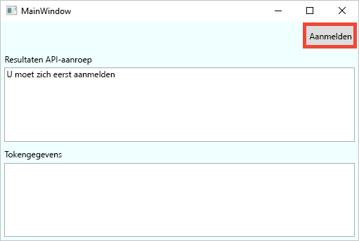
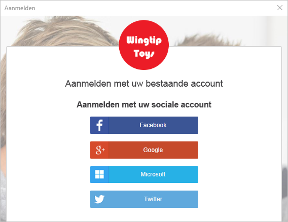
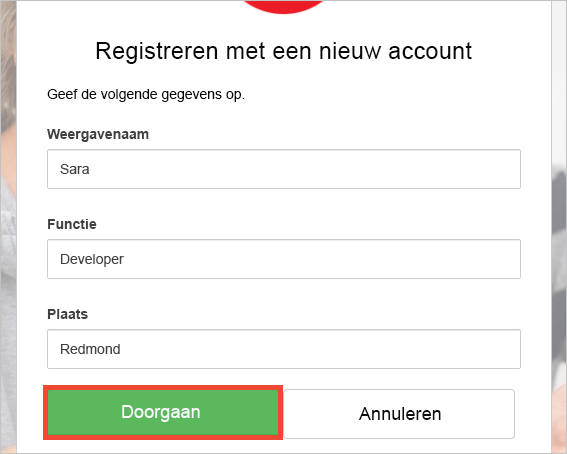
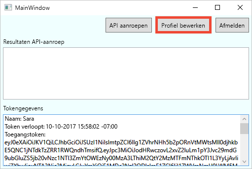
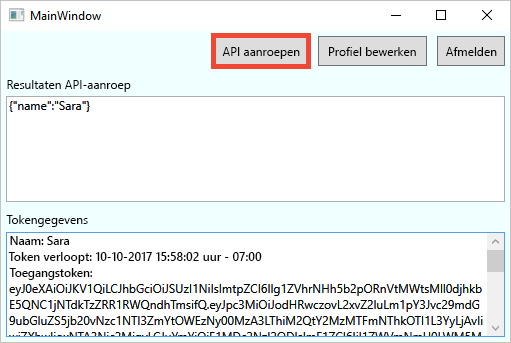

# Een bureaubladtoepassing geconfigureerd met Azure AD B2C testen

Azure Active Directory B2C biedt cloud identity management te houden van uw toepassing, zakelijke en klanten die zijn beveiligd.  Deze snelstartgids wordt een voorbeeldapp van het bureaublad van Windows Presentation Foundation (WPF) gebruikt om aan te tonen:

* Met behulp van de **registreren of aanmelden** beleid maken of meld u aan met een sociale id-provider of een lokale account via een e-mailadres. 
* **Een API aanroepen** uw weergegeven naam ophalen uit een Azure AD B2C beveiligde resource.

## Vereisten

* Installeer [Visual Studio 2017](https://www.visualstudio.com/downloads/) met de volgende workloads:
    - **Bureaublad .NET-ontwikkeling**

* Een sociaal-account van Facebook, Google, Microsoft- of Twitter. Als u geen een sociaal-account hebt, moet een geldig e-mailadres is vereist.

[!INCLUDE [quickstarts-free-trial-note](../../includes/quickstarts-free-trial-note.md)]

## Het voorbeeld downloaden

[Downloaden of te klonen van de voorbeeldtoepassing](https://github.com/Azure-Samples/active-directory-b2c-dotnet-desktop) vanuit GitHub.

## Voer de app in Visual Studio

Open in de projectmap voorbeeld toepassing de `active-directory-b2c-wpf.sln` oplossing in Visual Studio. 

Selecteer **fouten opsporen > Foutopsporing starten** het bouwen en uitvoeren van de toepassing. 

## Een account maken

Klik op **aanmelden** starten de **registreren of aanmelden** werkstroom. Wanneer u een account maakt, kunt u een bestaande sociale identiteit provider-account of een e-mailaccount.

### Aanmelden met een identiteitsprovider van sociale

Klik op de knop van de id-provider die u wilt gebruiken voor het aanmelden met een identiteitsprovider van sociale. Als u liever een e-mailadres, Ga naar de [aanmelden met een e-mailadres](#sign-up-using-an-email-address) sectie.

U moet verifiëren met uw account sociale referenties en autoriseren van de toepassing om informatie te lezen uit je account sociale (sign-in). Door toegang te verlenen, kan de toepassing profielgegevens ophalen van de sociale account zoals uw naam en plaats. 

De details van uw nieuwe profiel zijn al ingevuld met informatie uit uw sociale-account. Wijzig de details als u wilt en klikt u op **doorgaan**.

U hebt een nieuwe Azure AD B2C-gebruikersaccount die gebruikmaakt van een id-provider gemaakt. Na het aanmelden, het toegangstoken wordt weergegeven in de *info Token* in het tekstvak. Het toegangstoken wordt gebruikt bij het openen van de API-resource.

Volgende stap: [gaan bewerken van uw profiel](#edit-your-profile) sectie.

### Aanmelden met een e-mailadres

Als u een sociale account niet gebruikt kiest voor verificatie, kunt u een Azure AD B2C gebruikersaccount in met een geldig e-mailadres. Een lokale gebruikersaccount van Azure AD B2C gebruikt Azure Active Directory als de id-provider. Met uw e-mailadres, klikt u op de **geen account? Nu aanmelden** koppeling.

Voer een geldig e-mailadres in en klikt u op **sturen verificatiecode**. Een geldig e-mailadres is vereist voor de verificatiecode ontvangen van Azure AD B2C.

Voer de verificatiecode die u via e-mail ontvangt en klik op **code controleren**.

Je profielgegevens toevoegen en klik op **maken**.

Een nieuwe Azure AD B2C lokaal gebruikersaccount hebt gemaakt. Na het aanmelden, het toegangstoken wordt weergegeven in de *info Token* in het tekstvak. Het toegangstoken wordt gebruikt bij het openen van de API-resource.

## Uw profiel bewerken

Azure Active Directory B2C biedt functionaliteit waarmee gebruikers hun profielen bijwerken. Klik op **profiel bewerken** bewerken van het profiel dat u hebt gemaakt.

Kies de id-provider die is gekoppeld aan het account dat u hebt gemaakt. Als u Twitter als de id-provider gebruikt wanneer u uw account hebt gemaakt, bijvoorbeeld kiezen Twitter om de details van de bijbehorende profiel te wijzigen.

Wijzig uw **weergavenaam** of **stad**. 

Een nieuw toegangstoken wordt weergegeven in de *info Token* in het tekstvak. Als u controleren of de wijzigingen in uw profiel wilt, kopieer en plak het toegangstoken in het token decoder https://jwt.ms.

## Toegang tot een bron

Klik op **API aanroepen** beveiligd resource https://fabrikamb2chello.azurewebsites.net/hello om te vragen naar de Azure AD B2C. 

De toepassing bevat het toegangstoken dat wordt weergegeven in de *info Token* in het tekstvak in de aanvraag. De API stuurt terug de weergavenaam die is opgenomen in het toegangstoken.

## Volgende stappen

De volgende stap is uw eigen Azure AD B2C-tenant maken en configureren van het voorbeeld wilt uitvoeren met behulp van uw tenant. 

> [!div class="nextstepaction"]
> [Een Azure Active Directory B2C-tenant maken in de Azure portal](active-directory-b2c-get-started.md)
