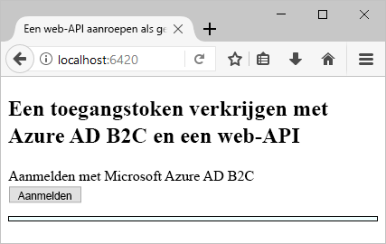
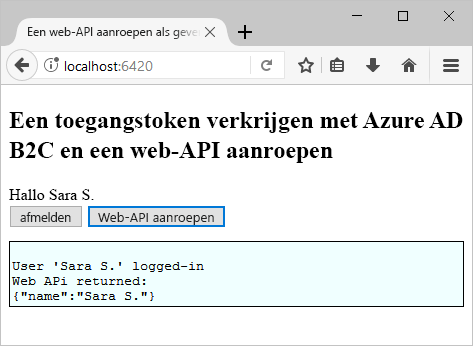

# <a name="test-drive-a-single-page-application-configured-with-azure-ad-b2c"></a>Een single-page application ' geconfigureerd met Azure AD B2C testen

## <a name="about-this-sample"></a>Over dit voorbeeld

Azure Active Directory B2C biedt cloud identity management te houden van uw toepassing, zakelijke en klanten die zijn beveiligd.  Deze snelstartgids maakt gebruik van een voorbeeldtoepassing met één pagina voor het demonstreren van:

* Met behulp van de **registreren of aanmelden** beleid maken of meld u aan met een sociale id-provider of een lokale account via een e-mailadres. 
* **Een API aanroepen** uw weergegeven naam ophalen uit een Azure AD B2C beveiligde resource.

## <a name="prerequisites"></a>Vereisten

* Installeer [Visual Studio 2017](https://www.visualstudio.com/downloads/) met de volgende workloads:
    - **ASP.NET- en web-ontwikkeling**

* [Node.js](https://nodejs.org/en/download/) installeren

* Een sociaal-account van Facebook, Google, Microsoft- of Twitter. Als u geen een sociaal-account hebt, moet een geldig e-mailadres is vereist.

[!INCLUDE [quickstarts-free-trial-note](../../includes/quickstarts-free-trial-note.md)]

## <a name="download-the-sample"></a>Het voorbeeld downloaden

[Downloaden of te klonen van de voorbeeldtoepassing](https://github.com/Azure-Samples/active-directory-b2c-javascript-msal-singlepageapp) vanuit GitHub.

## <a name="run-the-sample-application"></a>De voorbeeldtoepassing uitvoeren

Dit voorbeeld uitvoeren vanaf de Node.js-opdrachtprompt: 

```
cd active-directory-b2c-javascript-msal-singlepageapp
npm install && npm update
node server.js
```

Het consolevenster ziet u het poortnummer voor de webtoepassing op uw computer uitgevoerd.

```
Listening on port 6420...
```

Open `http://localhost:6420` in een webbrowser toegang krijgen tot de webtoepassing.




## <a name="create-an-account"></a>Een account maken

Klik op de **aanmelding** om te starten van de Azure AD B2C **registreren of aanmelden** werkstroom. Wanneer u een account maakt, kunt u een bestaande sociale identiteit provider-account of een e-mailaccount.

### <a name="sign-up-using-a-social-identity-provider"></a>Aanmelden met een identiteitsprovider van sociale

Klik op de knop van de id-provider die u wilt gebruiken voor het aanmelden met een identiteitsprovider van sociale. Als u liever een e-mailadres, Ga naar de [aanmelden met een e-mailadres](#sign-up-using-an-email-address) sectie.


U moet verifiëren met uw account sociale referenties en autoriseren van de toepassing om informatie te lezen uit je account sociale (sign-in). Door toegang te verlenen, kan de toepassing profielgegevens ophalen van de sociale account zoals uw naam en plaats. 


De details van uw nieuwe profiel zijn al ingevuld met informatie uit uw sociale-account. 


De weergavenaam, functietitel en plaats velden bijwerken en klik op **doorgaan**.  De waarden die u invoert worden gebruikt voor het hulpprogramma voor het account van uw Azure AD B2C-gebruikersprofiel.

U hebt een nieuwe Azure AD B2C-gebruikersaccount die gebruikmaakt van een id-provider gemaakt. 

Volgende stap: [aanroepen van een resource](#call-a-resource) sectie.

### <a name="sign-up-using-an-email-address"></a>Aanmelden met een e-mailadres

Als u een sociale account niet gebruikt kiest voor verificatie, kunt u een Azure AD B2C gebruikersaccount in met een geldig e-mailadres. Een lokale gebruikersaccount van Azure AD B2C gebruikt Azure Active Directory als de id-provider. Met uw e-mailadres, klikt u op de **geen account? Nu aanmelden** koppeling.


Voer een geldig e-mailadres in en klikt u op **sturen verificatiecode**. Een geldig e-mailadres is vereist voor de verificatiecode ontvangen van Azure AD B2C. 

Voer de verificatiecode die u via e-mail ontvangt en klik op **code controleren**.

Je profielgegevens toevoegen en klik op **maken**.


Een nieuwe Azure AD B2C lokaal gebruikersaccount hebt gemaakt.

## <a name="call-a-resource"></a>Aanroepen van een resource

Nadat u bent aangemeld, kunt u de **Web-API aanroepen** knop om de weergavenaam van de Web-API-aanroep als een JSON-object geretourneerd. 



## <a name="next-steps"></a>Volgende stappen

De volgende stap is uw eigen Azure AD B2C-tenant maken en configureren van het voorbeeld wilt uitvoeren met behulp van uw tenant. 

> [!div class="nextstepaction"]
> [Een Azure Active Directory B2C-tenant maken in de Azure portal](active-directory-b2c-get-started.md)