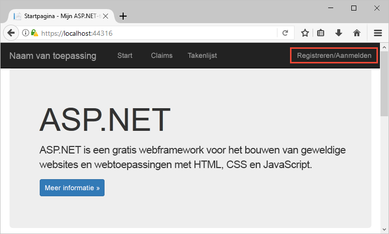
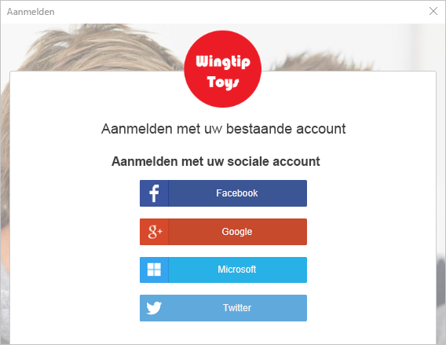
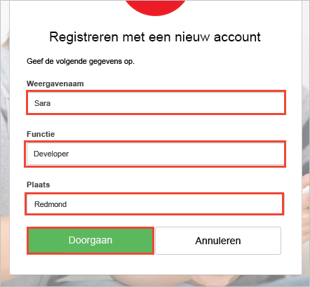
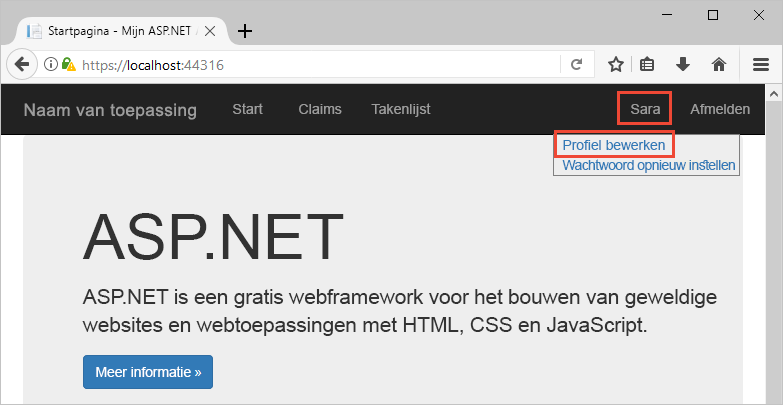
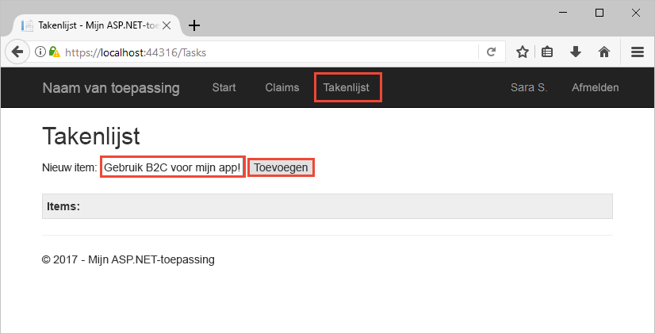

# Test station een Azure AD B2C ingeschakeld web-app

Azure Active Directory B2C biedt cloud identity management te houden van uw toepassing, zakelijke en klanten die zijn beveiligd. Deze snelstartgids maakt gebruik van een voorbeeld-app voor de lijst van taken voor het demonstreren van:

> [!div class="checklist"]
> * Aanmelden met een aangepaste aanmeldingspagina.
> * Meld u aan met een sociale id-provider.
> * Maken en beheren van uw Azure AD B2C-account en de gebruiker het profiel.
> * Het aanroepen van een web-API die zijn beveiligd door Azure AD B2C.

## Vereisten

* [Visual Studio 2017](https://www.visualstudio.com/downloads/) met de **ASP.NET en web ontwikkeling** werkbelasting. 
* Een sociaal-account van Facebook, Google, Microsoft- of Twitter.

[!INCLUDE [quickstarts-free-trial-note](../../includes/quickstarts-free-trial-note.md)]

## Het voorbeeld downloaden

[Downloaden of te klonen van de voorbeeldtoepassing](https://github.com/Azure-Samples/active-directory-b2c-dotnet-webapp-and-webapi) vanuit GitHub.

## Voer de app in Visual Studio

Open in de projectmap voorbeeld toepassing de `B2C-WebAPI-DotNet.sln` oplossing in Visual Studio. 

De oplossing is een voorbeeld van taak lijst die bestaat uit twee projecten:

* **TaskWebApp** : een ASP.NET MVC-webtoepassing waar een gebruiker hun taak lijstitems kan beheren.  
* **TaskService** – back-end van een ASP.NET-Web-API die wordt beheerd bewerkingen uitgevoerd op de lijst taakitems van een gebruiker. De web-app deze web-API aanroept en de resultaten worden weergegeven.

Voor deze Quick Start, moet u beide uitvoeren de `TaskWebApp` en `TaskService` projecten tegelijk. 

1. Selecteer in het menu Visual Studio **projecten > Opstartprojecten instellen...** . 
2. Selecteer **meerdere opstartprojecten** keuzerondje.
3. Wijzig de **actie** voor beide projecten naar **Start**. Klik op **OK**.

Selecteer **fouten opsporen > Foutopsporing starten** het bouwen en uitvoeren van beide toepassingen. Elke toepassing wordt geopend in een eigen browsertabblad:

`https://localhost:44316/`-Deze pagina is de ASP.NET-webtoepassing. U communiceert rechtstreeks met deze toepassing in de Quick Start.
`https://localhost:44332/`-Deze pagina is de web-API die wordt aangeroepen door de ASP.NET-webtoepassing.

## Een account maken

Klik op de **aanmelden / aanmelden** koppeling in de ASP.NET-webtoepassing starten de **registreren of aanmelden** werkstroom. Wanneer u een account maakt, kunt u een bestaande sociale identiteit provider-account of een e-mailaccount. Gebruik een account van de provider van sociale identiteit van Facebook, Google, Microsoft- of Twitter voor deze snelstartgids.

### Aanmelden met een identiteitsprovider van sociale

Klik op de knop van de id-provider die u wilt gebruiken voor het aanmelden met een identiteitsprovider van sociale. 

U moet verifiëren met uw account sociale referenties en autoriseren van de toepassing om informatie te lezen uit je account sociale (sign-in). Door toegang te verlenen, kan de toepassing profielgegevens ophalen van de sociale account zoals uw naam en plaats. 

Het proces aanmelden voltooid voor de id-provider. Bijvoorbeeld: als u Twitter, Voer uw referenties voor Twitter en klikt u op **aanmelden**.

Uw nieuwe Azure AD B2C profiel accountgegevens zijn al ingevuld met informatie uit uw sociale-account.

De weergavenaam, functietitel en plaats velden bijwerken en klik op **doorgaan**.  De waarden die u invoert worden gebruikt voor het hulpprogramma voor het account van uw Azure AD B2C-gebruikersprofiel.

Er is:

> [!div class="checklist"]
> * Geverifieerd met een id-provider.
> * Een Azure AD B2C-account gemaakt. 

## Uw profiel bewerken

Azure Active Directory B2C biedt functionaliteit waarmee gebruikers hun profielen bijwerken. Klik op de profielnaam in de menubalk van web-toepassing en selecteer **profiel bewerken** bewerken van het profiel dat u hebt gemaakt.

Wijzig uw **weergavenaam** en **stad**.  Klik op **doorgaan** uw profiel bijwerken.

Let op dat de weergavenaam van uw in de rechterbovenhoek van de pagina wordt de bijgewerkte naam weergegeven. 

## Toegang krijgen tot een beveiligde web API-resource

Klik op **takenlijst** in te voeren en uw taak lijstitems te wijzigen. De ASP.NET-webtoepassing bevat een toegangstoken in de aanvraag op het web API resource aanvragende toestemming voor het uitvoeren van bewerkingen op de taakitems lijst van de gebruiker. 

Voer tekst in de **Nieuw Item** in het tekstvak. Klik op **toevoegen** aanroepen van de Azure AD B2C beveiligd web-API waarmee een lijstitem taak toegevoegd.

U hebt uw Azure AD B2C-gebruikersaccount is gebruikt voor een geautoriseerde gesprek een web-API van Azure AD B2C, beveiligd.

## Volgende stappen

Het voorbeeld in deze snelstartgids gebruikt kan worden gebruikt om te proberen andere Azure AD B2C-scenario's, waaronder:

* Maken van een nieuwe lokale account met behulp van een e-mailadres.
* Opnieuw instellen van uw lokale wachtwoord.

Als u klaar bent om dieper uw eigen Azure AD B2C-tenant maken en configureren van het voorbeeld wilt uitvoeren met behulp van uw eigen tenant, probeer de volgende zelfstudie.

> [!div class="nextstepaction"]
> [Een ASP.NET-web-app maken met Azure Active Directory B2C registreren, aanmelden, profiel bewerken en wachtwoord opnieuw instellen](active-directory-b2c-devquickstarts-web-dotnet-susi.md)