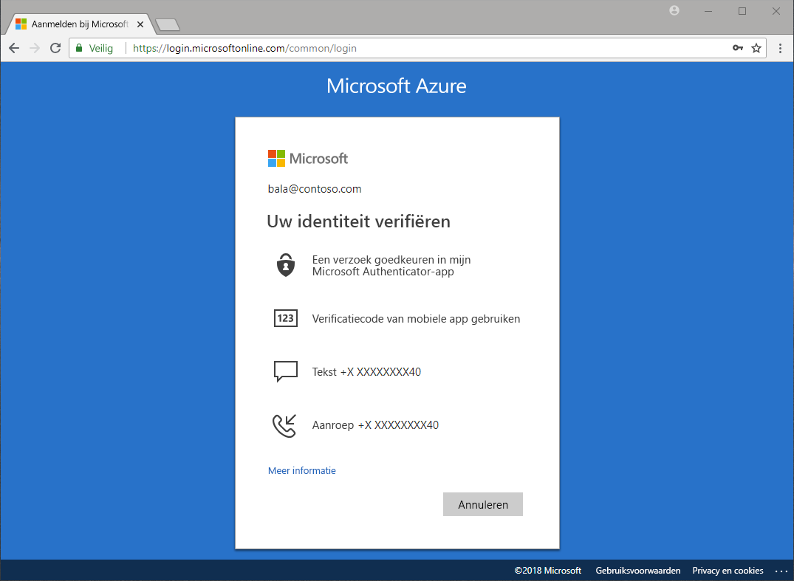

# Welke verificatiemethoden zijn er beschikbaar?

Je leest in het nieuws steeds dat wachtwoorden worden gestolen en dat er met identiteiten wordt geknoeid. Door een tweede verificatiefactor naast een wachtwoord te gebruiken, wordt uw organisatie meteen een stuk beter beveiligd. Microsoft Azure Active Directory (Azure AD) bevat functies, zoals Azure Multi-Factor Authentication (Azure MFA) en de selfservice voor wachtwoordherstel (SSPR) van Azure AD, die beheerders helpen om hun organisaties en gebruikers in staat te stellen zich beter te beveiligen met behulp van aanvullende verificatiemethoden.

Er zijn veel scenario's waarin het volgende gebeurt: aanmelden bij een toepassing, het wachtwoord opnieuw instellen, Windows Hello instellen en meer. Mogelijk wordt uw gebruikers gevraagd om op aanvullende manieren te verifiëren dat ze zijn wie ze beweren te zijn.

Aanvullende verificatie kan de vorm hebben van verificatiemethoden zoals:

* Een code die wordt verstrekt in een e-mail of sms-bericht
* Een telefoontje
* Een melding of de code op de telefoon
* Het beantwoorden van beveiligingsvragen

Met Azure MFA en de selfservice voor het opnieuw instellen van wachtwoorden van Azure AD, hebben beheerders een betere controle over de configuratie, het beleid, bewaking en rapportagemogelijkheden om hun organisatie te beveiligen via Azure AD en Azure Portal.

## Self-service voor wachtwoord opnieuw instellen

De selfservice voor het opnieuw instellen van wachtwoorden biedt uw gebruikers de mogelijkheid om waar en wanneer ze dat willen hun wachtwoord opnieuw in te stellen zonder dat er een beheerder bij te pas komt.

> [!VIDEO https://www.youtube.com/embed/hc97Yx5PJiM]

De selfservice voor het opnieuw instellen van wachtwoorden omvat onder andere:

* **Wachtwoord wijzigen:** Ik weet mijn wachtwoord maar wil het wijzigen.
* **Wachtwoord opnieuw instellen:** Ik kan me niet aanmelden en wil mijn wachtwoord met behulp van een of meer goedgekeurde verificatiemethoden opnieuw instellen.
* **Account ontgrendelen:** Ik kan me niet aanmelden omdat mijn account is vergrendeld en ik wil dit ontgrendelen met behulp van een of meer goedgekeurde verificatiemethoden.

## Multi-Factor Authentication

Azure Multi-Factor Authentication (MFA) is een Microsoft-oplossing voor verificatie in twee stappen. Met behulp van door een beheerder goedgekeurde verificatiemethode, helpt Azure MFA met het beveiligen van gegevens en toepassingen, terwijl tegelijkertijd aan de behoefte aan een eenvoudige aanmeldingsprocedure wordt voldaan.

## Volgende stappen

De volgende stap is dieper in te gaan op de selfservice voor het opnieuw instellen van wachtwoorden en op Azure Multi-Factor Authentication en hoe deze geconfigureerd kunnen worden.

Lees het [snelstart-artikel Selfservice voor het opnieuw instellen van wachtwoorden inschakelen](quickstart-sspr.md) als u aan de slag wilt met de functie voor het opnieuw instellen van wachtwoorden .

U vindt meer informatie over de selfservice voor het opnieuw instellen van wachtwoorden in het artikel [How it works: Azure AD self-service password reset](concept-sspr-howitworks.md) (Hoe het werkt: De selfservice voor het opnieuw instellen van wachtwoorden in Azure AD)

Lees het artikel [How it works: Azure Multi-Factor Authentication](concept-mfa-howitworks.md) (Hoe het werkt: Azure Multi-Factor Authentication) als u meer wilt weten over Azure Multi-Factor Authentication.
