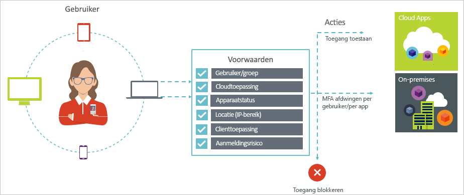

# Wat is voorwaardelijke toegang in Azure Active Directory?

Beveiliging is een topprioriteit voor organisaties die gebruikmaken van de cloud. Als het om het beheren van uw cloudresources gaat, vormen identiteit en toegang belangrijke aspecten bij het beveiligen van de cloud. In een wereld waar mobiliteit en cloud belangrijke begrippen zijn, kunnen gebruikers overal toegang krijgen tot de resources van uw organisatie met behulp van diverse apparaten en apps. Dus het is niet meer voldoende als u zich alleen richt op wie er toegang tot een resource mogen hebben. Voor de juiste balans tussen beveiliging en productiviteit dient u ook rekening te houden met de manier waarop een resource wordt geopend door middel van een beslissing voor toegangsbeheer. Met voorwaardelijke toegang van Azure Active Directory (Azure AD) kunt u dit vereiste aanpakken. Voorwaardelijke toegang is een functionaliteit van Azure Active Directory. Met voorwaardelijke toegang kunt u geautomatiseerde beslissingen voor toegangsbeheer implementeren voor het openen van uw cloud-apps op basis van voorwaarden. 

In dit artikel wordt een conceptueel overzicht gegeven van voorwaardelijke toegang in Azure AD.

## Algemene scenario's

In een wereld waar mobiliteit en cloud belangrijke begrippen zijn maakt Azure Active Directory vanaf een willekeurige locatie eenmalige aanmelding mogelijk voor apparaten, apps en services. Als gevolg van een toenemend aantal apparaten (waaronder BYOD), werken buiten de organisatie en SaaS-apps van derden, hebt u te maken met twee tegengestelde doelen:

- Geef gebruikers de mogelijkheid overal en altijd productief te zijn
- Beveilig de zakelijke bezittingen - op elk moment

Door gebruik te maken van voorwaardelijk toegangsbeleid kunt u de juiste besturingselementen voor toegang toepassen onder de juiste voorwaarden. Voorwaardelijke toegang van Azure AD biedt aanvullende beveiliging alleen als het nodig is. In andere gevallen heeft de gebruiker er geen last van. 

Hieronder vindt u enkele punten van zorg met betrekking tot toegang waarbij voorwaardelijke toegang u kan helpen:

- **[Aanmeldingsrisico](conditions.md#sign-in-risk)**: Azure AD Identity Protection detecteert aanmeldingsrisico's. Hoe beperkt u de toegang als een gedetecteerd aanmeldingsrisico op ongeautoriseerde toegang wijst? En als u sterker bewijs wilt hebben dat een aanmelding door een legitieme gebruiker is uitgevoerd? En als uw twijfels sterk genoeg zijn om zelfs bepaalde gebruikers de toegang tot een app te ontzeggen?  

- **[Netwerklocatie](location-condition.md)**: Azure AD is overal vandaan toegankelijk. Wat te doen als een toegangspoging wordt uitgevoerd vanaf een netwerklocatie die niet onder het beheer staat van uw IT-afdeling? Een gebruikersnaam in combinatie met een wachtwoord kan voldoende zijn als bewijs van identiteit voor toegang tot uw bedrijfsnetwerk. Maar wat te doen als u een sterker bewijs van de identiteit wilt bij toegangspogingen uit andere, onverwachte landen of regio's? En als u zelfs toegangspogingen wilt blokkeren vanaf bepaalde locaties?  

- **[Apparaatbeheer](conditions.md#device-platforms)**: in Azure AD hebben gebruikers toegang tot cloud-apps vanaf een groot aantal apparaten, waaronder mobiele en persoonlijke apparaten. Maar stel dat u eist dat toegangspogingen alleen mogen worden uitgevoerd met apparaten die door de IT-afdeling worden beheerd? En als u zelfs bepaalde typen apparaten de toegang tot cloud-apps in uw omgeving wilt ontzeggen? 

- **[Clienttoepassing](conditions.md#client-apps)**: tegenwoordig is toegang tot talloze cloud-apps mogelijk met verschillende typen apps, zoals web-apps, mobiele apps of bureaublad-apps. Maar als er nu een toegangspoging wordt ondernomen met een type client-app die bekende problemen veroorzaakt? Stel dat u voor bepaalde typen apps een apparaat nodig hebt dat door de IT-afdeling wordt beheerd? 

Deze vragen en de antwoorden erop hebben te maken met veelvoorkomende toegangsscenario's met voorwaardelijke toegang van Azure AD. Voorwaardelijke toegang is een functionaliteit van Azure Active Directory waardoor u toegangsscenario's kunt beheren met een op beleid gerichte aanpak.

## Voorwaardelijk toegangsbeleid

Voorwaardelijk toegangsbeleid is de naam voor een toegangsscenario waarbij gebruik wordt gemaakt van het volgende patroon:

**Ga als volgt te werk** geeft de reactie van het beleid aan. Merk op dat het doel van voorwaardelijk toegangsbeleid is om geen toegang tot een cloud-app te verlenen. In Azure AD is het verlenen van toegang tot cloud-apps onderhevig aan gebruikerstoewijzingen. Met voorwaardelijk toegangsbeleid bepaalt u hoe gemachtigde gebruikers (gebruikers die toegang tot een cloud-app is verleend) cloud-apps onder bepaalde voorwaarden mogen openen. In uw respons dwingt u aanvullende vereisten af, zoals bijvoorbeeld meervoudige verificatie of een beheerd apparaat. Binnen de context van voorwaardelijke toegang van Azure AD worden de door het beleid afgedwongen vereisten besturingselementen voor toegang genoemd. In zijn meest beperkende vorm kan het beleid de toegang blokkeren. Zie [Besturingselementen voor toegang in voorwaardelijke toegang van Azure Active Directory](controls.md) voor meer informatie.
     

**Als dit gebeurt** definieert de reden voor het activeren van het beleid. De reden wordt gekenmerkt als een groep voorwaarden waaraan is voldaan. In voorwaardelijke toegang van Azure AD spelen de twee toewijzingsvoorwaarden een speciale rol:

- **[Gebruikers](conditions.md#users-and-groups)**: de gebruikers die een toegangspoging uitvoeren (**Wie**). 

- **[Cloud-apps](conditions.md#cloud-apps)**: de doelen van een toegangspoging (**Wat**).    

Deze twee voorwaarden zijn verplicht in een voorwaardelijk toegangsbeleid. Naast de twee verplichte voorwaarden, kunt u ook aanvullende voorwaarden opnemen. Deze beschrijven hoe de toegangspoging wordt uitgevoerd. Bekende voorbeelden zijn het gebruik van mobiele apparaten of locaties buiten uw bedrijfsnetwerk. Zie [Voorwaarden in Azure Active Directory](conditions.md) voor meer informatie.   

De combinatie van voorwaarden en uw besturingselementen voor toegang stellen een beleid voor voorwaardelijke toegang voor. 

Met voorwaardelijke toegang van Azure AD kunt u bepalen hoe gemachtigde gebruikers uw cloud-apps kunnen openen. Het doel van een beleid voor voorwaardelijke toegang is om aanvullende besturingselementen voor toegang af te dwingen bij een toegangspoging tot een cloud-app op basis van de manier waarop de poging wordt uitgevoerd.

Een benadering op basis van beleid voor het beveiligen van toegang tot uw cloud-apps biedt u de mogelijkheid de beleidsvereisten voor uw omgeving te gaan schetsen aan de hand van de structuur die in dit artikel uiteen wordt gezet en zonder dat u zich zorgen hoeft te maken over de technische implementatie. 

## Voorwaardelijke toegang en federatieve verificatie van Azure Active Directory

Beleid voor voorwaardelijke toegang werkt naadloos met [federatieve verificatie](../../security/azure-ad-choose-authn.md#federated-authentication). Deze ondersteuning omvat alle ondersteunde voorwaarden en besturingselementen en inzicht in hoe beleid wordt toegepast op actieve gebruikersaanmeldingen met behulp van [Azure Active Directory-rapportage](../reports-monitoring/concept-sign-ins.md).

*Federatieve verificatie met Azure AD* betekent dat gebruikersverificatie bij Azure Active Directory wordt verwerkt door een vertrouwde verificatieservice. Een vertrouwde verificatieservice is bijvoorbeeld Active Directory Federation Services (AD FS) of een andere federatieservice. In deze configuratie wordt verificatie van de primaire gebruiker uitgevoerd bij de service en wordt vervolgens Azure Active Directory gebruikt voor aanmelding bij afzonderlijke toepassingen. Voorwaardelijke toegang van Azure Active Directory wordt toegepast voordat toegang wordt verleend tot de toepassing die de gebruiker wil openen. 

Wanneer het geconfigureerde beleid voor voorwaardelijke toegang meervoudige verificatie vereist, gebruikt Azure Active Directory standaard Azure MFA. Als u de federatieve service voor MFA gebruikt, kunt u Azure Active Directory configureren voor omleiding naar de federatieve services wanneer MFA nodig is door `-SupportsMFA` op `$true` in te stellen in [PowerShell](https://docs.microsoft.com/powershell/module/msonline/set-msoldomainfederationsettings). Deze instelling werkt voor federatieve verificatieservices die ondersteuning bieden voor de aanvraag voor de MFA-uitdaging die door Azure Active Directory wordt uitgegeven met behulp van `wauth= http://schemas.microsoft.com/claims/multipleauthn`.

Nadat de gebruiker is aangemeld bij de federatieve verificatieservice, worden andere beleidsvereisten, zoals het nalevingsbeleid voor apparaten of een goedgekeurde toepassing, door Azure Active Directory verwerkt.

## Licentievereisten voor het gebruik van voorwaardelijke toegang

Als u voorwaardelijke toegang wilt gebruiken, hebt u een Azure AD Premium-licentie nodig. Zie [Algemeen beschikbare functies van de edities Gratis, Basic en Premium vergelijken](https://azure.microsoft.com/pricing/details/active-directory/) als u een licentie zoekt die bij uw vereisten past.

## Volgende stappen

- Als u meer wilt weten over:
    - Voorwaarden, raadpleegt u [Voorwaarden in Azure Active Directory](conditions.md).

    - Besturingselementen voor toegang, raadpleegt u [Besturingselementen voor toegang in voorwaardelijke toegang van Azure Active Directory](controls.md).

- Zie [MFA vereisen voor specifieke apps met voorwaardelijke toegang van Azure Active Directory](app-based-mfa.md) als u ervaring wilt opdoen met het configureren van beleid voor voorwaardelijke toegang.

- Zie [Aanbevolen procedures voor voorwaardelijke toegang in Azure Active Directory](best-practices.md) als u klaar bent om beleid voor voorwaardelijke toegang in Azure Active Directory te configureren. 

- Zie [conditional access deployment plan](https://aka.ms/conditionalaccessdeploymentplan) (implementatieplan voor voorwaardelijke toegang) als u een stapsgewijs implementatieplan met aanbevolen beleid zoekt
