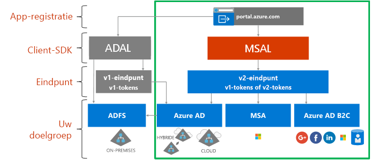

# Over het Microsoft Identity Platform

Het Microsoft Identity Platform bouwt voort op de identiteitsservice en het ontwikkelaarsplatform van Azure Active Directory (Azure AD). Met het Microsoft Identity Platform kunnen ontwikkelaars toepassingen maken waarbij gebruikers zich met alle Microsoft-identiteiten kunnen aanmelden en waarmee tokens worden opgehaald voor het aanroepen van Microsoft Graph, andere Microsoft-API's of API's die door ontwikkelaars zijn gemaakt. Het platform biedt uitgebreide functionaliteit en bevat een verificatieservice, open source-bibliotheken, mogelijkheden voor toepassingsregistratie en -configuratie (via een ontwikkelaarsportal en toepassings-API), volledige ontwikkelaarsdocumentatie, codevoorbeelden en andere inhoud voor ontwikkelaars. Het Microsoft Identity Platform biedt ondersteuning voor standaardprotocollen als OAuth 2.0 en OpenID Connect.

Tot nu toe hebben de meeste ontwikkelaars gewerkt met Azure AD v1.0 voor het verifiëren van Azure AD-identiteiten (werk- en schoolaccounts), door tokens aan te vragen van het Azure AD v1.0-eindpunt en gebruik te maken van Azure AD Authentication Library (ADAL), Azure Portal voor de registratie en configuratie van toepassingen, en Azure AD Graph API voor het programmatisch configureren van toepassingen. Het Azure AD v1.0-platform is een goed ontwikkeld platform dat zal blijven werken voor bedrijfstoepassingen.

Om de capaciteiten van het Microsoft Identity Platform verder uit te breiden, kunt u nu meer Microsoft-identiteiten verifiëren (Azure AD-identiteiten, Microsoft-accounts zoals outlook.com en hotmail.com, en socialemedia-accounts en lokale accounts via Azure AD B2C) via wat bekend is als het Azure AD v2.0-eindpunt. Hier gebruikt u de Microsoft Authentication Library (MSAL) of een open-source OAuth2.0- of OpenID Connect-bibliotheek, Azure Portal voor de registratie en configuratie van toepassingen, en de Microsoft Graph API voor het programmatisch configureren van toepassingen. Het bijgewerkte Microsoft Identity Platform (en dan met name de MSAL-bibliotheken en nieuwe manier van app-registratie op Azure Portal) heeft zich het afgelopen enorm ontwikkeld. Voor het voltooien van deze release, vragen we ontwikkelaars om hun toepassingen te ontwikkelen en testen met de recentste versie van het Microsoft Identity Platform.

Voor toepassingen die gebruikmaken van de nieuwste ADAL en MSAL kan eenmalige aanmelding worden gebruikt. Toepassingen die zijn bijgewerkt van ADAL naar MSAL houden de status Aanmelding door gebruiker. Ontwikkelaars kunnen er indien gewenst voor kiezen om hun toepassing bij te werken naar MSAL, omdat toepassingen die zijn gemaakt met ADAL blijven werken en worden ondersteund.

## Gebruikerservaring met het Microsoft Identity Platform

In het volgende schema wordt de gebruikerservaring met Microsoft Identity weergegeven op hoog niveau, inclusief de registratie van apps, SDK’s, eindpunten en ondersteunde identiteiten.

Het Microsoft Identity Platform heeft twee eindpunten (v1.0 en v2.0) en twee sets clientbibliotheken voor het afhandelen van deze eindpunten. Houd bij het ontwikkelen van nieuwe toepassing rekening met de voordelen en huidige status van de eindpunten en de verificatiebibliotheken. Houd ook rekening met het volgende:

* Ondersteunde platforms

    * [ADAL](active-directory-authentication-libraries.md) biedt ondersteuning voor .NET, JavaScript, iOS, Android, Java en Python
    * [MSAL Preview](reference-v2-libraries.md) biedt ondersteuning voor .NET, JavaScript, iOS en Android
    * Beide eindpunten bieden ondersteuning voor .NET- en Node.js-servermiddleware voor het beveiligen van API's en aanmelden. 

* Het grootste deel van innovatie, zoals dynamische toestemming en incrementele toestemming, vindt plaats op het v2.0-eindpunt en in MSAL, terwijl we v1.0 en ADAL blijven ondersteunen.

    In Azure Portal moest u voorheen alle bereiken die uw app nodig had statisch identificeren. Met het v2.0-eindpunt en de portals die eraan zijn gekoppeld, u kunt de bereiken statisch definiëren zoals voorheen, of ze dynamisch aanvragen wanneer uw app de machtiging nodig heeft. De dynamische methode biedt nog een optionele mogelijkheid, incrementele toestemming. Met incrementele toestemming kunt vragen om een subset van bereiken die u nodig hebt wanneer een gebruiker de eerste keer wordt geverifieerd, en aanvullende bereiken aanvragen wanneer nodig. 
    
    Bijvoorbeeld: wanneer u een camera-app gebruikt op een mobiel apparaat, wordt de gebruiker gevraagd de app toestemming te geven voor toegang tot de camera, en alleen nadat de gebruiker die toestemming heeft gegeven krijgt de app toegang tot de camera voor het maken van een foto.  Wanneer de app klaar is om de nieuwe foto op te slaan, kan deze vragen om lees- en schrijfmachtigingen. 

* Mogelijke wijzigingen die fouten veroorzaken

    MSAL is geschikt voor gebruik in een productieomgeving. We bieden hetzelfde niveau aan productieondersteuning voor MSAL als voor onze huidige productiebibliotheken. Tijdens de preview-fase kunnen we wijzigingen aanbrengen in de API, de indeling van de interne cache en andere mechanismen van deze bibliotheek. Deze moet u in gebruik nemen samen met oplossingen voor problemen of verbeterde functies. Dit kan gevolgen hebben voor uw toepassing. Een gewijzigde indeling van de cache kan bijvoorbeeld tot gevolg hebben dat uw gebruikers zich opnieuw moeten aanmelden. Een wijziging in de API kan ertoe leiden dat u code moet bijwerken. Wanneer we de release voor algemene beschikbaarheid (GA) beschikbaar stellen, moet u binnen zes maanden bijwerken naar de GA-versie, omdat toepassingen die zijn geschreven met een preview-versie van de bibliotheek daarna mogelijk niet meer werken.

## Volgende stappen

Meer informatie over v1.0 en v2.0.

* [Over v1.0](v1-overview.md)
* [Over v2.0](v2-overview.md)
