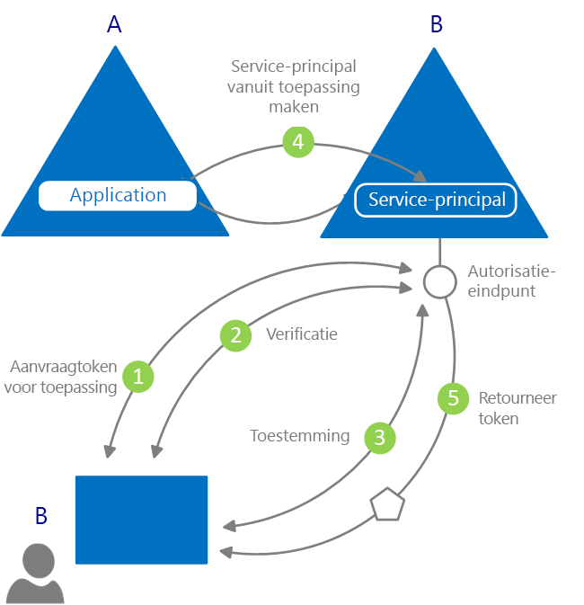

# Wat is verificatie?

Bij *verificatie* wordt een partij gevraagd om legitieme referenties. Op basis hiervan kan een beveiligingsprincipal worden gemaakt voor identiteits- en toegangsbeheer. Eenvoudiger gezegd wordt bij dit proces bewezen dat u bent wie u zegt te zijn. Verificatie wordt soms afgekort tot 'AuthN'.

Bij *autorisatie* krijgt een geverifieerde beveiligingsprincipal toestemming om iets te doen. Er wordt aangegeven welke gegevens mogen worden gebruikt en wat ermee mag worden gedaan. Autorisatie wordt soms afgekort tot 'AuthZ'.

Azure Active Directory (Azure AD) vereenvoudigt verificatie voor ontwikkelaars van toepassingen door Identity-as-a-Service aan te bieden, met ondersteuning voor standaardprotocollen zoals OAuth 2.0 en OpenID Connect. Daarnaast wordt er ondersteuning geboden voor open-sourcebibliotheken van verschillende platforms zodat u snel aan de slag kunt met coderen.

Er zijn twee primaire gebruiksscenario's in het Azure AD-programmeermodel:

* Tijdens een OAuth 2.0-stroom voor autorisatie - wanneer de resource-eigenaar autorisatie verleent aan de clienttoepassing, zodat de client toegang verkrijgt tot de resources van de resource-eigenaar.
* Wanneer de client resources opent - zoals geïmplementeerd door de resourceserver, met gebruik van de claimwaarden in het toegangstoken, om toegangsbeheerbeslissingen te nemen op basis van die waarden.

## Basisinformatie over verificatie in Azure Active Directory

Bedenk het meest eenvoudige scenario waarin identiteiten zijn vereist: een gebruiker moet zich in een webbrowser verifiëren bij een webtoepassing. In het volgende diagram is dit scenario te zien:

Hier volgt wat u moet weten over de verschillende onderdelen in het diagram:

* Azure AD is de identiteitsprovider. De identiteitsprovider is verantwoordelijk voor het verifiëren van de identiteit van gebruikers en toepassingen uit de directory van een organisatie. Er worden ook beveiligingstokens uitgegeven nadat die gebruikers en toepassingen zijn geverifieerd.
* Als een toepassing het verifiëren wil uitbesteden aan Azure AD, moet deze bij Azure AD zijn geregistreerd. Azure AD registreert de app in de directory en geeft deze een unieke id.
* Ontwikkelaars kunnen de open-sourceverificatiebibliotheken van Azure AD gebruiken om de verificatie te vereenvoudigen. Hierbij worden de protocolgegevens voor u verwerkt. Voor meer informatie ziet u de Azure AD [v2.0-verificatiebibliotheken](reference-v2-libraries.md) en de [v1.0-verificatiebibliotheken](active-directory-authentication-libraries.md).
* Wanneer een gebruiker is geverifieerd, moet de toepassing het beveiligingstoken van de gebruiker valideren om er zeker van te zijn dat de verificatie is gelukt. U kunt snelstartgidsen, zelfstudies, codevoorbeelden in verschillende talen en frameworks bekijken waarin u ziet wat de toepassing moet doen.
  * Om snel een app te bouwen en functionaliteit toe te voegen, zoals tokens ophalen, tokens vernieuwen, gebruikers aanmelden, bepaalde gebruikersgegevens weergeven, enzovoort, gaat u naar het gedeelte **Snelstartgidsen** in de documentatie.
  * Ga naar het gedeelte **Zelfstudies** van de documentatie voor uitgebreide, op scenario's gebaseerde procedures voor ontwikkelaarstaken (zoals toegangstokens verkrijgen en deze gebruiken in aanroepen naar de Microsoft Graph-API en andere API's en aanmelden met Microsoft implementeren in een traditionele webbrowser-app via OpenID Connect).
  * Ga naar [GitHub](https://github.com/Azure-Samples?q=active-directory) om codevoorbeelden te downloaden.
* De stroom van aanvragen en antwoorden in het verificatieproces wordt bepaald aan de hand van het gebruikte verificatieprotocol, zoals OAuth 2.0, OpenID Connect, WS-Federation of SAML 2.0. Zie het gedeelte **Concepten > Protocollen** van de documentatie voor meer informatie over protocollen.

In het bovenstaande voorbeeldscenario kunt u apps classificeren aan de hand van deze twee rollen:

* Apps die veilig toegang nodig hebben tot resources
* Apps die zelf de rol van resource hebben

Nu u bekend bent met de basisinformatie, kunt u verder lezen voor inzicht in het identiteit-app-model en de bijbehorende API, voor meer informatie over inrichten in Azure AD en voor koppelingen naar gedetailleerde informatie over algemene scenario's waar Azure AD ondersteuning voor biedt.

## Toepassingsmodel

Azure AD vertegenwoordigt toepassingen met een specifiek model dat speciaal bedoeld is voor twee belangrijke functies:

* **De app identificeren op basis van de ondersteunde verificatieprotocollen** - dit omvat het inventariseren van alle id's, URL's, geheimen en gerelateerde informatie die nodig is tijdens de verificatie. Azure AD doet dan het volgende:

    * Bewaart alle gegevens die nodig zijn om verificatie tijdens runtime te ondersteunen.
    * Bewaart alle gegevens om te beslissen welke resources een app mogelijk nodig heeft en of aanvragen moeten worden uitgevoerd (en onder welke omstandigheden).
    * Biedt de infrastructuur voor het implementeren van app-inrichting in de tenant van de app-ontwikkelaar en in andere Azure AD-tenants.

* **Verwerkt de gebruikerstoestemming tijdens het aanvragen van het token en maakt het dynamisch inrichten van apps in tenants mogelijk** - Hier doet Azure AD het volgende:

    * Stelt gebruikers en beheerders in staat om de app dynamisch toestemming te geven of weigeren om resources namens hen te gebruiken.
    * Stelt beheerders in staat om te beslissen wat apps mogen doen, welke gebruikers gebruik mogen maken van specifieke apps en hoe de directoryresources kunnen worden benaderd.

In Azure AD beschrijft een **toepassingsobject** een toepassing als een abstracte entiteit. Ontwikkelaars werken met toepassingen. Tijdens de implementatie gebruikt Azure AD een specifiek toepassingsobject als blauwdruk om een **service-principal** te maken; deze vertegenwoordigt een concreet exemplaar van een toepassing binnen een directory of tenant. De service-principal bepaalt wat de app daadwerkelijk kan doen in een specifieke doeldirectory, wie deze mag gebruiken, tot welke resources deze toegang heeft en meer. Azure AD maakt op basis van **toestemming** een service-principal van een toepassingsobject.

In het volgende diagram staat een vereenvoudigde Azure AD-inrichtingsstroom op basis van toestemming.

De inrichtingsstroom verloopt als volgt:

|   |   |
|---|---|
| 1 | Een gebruiker van B probeert zich aan te melden bij de app |
| 2 | De gebruikersreferenties worden verkregen en geverifieerd |
| 3 | De gebruiker wordt gevraagd de app toestemming te geven om toegang te verkrijgen tot tenant B |
| 4 | Azure AD gebruikt het toepassingsobject A als een blauwdruk voor het maken van een service-principal in B |
| 5 | De gebruiker ontvangt de aangevraagde token |
|   |   |

U kunt dit proces zo vaak herhalen als u wilt (voor andere tenants, zoals C, D, enzovoort). Directory A bevat de blauwdruk voor de app (heb toepassingsobject). De gebruikers en beheerders van de andere tenants waarvoor de app toestemming heeft, behouden controle over wat de toepassing mag doen. Dit kan worden beheerd met het bijbehorende service-principalobject in elke tenant. Zie [Toepassing en service-principalobjecten in Azure AD](app-objects-and-service-principals.md) voor meer informatie.

## Claims in Azure AD-beveiligingstokens

Beveiligingstokens (toegangs- en id-tokens) die worden uitgegeven door Azure AD bevatten claims of asserties van informatie over het onderwerp dat is geverifieerd. Toepassingen kunnen voor verschillende taken gebruikmaken van claims, waaronder:

* Het token valideren
* De directorytenant van het onderwerp identificeren
* Gebruikersgegevens weergeven
* De autorisatie van het onderwerp bepalen

Welke claims aanwezig zijn in een bepaald beveiligingstoken, is afhankelijk van het type token, het type referentie dat is gebruikt om de gebruiker te verifiëren en de configuratie van de toepassing.

In de onderstaande tabel staat een korte beschrijving van elk type claim dat door Azure AD wordt uitgegeven. Zie de [toegangstokens](access-tokens.md) en [id-tokens](id-tokens.md) die door Azure AD worden uitgegeven voor meer informatie.

| Claim | Beschrijving |
| --- | --- |
| Toepassings-id | Identificeert de toepassing die gebruikmaakt van het token. |
| Doelgroep | Identificeert de ontvangende resource waar het token voor is bedoeld. |
| Application Authentication Context Class Reference | Geeft aan hoe de client is geverifieerd (openbare client of vertrouwelijke client). |
| Verificatiemoment | Registreert de datum en tijd waarop de verificatie heeft plaatsgevonden. |
| Verificatiemethode | Geeft aan hoe het onderwerp van het token is geverifieerd (wachtwoord, certificaat, enzovoort). |
| Voornaam | Biedt de naam van de gebruiker zoals ingesteld in Azure AD. |
| Groepen | Bevat de object-id's van de Azure AD-groepen waar de gebruiker lid van is. |
| Identiteitsprovider | Registreert de identiteitsprovider waarmee het onderwerp van het token is geverifieerd. |
| Uitgegeven om | Registreert de tijd waarop het token is uitgegeven (vaak gebruikt om te controleren hoe nieuw het token is). |
| Verlener | Identificeert de beveiligingstokenservice die het token heeft uitgegeven en de Azure AD-tenant. |
| Achternaam | Biedt de achternaam van de gebruiker, zoals ingesteld in Azure AD. |
| Naam | Biedt een voor mensen leesbare waarde waarmee het onderwerp van het token wordt geïdentificeerd. |
| Object-id | Bevat een onveranderbare, unieke id voor het onderwerp in Azure AD. |
| Rollen | Bevat beschrijvende namen voor de Azure AD-toepassingsrollen die zijn toegewezen aan de gebruiker. |
| Bereik | Geeft aan welke machtigingen zijn verleend aan de clienttoepassing. |
| Onderwerp | Geeft aan over welke principal het token informatie bevat. |
| Tenant-id | Bevat een onveranderbare, unieke id voor de directorytenant die het token heeft uitgegeven. |
| Levensduur van token | Definieert gedurende welke periode een token geldig is. |
| User principal name | Bevat de user principal name van het onderwerp. |
| Versie | Bevat het versienummer van het token. |

## Volgende stappen

* Meer informatie over de [toepassingstypen en scenario's die worden ondersteund in Azure Active Directory](app-types.md)
