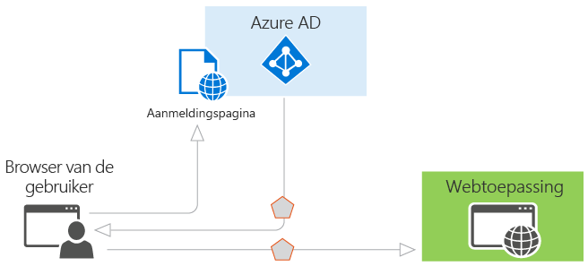

# Verificatiescenario's voor Azure AD

Azure Active Directory (Azure AD) vereenvoudigt verificatie voor ontwikkelaars door op te geven van de identiteit als een service, met ondersteuning voor standaardprotocollen zoals OAuth 2.0 en OpenID Connect, evenals open-source-bibliotheken voor verschillende platforms om u te helpen begin snel te coderen. In dit artikel krijgt u inzicht in de verschillende scenario's Azure AD ondersteunt en ziet u hoe u aan de slag. Het onderverdeeld in de volgende secties:

* [Basisbeginselen van verificatie in Azure AD](#basics-of-authentication-in-azure-ad)
* [Claims in beveiligingstokens van Azure AD](#claims-in-azure-ad-security-tokens)
* [Basisbeginselen van het registreren van een toepassing in Azure AD](#basics-of-registering-an-application-in-azure-ad)
* [Soorten toepassingen en scenario 's](#application-types-and-scenarios)

  * [Webbrowser voor web-App](#web-browser-to-web-application)
  * [Toepassing met één pagina (SPA)](#single-page-application-spa)
  * [Systeemeigen toepassing voor de web-API](#native-application-to-web-api)
  * [Web-App aan web-API](#web-application-to-web-api)
  * [Daemon of servertoepassing naar web-API](#daemon-or-server-application-to-web-api)

## Basisbeginselen van verificatie in Azure AD

Als u niet bekend met de basisbeginselen van verificatie in Azure AD bent, lees deze sectie. Anders kunt u direct doorgaan naar beneden naar [toepassingstypen en scenario's](#application-types-and-scenarios).

Laten we eens het eenvoudigste scenario waarin de identiteit vereist is: een gebruiker in een webbrowser nodig heeft om een webtoepassing te verifiëren. In dit scenario wordt beschreven in meer detail in de [webbrowser webtoepassing](#web-browser-to-web-application) sectie, maar de een handig startpunt om te laten zien van de mogelijkheden van Azure AD en visualiseren van de werking van het scenario. Houd rekening met het volgende diagram voor dit scenario:

Met het diagram hierboven in gedachten is dit wat u moet weten over de verschillende onderdelen:

* Azure AD is de id-provider, die verantwoordelijk is voor het verifiëren van de identiteit van gebruikers en toepassingen die zijn opgenomen in de adreslijst van een organisatie en uiteindelijk uitgeven van beveiligingstokens bij een geslaagde verificatie van gebruikers en toepassingen.
* Een toepassing die wil uitbesteden van Azure AD-verificatie moet zijn geregistreerd in Azure AD. Hierbij worden geregistreerd en de app in de map wordt aangeduid.
* Ontwikkelaars kunnen de open-source Azure AD-verificatiebibliotheken gebruiken voor verificatie vereenvoudigen doordat de gegevens van het protocol voor u. Zie voor meer informatie, [Azure Active Directory Authentication Libraries](active-directory-authentication-libraries.md).
* Wanneer een gebruiker is geverifieerd, moet de toepassing van de gebruiker beveiligingstoken om ervoor te zorgen dat de verificatie is geslaagd valideren. Er zijn voorbeelden van wat de toepassing moet doen in verschillende talen en frameworks op [GitHub](https://github.com/Azure-Samples?q=active-directory). Als u een web-app in ASP.NET bouwt, ziet de [aanmelden voor een ASP.NET web-app-handleiding toevoegen](https://docs.microsoft.com/en-us/azure/active-directory/develop/guidedsetups/active-directory-aspnetwebapp). Als u een web API-resource in ASP.NET bouwt, ziet de [web-API aan de slag](https://docs.microsoft.com/en-us/azure/active-directory/develop/active-directory-devquickstarts-webapi-dotnet).
* De stroom van aanvragen en antwoorden voor het verificatieproces wordt bepaald door het verificatieprotocol dat is gebruikt, zoals OAuth 2.0, OpenID Connect, WS-Federation of SAML 2.0. Deze protocollen zijn uitgebreider besproken in de [Azure Active Directory-verificatieprotocollen](active-directory-authentication-protocols.md) artikel en in de onderstaande secties.

> [!NOTE]
> Azure AD biedt ondersteuning voor de OAuth 2.0 en OpenID Connect-normen die uitgebreide maken gebruik van bearer-tokens, met inbegrip van weergegeven als JWTs bearer-tokens. Een *bearer-token* is een lichtgewicht beveiligingstoken die de "bearer" toegang tot een beveiligde bron verleent. In dit opzicht is de 'bearer' een partij die het token kan opleveren. Hoewel een partij moet eerst worden geverifieerd met Azure AD voor het ontvangen van het bearer-token, als de vereiste stappen zijn niet in gebruik voor het beveiligen van de token in overdracht en opslag, kan worden onderschept en die worden gebruikt door een onbedoelde partij. Hoewel sommige beveiligingstokens een ingebouwd mechanisme hebben voor zo wordt voorkomen dat onbevoegden gebruik ervan, wordt bearer-tokens geen dit mechanisme en moeten worden overgebracht in een beveiligd kanaal, zoals transport layer security (HTTPS). Als een bearer-token in het wissen wordt verzonden, kan een man-in-the-middle-aanval worden gebruikt door een schadelijke partij de token ophalen en deze gebruiken voor een niet-geautoriseerde toegang tot een beveiligde bron. Dezelfde beveiligingsprincipes van toepassing wanneer op te slaan of bearer-tokens voor later gebruik opslaan in cache. Altijd voor zorgen dat uw toepassing verzendt en bearer-tokens worden opgeslagen op een veilige manier. Zie voor meer beveiligingsoverwegingen op bearer-tokens, [RFC 6750 sectie 5](http://tools.ietf.org/html/rfc6750).

Nu dat u een overzicht van de basisbeginselen hebt, lees de secties hieronder in om te begrijpen hoe inrichting werkt in Azure AD en de algemene scenario's die ondersteuning biedt voor Azure AD.

## Claims in beveiligingstokens van Azure AD

Beveiligingstokens (toegang en ID-tokens) dat is uitgegeven door Azure AD bevatten claims of asserties van informatie over het onderwerp dat is geverifieerd. Deze claims kunnen worden gebruikt door de toepassing voor verschillende taken. Toepassingen kunnen bijvoorbeeld claims gebruiken om het token valideren, identificeren van de certificaathouder directory-tenant, gebruikersgegevens weergeven, bepalen van de certificaathouder autorisatie, enzovoort. De claims aanwezig zijn in een bepaalde beveiligingstoken zijn afhankelijk van het type token, het type van de referentie die wordt gebruikt om de gebruiker en de configuratie van de toepassing te verifiëren. Een korte beschrijving van elk type claim verzonden door Azure AD is opgegeven in de onderstaande tabel. Raadpleeg voor meer informatie, [ondersteunde typen tokens en claims](active-directory-token-and-claims.md).

| Claim | Beschrijving |
| --- | --- |
| Toepassings-id | De toepassing die van het token gebruikmaakt wordt geïdentificeerd. |
| Doelgroep | Hiermee geeft u de ontvanger resource die het token is bedoeld voor. |
| Application Authentication Context Class Reference | Geeft aan hoe de client is geverifieerd (openbare client versus vertrouwelijke client). |
| Instant verificatie | Registreert de datum en tijd waarop de verificatie heeft plaatsgevonden. |
| Verificatiemethode | Geeft aan hoe de onderwerpnaam van het token is geverifieerd (wachtwoord, certificaten, enzovoort). |
| Voornaam | Biedt de voornaam van de gebruiker als instellen in Azure AD. |
| Groepen | Bevat de object-id's van Azure AD-groepen die de gebruiker een lid van is. |
| Id-provider | Registreert de id-provider die het onderwerp van het token zijn geverifieerd. |
| Uitgegeven op | Registreert de tijd waarop het token is uitgegeven, vaak gebruikt voor token webdocumenten. |
| Certificaatverlener | Hiermee geeft u de STS die het token, evenals de Azure AD-tenant verzonden. |
| Achternaam | Biedt de achternaam van de gebruiker als instellen in Azure AD. |
| Naam | Biedt een mens leesbaar waarde die het onderwerp van het token identificeert. |
| Object-id | Bevat een onveranderbare, unieke id van het onderwerp in de Azure AD. |
| Rollen | Beschrijvende namen bevat van Azure AD-toepassingsrollen die de gebruiker heeft gekregen. |
| Bereik | Geeft aan dat de machtigingen verleend aan de clienttoepassing. |
| Onderwerp | Geeft aan dat de principal waarover het token worden bevestigd met informatie. |
| Tenant-id | Bevat een onveranderbare, unieke id van de directory-tenant die het token is uitgegeven. |
| Levensduur van token | Hiermee definieert u het tijdsinterval waarin een token geldig is. |
| User principal name | Bevat de user principal name van het onderwerp. |
| Versie | Het versienummer van het token bevat. |

## Basisbeginselen van het registreren van een toepassing in Azure AD

Alle toepassingen die Azure AD-verificatie heeft, moet zijn geregistreerd in een map. Deze stap omvat het Azure AD te vertellen over uw toepassing, met inbegrip van de URL waar deze zich, de URL voor het verzenden van antwoorden na verificatie van de URI voor het identificeren van uw toepassing, en meer. Deze informatie is vereist voor een aantal belangrijke redenen hebben:

* Azure AD moet communiceren met de toepassing bij het verwerken van aanmelding of uitwisselen-tokens. De gegevens doorgegeven tussen Azure AD en de toepassing omvat het volgende:
  
  * **URI toepassings-ID** -de id voor een toepassing. Deze waarde wordt verzonden naar Azure AD tijdens de verificatie om aan te geven welke toepassing de oproepende functie wil een token. Deze waarde is ook opgenomen in het token zodat de toepassing weet dat dit is het beoogde doel.
  * **Antwoord-URL** en **omleidings-URI** -een web-API of webtoepassing, is de antwoord-URL de locatie waar Azure AD het verificatieantwoord stuurt, met inbegrip van een token als verificatie voltooid is. Voor een systeemeigen toepassing is de omleidings-URI een unieke id waarnaar de gebruikersagent in een OAuth 2.0-aanvraag wordt omgeleid met Azure AD.
  * **Toepassings-ID** -de ID voor een toepassing die wordt gegenereerd door Azure AD wanneer de toepassing is geregistreerd. Bij het aanvragen van een autorisatiecode of het token, worden de toepassings-ID en de sleutel worden verzonden naar Azure AD tijdens de verificatie.
  * **Sleutel** -de sleutel die wordt verzonden, samen met een toepassings-ID bij het verifiëren met Azure AD naar een web-API aanroepen.
* Vereist voor Azure AD om te controleren of dat de toepassing heeft de vereiste machtigingen om toegang te krijgen tot de directorygegevens van uw, andere toepassingen in uw organisatie, enzovoort.

Inrichting wordt duidelijker als u weet wat er zijn twee soorten toepassingen die kunnen worden ontwikkeld en geïntegreerd met Azure AD:

* **Eén tenant toepassing** -een toepassing met één tenant is bedoeld voor gebruik in een organisatie. Dit zijn doorgaans line-of-business (LoB)-toepassingen die is geschreven door de ontwikkelaar in een organisatie. Een toepassing met één tenant moet alleen worden geopend door gebruikers in een map en als gevolg hiervan alleen moet worden ingericht in een map. Deze toepassingen zijn meestal geregistreerd door een ontwikkelaar in de organisatie.
* **Toepassing met meerdere tenants** -een toepassing met meerdere tenants is bedoeld voor gebruik in veel organisaties niet slechts één organisatie. Dit zijn doorgaans software-as-a-service (SaaS)-toepassingen die is geschreven door een onafhankelijke softwareleverancier (ISV). Toepassingen met meerdere tenants moeten worden ingericht in elke map waar ze worden gebruikt, welke gebruiker of beheerder toestemming om u te registreren. Dit proces toestemming wordt gestart wanneer een toepassing in de directory is geregistreerd en toegang tot de Graph API of een andere web-API krijgen wordt. Wanneer een gebruiker of beheerder van een andere organisatie zich registreert voor het gebruik van de toepassing, worden ze weergegeven met een dialoogvenster waarin de machtigingen die voor de toepassing moet worden weergegeven. De gebruiker of beheerder kan vervolgens akkoord met de toepassing, die de toepassing toegang geeft tot de opgegeven gegevens en tot slot, registreert u de toepassing in de directory. Zie voor meer informatie, [overzicht van het Framework toestemming geven](quickstart-v1-integrate-apps-with-azure-ad.md#overview-of-the-consent-framework).

### Aanvullende overwegingen bij het ontwikkelen van één of meerdere tenant-apps
Enkele aanvullende overwegingen zich voordoen bij het ontwikkelen van een toepassing met meerdere tenants in plaats van een toepassing met één tenant. Bijvoorbeeld, als u uw toepassing beschikbaar voor gebruikers in meerdere mappen, moet u een mechanisme om te bepalen welke tenant waarin ze zijn opgeslagen. Een toepassing met één tenant is alleen nodig heeft om te zoeken in een eigen map voor een gebruiker, terwijl een toepassing met meerdere tenants moet een specifieke gebruiker vanuit alle mappen in Azure AD te identificeren. Als u wilt deze taak wordt uitgevoerd, biedt Azure AD een algemene verificatie-eindpunt waar aanmeldingsaanvragen, in plaats van een tenant-specifieke eindpunt dat een toepassing met meerdere tenants instellen kunt. Dit eindpunt is https://login.microsoftonline.com/common voor alle mappen in Azure AD, dat een tenant-specifieke eindpunt mogelijk https://login.microsoftonline.com/contoso.onmicrosoft.com. Het eindpunt van de algemene is vooral belangrijk om te overwegen bij het ontwikkelen van uw toepassing omdat u de benodigde logica moet, voor het afhandelen van meerdere tenants tijdens het aanmelden, afmelden, en validatie van tokens.

Als u momenteel het ontwikkelen van een toepassing met één tenant, maar u wilt het toegankelijk maken voor veel organisaties, kunt u eenvoudig wijzigingen aanbrengen aan de toepassing en de configuratie ervan in Azure AD te maken met meerdere tenants kan worden. Azure AD gebruikt bovendien de dezelfde ondertekeningssleutel voor alle tokens in alle mappen, of u verificatie in een enkele tenant of een toepassing met meerdere tenants opgeeft.

Elk scenario vermeld in dit document bevat een subsectie die de vereisten voor inrichting beschrijft. Zie voor meer gedetailleerde informatie over het inrichten van een toepassing in Azure AD en de verschillen tussen één en multitenant-toepassingen [toepassingen integreren met Azure Active Directory](quickstart-v1-integrate-apps-with-azure-ad.md) voor meer informatie. Doorgaan met lezen voor meer informatie over de veelvoorkomende toepassingsscenario's in Azure AD.

## Soorten toepassingen en scenario 's

Elk van de hier beschreven scenario's kan worden ontwikkeld met behulp van verschillende talen en platforms. Ze worden ondersteund door de volledige codevoorbeelden die beschikbaar zijn in de [handleiding voor voorbeelden van Code](active-directory-code-samples.md), of rechtstreeks vanuit de bijbehorende [GitHub-opslagplaatsen voor voorbeeld](https://github.com/Azure-Samples?q=active-directory). Bovendien, als uw toepassing nodig heeft voor een bepaald of een segment van een end-to-end-scenario, kan in de meeste gevallen deze functionaliteit worden toegevoegd onafhankelijk van elkaar. Als u een systeemeigen toepassing die een web-API-aanroepen hebt, kunt u bijvoorbeeld eenvoudig een webtoepassing die ook de web-API-aanroepen toevoegen. Het volgende diagram illustreert deze scenario's en de toepassingstypen, en hoe de verschillende onderdelen kunnen worden toegevoegd:

Dit zijn de vijf primaire toepassing-scenario's ondersteund door Azure AD:

* [Web-App de webbrowser](#web-browser-to-web-application): een gebruiker moet zich aanmelden bij een webtoepassing die wordt beveiligd door Azure AD.
* [Eén pagina toepassing (SPA)](#single-page-application-spa): een gebruiker moet zich aanmelden bij een toepassing met één pagina die wordt beveiligd door Azure AD.
* [Systeemeigen toepassing voor de web-API](#native-application-to-web-api): een systeemeigen toepassing die wordt uitgevoerd op een telefoon, tablet of PC moet een gebruiker voor resources van een web-API die wordt beveiligd door Azure AD verifiëren.
* [Webtoepassing aan web-API](#web-application-to-web-api): een web-App nodig heeft om op te halen van resources van een web-API is beveiligd door Azure AD.
* [Web-API-daemon of server toepassing](#daemon-or-server-application-to-web-api): een daemon-toepassing of een servertoepassing zonder gebruikersinterface web moet de resources ophalen uit een web-API is beveiligd door Azure AD.

### Webbrowser voor web-App

Deze sectie beschrijft een toepassing die een gebruiker in een webbrowser naar een web-App wordt geverifieerd. De web-App in dit scenario zorgt ervoor dat de browser van de gebruiker ze zich aanmelden bij Azure AD. Azure AD retourneert een antwoord aanmelden via de browser van de gebruiker, met claims over de gebruiker in een beveiligingstoken. In dit scenario biedt ondersteuning voor aanmelding met de WS-Federation, SAML 2.0 en OpenID Connect-protocollen.

#### Diagram

#### Beschrijving van de stroom protocol

1. Wanneer een gebruiker bezoekt de toepassing en behoeften aan te melden, worden ze omgeleid via een aanmeldingsaanvraag voor de verificatie-eindpunt in Azure AD.
1. De gebruiker meldt zich aan op de pagina aanmelden.
1. Als verificatie geslaagd is, wordt Azure AD maakt u een verificatietoken en retourneert een antwoord aanmelding aan van de toepassing antwoord-URL die is geconfigureerd in Azure portal. Voor een productietoepassing moet deze antwoord-URL HTTPS. Het geretourneerde token bevat claims over de gebruiker en de Azure AD die nodig zijn voor de toepassing voor het valideren van het token.
1. De toepassing valideert het token met behulp van een openbare ondertekeningssleutel en informatie over de uitgever beschikbaar op het document met federatieve metagegevens voor Azure AD. Nadat de toepassing het token valideert, wordt een nieuwe sessie gestart met de gebruiker. Deze sessie kan de gebruiker toegang tot de toepassing totdat het verloopt.

#### Codevoorbeelden

Zie de codevoorbeelden voor webbrowser voor Web-App-scenario's. En kom regelmatig terug--nieuwe voorbeelden worden regelmatig toegevoegd. [Webtoepassing](active-directory-code-samples.md#web-applications).

#### Registreren

* Één Tenant: Als u een toepassing voor uw organisatie bouwt, moet deze worden geregistreerd in de directory van uw bedrijf met behulp van de Azure-portal.
* Multitenant: Als u het bouwen van een toepassing die kan worden gebruikt door gebruikers buiten uw organisatie, deze moet worden geregistreerd in de directory van uw bedrijf, maar ook moet worden geregistreerd in de adreslijst van elke organisatie die van de toepassing gebruikmaakt. Als u uw toepassing in de directory, kunt u een aanmeldingsproces opnemen voor uw klanten waarmee ze akkoord gaan met uw toepassing. Wanneer ze zich registreren voor uw toepassing, wordt deze weergegeven met een dialoogvenster waarin de machtigingen die voor de toepassing moet worden weergegeven, en vervolgens de optie om in te stemmen. Afhankelijk van de vereiste machtigingen kan een beheerder in de andere organisatie worden vereist om toestemming te geven. Wanneer de gebruiker of beheerder hiermee akkoord gaat, wordt de toepassing is geregistreerd in de directory. Zie voor meer informatie, [toepassingen integreren met Azure Active Directory](quickstart-v1-integrate-apps-with-azure-ad.md).

#### Geldigheidsduur van het token

Sessie van de gebruiker is verlopen wanneer de levensduur van het token dat is uitgegeven door Azure AD is verlopen. Uw toepassing kunt korter deze periode, indien gewenst, zoals het afmelden van gebruikers op basis van een periode van inactiviteit. Wanneer de sessie is verlopen, wordt de gebruiker gevraagd zich opnieuw aanmelden.

### Toepassing met één pagina (SPA)

Deze sectie beschrijft de verificatie voor een enkele pagina toepassing, die maakt gebruik van Azure AD en de impliciete OAuth 2.0-machtiging verlenen voor het beveiligen van de web-API terug beëindigen. Toepassingen met één pagina zijn doorgaans gestructureerd als een JavaScript-presentatielaag (front-end) die in de browser en een Web-API back-end die wordt uitgevoerd op een server en implementeert de bedrijfslogica van de toepassing wordt uitgevoerd. Zie voor meer informatie over de impliciete autorisatietoekenning en kunt u bepalen of deze geschikt is voor uw toepassingsscenario, [inzicht in de OAuth2-impliciete stroom in Azure Active Directory verlenen](active-directory-dev-understanding-oauth2-implicit-grant.md).

In dit scenario is wanneer de gebruiker zich aanmeldt, JavaScript front-end gebruikt [Active Directory Authentication Library voor JavaScript (ADAL. JS)](https://github.com/AzureAD/azure-activedirectory-library-for-js) en de impliciete autorisatietoekenning verkrijgen van een ID-token (id_token) van Azure AD. Het token is opgeslagen in de cache en de client gekoppeld aan de aanvraag als het bearer-token bij het maken van aanroepen naar de Web-API-back-end, dat is beveiligd met behulp van de OWIN-middleware. 

#### Diagram

#### Beschrijving van de stroom protocol

1. De gebruiker navigeert naar de webtoepassing.
1. De toepassing retourneert de JavaScript-front-end (presentatielaag) naar de browser.
1. De gebruiker een aanmelding initieert, bijvoorbeeld door te klikken op een koppeling aanmelden. De browser verzendt een GET naar het autorisatie-eindpunt van de Azure AD om aan te vragen van een ID-token. Deze aanvraag bevat de toepassings-ID en antwoord-URL de queryparameters.
1. Azure AD valideert de antwoord-URL op basis van de geregistreerde antwoord-URL die is geconfigureerd in Azure portal.
1. De gebruiker meldt zich aan op de pagina aanmelden.
1. Als verificatie geslaagd is, wordt Azure AD maakt u een ID-token en stuurt deze als een URL-fragment (#) naar antwoord-URL van de toepassing. Voor een productietoepassing moet deze antwoord-URL HTTPS. Het geretourneerde token bevat claims over de gebruiker en de Azure AD die nodig zijn voor de toepassing voor het valideren van het token.
1. De JavaScript-client-code die wordt uitgevoerd in de browser extraheert het token uit het antwoord om te gebruiken bij het beveiligen van aanroepen van de toepassing web dat API terug beëindigen.
1. De browser aanroept van de toepassing-web-API terug eindigen met de ID-token in de autorisatie-header. De Azure AD-verificatieservice problemen met een ID-token die kan worden gebruikt als een bearer-token als de resource hetzelfde als de client-ID is (in dit geval, dit geldt als de web-API de app zelf back-end is). 

#### Codevoorbeelden

Zie de voorbeelden van code voor de toepassing van één pagina (SPA) scenario's. Zorg ervoor dat u vaak terugkomen--nieuwe voorbeelden worden regelmatig toegevoegd. [Enkele van de toepassing van de pagina (SPA)](active-directory-code-samples.md#single-page-applications).

#### Registreren

* Één Tenant: Als u een toepassing voor uw organisatie bouwt, moet deze worden geregistreerd in de directory van uw bedrijf met behulp van de Azure-portal.
* Multitenant: Als u het bouwen van een toepassing die kan worden gebruikt door gebruikers buiten uw organisatie, deze moet worden geregistreerd in de directory van uw bedrijf, maar ook moet worden geregistreerd in de adreslijst van elke organisatie die van de toepassing gebruikmaakt. Als u uw toepassing in de directory, kunt u een aanmeldingsproces opnemen voor uw klanten waarmee ze akkoord gaan met uw toepassing. Wanneer ze zich registreren voor uw toepassing, wordt deze weergegeven met een dialoogvenster waarin de machtigingen die voor de toepassing moet worden weergegeven, en vervolgens de optie om in te stemmen. Afhankelijk van de vereiste machtigingen kan een beheerder in de andere organisatie worden vereist om toestemming te geven. Wanneer de gebruiker of beheerder hiermee akkoord gaat, wordt de toepassing is geregistreerd in de directory. Zie voor meer informatie, [toepassingen integreren met Azure Active Directory](quickstart-v1-integrate-apps-with-azure-ad.md).

Na de registratie van de toepassing, moet deze worden geconfigureerd voor het gebruik van de impliciete toekenning van OAuth 2.0-protocol. Dit protocol is standaard uitgeschakeld voor toepassingen. De impliciete goedkeuring voor Oauth2 als protocol wilt inschakelen voor uw toepassing, het manifest van de toepassing vanuit Azure portal bewerken en de waarde 'oauth2AllowImplicitFlow' ingesteld op true. Zie voor gedetailleerde instructies [inschakelen van OAuth 2.0 impliciete goedkeuring voor toepassingen met één pagina](quickstart-v1-integrate-apps-with-azure-ad.md).

#### Geldigheidsduur van het token

Met behulp van ADAL.js helpt met het volgende:

* vernieuwen van een token verlopen
* aanvragen van een toegangstoken voor het aanroepen van een web API-resource

Na een geslaagde verificatie wordt in Azure AD een cookie schrijft in de browser van de gebruiker een sessie tot stand brengen. Houd er rekening mee dat de sessie bestaat tussen de gebruiker en de Azure AD (niet tussen de gebruiker en de web-App). Wanneer een token is verlopen, ADAL.js maakt gebruik van deze sessie op de achtergrond verkrijgen van een ander token. ADAL.js maakt gebruik van een verborgen iFrame te verzenden en ontvangen van de aanvraag met behulp van de impliciete toekenning van OAuth-protocol. ADAL.js kunt ook hetzelfde mechanisme gebruiken op de achtergrond toegangstokens verkrijgen voor andere web-API-resources die de toepassing wordt aangeroepen, zolang deze resources ondersteuning voor cross-origin resource sharing (CORS), zijn geregistreerd in de map van de gebruiker en eventuele vereiste toestemming is opgegeven door de gebruiker tijdens het aanmelden.

### Systeemeigen toepassing voor de web-API

Deze sectie beschrijft een systeemeigen toepassing die namens een gebruiker een web-API aanroept. In dit scenario is gebaseerd op het machtigingstype van OAuth 2.0 machtiging code met een openbare client, zoals beschreven in sectie 4.1 van de [OAuth 2.0-specificatie](http://tools.ietf.org/html/rfc6749). De systeemeigen toepassing verkrijgt een toegangstoken voor de gebruiker met behulp van de OAuth 2.0-protocol. Deze toegangstoken wordt verzonden in de aanvraag naar de web-API, die de gebruiker toestaat en retourneert de gewenste resource.

#### Diagram

#### Beschrijving van de stroom protocol

Als u van de AD-Verificatiebibliotheken gebruikmaakt, worden de meeste van de hieronder beschreven informatie voor het protocol voor u, zoals de browser pop-upvenster token opslaan in cache en de verwerking van vernieuwingstokens verwerkt.

1. Met behulp van een browser pop, dat de systeemeigen toepassing een aanvraag doet bij het autorisatie-eindpunt in Azure AD. Deze aanvraag bevat de toepassings-ID en de omleidings-URI van de systeemeigen toepassing, zoals wordt weergegeven in de Azure-portal en de toepassings-ID-URI voor de web-API. Als de gebruiker nog niet is aangemeld, wordt ze gevraagd zich opnieuw aanmelden
1. Azure AD verifieert de gebruiker. Als het is een multitenant-toepassing en toestemming vereist voor het gebruik van de toepassing is, de gebruiker moet toestemming geven als ze nog niet hebt gedaan. Na de toestemming verlenen en bij een geslaagde verificatie, problemen met Azure AD een autorisatie code-antwoord terug naar de clienttoepassing omleidings-URI.
1. Wanneer Azure AD een autorisatie code-antwoord terug naar de omleidings-URI geeft, wordt de clienttoepassing stopt tussenkomst van de browser en extraheert de autorisatiecode uit het antwoord. Met deze autorisatiecode, verzendt de clienttoepassing een aanvraag naar Azure AD-token-eindpunt heeft met de autorisatiecode, details over de clienttoepassing (toepassings-ID en omleidings-URI) en de gewenste resource (toepassings-ID-URI voor de Web-API).
1. De autorisatiecode en informatie over de client- en web-API worden gevalideerd door Azure AD. Na de validatie is geslaagd, Azure AD twee tokens retourneert: een JWT-toegangstoken en een JWT-vernieuwingstoken. Bovendien Azure AD als resultaat geeft algemene informatie over de gebruiker, zoals hun weergave naam en het tenant-ID.
1. Via HTTPS gebruikt de clienttoepassing het geretourneerde JWT-toegangstoken om toe te voegen van de JWT-tekenreeks met een aanduiding 'Bearer' in de autorisatie-header van de aanvraag naar de web-API. De web-API valideert de JWT-token, en als validatie gelukt is, geeft de gewenste resource.
1. Wanneer het toegangstoken is verlopen, is de clienttoepassing ontvangt een foutbericht weergegeven dat de gebruiker moet opnieuw worden geverifieerd. Als de toepassing een ongeldig vernieuwingstoken heeft, kan deze worden gebruikt om een nieuw toegangstoken verkrijgen zonder tussenkomst van de gebruiker zich opnieuw aanmelden. Als het vernieuwingstoken is verlopen, moet de toepassing interactief verifiëren van de gebruiker opnieuw.

> [!NOTE]
> Het vernieuwingstoken dat is uitgegeven door Azure AD kan worden gebruikt voor toegang tot meerdere resources. Bijvoorbeeld, hebt u een clienttoepassing die gemachtigd is voor het aanroepen van twee web-API's, kan het vernieuwingstoken dat kan worden gebruikt voor een toegangstoken aan de andere web-API ook ophalen.

#### Codevoorbeelden

Zie de codevoorbeelden voor systeemeigen toepassing voor de Web-API-scenario's. En kom regelmatig terug--we nieuwe voorbeelden vaak toevoegen. [Systeemeigen toepassing voor de Web-API](active-directory-code-samples.md#desktop-and-mobile-public-client-applications-calling-microsoft-graph-or-a-web-api).

#### Registreren

* Één Tenant: Zowel de native toepassing en de web-API moeten worden geregistreerd in dezelfde map in Azure AD. De web-API kan worden geconfigureerd als een reeks machtigingen die worden gebruikt voor het beperken van toegang tot de bronnen van de systeemeigen toepassing beschikbaar wilt maken. De clienttoepassing vervolgens selecteert de gewenste machtigingen in het menu van de vervolgkeuzelijst 'Machtigingen voor andere toepassingen' in de Azure-portal.
* Multitenant: Eerst de systeemeigen toepassing slechts geregistreerd in de ontwikkelaar of in de map van de uitgever. Ten tweede is de systeemeigen toepassing geconfigureerd om aan te geven van de machtigingen die nodig is voor functioneel. Deze lijst met vereiste machtigingen in een dialoogvenster weergegeven wanneer een gebruiker of beheerder in de doelmap toestemming geeft voor de toepassing, waardoor het beschikbaar is voor hun organisatie. Sommige toepassingen vereisen alleen machtigingen op gebruikersniveau, waar een gebruiker in de organisatie toestemming kunt geven. Andere toepassingen vereist beheerdersrechten, die een gebruiker in de organisatie kan niet met instemmen zijn. Alleen een directory-beheerder kan toestemming geven voor toepassingen waarvoor dit niveau van machtigingen. Wanneer de gebruiker of beheerder hiermee akkoord gaat, worden alleen de web-API is geregistreerd in de directory. Zie voor meer informatie, [toepassingen integreren met Azure Active Directory](quickstart-v1-integrate-apps-with-azure-ad.md).

#### Geldigheidsduur van het token

Wanneer de systeemeigen toepassing maakt gebruik van de autorisatiecode ophalen een toegang JWT-token, ontvangt deze ook een JWT-vernieuwingstoken. Wanneer het toegangstoken is verlopen, kan het vernieuwingstoken dat kan worden gebruikt voor het opnieuw verifiëren zonder dat ze zich opnieuw aanmelden. Dit vernieuwingstoken wordt vervolgens gebruikt voor verificatie van de gebruiker, wat resulteert in een nieuw toegangstoken en een vernieuwingstoken.

### Web-App aan web-API

Deze sectie beschrijft een webtoepassing die nodig heeft om op te halen van resources van een web-API. In dit scenario zijn er zijn twee identiteitstypen die de web-App gebruiken kunt om te verifiëren en de web-API aanroepen: een toepassings-id of een gedelegeerde gebruikersidentiteit.

*Toepassings-id:* in dit scenario maakt gebruik van OAuth 2.0-clientreferenties om te verifiëren als de toepassing en toegang tot de web-API. Bij het gebruik van een toepassings-id, de web-API kan alleen worden gedetecteerd dat de web-App wordt aangeroepen, als de web-API heeft niet informatie is ontvangen over de gebruiker. Als de toepassing informatie over de gebruiker ontvangt, wordt verzonden via het toepassingsprotocol en is het niet ondertekend door Azure AD. De web-API vertrouwt die de web-App de gebruiker geverifieerd. Dit patroon wordt een subsysteem van het vertrouwde genoemd om deze reden.

*Gedelegeerde gebruikersidentiteit:* in dit scenario kan worden uitgevoerd op twee manieren: OpenID Connect en OAuth 2.0-autorisatiecode verlenen aan een vertrouwelijke client. De web-App verkrijgt een toegangstoken voor de gebruiker, blijkt dat de web-API die de gebruiker is geverifieerd aan de web-App en dat de web-App heeft kunnen verkrijgen van een gedelegeerde gebruikersidentiteit in voor het aanroepen van de web-API. Deze toegangstoken wordt verzonden in de aanvraag voor de web-API, die de gebruiker toestaat en retourneert de gewenste resource.

#### Diagram

#### Beschrijving van de stroom protocol

De toepassings-id en de gemachtigde gebruiker-ID-typen worden beschreven in de onderstaande stroom. Het belangrijkste verschil is dat de gedelegeerde gebruikersidentiteit eerst een autorisatiecode verkrijgen moet voordat de gebruiker kan zich aanmelden en toegang tot de web-API krijgen.

##### Toepassings-id met referenties voor OAuth 2.0-client verlenen

1. Een gebruiker is aangemeld bij Azure AD in de web-App (Zie de [Web Browser webtoepassing](#web-browser-to-web-application) hierboven).
1. De web-App moet een toegangstoken verkrijgen, zodat het kan worden geverifieerd bij de web-API en opvragen van de gewenste resource. Wordt een aanvraag naar Azure AD-token-eindpunt met de referentie, toepassings-ID en de web-API-toepassing-ID-URI.
1. Azure AD verifieert de toepassing en retourneert een JWT-toegangstoken dat wordt gebruikt voor de web-API aanroepen.
1. Via HTTPS gebruikt de web-App het geretourneerde JWT-toegangstoken om toe te voegen van de JWT-tekenreeks met een aanduiding 'Bearer' in de autorisatie-header van de aanvraag naar de web-API. De web-API valideert de JWT-token, en als validatie gelukt is, geeft de gewenste resource.

##### Gedelegeerde gebruikersidentiteit met OpenID Connect

1. Een gebruiker is aangemeld bij een web-App met behulp van Azure AD (Zie de [Web Browser webtoepassing](#web-browser-to-web-application) hierboven). Als de gebruiker van de web-App heeft nog niet toegestaan dat zodat de webtoepassing naar de web-API aanroepen namens, wordt de gebruiker moet toestemming geven. De machtigingen die vereist is door de toepassing wordt weergegeven, en als een van deze machtigingen op administrator-niveau, een normale gebruiker in de map niet mogelijk om in te stemmen. Dit proces toestemming geldt alleen voor toepassingen met meerdere tenants, niet één tenant-toepassingen, zoals de toepassing beschikt al over de vereiste machtigingen. Wanneer de gebruiker is aangemeld, heeft een ID-token met informatie over de gebruiker, evenals een autorisatiecode ontvangen in de web-App.
1. Met behulp van de autorisatiecode dat is uitgegeven door Azure AD, verzendt de web-App een aanvraag naar Azure AD-token-eindpunt met de autorisatiecode, informatie over de clienttoepassing (toepassings-ID en omleidings-URI) en de gewenste resource (toepassings-ID De URI voor de web-API).
1. De autorisatiecode en informatie over de web-App en web-API worden gevalideerd door Azure AD. Na de validatie is geslaagd, Azure AD twee tokens retourneert: een JWT-toegangstoken en een JWT-vernieuwingstoken.
1. Via HTTPS gebruikt de web-App het geretourneerde JWT-toegangstoken om toe te voegen van de JWT-tekenreeks met een aanduiding 'Bearer' in de autorisatie-header van de aanvraag naar de web-API. De web-API valideert de JWT-token, en als validatie gelukt is, geeft de gewenste resource.

##### Gedelegeerde gebruikersidentiteit met OAuth 2.0-autorisatiecode verlenen

1. Een gebruiker is al aangemeld bij een webtoepassing, waarvan verificatiemechanisme onafhankelijk van Azure AD is.
1. De web-App is een autorisatiecode voor een toegangstoken verkrijgen, zodat deze Hiermee wordt een aanvraag via de browser naar Azure AD autorisatie-eindpunt, bieden de toepassings-ID en omleidings-URI voor de web-App na een geslaagde authenticatie vereist. De gebruiker zich aanmeldt bij Azure AD.
1. Als de gebruiker van de web-App heeft nog niet toegestaan dat zodat de webtoepassing naar de web-API aanroepen namens, wordt de gebruiker moet toestemming geven. De machtigingen die vereist is door de toepassing wordt weergegeven, en als een van deze machtigingen op administrator-niveau, een normale gebruiker in de map niet mogelijk om in te stemmen. Deze toestemming is van toepassing op zowel één als multitenant-toepassing. In het geval één tenant, kan een beheerder beheerder toestemming voor toestemming uitvoeren namens de gebruikers. Dit kan worden gedaan met behulp van de `Grant Permissions` knop in de [Azure Portal](https://portal.azure.com). 
1. Nadat de gebruiker heeft ingestemd, ontvangt de webtoepassing de autorisatiecode die nodig zijn voor een toegangstoken verkrijgen.
1. Met behulp van de autorisatiecode dat is uitgegeven door Azure AD, verzendt de web-App een aanvraag naar Azure AD-token-eindpunt met de autorisatiecode, informatie over de clienttoepassing (toepassings-ID en omleidings-URI) en de gewenste resource (toepassings-ID De URI voor de web-API).
1. De autorisatiecode en informatie over de web-App en web-API worden gevalideerd door Azure AD. Na de validatie is geslaagd, Azure AD twee tokens retourneert: een JWT-toegangstoken en een JWT-vernieuwingstoken.
1. Via HTTPS gebruikt de web-App het geretourneerde JWT-toegangstoken om toe te voegen van de JWT-tekenreeks met een aanduiding 'Bearer' in de autorisatie-header van de aanvraag naar de web-API. De web-API valideert de JWT-token, en als validatie gelukt is, geeft de gewenste resource.

#### Codevoorbeelden

Zie de codevoorbeelden voor Web-App naar Web-API-scenario's. En kom regelmatig terug--nieuwe voorbeelden worden regelmatig toegevoegd. Web [toepassing naar Web-API](active-directory-code-samples.md#web-applications-signing-in-users-calling-microsoft-graph-or-a-web-api-with-the-users-identity).

#### Registreren

* Één Tenant: Voor zowel de toepassings-id als gemachtigde gebruiker identiteit gevallen worden de web-App en de web-API moet worden geregistreerd in dezelfde map in Azure AD. De web-API kan worden geconfigureerd als een reeks machtigingen die worden gebruikt voor het beperken van toegang tot de bronnen van de web-App beschikbaar wilt maken. Als een gemachtigde gebruiker-ID-type wordt gebruikt, moet de web-App selecteert de gewenste machtigingen in de vervolgkeuzelijst 'Machtigingen voor andere toepassingen' in de Azure-portal. Deze stap is niet vereist als het toepassingstype identiteit wordt gebruikt.
* Multitenant: Eerst de webtoepassing is geconfigureerd om aan te geven van de machtigingen die nodig is voor functioneel. Deze lijst met vereiste machtigingen in een dialoogvenster weergegeven wanneer een gebruiker of beheerder in de doelmap toestemming geeft voor de toepassing, waardoor het beschikbaar is voor hun organisatie. Sommige toepassingen vereisen alleen machtigingen op gebruikersniveau, waar een gebruiker in de organisatie toestemming kunt geven. Andere toepassingen vereist beheerdersrechten, die een gebruiker in de organisatie kan niet met instemmen zijn. Alleen een directory-beheerder kan toestemming geven voor toepassingen waarvoor dit niveau van machtigingen. Wanneer de gebruiker of beheerder hiermee akkoord gaat, de web-App en de web-API zijn beide geregistreerd in de directory.

#### Geldigheidsduur van het token

Wanneer de web-App de autorisatiecode gebruikt om te profiteren van een JWT-token, ontvangt deze ook een JWT-vernieuwingstoken. Wanneer het toegangstoken is verlopen, kan het vernieuwingstoken dat kan worden gebruikt voor het opnieuw verifiëren zonder dat ze zich opnieuw aanmelden. Dit vernieuwingstoken wordt vervolgens gebruikt voor verificatie van de gebruiker, wat resulteert in een nieuw toegangstoken en een vernieuwingstoken.

### Daemon of servertoepassing naar web-API

Deze sectie beschrijft een daemon of server-toepassing die moet resources ophalen uit een web-API. Er zijn twee subregio's die betrekking hebben op deze sectie: een daemon uit die nodig zijn om aan te roepen een web-API, die is gebouwd op toekenningstype van OAuth 2.0-client-referenties; en een servertoepassing (zoals een web-API) die nodig heeft om aan te roepen een web-API, die is gebouwd op namens van OAuth 2.0-concept-specificatie.

Voor het scenario als een daemontoepassing nodig heeft om aan te roepen een web-API, is het belangrijk om te begrijpen van een aantal dingen. Eerst is tussenkomst van de gebruiker niet mogelijk is met een daemon-toepassing waarvoor u de toepassing een eigen identiteit hebben. Een voorbeeld van een daemontoepassing is een batch-taak, of de service van een besturingssysteem op de achtergrond uitgevoerd. Dit type toepassing vraagt een toegangstoken met behulp van de toepassings-id en presenteert de toepassings-ID, de referentie (wachtwoord of certificaat) en de toepassing-ID-URI naar Azure AD. Na een geslaagde authenticatie ontvangt de daemon voor een toegangstoken van Azure AD, dat vervolgens wordt gebruikt voor het aanroepen van de web-API.

Voor het scenario als nodig is voor een servertoepassing voor het aanroepen van een web-API, is het handig om een voorbeeld gebruiken. Stel dat een gebruiker is geverifieerd op een systeemeigen toepassing, en deze systeemeigen toepassing moet een web-API aanroepen. Azure AD geeft een JWT-toegangstoken voor het aanroepen van de web-API. Als de web-API een andere downstream web-API aanroepen moet, kan deze de stroom op-andere gebruikers-of gebruik het overdragen van de identiteit van de gebruiker en worden geverifieerd bij de tweede laag web-API.

#### Diagram

#### Beschrijving van de stroom protocol

##### Toepassings-id met referenties voor OAuth 2.0-client verlenen

1. De servertoepassing moet eerst worden geverifieerd bij Azure AD als zelf, zonder menselijke tussenkomst, zoals een dialoogvenster voor interactieve aanmelding. Wordt een aanvraag naar Azure AD-token-eindpunt met de referenties, toepassings-ID en toepassings-ID-URI.
1. Azure AD verifieert de toepassing en retourneert een JWT-toegangstoken dat wordt gebruikt voor de web-API aanroepen.
1. Via HTTPS gebruikt de web-App het geretourneerde JWT-toegangstoken om toe te voegen van de JWT-tekenreeks met een aanduiding 'Bearer' in de autorisatie-header van de aanvraag naar de web-API. De web-API valideert de JWT-token, en als validatie gelukt is, geeft de gewenste resource.

##### Gedelegeerde gebruikersidentiteit met OAuth 2.0 namens concept-specificatie

De stroom die hierna wordt ervan uitgegaan dat een gebruiker is geverifieerd op een andere toepassing (zoals een systeemeigen toepassing) en de identiteit van de gebruiker is gebruikt voor het verkrijgen van een toegangstoken uit aan de web-API van de eerste laag.

1. Het toegangstoken verzendt de systeemeigen toepassing naar de web-API van de eerste laag.
1. De eerste laag web-API verzendt een aanvraag naar Azure AD-token-eindpunt biedt de toepassings-ID en referenties, evenals het toegangstoken van de gebruiker. Bovendien de aanvraag is verzonden met een on_behalf_of parameter die aangeeft van de web API nieuwe tokens voor het aanroepen van een downstream web-API namens de oorspronkelijke gebruiker wordt aangevraagd.
1. Azure AD verifieert dat de eerste laag web-API heeft machtigingen voor toegang tot de tweede laag web-API en valideert de aanvraag, retourneren een JWT-toegangstoken en vernieuwen van een JWT-token naar de web-API voor de eerste laag.
1. Via HTTPS roept de eerste laag web-API voor de web-API van de tweede laag vervolgens door de token tekenreeks in de autorisatie-header in de aanvraag toe te voegen. De eerste laag web-API kunt doorgaan met het aanroepen van de tweede laag web-API, zolang het toegangstoken en vernieuwen van tokens geldig zijn.

#### Codevoorbeelden

Zie de codevoorbeelden voor Daemon of servertoepassing naar Web-API-scenario's. En kom regelmatig terug--nieuwe voorbeelden worden regelmatig toegevoegd. [Server- of Daemon-toepassing naar Web-API](active-directory-code-samples.md#daemon-applications-accessing-web-apis-with-the-applications-identity)

#### Registreren

* Één Tenant: Voor de toepassings-id en de gemachtigde gebruiker identiteit gevallen, de toepassing daemon of de server moet worden geregistreerd in dezelfde map in Azure AD. De web-API kan worden geconfigureerd als een reeks machtigingen die worden gebruikt voor het beperken van de daemon of van de server toegang tot de resources beschikbaar wilt maken. Als een gemachtigde gebruiker-ID-type wordt gebruikt, moet de servertoepassing Selecteer de gewenste machtigingen in de vervolgkeuzelijst 'Machtigingen voor andere toepassingen' in de Azure-portal. Deze stap is niet vereist als het toepassingstype identiteit wordt gebruikt.
* Multitenant: Eerst de daemon of server toepassing is geconfigureerd om aan te geven van de machtigingen die nodig is voor functioneel. Deze lijst met vereiste machtigingen in een dialoogvenster weergegeven wanneer een gebruiker of beheerder in de doelmap toestemming geeft voor de toepassing, waardoor het beschikbaar is voor hun organisatie. Sommige toepassingen vereisen alleen machtigingen op gebruikersniveau, waar een gebruiker in de organisatie toestemming kunt geven. Andere toepassingen vereist beheerdersrechten, die een gebruiker in de organisatie kan niet met instemmen zijn. Alleen een directory-beheerder kan toestemming geven voor toepassingen waarvoor dit niveau van machtigingen. Wanneer de gebruiker of beheerder hiermee akkoord gaat, worden beide van de web-API's in de directory geregistreerd.

#### Geldigheidsduur van het token

Wanneer de eerste toepassing gebruikmaakt van de autorisatiecode ophalen een toegang JWT-token, ontvangt deze ook een JWT-vernieuwingstoken. Wanneer het toegangstoken is verlopen, kan het vernieuwingstoken dat kan worden gebruikt voor het opnieuw verifiëren zonder te vragen om referenties. Dit vernieuwingstoken wordt vervolgens gebruikt voor verificatie van de gebruiker, wat resulteert in een nieuw toegangstoken en een vernieuwingstoken.

## Zie ook

[Ontwikkelaarshandleiding voor Azure Active Directory](azure-ad-developers-guide.md)

[Azure Active Directory-codevoorbeelden](active-directory-code-samples.md)

[Belangrijke informatie over het ondertekenen van sleutelrollover in Azure AD](active-directory-signing-key-rollover.md)

[OAuth 2.0 in Azure AD](https://msdn.microsoft.com/library/azure/dn645545.aspx)
