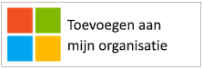
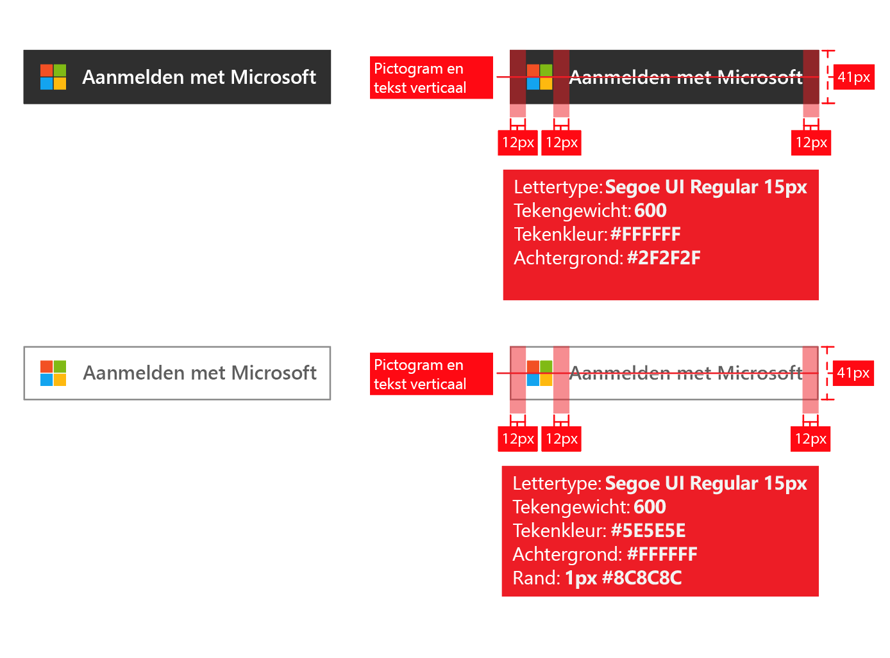
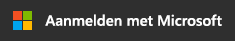
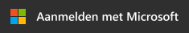
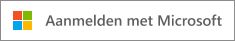
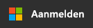
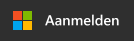
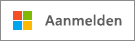

# Huisstijlrichtlijnen voor apps

Wanneer u toepassingen ontwikkelt met Azure Active Directory (Azure AD), moet u uw klanten wanneer ze hun werk- of schoolaccount (dat in Azure AD wordt beheerd) of hun persoonlijke account willen gebruiken, aangeven dat ze zich moeten registreren voor en aanmelden bij uw app.

In dit artikel leert u het volgende:

- Meer informatie over de twee soorten gebruikersaccounts die worden beheerd door Microsoft en hoe u in uw toepassing naar Azure AD-accounts kunt verwijzen
- Wat u moet doen om het Microsoft-logo toe te voegen voor gebruik in uw app
- Hoe u de officiële afbeeldingen voor **Aanmelden** of **Aanmelden bij Microsoft** downloadt voor gebruik in uw app
- De do's en don'ts van huisstijl en navigatie

## Persoonlijke accounts vs. werk- of schoolaccounts van Microsoft

Microsoft beheert twee soorten gebruikersaccounts:

- **Persoonlijke accounts** (voorheen bekend als Windows Live ID). Deze accounts vertegenwoordigen de relatie tussen *afzonderlijke* gebruikers en Microsoft, en worden gebruikt om toegang te verkrijgen tot consumentenapparaten en services van Microsoft. Deze accounts zijn bedoeld voor persoonlijk gebruik.
- **Werk- of schoolaccounts.** Deze accounts worden beheerd door Microsoft namens organisaties die Azure Active Directory gebruiken. Deze accounts worden gebruikt voor aanmelding bij Office 365 en andere zakelijke services van Microsoft.

Werk- of schoolaccounts van Microsoft worden meestal toegewezen aan eindgebruikers (werknemers, leerlingen/studenten, overheidspersoneel) door hun organisaties (bedrijf, school, overheidsinstelling). Deze accounts worden rechtstreeks in de cloud beheerd (op het Azure AD-platform) of met Azure AD gesynchroniseerd vanuit een on-premises directory, zoals Windows Server Active Directory. Microsoft is de *bewaarder* van de werk- of schoolaccounts, maar de accounts zijn eigendom van en worden beheerd door de organisatie.

## Verwijzen naar Azure AD-accounts in uw app

Microsoft stelt eindgebruikers niet bloot aan de merknaam Azure of Active Directory, en u moet dat ook niet doen.

- Zodra gebruikers zijn aangemeld, moeten ze de naam en het logo van de organisatie zoveel mogelijk zien. Dit is beter dan algemene termen zoals ‘uw organisatie’ te gebruiken.
- Wanneer gebruikers niet zijn aangemeld, moet u naar hun accounts verwijzen als ‘werk- of schoolaccounts’ en het Microsoft-logo gebruiken om te laten zien dat Microsoft deze accounts beheert. Gebruik geen termen zoals ‘ondernemingsaccount’, ‘bedrijfsaccount’ of ‘zakelijk account’, want die kunnen voor verwarring zorgen bij de gebruiker.

## Pictogram van het gebruikersaccount

In een eerdere versie van deze richtlijnen raadden we aan een pictogram van een ‘blauwe badge’ te gebruiken. Naar aanleiding van feedback van gebruikers en ontwikkelaars raden we nu echter aan het Microsoft-logo te gebruiken. Het Microsoft-logo helpt gebruikers te begrijpen dat ze het account dat ze met Office 365 of andere zakelijke Microsoft-services gebruiken, ook kunnen gebruiken om zich aan te melden bij uw app.

## Registreren en aanmelden met Azure AD

Uw app heeft misschien aparte paden voor registratie en aanmelding, en de volgende secties bieden visuele begeleiding voor beide scenario’s.

**Als uw app eindgebruikersregistratie ondersteunt (bijvoorbeeld voor een gratis proefversie of freemium-model)**: U kunt een knop **Aanmelden** tonen waarmee gebruikers toegang tot uw app kunnen verkrijgen met hun werkaccount of persoonlijke account. De eerste keer dat ze toegang tot uw app verkrijgen, toont Azure AD een instemmingsprompt.

**Als uw app toestemmingen nodig heeft die alleen beheerders kunnen verlenen, of als uw app organisatielicenties nodig heeft**: Scheid beheerdersdownload van gebruikersaanmelding. Met de knop **Download deze app** worden beheerders naar de aanmeldingspagina geleid, waarna ze worden gevraagd toestemming te verlenen namens gebruikers in hun organisatie. Dit heeft het extra voordeel dat instemmingsprompts voor eindgebruikers naar uw app worden onderdrukt.

## Visuele begeleiding voor app-download

Uw koppeling ‘Download de app’ moet de gebruiker naar de Azure AD-pagina voor toegangsverlening (autorisatie) leiden, zodat de beheerder van een organisatie kan autoriseren dat uw app toegang heeft tot de gegevens van die organisatie, die worden gehost door Microsoft. In het artikel [Toepassingen integreren met Azure Active Directory](quickstart-v1-integrate-apps-with-azure-ad.md) staat meer informatie over hoe u toegang kunt aanvragen.

Nadat beheerders toestemming hebben verleend voor uw app, kunnen ze ervoor kiezen deze toe te voegen aan het startprogramma voor Office 365-apps van hun gebruikers (toegankelijk via het wafelmenu en via [https://portal.office.com/myapps](https://portal.office.com/myapps)). Als u deze mogelijkheid wilt adverteren, kunt u termen zoals ‘Voeg deze app aan uw organisatie toe’ gebruiken en een knop tonen zoals in het volgende voorbeeld:

We raden u echter aan verklarende tekst te schrijven in plaats van op knoppen te vertrouwen. Bijvoorbeeld:

> *Als u Office 365 of andere zakelijke services van Microsoft al gebruikt, kunt u <naam_van_uw_app> toegang verlenen tot de gegevens van uw organisatie. Zo kunnen uw gebruikers toegang tot <naam_van_uw_app> verkrijgen met hun bestaande werkaccount.*

Als u het officiële Microsoft-logo wilt downloaden voor gebruik in uw app, klikt u met de rechtermuisknop op het logo dat u wilt gebruiken en slaat u het op naar uw computer.

| Asset                                | PNG-indeling | SVG-indeling |
| ------------------------------------ | ---------- | ---------- |
| Microsoft-logo  |  |  |

## Visuele begeleiding voor aanmelding

Uw app moet een aanmeldingsknop tonen waarmee gebruikers naar het aanmeldingseindpunt worden geleid dat overeenkomt met het protocol dat u gebruikt om te integreren met Azure AD. De volgende sectie biedt meer informatie over hoe de knop eruit moet zien.

### Pictogram en ‘Aanmelden met Microsoft’

Het is de associatie van het Microsoft-logo en de term ‘Aanmelden met Microsoft’ die Azure AD onderscheidt van andere identiteitsproviders die uw app mogelijk ondersteunt. Als u niet genoeg ruimte hebt voor ‘Aanmelden met Microsoft’, kunt u dit afkorten tot ‘Aanmelden’. Voor de knoppen kunt u een licht of donker kleurenschema gebruiken.

Het volgende diagram toont de door Microsoft aanbevolen rode lijnen wanneer u de assets met uw app gebruikt. De rode lijnen zijn van toepassing op ‘Aanmelden met Microsoft’ en de kortere versie ‘Aanmelden’.

Als u de officiële afbeelding wilt downloaden voor gebruik in uw app, klikt u met de rechtermuisknop op de afbeelding die u wilt gebruiken en slaat u deze op naar uw computer.

| Asset                                | PNG-indeling | SVG-indeling |
| ------------------------------------ | ---------- | ---------- |
| Aanmelden met Microsoft (donker thema)  |  |  |
| Aanmelden met Microsoft (licht thema) |  |  |
| Aanmelden (donker thema)                 |  |  |
| Aanmelden (licht thema)                |  |  |

## Huisstijl: wel en niet doen

**WEL DOEN** ‘Werk- of schoolaccount’ gebruiken in combinatie met de knop ‘Aanmelden met Microsoft’ om eindgebruikers te helpen zien of ze het kunnen gebruiken. **NIET DOEN** Andere termen zoals ‘ondernemingsaccount’, ‘bedrijfsaccount’ of ‘zakelijk account’ gebruiken.

**NIET DOEN** ‘Office 365 ID’ of ‘Azure ID’ gebruiken. Office 365 is ook de naam van een consumentenaanbod van Microsoft, dat geen gebruik maakt van Azure AD voor verificatie.

**NIET DOEN** Het Microsoft-logo wijzigen.

**NIET DOEN** Eindgebruikers blootstellen aan het merk Azure of Active Directory. U kunt deze termen echter wel gebruiken bij ontwikkelaars, IT-professionals en beheerders.

## Navigatie: wel en niet doen

**WEL DOEN** Gebruikers een manier bieden om zich af te melden en naar een ander gebruikersaccount te schakelen. Hoewel de meeste mensen één persoonlijk account van Microsoft/Facebook/Google/Twitter hebben, zijn mensen vaak gekoppeld aan meer dan één organisatie. Ondersteuning voor meerdere aangemelde gebruikers zal binnenkort beschikbaar zijn.
