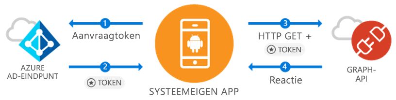

# <a name="quickstart-sign-in-users-and-call-the-microsoft-graph-api-from-an-android-app"></a>Snelstart: Gebruikers aanmelden en de Microsoft Graph API aanroepen vanuit een Android-app

[!INCLUDE [active-directory-develop-applies-v1-adal](../../../includes/active-directory-develop-applies-v1-adal.md)]

Als u een Android-toepassing ontwikkelt, maakt Microsoft het voor u eenvoudig om Azure Active Directory (Azure AD) gebruikers in te laten loggen. Met Azure Active Directory heeft uw toepassing toegang tot gebruikergegevens via Microsoft Graph of uw eigen beschermde web-API.

De Azure AD Authentication Library (ADAL) Android bibltioheek geeft uw app de mogelijkheid om de [Microsoft Azure Cloud](https://cloud.microsoft.com) & [Microsoft Graph API](https://developer.microsoft.com/graph) te gebruiken door [Microsoft Azure Active Directory accounts](https://azure.microsoft.com/services/active-directory/) te ondersteunen die de industriestandaard OAuth 2.0 en OpenID Connect gebruiken.

In deze snelstart leert u het volgende:

* Een token krijgen voor de Microsoft Graph
* Een token verversen
* Microsoft Graph aanroepen
* De gebruiker uitloggen

## <a name="prerequisites"></a>Vereisten

U hebt een Azure Active Directory tenant nodig om van start te gaan waar u gebruikers kunt aanmaken en een toepassing kunt registreren. [Lees hier hoe u een tenant kunt verkrijgen](quickstart-create-new-tenant.md) als u er nog geen hebt.

## <a name="scenario-sign-in-users-and-call-the-microsoft-graph"></a>Scenario: gebruikers inloggen en Microsoft Graph aanroepen



U kunt deze app gebruiken voor alle Azure Active Directory accounts. Het ondersteunt single-tenant en multi-tenant scenario’s (wordt in stappen besproken). Het laat zien hoe u apps kunt bouwen om met enterprise-gebruikers in contact te komen en toegang te krijgen tot hun Azure + O365-gegevens via de Microsoft Graph. Tijdens de auth-flow, dienen eindgebruikers in te loggen en akkoord te gaan met de machtigingen van de toepassing, en in sommige gevallen dient een beheerder met de app akkoord te gaan. Het merendeel van de logica in dit voorbeeld laat zien hoe een eindgebruiker te autoriseren en een basisaanroep uit te voeren naar de Microsoft Graph.

## <a name="sample-code"></a>Voorbeeldcode

U vindt de volledige code [op Github](https://github.com/Azure-Samples/active-directory-android).

```Java
// Initialize your app with MSAL
AuthenticationContext mAuthContext = new AuthenticationContext(
        MainActivity.this, 
        AUTHORITY, 
        false);


// Perform authentication requests
mAuthContext.acquireToken(
    getActivity(), 
    RESOURCE_ID, 
    CLIENT_ID, 
    REDIRECT_URI,  
    PromptBehavior.Auto, 
    getAuthInteractiveCallback());

// ...

// Get tokens to call APIs like the Microsoft Graph
mAuthResult.getAccessToken()
```

## <a name="step-1-register-and-configure-your-app"></a>Stap 1: Registeer en configureer uw app

U dient een native client-toepassing geregistreerd te hebben bij Microsoft via het [Azure Portal](https://portal.azure.com).

1. De app registreren
    - Navigeer naar [Azure Portal](https://aad.portal.azure.com).
    - Selecteer ***Azure Active Directory*** > ***App-registraties***.

2. De app maken
    - Selecteer **Nieuwe toepassing registreren**.
    - Voer een app-naam in het veld **Naam** in.
    - In **Soort toepassing** selecteer **Native**.
    - In **URI omleiding**, voert u `http://localhost` in.

3. Microsoft Graph configureren
    - Selecteer **Instellingen > Vereiste machtigingen**.
    - Selecteer **Toevoegen**, in **Selecteer een API** selecteer ***Microsoft Graph***.
    - Selecteer de machtiging **Inloggen en gebruikersprofiel lezen**, en klik dan op **Selecteren** om op te slaan.
        - Deze machtiging gaat over de `User.Read` omvang.
    - Optioneel: In **Vereiste machtigingen > Windows Azure Active Directory**, verwijder de geselecteerde machtiging **Inloggen en gebruikerprofiel lezen**. Daarmee wordt voorkomen dat de pagina gebruikerstoestemming de machtiging twee keer laat zien.

4. Gefeliciteerd! Uw app is geconfigureerd. In het volgende deel dient u:
    - `Application ID`
    - `Redirect URI`

## <a name="step-2-get-the-sample-code"></a>Stap 2: De voorbeeldcode ophalen

1. De code klonen.
    ```
    git clone https://github.com/Azure-Samples/active-directory-android
    ```
2. Het voorbeeld in Android Studio openen.
    - Selecteer **Open een bestaand Android Studio project**.

## <a name="step-3-configure-your-code"></a>Stap 3: Configureer uw code

U vindt alle configuratiegegevens voor deze code in het bestand ***src/main/java/com/azuresamples/azuresampleapp/MainActivity.java***.

1. Vervang de constante factor `CLIENT_ID` met de `ApplicationID`.
2. Vervang de constante factor `REDIRECT URI` met de `Redirect URI` die u eerder hebt geconfigureerd (`http://localhost`).

## <a name="step-4-run-the-sample"></a>Stap 4: Voer het voorbeeld uit

1. Selecteer **Bouw > Schoon project**.
2. Selecteer **Run > Run app**.
3. De app moet gaan bouwen en standaard UX tonen. Wanneer u op de knop `Call Graph API` klikt, wordt u gevraagd zich aan te melden en dan stil de Microsoft Graph API met het nieuwe token aanroepen.

## <a name="next-steps"></a>Volgende stappen

1. Controleer [ADAL Android Wiki](https://github.com/AzureAD/azure-activedirectory-library-for-android/wiki) voor meer info over de bibliotheekmechanismen en hoe nieuwe scenario’s en mogelijkheden te configureren.
2. In Native scenario’s, zal de app een ingebed Webview gebruiken en de app niet verlaten. De `Redirect URI` kan willekeurig zijn.
3. Ondervindt u problemen of hebt u vragen? U kunt een ticket aanmaken of op Stackoverflow een melding plaatsen met het label `azure-active-directory`.

### <a name="cross-app-sso"></a>Cross-app SSO

Ontdek [hoe u cross-app SSO op Android inschakelt met ADAL](howto-v1-enable-sso-android.md).

### <a name="auth-telemetry"></a>Auth telemetry

De ADAL-bibliotheek toont auth telemetry zodat app-ontwikkelaars inzicht krijgen in hoe hun apps het doen en om betere ervaringen te creëren. Hiermee kunt u een succesvolle inlog vastleggen, actieve gebruikers en andere interessante inzichten. Met auth telemetry dienen app-ontwikkelaars een telemetry-service op te zetten om evenementen te genereren en op te slaan.

Om meer te lezen over auth telemetry, ga naar [ADAL Android auth telemetry](https://github.com/AzureAD/azure-activedirectory-library-for-android/wiki/Telemetry).