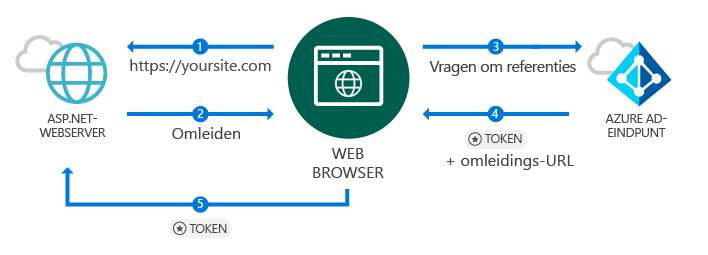
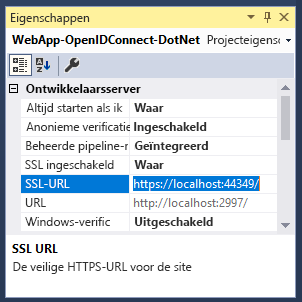
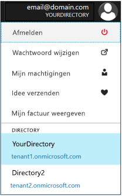
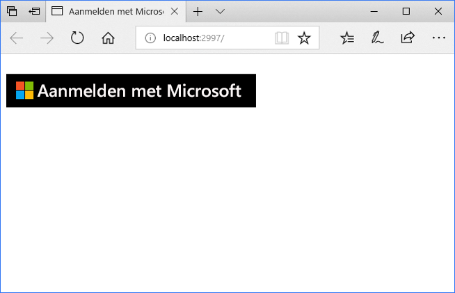
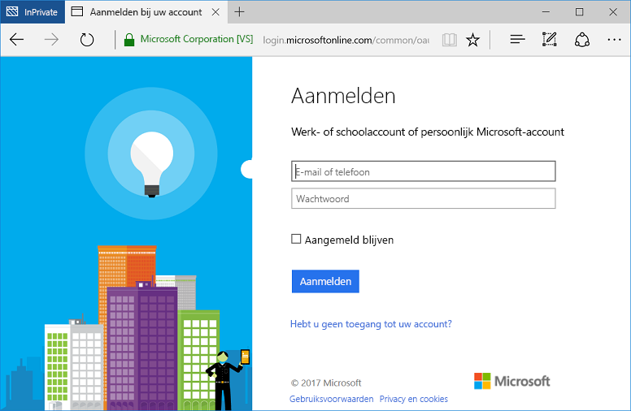

# <a name="quickstart-add-sign-in-with-microsoft-to-an-aspnet-web-app"></a>Quickstart: Aanmelding met Microsoft toevoegen aan een ASP.NET-web-app

[!INCLUDE [active-directory-develop-applies-v1](../../../includes/active-directory-develop-applies-v1.md)]

In deze quickstart leert u hoe u aanmelding met Microsoft implementeert met behulp van een ASP.NET MVC-oplossing met een traditionele toepassing op basis van een webbrowser via OpenID Connect. U leert hoe u aanmeldingen vanaf werk- en schoolaccounts mogelijk maakt in de ASP.NET-toepassing.

Aan het einde van deze quickstart worden via de toepassing aanmeldingen van werk- en schoolaccounts geaccepteerd van organisaties die zijn geïntegreerd met Azure AD (Azure Active Directory).

> [!NOTE]
> Als u naast werk- en schoolaccounts ook aanmeldingen van persoonlijke accounts mogelijk wilt maken, kunt u het [v2.0-eindpunt](azure-ad-endpoint-comparison.md) gebruiken. Raadpleeg [deze ASP.NET-zelfstudie voor het v2.0-eindpunt](tutorial-v2-asp-webapp.md) en [dit artikel](active-directory-v2-limitations.md) waarin wordt uitgelegd wat de huidige beperkingen van het v2.0-eindpunt zijn.

## <a name="prerequisites"></a>Vereisten

Controleer voor u aan de slag gaat of u voldoet aan deze vereisten:

* Visual Studio 2015 Update 3 of Visual Studio 2017 moet zijn geïnstalleerd. Is dit niet het geval? U kunt [Visual Studio 2017 gratis downloaden](https://www.visualstudio.com/downloads/)

## <a name="scenario-sign-in-users-from-work-and-school-accounts-in-your-aspnet-app"></a>Scenario: Gebruikers aanmelden vanaf werk- en schoolaccounts in de ASP.NET-app



In dit scenario krijgt een browser toegang tot een ASP.NET-website en wordt een gebruiker gevraagd om zich te verifiëren met behulp van een knop Aanmelden. In dit scenario vindt het grootste gedeelte van het werk om de webpagina weer te geven plaats aan de serverzijde.

In deze quickstart wordt gedemonstreerd hoe u gebruikers kunt aanmelden in een ASP.NET-webtoepassing, beginnend met een lege sjabloon. De quickstart bevat stappen zoals het toevoegen van een knop Aanmelden, en alle controllers en methoden, en bespreekt de concepten achter deze taken. U kunt er ook voor kiezen om een project te maken om Azure AD-gebruikers aan te melden (via werk- en schoolaccounts) door de [Visual Studio-websjabloon](https://docs.microsoft.com/aspnet/visual-studio/overview/2013/creating-web-projects-in-visual-studio#organizational-account-authentication-options) te gebruiken en **Organisatieaccounts** te selecteren, en vervolgens een van de cloudopties te kiezen. Deze optie maakt gebruik van een sjabloon met meer opmaak, met extra controllers, methoden en weergaven.

## <a name="libraries"></a>Bibliotheken

In deze quickstart worden de volgende pakketten gebruikt:

| Bibliotheek | Beschrijving |
|---|---|
| [Microsoft.Owin.Security.OpenIdConnect](https://www.nuget.org/packages/Microsoft.Owin.Security.OpenIdConnect/) | Middleware die een toepassing in staat stelt om OpenIdConnect te gebruiken voor verificatie |
| [Microsoft.Owin.Security.Cookies](https://www.nuget.org/packages/Microsoft.Owin.Security.Cookies) |Middleware die een toepassing in staat stelt om een gebruikerssessie te onderhouden met behulp van cookies |
| [Microsoft.Owin.Host.SystemWeb](https://www.nuget.org/packages/Microsoft.Owin.Host.SystemWeb) | Maakt het mogelijk om OWIN-toepassingen uit te voeren op IIS met behulp van de ASP.NET-aanvraagpijplijn |
|  |  | 

## <a name="step-1-set-up-your-project"></a>Stap 1: Het project instellen

Deze stappen laten zien hoe u de verificatiepijplijn kunt installeren en configureren via de OWIN-middleware in een ASP.NET-project met behulp van OpenID Connect.

Als u in plaats hiervan het Visual Studio-project uit dit voorbeeld wilt downloaden, volgt u deze stappen:
1. [Download het project in GitHub](https://github.com/AzureADQuickStarts/WebApp-OpenIdConnect-DotNet/archive/GuidedSetup.zip).
1. Ga verder met de [Configuratiestap](#configure-your-webconfig-and-register-an-application) om het codevoorbeeld te configureren vóórdat u het uitvoert.

## <a name="step-2-create-your-aspnet-project"></a>Stap 2: Het ASP.NET-project maken

1. Ga in Visual Studio naar **Bestand > Nieuw > Project**.
2. Selecteer onder **Visual C#\Web** de optie **ASP.NET-webtoepassing (.NET Framework)**.
3. Geef de toepassing ene naam en selecteer **OK**.
4. Selecteer **Leeg** en selecteer vervolgens het selectievakje om **MVC**-verwijzingen toe te voegen.

## <a name="step-3-add-authentication-components"></a>Stap 3: Onderdelen voor verificatie toevoegen

1. Ga in Visual Studio naar **Hulpprogramma’s > NuGet Package Manager > Package Manager Console**.
2. Voeg **NuGet-pakketten voor OWIN-middleware** toe door het volgende te typen in het Package Manager Console-venster:

    ```powershell
    Install-Package Microsoft.Owin.Security.OpenIdConnect
    Install-Package Microsoft.Owin.Security.Cookies
    Install-Package Microsoft.Owin.Host.SystemWeb
    ```

<!--start-collapse-->
> ### <a name="about-these-packages"></a>Over deze pakketten
>De bovenstaande bibliotheken maken SSO (eenmalige aanmelding) met behulp van OpenID Connect mogelijk via verificatie op basis van cookies. Nadat de verificatie is voltooid en het token dat de gebruiker vertegenwoordigt, is verzonden naar de toepassing, wordt met OWIN-middleware een sessiecookie gemaakt. In de browser wordt dit cookie vervolgens gebruikt in volgende aanvragen. Op deze manier hoeft de gebruiker niet opnieuw te verifiëren en is er geen aanvullende verificatie meer vereist.
<!--end-collapse-->

## <a name="step-4-configure-the-authentication-pipeline"></a>Stap 4: De verificatiepijplijn configureren

Volg deze stappen om een *Opstartklasse* van OWIN-middleware te maken om OpenID Connect-verificatie te configureren. Deze klasse wordt automatisch uitgevoerd.

> [!TIP]
> Ga als volgt te werk als uw project geen `Startup.cs`-bestand bevat in de hoofdmap:<br/>
> 1. Klik met de rechtermuisknop op de hoofdmap van het project: > **Toevoegen > Nieuw item... > OWIN-opstartklasse**<br/>
> 2. Noem deze `Startup.cs`<br/>
>
>> Zorg ervoor dat de geselecteerde klasse een OWIN-opstartklasse is, en niet een Standard C#-klasse. Verzeker u hiervan door te kijken of `[assembly: OwinStartup(typeof({NameSpace}.Startup))]` wordt weergegeven boven de naamruimte.

Ga als volgt te werk om een *Opstartklasse* van OWIN-middleware maken:

1. Voeg de naamruimten *OWIN* en *Microsoft.IdentityModel* toe aan `Startup.cs`:

    [!code-csharp[main](../../../WebApp-OpenIDConnect-DotNet/WebApp-OpenIDConnect-DotNet\Startup.cs?name=AddedNameSpaces "Startup.cs")]

2. Vervang Opstartklasse door de volgende code:

    [!code-csharp[main](../../../WebApp-OpenIDConnect-DotNet/WebApp-OpenIDConnect-DotNet\Startup.cs?name=Startup "Startup.cs")]

<!--start-collapse-->
> [!NOTE]
> De parameters die u opgeeft in *OpenIDConnectAuthenticationOptions*, dienen als coördinaten waarmee de toepassing kan communiceren met Azure AD. Omdat de OpenID Connect-middleware gebruikmaakt van cookies, moet u ook cookieverificatie instellen zoals in de vorige code wordt weergegeven. De waarde *ValidateIssuer* zorgt ervoor dat de toegang via OpenIdConnect niet wordt beperkt tot één specifieke organisatie.
<!--end-collapse-->

<!--end-setup-->

<!--start-use-->

## <a name="step-5-add-a-controller-to-handle-sign-in-and-sign-out-requests"></a>Stap 5: Een controller toevoegen om aanmeldings- en afmeldingsaanvragen te verwerken

Maak een nieuwe controller om de methoden voor aanmelden en afmelden beschikbaar te maken.

1.  Klik met de rechtermuisknop op de map **Controllers** en selecteer **Toevoegen > Controller**
2.  Selecteer **MVC-controller (.NET-versie) – Leeg**.
3.  Selecteer **Toevoegen**.
4.  Noem deze `HomeController` en selecteer **Toevoegen**.
5.  Voeg **OWIN**-naamruimten toe aan de klasse:

    [!code-csharp[main](../../../WebApp-OpenIDConnect-DotNet/WebApp-OpenIDConnect-DotNet\Controllers\HomeController.cs?name=AddedNameSpaces "HomeController.cs")]

6. Voeg de volgende methoden voor aanmelden en afmelden toe aan de controller door een verificatievraag te starten via code:

    [!code-csharp[main](../../../WebApp-OpenIDConnect-DotNet/WebApp-OpenIDConnect-DotNet\Controllers\HomeController.cs?name=SigInAndSignOut "HomeController.cs")]

## <a name="step-6-create-the-apps-home-page-to-sign-in-users-via-a-sign-in-button"></a>Stap 6: De startpagina van de app maken om gebruikers aan te melden via een knop Aanmelden

Maak in Visual Studio een nieuwe weergave om de knop Aanmelden toe te voegen en gebruikersgegevens weer te geven na de verificatie:

1. Klik met de rechtermuisknop op de map **Weergaven\Startpagina** en selecteer **Weergave toevoegen**.
1. Noem deze **Index**.
1. Voeg de volgende HTML toe aan het bestand. Deze bevat de knop Aanmelden:

    [!code-html[main](../../../WebApp-OpenIDConnect-DotNet/WebApp-OpenIDConnect-DotNet/Views/Home/Index.cshtml "Index.cshtml")]

<!--start-collapse--> Met deze pagina wordt een knop Aanmelden toegevoegd, in de SVG-indeling met een zwarte achtergrond:<br/><br/> Ga voor meer soorten knoppen voor aanmelden naar [Huisstijlrichtlijnen voor toepassingen](https://docs.microsoft.com/azure/active-directory/develop/howto-add-branding-guidelines-in-azure-ad-apps).
<!--end-collapse-->

## <a name="step-7-display-users-claims-by-adding-a-controller"></a>Stap 7: Claims van gebruikers weergeven door een controller toe te voegen

Deze controller demonstreert het gebruik van het kenmerk `[Authorize]` om een controller te beveiligen. Met dit kenmerk wordt de toegang tot de controller beperkt doordat alleen geverifieerde gebruikers toegang krijgen. In de volgende code wordt het kenmerk gebruikt om gebruikersclaims weer te geven die zijn opgehaald als onderdeel van de aanmelding.

1. Klik met de rechtermuisknop op de map **Controllers**. Selecteer vervolgens **Toevoegen > Controller**.
1. Selecteer **MVC-controller {versie} – Leeg**.
1. Selecteer **Toevoegen**.
1. Noem deze **ClaimsController**.
1. Vervang de code van de controllerklasse door de volgende code: hierdoor wordt het kenmerk `[Authorize]` toegevoegd aan de klasse:

    [!code-csharp[main](../../../WebApp-OpenIDConnect-DotNet/WebApp-OpenIDConnect-DotNet\Controllers\ClaimsController.cs?name=ClaimsController "ClaimsController.cs")]

<!--start-collapse-->
> [!NOTE]
> Vanwege het gebruik van het kenmerk `[Authorize]` kunnen alle methoden van deze controller alleen worden uitgevoerd als de gebruiker is geverifieerd. Als een niet-geverifieerde gebruiker toegang probeert te krijgen tot de controller, wordt met OWIN een verificatievraag gestart en wordt de gebruiker gedwongen zich te verifiëren. De bovenstaande code kijkt naar de claimverzameling van de gebruiker voor specifieke kenmerken die zijn opgenomen in het token van de gebruiker. Deze kenmerken omvatten de volledige naam en gebruikersnaam van de gebruiker, en het globale onderwerp voor de gebruikers-id. Ze omvatten ook de *Tenant-id*. Dit is de id voor de organisatie van de gebruiker. 
<!--end-collapse-->

## <a name="step-8-create-a-view-to-display-the-users-claims"></a>stap 8: Een weergave maken om de claims van de gebruiker weer te geven

Maak in Visual Studio een nieuwe weergave om de claims van de gebruiker weer te geven op een webpagina:

1. Klik met de rechtermuisknop op de map **Weergaven\Claims**. Selecteer vervolgens **Weergave toevoegen**.
1. Noem deze **Index**.
1. Voeg de volgende HTML toe aan het bestand:

    [!code-html[main](../../../WebApp-OpenIDConnect-DotNet/WebApp-OpenIDConnect-DotNet/Views/Claims/Index.cshtml "Index.cshtml")]

<!--end-use-->

<!--start-configure-->

## <a name="step-9-configure-your-webconfig-and-register-an-application"></a>Stap 9: Uw *web.config* configureren en een toepassing registreren

1. Voeg in Visual Studio het volgende toe aan `web.config` (in de hoofdmap) onder de sectie `configuration\appSettings`:

    ```xml
    <add key="ClientId" value="Enter_the_Application_Id_here" />
    <add key="RedirectUrl" value="Enter_the_Redirect_Url_here" />
    <add key="Tenant" value="common" />
    <add key="Authority" value="https://login.microsoftonline.com/{0}" /> 
    ```
2. Selecteer het project in Solution Explorer en kijk naar het venster <i>Eigenschappen</i> (druk op F4 als u het venster Eigenschappen niet ziet)
3. Wijzig SSL ingeschakeld in <code>True</code>
4. Kopieer de SSL-URL van het project naar het klembord:<br/><br/><br />
5. Vervang <code>Enter_the_Redirect_URL_here</code> in <code>web.config</code> door de SSL-URL van het project.

### <a name="register-your-application-in-the-azure-portal-then-add-its-information-to-webconfig"></a>Registreer de toepassing in de Azure-portal. Voeg vervolgens de gegevens van de toepassing toe aan *web.config*

1. Ga naar [Microsoft Azure-portal - app-registratie](https://portal.azure.com/#blade/Microsoft_AAD_IAM/ActiveDirectoryMenuBlade/RegisteredApps) om een toepassing te registreren.
2. Selecteer **Nieuwe toepassing registreren**.
3. Voer een naam in voor de toepassing.
4. Plak de *SSL-URL* van het Visual Studio-project in **Aanmeldings-URL**. Deze URL wordt ook automatisch toegevoegd aan de lijst met Antwoord-URL’s voor de toepassing die u registreert.
5. Selecteer **Maken** om de toepassing te registreren. Hierdoor keert u terug naar de lijst met toepassingen.
6. Zoek en/of selecteer nu de toepassing die u zojuist hebt gemaakt, om de bijbehorende eigenschappen te openen.
7. Kopieer de GUID bij **Toepassings-id** naar het klembord.
8. Ga terug naar Visual Studio en vervang `Enter_the_Application_Id_here` in `web.config` door de Toepassings-id van de toepassing die u zojuist hebt geregistreerd.

> [!TIP]
> Als uw account is geconfigureerd voor toegang tot meerdere mappen, moet u ervoor zorgen dat de juiste map is geselecteerd voor de organisatie waar u de map wilt registreren, door in de rechterbovenhoek in de Azure-portal op uw accountnaam te klikken en vervolgens de geselecteerde map te verifiëren zoals aangegeven:<br/>

## <a name="step-10-configure-sign-in-options"></a>Stap 10: Aanmeldingsopties configureren

U kunt de toepassing zo configureren dat alleen gebruikers die behoren tot het Azure AD-exemplaar van één bepaalde organisatie, zich kunnen aanmelden, of dat aanmeldingen van gebruikers van elke willekeurige organisatie worden geaccepteerd. Volg de instructies voor één van de volgende keuzen:

### <a name="configure-your-application-to-allow-sign-ins-of-work-and-school-accounts-from-any-company-or-organization-multi-tenant"></a>De toepassing zo configureren dat aanmeldingen vanaf werk- en schoolaccounts in elk bedrijf en elke organisatie zijn toegestaan (multitenant)

Volg deze stappen als u aanmeldingen wilt accepteren vanaf werk- en schoolaccounts in elk bedrijf of elke organisatie die is geïntegreerd met Azure AD. Dit is een veelvoorkomend scenario voor *SaaS-toepassingen*:

1. Ga terug naar [Microsoft Azure-portal - app-registratie](https://portal.azure.com/#blade/Microsoft_AAD_IAM/ActiveDirectoryMenuBlade/RegisteredApps) en ga naar de toepassing die u zojuist hebt geregistreerd.
2. Selecteer onder **Alle instellingen** de optie **Eigenschappen**.
3. Wijzig de eigenschap **Met meerdere tenants** in **Ja** en selecteer vervolgens **Opslaan**.

Zie [Overzicht van multitenant](howto-convert-app-to-be-multi-tenant.md) voor meer informatie over deze instelling en het concept van multitenanttoepassingen.

### <a name="restrict-users-from-only-one-organizations-active-directory-instance-to-sign-in-to-your-application-single-tenant"></a>Toegang tot de toepassing beperken tot alleen gebruikers uit het Active Directory-exemplaar van één bepaalde organisatie (één tenant)

Deze optie is een veelvoorkomend scenario voor Line-Of-Business-toepassingen.

Als u wilt dat in de toepassing alleen aanmeldingen worden geaccepteerd die horen bij een specifiek Azure AD-exemplaar (inclusief *gastaccounts* van dit exemplaar), volgt u deze stappen:
1. Vervang de parameter `Tenant` in *web.config* uit `Common` met de tenantnaam van de organisatie, bijvoorbeeld *contoso.onmicrosoft.com*.
1. Wijzig het argument `ValidateIssuer` in de [*OWIN-opstartklasse*](#configure-the-authentication-pipeline) in `true`.

Als u alleen gebruikers van een lijst met specifieke organisaties wilt toestaan, volgt u deze stappen:
1. Stel `ValidateIssuer` in op Waar.
1. Gebruik de parameter `ValidIssuers` om een lijst met organisaties op te geven.

Een ander optie is om een aangepaste methode te implementeren om de uitgevers te valideren met behulp van de parameter *IssuerValidator*. Raadpleeg [dit MSDN-artikel](https://msdn.microsoft.com/library/system.identitymodel.tokens.tokenvalidationparameters.aspx "TokenValidationParameters MSDN-artikel") voor meer informatie over `TokenValidationParameters`.

<!--end-configure-->

<!--start-configure-arp-->
<!--
## Configure your ASP.NET Web App with the application's registration information

In this step, you will configure your project to use SSL, and then use the SSL URL to configure your application’s registration information. After this, add the application’ registration information to your solution via *web.config*.

1.  In Solution Explorer, select the project and look at the `Properties` window (if you don’t see a Properties window, press F4)
2.  Change `SSL Enabled` to `True`
3.  Copy the value from `SSL URL` above and paste it in the `Redirect URL` field on the top of this page, then click *Update*:<br/><br/><br />
4.  Add the following in `web.config` file located in root’s folder, under section `configuration\appSettings`:

```xml
<add key="ClientId" value="[Enter the application Id here]" />
<add key="RedirectUri" value="[Enter the Redirect URL here]" />
<add key="Tenant" value="common" />
<add key="Authority" value="https://login.microsoftonline.com/{0}" /> 
```
-->
<!--end-configure-arp-->
<!--start-test-->

## <a name="step-11-test-your-code"></a>Stap 11: Uw code testen

1. Druk op **F5** om uw project uit te voeren in Visual Studio. De browser wordt geopend en u wordt naar `http://localhost:{port}` geleid, waar u de knop **Aanmelden met Microsoft** ziet.
1. Selecteer de knop om u aan te melden.

### <a name="sign-in"></a>Aanmelden

Gebruik, als u klaar bent om te testen, een werkaccount (Azure AD) om u aan te melden.





#### <a name="expected-results"></a>Verwachte resultaten

Na het aanmelden wordt de gebruiker naar de startpagina van uw website geleid. Dit is de HTTP-URL die in de Microsoft-portal voor app-registratie is opgegeven in de registratiegegevens van de toepassing. Op deze pagina verschijnt nu *Hallo {gebruiker}* en een koppeling om u af te melden. Er wordt ook een koppeling weergegeven om de claims van de gebruiker te zien. Dit is een koppeling naar de autorisatiecontroller die eerder is gemaakt.

### <a name="see-users-claims"></a>Claims van gebruiker weergeven

Selecteer de hyperlink om de claims van de gebruiker te zien. Hiermee gaat u naar de controller en de weergave die alleen beschikbaar is voor gebruikers die zijn geverifieerd.

#### <a name="expected-results"></a>Verwachte resultaten

 Als het goed is, ziet u nu een tabel met de basiseigenschappen van de aangemelde gebruiker:

| Eigenschap | Waarde | Beschrijving |
|---|---|---|
| Naam | {Volledige naam van gebruiker} | Voor- en achternaam van de gebruiker |
| Gebruikersnaam | <span>user@domain.com</span> | De gebruikersnaam die is gebruikt om de aangemelde gebruiker te identificeren |
| Onderwerp| {Onderwerp} |Een tekenreeks om de aanmelding van de gebruiker uniek te identificeren op het web |
| Tenant-id | {GUID} | Een *GUID* om de Azure AD-organisatie van de gebruiker uniek te vertegenwoordigen |

Daarnaast ziet u een tabel met alle gebruikersclaims uit de verificatieaanvraag. Zie [Lijst met claims in id-token](https://docs.microsoft.com/azure/active-directory/develop/active-directory-token-and-claims) voor een lijst met alle claims in een id-token en de bijbehorende uitleg.

### <a name="optional-access-a-method-that-has-an-authorize-attribute"></a>Gebruik een methode die een kenmerk *[Autoriseren]* bevat

In deze stap test u de toegang tot de claimscontroller als een anonieme gebruiker:<br/>
Selecteer de koppeling om de gebruiker af te melden en de afmelding te voltooien.<br/>
Typ nu in de browser http://localhost:{port}/claims voor toegang tot de controller die is beveiligd met het kenmerk `[Authorize]`

#### <a name="expected-results"></a>Verwachte resultaten

U ontvangt nu een prompt waarin u wordt gevraagd om u te verifiëren om de weergave te kunnen zien.

## <a name="additional-information"></a>Aanvullende informatie

<!--start-collapse-->
### <a name="protect-your-entire-web-site"></a>De hele website beveiligen

Voeg de `AuthorizeAttribute` toe aan `GlobalFilters` in de methode `Global.asax` `Application_Start` om de hele website te beveiligen:

```csharp
GlobalFilters.Filters.Add(new AuthorizeAttribute());
```
<!--end-collapse-->

<div></div>
<br/>

<!--end-test-->

## <a name="next-steps"></a>Volgende stappen

Nu kunt u verdergaan met aanvullende scenario's.

> [!div class="nextstepaction"]
> [Zelfstudie voor ASP.NET](https://docs.microsoft.com/azure/active-directory/develop/tutorial-v2-asp-webapp)