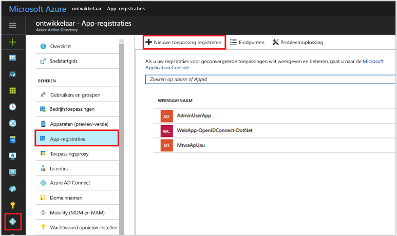
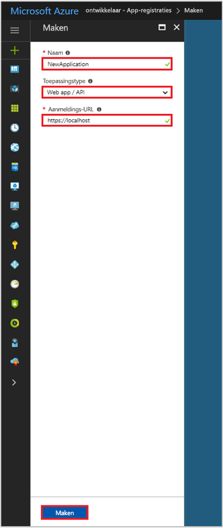

# <a name="integrating-applications-with-azure-active-directory"></a>Toepassingen integreren met Azure Active Directory
[!INCLUDE [active-directory-devguide](../../../includes/active-directory-devguide.md)]

Ontwikkelaars van ondernemingen en software-as-a-service (SaaS)-providers kunnen ontwikkelen commerciële cloudservices of line-of-business-toepassingen, die kunnen worden geïntegreerd met Azure Active Directory (Azure AD) om beveiligde aanmelding en autorisatie te bieden voor hun Services. Voor het integreren van een toepassing of service met Azure AD, moet een ontwikkelaar van de toepassing eerst registreren bij Azure AD.

Dit artikel ziet u hoe u kunt toevoegen, bijwerken of verwijderen van een toepassing registreren in Azure AD. U meer informatie over de verschillende typen toepassingen die kunnen worden geïntegreerd met Azure AD, het configureren van uw toepassingen voor toegang tot andere resources, zoals web-API's en meer.

Zie voor meer informatie over de twee Azure AD-objecten die een geregistreerde toepassing en de relatie tussen deze vertegenwoordigen, [toepassing en Service-Principal-objecten](app-objects-and-service-principals.md); voor meer informatie over de huisstijlrichtlijnen u moet bij het ontwikkelen van toepassingen met Azure Active Directory gebruiken, raadpleegt u [huisstijl richtlijnen voor geïntegreerde Apps](howto-add-branding-in-azure-ad-apps.md).

## <a name="adding-an-application"></a>Een toepassing toevoegen
Elke toepassing die met behulp van de mogelijkheden van Azure AD moet eerst worden geregistreerd in een Azure AD-tenant. Dit registratieproces bestaat uit Azure AD-details over uw toepassing, zoals de URL waar deze zich, de URL om te antwoorden verzenden nadat een gebruiker is geverifieerd, geeft de URI die u de app, enzovoort identificeert.

### <a name="to-register-a-new-application-using-the-azure-portal"></a>Het registreren van een nieuwe toepassing met behulp van de Azure portal
1. Meld u aan bij [Azure Portal](https://portal.azure.com).
2. Als uw account hebt u toegang tot meer dan één, klikt u op uw account in de rechterbovenhoek en instellen van uw portal-sessie op de gewenste Azure AD-tenant.
3. Klik in het navigatiedeelvenster links op de **Azure Active Directory** service, klikt u op **App-registraties**, en klikt u op **nieuwe toepassing registreren**.

   

4. Wanneer de **maken** pagina wordt weergegeven, voer de registratie-informatie van uw toepassing: 

  - **Naam:** een zinvolle toepassingsnaam invoeren
  - **Toepassingstype:** 
    - Selecteer 'Native' voor [clienttoepassingen](active-directory-dev-glossary.md#client-application) die lokaal zijn geïnstalleerd op een apparaat. Deze instelling wordt gebruikt voor openbaar gebruik OAuth [systeemeigen clients](active-directory-dev-glossary.md#native-client).
    - Selecteer ' Web-app / API ' voor [clienttoepassingen](active-directory-dev-glossary.md#client-application) en [resource/API-Apps](active-directory-dev-glossary.md#resource-server) die op een beveiligde server worden geïnstalleerd. Deze instelling wordt gebruikt voor OAuth vertrouwelijke [web-clients](active-directory-dev-glossary.md#web-client) en openbare [gebruiker agent-gebaseerde clients](active-directory-dev-glossary.md#user-agent-based-client). Dezelfde toepassing ook beschikbaar maakt zowel een client en de resource/API.
  - **Aanmeldings-URL:** voor ' Web-app / API '-toepassingen, bieden de basis-URL van uw app. Bijvoorbeeld, `http://localhost:31544` mogelijk de URL voor een WebApp die wordt uitgevoerd op uw lokale computer. Gebruikers gebruikt deze URL te melden bij een web-clienttoepassing. 
  - **Omleidings-URI:** voor 'Native'-toepassingen, geeft u de URI die door Azure AD wordt gebruikt om tokenantwoorden te retourneren. Voer een specifieke waarde aan uw toepassing, bijvoorbeeld `http://MyFirstAADApp`

   

   Als u specifieke voorbeelden voor webtoepassingen of systeemeigen toepassingen, Bekijk onze [snelstartgidsen](azure-ad-developers-guide.md#get-started).

5. Klik op **Create** als u klaar bent. Azure AD wijst een unieke toepassings-ID toe aan uw toepassing en er wordt naar de pagina voor de belangrijkste registratie van uw toepassing. Afhankelijk van of uw toepassing een web- of native toepassing is, vindt u verschillende opties extra mogelijkheden toevoegen aan uw toepassing. Zie de volgende sectie voor een overzicht van de toestemming en meer informatie over het inschakelen van aanvullende configuratie van onderdelen in uw toepassing registreren (referenties, machtigingen, aanmelding inschakelen voor gebruikers van andere tenants.)

  > [!NOTE]
  > Een zojuist geregistreerde web-App is standaard geconfigureerd om toe te staan **alleen** gebruikers vanuit dezelfde tenant aanmelden bij uw toepassing.
  > 
  > 

## <a name="updating-an-application"></a>Een toepassing bijwerken
Wanneer uw toepassing is geregistreerd bij Azure AD, moeten deze kan worden bijgewerkt om te voorzien van toegang tot web-API's, beschikbaar gesteld in andere organisaties en meer. Deze sectie beschrijft de verschillende manieren waarop u uw toepassing verder kunt configureren. We beginnen met een overzicht van het toestemmingsframework, dit belangrijk is om te begrijpen bij het bouwen van toepassingen die moeten worden gebruikt door andere gebruikers of toepassingen.

### <a name="overview-of-the-consent-framework"></a>Overzicht van het toestemmingsframework

Het toestemmingsframework Azure AD kunt eenvoudig meerdere tenants web- en native clienttoepassingen ontwikkelen. Deze toepassingen kunnen aanmelden door gebruikersaccounts van een Azure AD-tenant, dan het adres waar de toepassing is geregistreerd. Ze kunnen ook nodig voor toegang tot web-API's, zoals de Microsoft Graph-API (voor toegang tot Azure Active Directory, Intune en services in Office 365) en andere Microsoft-services-API's, naast uw eigen web-API's. Het framework is gebaseerd op een gebruiker of beheerder toestemming verlenen tot een toepassing die wordt gevraagd om te worden geregistreerd in de directory, waarbij toegang tot directorygegevens.

Bijvoorbeeld, als een web-clienttoepassing moet agenda om informatie te lezen over de gebruiker van Office 365, is die gebruiker vereist voor het eerst toestemming geven voor de clienttoepassing. Nadat toestemming is opgegeven, wordt de clienttoepassing kan de Microsoft Graph-API aanroepen namens de gebruiker en gebruik van de agenda-informatie, indien nodig worden. De [Microsoft Graph API](https://graph.microsoft.io) biedt toegang tot gegevens in Office 365 (zoals agenda's en berichten van Exchange, sites en -lijsten van SharePoint, documenten uit OneDrive, van taken van de Planner, werkmappen van Excel, OneNote-notitieblokken enz.), evenals de gebruikers en groepen van Azure AD en andere objecten van meer Microsoft-cloudservices. 

Het toestemmingsframework is gebouwd op OAuth 2.0 en de verschillende stromen, zoals code verlenen en de client referenties voor autorisatie verlenen, met behulp van openbare of vertrouwelijke clients. Met behulp van OAuth 2.0, maakt Azure AD het mogelijk te maken van veel verschillende soorten clienttoepassingen, zoals op een telefoon, tablet, server of een webtoepassing en toegang krijgen tot de vereiste resources.

Zie voor meer informatie over het gebruik van het toestemmingsframework met OAuth 2.0-autorisatietoekenningen [toegang verlenen aan webtoepassingen die gebruikmaken van OAuth 2.0 en Azure AD](v1-protocols-oauth-code.md) en [Verificatiescenario's voor Azure AD](authentication-scenarios.md). Zie voor meer informatie over het ophalen van geautoriseerde toegang tot Office 365 via Microsoft Graph [verificatie van apps met Microsoft Graph](https://graph.microsoft.io/docs/authorization/auth_overview).

#### <a name="example-of-the-consent-experience"></a>Voorbeeld van de ervaring voor toestemming

De volgende stappen laten zien hoe de toestemming ervaren werkt voor zowel de ontwikkelaar van toepassingen en de gebruiker.

1. Stel dat u hebt een web-clienttoepassing die nodig zijn om aan te vragen van specifieke machtigingen voor toegang tot een resource/API. Leert u hoe u deze configuratie in de volgende sectie, maar in feite de Azure-portal wordt gebruikt om te declareren machtigingsaanvragen tijdens de configuratie. Net als andere configuratie-instellingen worden ze onderdeel van Azure AD-registratie van de toepassing:
   
  
    
2. Houd rekening met dat van uw toepassing machtigingen zijn bijgewerkt, de toepassing wordt uitgevoerd en een gebruiker is gebruikt voor de eerste keer. De toepassing moet eerst een autorisatiecode ophalen uit Azure AD `/authorize` eindpunt. De autorisatiecode kan vervolgens worden gebruikt bij het aanschaffen van een nieuwe toegang en vernieuwen van het token.

3. Als de gebruiker nog niet is geverifieerd, Azure AD van `/authorize` eindpunt voor aanmelding bij vraagt.
   
  

4. Nadat de gebruiker is aangemeld, wordt Azure AD te bepalen of de gebruiker moet een instemmingspagina weergegeven. Deze beslissing is gebaseerd op of de gebruiker (of de beheerder van hun organisatie) heeft al verleend de toestemming van de toepassing. Als toestemming nog niet is gedaan, wordt Azure AD de gebruiker om toestemming wordt gevraagd en geeft de vereiste machtigingen die nodig is om te werken. De reeks machtigingen die worden weergegeven in het dialoogvenster overeenkomen met de die u hebt geselecteerd in de gedelegeerde machtigingen in Azure portal.
   
  

5. Nadat de gebruiker toestemming verleent, wordt een autorisatiecode voor uw toepassing, die wordt ingewisseld voor een toegangstoken verkrijgen en vernieuwen van het token geretourneerd. Zie voor meer informatie over deze stroom de [naar web-API-sectie in Verificatiescenario's voor Azure AD-webtoepassing](authentication-scenarios.md#web-application-to-web-api).

6. Als beheerder, kunt u ook toestemming voor gedelegeerde machtigingen namens alle gebruikers van een toepassing in uw tenant. Toestemming van een beheerder voorkomt u het dialoogvenster worden weergegeven voor elke gebruiker in de tenant en kan worden uitgevoerd in de [Azure-portal](https://portal.azure.com) door gebruikers met de beheerdersrol. Uit de **instellingen** pagina voor uw toepassing, klikt u op **vereiste machtigingen** en klik op de **machtigingen verlenen** knop. 

  
    
  > [!NOTE]
  > Expliciete verleent toestemming met behulp van de **machtigingen verlenen** knop is momenteel vereist voor één pagina toepassingen (SPA) die gebruikmaken van ADAL.js. Anders mislukt de toepassing wanneer het toegangstoken wordt aangevraagd. 

### <a name="configure-a-client-application-to-access-web-apis"></a>Een clienttoepassing voor toegang tot web-API's configureren
In de order voor een web/vertrouwelijke client-toepassing te kunnen deelnemen aan een stroom voor het verlenen van machtiging die moet worden geverifieerd (en een toegangstoken verkrijgen), moet het beveiligde referenties vast. De standaardmethode voor verificatie ondersteund door de Azure portal is de client-ID + geheime sleutel. Deze sectie worden de configuratiestappen vereist voor het bieden van de geheime sleutel met de referenties van uw client.

Bovendien voordat een client toegang heeft tot een web-API beschikbaar is gemaakt door een resourcetoepassing (zoals de Microsoft Graph-API), het toestemmingsframework zorgt ervoor dat de client verkrijgt het verlenen van de machtiging vereist, op basis van de machtigingen die zijn aangevraagd. Standaard kunnen alle toepassingen machtigingen kiezen uit 'Windows Azure Active Directory' (Graph API) en "Windows Azure Service Management-API." De [de machtiging 'aanmelden en gebruikersprofiel lezen' Graph API](https://msdn.microsoft.com/Library/Azure/Ad/Graph/howto/azure-ad-graph-api-permission-scopes#PermissionScopeDetails) ook standaard is geselecteerd. Als de client wordt geregistreerd in een tenant met accounts die zijn geabonneerd op Office 365, zijn machtigingen voor SharePoint en Exchange Online en web-API's beschikbaar voor selectie. U kunt kiezen uit [twee typen machtigingen](active-directory-dev-glossary.md#permissions) voor elke web-API gewenste:

- De machtigingen van de toepassing: De clienttoepassing moet toegang tot de web-API rechtstreeks als zelf (geen gebruikerscontext). Dit type machtiging administrator toestemming nodig heeft en is ook niet beschikbaar voor systeemeigen client-toepassingen.

- Gedelegeerde machtigingen: Uw clienttoepassing moet toegang krijgen tot de web-API als de gebruiker is aangemeld, maar met de toegang beperkt door de geselecteerde machtiging. Dit type machtiging kan worden verleend door een gebruiker alleen de machtiging administrator toestemming vereist. 

  > [!NOTE]
  > Een overgedragen machtiging toevoegen aan een toepassing verleent automatisch toestemming voor de gebruikers binnen de tenant. Gebruikers moeten nog steeds handmatig toestemming geven voor de toegevoegde gedelegeerde machtigingen tijdens runtime, tenzij de beheerder klikt op de **machtigingen verlenen** knop van de **vereiste machtigingen** sectie van de de pagina van de toepassing in Azure portal. 

#### <a name="to-add-application-credentials-or-permissions-to-access-web-apis"></a>Referenties van de toepassing of machtigingen voor toegang tot web-API's toe te voegen
1. Meld u aan bij [Azure Portal](https://portal.azure.com).
2. Als uw account hebt u toegang tot meer dan één, klikt u op uw account in de rechterbovenhoek en instellen van uw portal-sessie op de gewenste Azure AD-tenant.
3. Klik in het navigatiedeelvenster links op de **Azure Active Directory** service, klikt u op **App-registraties**, vervolgens zoeken/op de toepassing die u wilt configureren.

   

4. U gaat naar de pagina belangrijkste registratie van de toepassing, die wordt geopend de **instellingen** pagina voor de toepassing. Een geheime sleutel voor de referenties van uw webtoepassing toevoegen:
  - Klik op de **sleutels** sectie op de **instellingen** pagina. 
  - Een beschrijving voor uw sleutel toevoegen.
  - Selecteer een of twee jaar.
  - Klik op **Opslaan**. De meest rechtse kolom bevat de waarde van de sleutel, nadat u de wijzigingen in de configuratie hebt opgeslagen. **Zorg ervoor dat de sleutel wilt kopiëren** voor gebruik in de code van uw client-toepassing, omdat niet toegankelijk is wanneer u deze pagina verlaat.

  

5. Machtigingen voor toegang tot resource-API's van uw client toevoegen
  - Klik op de **vereiste machtigingen** sectie op de **instellingen** pagina. 
  - Klik op de knop **Toevoegen**.
  - Klik op **Select an API** om te selecteren van het type van de resources die u kiezen wilt uit.
  - Blader door de lijst met beschikbare API's of gebruik het zoekvak om te selecteren uit de beschikbare resource-toepassingen in uw directory, die beschikbaar maken van een web-API. Klik op de resource die u geïnteresseerd bent in en klik vervolgens op **Selecteer**.
  - Er wordt de **toegang inschakelen** pagina. Selecteer de machtigingen van de toepassing en/of gedelegeerde machtigingen nodig voor uw toepassing bij het openen van de API.
   
  

  

6. Wanneer u klaar bent, klikt u op de **Selecteer** op knop **toegang inschakelen** pagina, dan zal de **gedaan** knop op de **API-toegang toevoegen** pagina. U keert terug naar de **vereiste machtigingen** pagina, waar de nieuwe resource wordt toegevoegd aan de lijst met API's.

  > [!NOTE]
  > Te klikken op de **gedaan** knop stelt de machtigingen voor uw toepassing ook automatisch in uw directory op basis van de machtigingen voor andere toepassingen die u hebt geconfigureerd. U kunt deze machtigingen van de toepassing weergeven door te kijken naar de toepassing **instellingen** pagina.
  > 
  > 

### <a name="configuring-a-resource-application-to-expose-web-apis"></a>Configureren van de resourcetoepassing van een om beschikbaar te stellen van web-API 's

U kunt een web-API ontwikkelen en maakt u deze beschikbaar is voor clienttoepassingen bij het blootstellen van toegang [scopes](active-directory-dev-glossary.md#scopes) en [rollen](active-directory-dev-glossary.md#roles). Er is een correct geconfigureerde web-API beschikbaar net als bij de andere Microsoft web-API's, met inbegrip van de Graph API en de Office 365 API's. Toegangsbereiken en rollen worden weergegeven via uw [toepassingsmanifest](active-directory-dev-glossary.md#application-manifest), dit is een JSON-bestand met de configuratie van de identiteit van uw toepassing. 

De volgende sectie leest u hoe blootstellen toegangsbereiken, door het wijzigen van de resource-toepassingsmanifest.

#### <a name="adding-access-scopes-to-your-resource-application"></a>Toegangsbereiken toe te voegen aan uw resourcetoepassing

1. Meld u aan bij [Azure Portal](https://portal.azure.com).
2. Als uw account hebt u toegang tot meer dan één, klikt u op uw account in de rechterbovenhoek en instellen van uw portal-sessie op de gewenste Azure AD-tenant.

3. Klik in het navigatiedeelvenster links op de **Azure Active Directory** service, klikt u op **App-registraties**, vervolgens zoeken/op de toepassing die u wilt configureren.

   

4. U gaat naar de pagina belangrijkste registratie van de toepassing, die wordt geopend de **instellingen** pagina voor de toepassing. Schakel over naar de **manifest bewerken** pagina door te klikken op **Manifest** van pagina voor de registratie van de toepassing. Een web gebaseerde manifest editor wordt geopend, zodat u kunt **bewerken** het manifest van de portal. Desgewenst kunt u **downloaden** en lokaal bewerken en vervolgens gebruiken **uploaden** toe te passen aan uw toepassing.

5. In dit voorbeeld wordt een nieuwe scope met de naam wordt weergegeven `Employees.Read.All` op onze resource/API's door toe te voegen van de volgende JSON-element op de `oauth2Permissions` verzameling. De bestaande `user_impersonation` bereik wordt standaard opgegeven tijdens de registratie. `user_impersonation` Hiermee kunt een clienttoepassing te vragen om toestemming voor toegang tot de resource, onder de identiteit van de aangemelde gebruiker. Zorg ervoor dat u de komma toevoegen na de bestaande `user_impersonation` element bereik en de waarden van eigenschappen om aan de behoeften van uw resource te wijzigen. 

  ```json
  {
    "adminConsentDescription": "Allow the application to have read-only access to all Employee data.",
    "adminConsentDisplayName": "Read-only access to Employee records",
    "id": "2b351394-d7a7-4a84-841e-08a6a17e4cb8",
    "isEnabled": true,
    "type": "User",
    "userConsentDescription": "Allow the application to have read-only access to your Employee data.",
    "userConsentDisplayName": "Read-only access to your Employee records",
    "value": "Employees.Read.All"
  }
  ```
  > [!NOTE]
  > De waarde 'id' moet worden gegenereerd met behulp van een hulpprogramma voor het genereren van GUID zoals [guidgen](https://msdn.microsoft.com/library/ms241442%28v=vs.80%29.aspx) of via een programma. Dit staat voor een unieke id voor de scope zoals die worden weergegeven door de web-API. Nadat een client op de juiste wijze is geconfigureerd met machtigingen voor toegang tot uw web-API, is het een OAuth 2.0-toegangstoken uitgegeven door Azure AD. Wanneer de clientaanroepen de web-API, dit geeft het toegangstoken dat het bereik (scp is) wordt claim ingesteld op de machtigingen in de registratie van de toepassing wordt aangevraagd.
  >
  > U kunt extra scopes later zo nodig weergeven. Houd rekening met dat meerdere scopes die zijn gekoppeld aan een verscheidenheid aan verschillende functies kan worden blootgesteld aan uw web-API. Uw resource toegang tot de web-API tijdens runtime, kunt beheren door het evalueren van het bereik (`scp`) claim (s) in het ontvangen toegangstoken van OAuth 2.0.
  > 

6. Wanneer u klaar bent, klikt u op **opslaan**. Uw web-API is nu geconfigureerd voor gebruik door andere toepassingen in uw directory. 

  

#### <a name="verify-the-web-api-is-exposed-to-other-applications-in-your-tenant"></a>Controleren of de web die API wordt blootgesteld aan andere toepassingen in uw tenant
1. Ga terug naar uw Azure AD-tenant, klikt u op **App-registraties** opnieuw, klikt u vervolgens zoeken/klikt u op de clienttoepassing die u wilt configureren.

   

2. Herhaal stap 5, net als bij [configureren van een clienttoepassing voor toegang tot web-API's](#configure-a-client-application-to-access-web-apis). Wanneer de **Select an API** stap en klikt u op uw resource Zoek door te voeren van de naam van de toepassing in het zoekveld **Selecteer**. 

3. Op de **toegang inschakelen** pagina ziet u de nieuwe scope, beschikbaar voor clientaanvragen machtiging.

  

#### <a name="more-on-the-application-manifest"></a>Meer informatie over het toepassingsmanifest

Het toepassingsmanifest is daadwerkelijk doet dienst als een mechanisme voor het bijwerken van de Toepassingsentiteit, worden alle kenmerken van een Azure AD-toepassing identiteit configuratie, met inbegrip van de API-toegangsbereiken besproken gedefinieerd. Zie voor meer informatie over de toepassing-entiteit en waarvan het schema is de [Graph-API-toepassing entity documentatie](https://msdn.microsoft.com/Library/Azure/Ad/Graph/api/entity-and-complex-type-reference#application-entity). Het artikel bevat volledige naslaginformatie over de toepassing entiteitsleden gebruikt voor het opgeven van machtigingen voor uw API, met inbegrip van:  

- Het lid appRoles, dit een verzameling is van [AppRole](https://msdn.microsoft.com/Library/Azure/Ad/Graph/api/entity-and-complex-type-reference#approle-type) entiteiten, die worden gebruikt voor het definiëren van [Toepassingsmachtigingen](active-directory-dev-glossary.md#permissions) voor een web-API. 
- Het lid oauth2Permissions, dit een verzameling is van [OAuth2Permission](https://msdn.microsoft.com/Library/Azure/Ad/Graph/api/entity-and-complex-type-reference#oauth2permission-type) entiteiten, die worden gebruikt voor het definiëren van [overgedragen machtigingen](active-directory-dev-glossary.md#permissions) voor een web-API.

Voor meer informatie over application manifest van de concepten in het algemeen, Zie [inzicht in de Azure Active Directory-toepassingsmanifest](active-directory-application-manifest.md).

### <a name="accessing-the-azure-ad-graph-and-office-365-via-microsoft-graph-apis"></a>Toegang tot de Azure AD Graph en Office 365 via Microsoft Graph-API 's  

Zoals eerder aangegeven, naast de bloot/toegang tot API's voor uw eigen toepassingen, kunt u de clienttoepassing toegang tot API's die worden weergegeven door de Microsoft-resources kunt registreren. De Microsoft Graph-API, aangeduid als 'Microsoft Graph' in de resource/API-lijst van de portal, is beschikbaar voor alle toepassingen die zijn geregistreerd bij Azure AD. Als u uw clienttoepassing in een tenant met accounts die zich hebben geregistreerd voor een Office 365-abonnement registreert, kunt u ook toegang tot de bereiken die worden weergegeven door de verschillende Office 365-resources.

Zie voor een volledige bespreking van de bereiken die worden weergegeven door Microsoft Graph API, de [referentie voor Microsoft Graph-machtigingen](https://developer.microsoft.com/en-us/graph/docs/concepts/permissions_reference) artikel.

> [!NOTE]
> Vanwege een beperking, kunnen native clienttoepassingen alleen aanroepen in de Azure AD Graph API als ze de machtiging "Toegang tot de adreslijst van uw organisatie" gebruiken. Deze beperking geldt niet voor webtoepassingen.
> 
> 

### <a name="configuring-multi-tenant-applications"></a>Multitenant-toepassingen configureren

Bij het registreren van een toepassing in Azure AD, kunt u uw toepassing kan alleen worden geopend door gebruikers in uw organisatie. U kunt ook kunt u ook uw toepassing toegankelijk moeten zijn door gebruikers in externe organisaties. Deze twee typen heten één tenant en multitenant-toepassingen. In deze sectie wordt beschreven hoe u de configuratie van een toepassing met één tenant gemakkelijk een toepassing met meerdere tenants wijzigen.

Het is belangrijk te weten de verschillen tussen een toepassing met één tenant en meerdere tenants:  

- Een toepassing met één tenant is bedoeld voor gebruik in een organisatie. Het is doorgaans een line-of-business (LoB)-toepassing die is geschreven door de ontwikkelaar in een organisatie. Een toepassing met één tenant kan alleen worden geopend door gebruikers met een account in dezelfde tenant als de registratie van de toepassing. Als gevolg hiervan alleen moet worden ingericht in een map.
- Een toepassing met meerdere tenants is bedoeld voor gebruik in veel organisaties. Aangeduid als een software-as-a-service (SaaS)-toepassing, wordt doorgaans geschreven door een onafhankelijke softwareleverancier (ISV). Toepassingen met meerdere tenants moeten worden ingericht in elke tenant waar gebruikers toegang nodig. Voor tenants dan de regio waar de toepassing is geregistreerd, wordt de gebruiker of beheerder toestemming nodig om u te registreren. Houd er rekening mee dat systeemeigen client-toepassingen met meerdere tenants standaard zijn zoals ze zijn geïnstalleerd op de resource-eigenaar apparaat. Zie de voorgaande [overzicht van het toestemmingsframework](#overview-of-the-consent-framework) sectie voor meer informatie over het toestemmingsframework.

Maken van een toepassing met meerdere tenants beide wijzigingen in de registratie van toepassing is vereist, evenals wijzigingen in de web-App zelf. De volgende gedeelten staat informatie over beide.

#### <a name="changing-the-application-registration-to-support-multi-tenant"></a>Wijzigen van de registratie van de toepassing ter ondersteuning van meerdere tenants

Als u een toepassing die u beschikbaar wilt maken voor uw klanten of partners buiten uw organisatie ontwikkelt, moet u bijwerken van de definitie van de toepassing in Azure portal.

> [!IMPORTANT]
> Azure AD is de URI van de App-ID van toepassingen met meerdere tenants moet globaal uniek vereist. De URI van de App-ID is een van de manieren waarop die een toepassing in protocolberichten wordt aangeduid. Voor een toepassing met één tenant is het voldoende voor de URI van de App-ID moet uniek zijn in deze tenant. Voor een toepassing met meerdere tenants moet het globaal uniek zijn, zodat Azure AD de toepassing voor alle tenants vinden kan. Uniekheid van globale wordt afgedwongen door de URI van de App-ID in een hostnaam die overeenkomt met een geverifieerd domein van de Azure AD-tenant. Bijvoorbeeld, als de naam van uw tenant contoso.onmicrosoft.com wordt een geldige is App ID URI zou worden https://contoso.onmicrosoft.com/myapp. Als uw tenant een geverifieerd domein contoso.com heeft, wordt ook een geldige URI voor de App-ID worden https://contoso.com/myapp. Als de URI van de App-ID niet dit patroon volgen, instellen van een toepassing als u meerdere tenants is mislukt.
> 

Zodat externe gebruikers de mogelijkheid om toegang tot uw toepassing: 

1. Meld u aan bij [Azure Portal](https://portal.azure.com).
2. Als uw account hebt u toegang tot meer dan één, klikt u op uw account in de rechterbovenhoek en instellen van uw portal-sessie op de gewenste Azure AD-tenant.
3. Klik in het navigatiedeelvenster links op de **Azure Active Directory** service, klikt u op **App-registraties**, vervolgens zoeken/op de toepassing die u wilt configureren. U gaat naar de pagina belangrijkste registratie van de toepassing, die wordt geopend de **instellingen** pagina voor de toepassing.
4. Uit de **instellingen** pagina, klikt u op **eigenschappen** en wijzig de **multitenant** overschakelen naar **Ja**.

Nadat u de wijzigingen hebt aangebracht, kunnen gebruikers en beheerders van andere organisaties verlenen hun gebruikers de mogelijkheid om aan te melden bij uw toepassing, zodat het apparaat voor toegang tot resources die zijn beveiligd door hun tenant.

#### <a name="changing-the-application-to-support-multi-tenant"></a>Wijzigen van de toepassing voor de ondersteuning van meerdere tenants

Ondersteuning voor toepassingen met meerdere tenants is sterk afhankelijk van het toestemmingsframework Azure AD. Toestemming is het mechanisme waarmee een gebruiker van een andere tenant aan de App toegang verlenen tot resources die zijn beveiligd door de tenant van de gebruiker. Deze ervaring wordt aangeduid als 'gebruiker toestemming geven'.

Het bieden van uw webtoepassing mogelijk ook:

- De mogelijkheid voor beheerders om te "ondertekenen van mijn bedrijf." Deze ervaring, aangeduid als 'beheerder toestemming geven', kan een beheerder de mogelijkheid voor het verlenen van toestemming namens *alle gebruikers* in hun organisatie. Alleen een gebruiker die verifieert met een account dat deel uitmaakt van de rol globale beheerder kan toestemming van een beheerder; bieden anderen foutbericht een weergegeven.

- Een registratie-ervaring voor gebruikers. Het is waarschijnlijk dat de gebruiker wordt opgegeven in een 'aanmelden' knop waarmee de browser wordt omgeleid naar de Azure AD OAuth 2.0 `/authorize` eindpunt of een OpenID Connect `/userinfo` eindpunt. Deze eindpunten kunt de toepassing voor informatie over de nieuwe gebruiker door de id_token inspecteren. Na de aanmelding fase van de gebruiker een toestemmingsprompt, vergelijkbaar met de architectuur die wordt weergegeven krijgt de [overzicht van het toestemmingsframework](#overview-of-the-consent-framework) sectie.

Zie voor meer informatie over de wijzigingen in de toepassing vereist ter ondersteuning van meerdere tenants toegang en sign-in/aanmelden-van ervaringen:

- [Een Azure Active Directory-gebruiker aanmelden met behulp van het patroon voor multitenant-toepassingen](howto-convert-app-to-be-multi-tenant.md)
- De lijst met [multitenant-codevoorbeelden](https://azure.microsoft.com/documentation/samples/?service=active-directory&term=multi-tenant). 
- [Snelstartgids: Huisstijl naar de aanmeldingspagina in Azure AD toevoegen](../fundamentals/customize-branding.md)

### <a name="enabling-oauth-20-implicit-grant-for-single-page-applications"></a>Inschakelen van OAuth verlenen 2.0-impliciete voor toepassingen met één pagina

Één pagina van de toepassing (kuuroorden) zijn doorgaans geordend met een JavaScript-zware front-end die wordt uitgevoerd in de browser, die back-end om uit te voeren van de bedrijfslogica voor van de toepassing web-API aanroept. Voor kuuroorden die wordt gehost in Azure AD, gebruikt u impliciete goedkeuring voor OAuth 2.0 voor de gebruiker met de Azure AD verifiëren en verkrijgen van een token dat u gebruiken kunt voor het aanroepen van de JavaScript-client van de toepassing naar de back-end web-API beveiligen. 

Nadat de gebruiker heeft toestemming verleend, kan deze dezelfde verificatieprotocol om op te halen van tokens voor het beveiligen van aanroepen tussen de client en andere web-API-resources die zijn geconfigureerd voor de toepassing worden gebruikt. Zie voor meer informatie over de impliciete autorisatietoekenning en kunt u bepalen of deze geschikt is voor uw toepassingsscenario, [inzicht in de OAuth2-impliciete stroom in Azure Active Directory verlenen](v1-oauth2-implicit-grant-flow.md).

Impliciete goedkeuring voor OAuth 2.0 is standaard uitgeschakeld voor toepassingen. U kunt de impliciete toekenning van OAuth 2.0 voor uw toepassing inschakelen door in te stellen de `oauth2AllowImplicitFlow` waarde in de [toepassingsmanifest](active-directory-application-manifest.md).

#### <a name="to-enable-oauth-20-implicit-grant"></a>Impliciete goedkeuring voor OAuth 2.0 inschakelen

> [!NOTE]
> Voor meer informatie over het bewerken van het manifest van de toepassing, leest u eerst de vorige sectie, [web-API's voor het configureren van een resourcetoepassing beschikbaar stellen](#configuring-a-resource-application-to-expose-web-apis).
>

1. Meld u aan bij [Azure Portal](https://portal.azure.com).
2. Als uw account hebt u toegang tot meer dan één, klikt u op uw account in de rechterbovenhoek en instellen van uw portal-sessie op de gewenste Azure AD-tenant.
3. Klik in het navigatiedeelvenster links op de **Azure Active Directory** service, klikt u op **App-registraties**, vervolgens zoeken/op de toepassing die u wilt configureren. U gaat naar de pagina belangrijkste registratie van de toepassing, die wordt geopend de **instellingen** pagina voor de toepassing.
4. Schakel over naar de **manifest bewerken** pagina door te klikken op **Manifest** van pagina voor de registratie van de toepassing. Een web gebaseerde manifest editor wordt geopend, zodat u kunt **bewerken** het manifest van de portal. Zoek en stel de waarde 'oauth2AllowImplicitFlow' op 'true'. Standaard is ingesteld op 'false'.
   
  ```json
  "oauth2AllowImplicitFlow": true,
  ```
5. Sla het bijgewerkte manifest. Nadat het is opgeslagen, wordt uw web-API is nu geconfigureerd voor het gebruik van OAuth 2.0-impliciete om gebruikers te verifiëren.

## <a name="removing-an-application"></a>Een toepassing verwijderen
In deze sectie wordt beschreven hoe u de registratie van een toepassing verwijderen uit uw Azure AD-tenant.

### <a name="removing-an-application-authored-by-your-organization"></a>Verwijderen van een toepassing die is geschreven door uw organisatie
Toepassingen die uw organisatie is geregistreerd, worden weergegeven onder het 'Mijn apps'-filter op belangrijkste 'App-registraties'-pagina van uw tenant. Deze toepassingen zijn services die u handmatig geregistreerd via Azure portal of programmatisch via PowerShell of de Graph API. Ze zijn meer specifiek, vertegenwoordigd door een toepassing en Service-Principal object in uw tenant. Zie voor meer informatie, [toepassing en Service-Principal-objecten](app-objects-and-service-principals.md).

#### <a name="to-remove-a-single-tenant-application-from-your-directory"></a>Een toepassing met één tenant uit uw directory verwijderen
1. Meld u aan bij [Azure Portal](https://portal.azure.com).
2. Als uw account hebt u toegang tot meer dan één, klikt u op uw account in de rechterbovenhoek en instellen van uw portal-sessie op de gewenste Azure AD-tenant.
3. Klik in het navigatiedeelvenster links op de **Azure Active Directory** service, klikt u op **App-registraties**, vervolgens zoeken/op de toepassing die u wilt configureren. U gaat naar de pagina belangrijkste registratie van de toepassing, die wordt geopend de **instellingen** pagina voor de toepassing.
4. Klik op de pagina van de toepassing de registratie van de belangrijkste **verwijderen**.
5. Klik op **Ja** in het bevestigingsbericht.

#### <a name="to-remove-a-multi-tenant-application-from-its-home-directory"></a>Een toepassing met meerdere tenants verwijderen uit de basismap
1. Meld u aan bij [Azure Portal](https://portal.azure.com).
2. Als uw account hebt u toegang tot meer dan één, klikt u op uw account in de rechterbovenhoek en instellen van uw portal-sessie op de gewenste Azure AD-tenant.
3. Klik in het navigatiedeelvenster links op de **Azure Active Directory** service, klikt u op **App-registraties**, vervolgens zoeken/op de toepassing die u wilt configureren. U gaat naar de pagina belangrijkste registratie van de toepassing, die wordt geopend de **instellingen** pagina voor de toepassing.
4. Uit de **instellingen** pagina, kies **eigenschappen** en wijzig de **multitenant** overschakelen naar **Nee**eerst uw toepassing om te worden gewijzigd één tenant, klikt u vervolgens op **opslaan**. Service-principalobjecten van de toepassing blijven in de tenants van alle organisaties die al toestemming hebt gegeven voor het.
5. Klik op de **verwijderen** knop van de belangrijkste registratiepagina van de toepassing.
6. Klik op **Ja** in het bevestigingsbericht.

### <a name="removing-a-multi-tenant-application-authorized-by-another-organization"></a>Verwijderen van een toepassing met meerdere tenants geautoriseerd door een andere organisatie
Een subset van de toepassingen die worden weergegeven onder het filter 'Alle apps' (met uitzondering van de 'Mijn apps' registraties) op van uw tenant 'App-registraties' hoofdpagina zijn toepassingen met meerdere tenants. In technische termen, deze toepassingen met meerdere tenants zijn van een andere tenant, en zijn geregistreerd bij uw tenant tijdens de toestemming. Ze zijn meer specifiek, vertegenwoordigd door alleen een service principal-object in uw tenant, waarbij geen bijbehorende toepassingsobject. Zie voor meer informatie over de verschillen tussen de toepassing en service-principalobjecten [toepassing en service-principalobjecten in Azure AD](app-objects-and-service-principals.md).

Als u wilt verwijderen van een toepassing met meerdere tenants toegang tot uw directory (na heeft toestemming verleend), moet de company administrator de service-principal verwijderen. De beheerder moet globale beheerderstoegang hebt en kunt deze verwijderen via de Azure-portal of gebruik de [Azure AD PowerShell-Cmdlets](http://go.microsoft.com/fwlink/?LinkId=294151).

## <a name="next-steps"></a>Volgende stappen
- Zie voor meer informatie over de werking van verificatie in Azure AD [Verificatiescenario's voor Azure AD](authentication-scenarios.md).
- Zie de [huisstijl richtlijnen voor geïntegreerde Apps](howto-add-branding-in-azure-ad-apps.md) voor tips over het visuele aanwijzingen voor uw app.
- Zie voor meer informatie over de relatie tussen de toepassing en Service-Principal objecten van een toepassing [toepassing en Service-Principal-objecten](app-objects-and-service-principals.md).
- Zie voor meer informatie over de rol van de app-manifest wordt afgespeeld, [inzicht in de Azure Active Directory-toepassingsmanifest](active-directory-application-manifest.md)
- Zie de [woordenlijst voor ontwikkelaars van Azure AD](active-directory-dev-glossary.md) voor definities van de belangrijkste Azure AD-concepten voor ontwikkelaars.
- Ga naar de [Ontwikkelaarshandleiding voor Active Directory](azure-ad-developers-guide.md) voor een overzicht van alle inhoud die relevant zijn voor ontwikkelaars.

