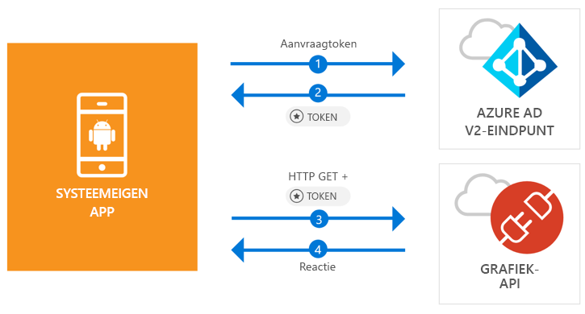

# <a name="quickstart-sign-in-users-and-call-the-microsoft-graph-api-from-an-android-app"></a>Quickstart: Gebruikers aanmelden en de Microsoft Graph API aanroepen vanuit een Android-app

[!INCLUDE [active-directory-develop-applies-v2-msal](../../../includes/active-directory-develop-applies-v2-msal.md)]

Deze snelstart bevat een codevoorbeeld die u laat zien hoe een Android-toepassing persoonlijke, werk- en schoolaccounts kan aanmelden, een toegangstoken kan ophalen en de Microsoft Graph API kan aanroepen.



> [!NOTE]
> **Vereisten**
> * Android Studio 3 of hoger
> * Android SDK 21 of hoger is vereist (SDK 27 wordt aanbevolen)

> [!div renderon="docs"]
> ## <a name="register-and-download"></a>Registreren en downloaden
> ### <a name="register-and-configure-your-application-and-code-sample"></a>Uw toepassing en codevoorbeeld registreren en configureren
> #### <a name="step-1-register-your-application"></a>Stap 1: Uw toepassing registreren
> Ga als volgt te werk om de toepassing te registreren en de registratiegegevens van de toepassing toe te voegen aan uw oplossing:
> 1. Ga naar de [Microsoft-portal voor app-registratie](https://apps.dev.microsoft.com/portal/register-app) om een toepassing te registreren.
> 1. Typ in het vak **Toepassingsnaam** een naam voor de toepassing.
> 1. Zorg ervoor dat het selectievakje **Stapsgewijze instelling** is uitgeschakeld en selecteer vervolgens **Maken**.
> 1. Selecteer **Platform toevoegen**, selecteer **Systeemeigen toepassing** en selecteer vervolgens **Opslaan**.

> [!div renderon="portal" class="sxs-lookup"]
> #### <a name="step-1-configure-your-application"></a>Stap 1: Uw toepassing configureren
> Voor een juiste werking van het codevoorbeeld uit deze snelstart, moet u een antwoord-URL als **msal{AppId}://auth** toevoegen (waarbij {AppId} de toepassings-id is van uw app).
> > [!div renderon="portal" id="makechanges" class="nextstepaction"]
> > [Deze wijziging voor mij maken]()
>
> > [!div id="appconfigured" class="alert alert-info"]
> >  Uw toepassing is al geconfigureerd met deze kenmerken

#### <a name="step-2-download-the-project"></a>Stap 2: Het project downloaden

* [Het Android Studio-project downloaden](https://github.com/Azure-Samples/active-directory-android-native-v2/archive/master.zip)

#### <a name="step-3-configure-your-project"></a>Stap 3: Het project configureren

1. Pak het project uit en open het in Android Studio.
1. Onder **app** > **java** > **<i>{host}.{namespace}</i>**, opent u **MainActivity**.
1. Vervang de regel die begint met `final static String CLIENT_ID`:

    > [!div renderon="portal" class="sxs-lookup"]
    > ```java
    > final static String CLIENT_ID = "ENTER_THE_APPLICATION_ID_HERE";
    > ```

    > [!div renderon="docs"]
    > ```java
    > final static String CLIENT_ID = "<ENTER_THE_APPLICATION_ID_HERE>";
    > ```

1. Open: **app** > **manifests** > **AndroidManifest.xml**.
1. Voeg de volgende activiteit toe aan het knooppunt **manifest\application**. Met dit codefragment wordt een **BrowserTabActivity** geregistreerd, zodat het besturingssysteem uw toepassing kan hervatten wanneer de verificatie is voltooid:

    > [!div renderon="docs"]
    > ```xml
    > <!--Intent filter to capture System Browser calling back to our app after Sign In-->
    > <activity
    >     android:name="com.microsoft.identity.client.BrowserTabActivity">
    >     <intent-filter>
    >         <action android:name="android.intent.action.VIEW" />
    >         <category android:name="android.intent.category.DEFAULT" />
    >         <category android:name="android.intent.category.BROWSABLE" />
    > 
    >         <!--Add in your scheme/host from registered redirect URI-->
    >         <!--By default, the scheme should be similar to 'msal[appId]' -->
    >         <data android:scheme="msal<ENTER_THE_APPLICATION_ID_HERE>"
    >             android:host="auth" />
    >     </intent-filter>
    > </activity>
    > ```

    > [!div renderon="portal" class="sxs-lookup"]
    > ```xml
    > <!--Intent filter to capture System Browser calling back to our app after Sign In-->
    > <activity
    >     android:name="com.microsoft.identity.client.BrowserTabActivity">
    >     <intent-filter>
    >         <action android:name="android.intent.action.VIEW" />
    >         <category android:name="android.intent.category.DEFAULT" />
    >         <category android:name="android.intent.category.BROWSABLE" />
    > 
    >         <!--Add in your scheme/host from registered redirect URI-->
    >         <!--By default, the scheme should be similar to 'msal[appId]' -->
    >         <data android:scheme="msalENTER_THE_APPLICATION_ID_HERE"
    >             android:host="auth" />
    >     </intent-filter>
    > </activity>
    > ```

> [!div renderon="docs"]
> <span>6.</span> Vervang `<ENTER_THE_APPLICATION_ID_HERE>` door de *toepassings-id* voor uw toepassing. Als u de *toepassings-id* wilt zoeken, gaat u naar de pagina *Overzicht*.

## <a name="more-information"></a>Meer informatie

Lees de volgende secties voor meer informatie over deze snelstart.

### <a name="msal"></a>MSAL

MSAL ([com.microsoft.identity.client](https://javadoc.io/doc/com.microsoft.identity.client/msal)) is de bibliotheek die wordt gebruikt voor het aanmelden van gebruikers en het aanvragen van tokens die worden gebruikt voor toegang tot een API die wordt beveiligd met Microsoft Azure AD (Azure Active Directory). U kunt Gradle gebruiken om deze te installeren door het volgende toe te voegen in **Gradle-Scripts** > **build.gradle (Module: app)** onder **Afhankelijkheden**:

```gradle  
implementation 'com.android.volley:volley:1.1.1'
implementation 'com.microsoft.identity.client:msal:0.1.+'
```

### <a name="msal-initialization"></a>MSAL initialiseren

U kunt de verwijzing voor MSAL toevoegen door de volgende code toe te voegen:

```java
import com.microsoft.identity.client.*;
```

Vervolgens initialiseert u MSAL met de volgende code:

```java
sampleApp = new PublicClientApplication(
        this.getApplicationContext(),
        CLIENT_ID);
```

> |Waar: ||
> |---------|---------|
> |`CLIENT_ID` | De toepassings-id van de toepassing die is geregistreerd in *portal.azure.com* |

### <a name="requesting-tokens"></a>Tokens aanvragen

MSAL biedt twee methoden om tokens te verkrijgen: `acquireToken` en `acquireTokenSilentAsync`

#### <a name="getting-a-user-token-interactively"></a>Een gebruikerstoken interactief ophalen

In sommige situaties moeten gebruikers worden gedwongen te communiceren met Azure AD v2.0-eindpunt. Dit leidt tot een contextomschakeling in de systeembrowser om de referenties van de gebruiker te valideren of om toestemming te vragen. Voorbeelden zijn:

* De eerste keer dat gebruikers zich aanmelden bij de toepassing
* Wanneer gebruikers mogelijk hun referenties opnieuw moeten opgeven omdat het wachtwoord is verlopen
* Wanneer via de toepassing toegang wordt aangevraagd tot een resource waarvoor de gebruiker toestemming moet geven
* Wanneer tweeledige verificatie is vereist

```java
sampleApp.acquireToken(this, SCOPES, getAuthInteractiveCallback());
```

> |Waar:||
> |---------|---------|
> | `SCOPES` | Bevat de bereiken die worden aangevraagd (dat wil zeggen `{ "user.read" }` voor Microsoft Graph of `{ "<Application ID URL>/scope" }` voor aangepaste web-API's (dat wil zeggen `api://<Application ID>/access_as_user`) |
> | `getAuthInteractiveCallback` | Callback uitgevoerd wanneer besturing na verificatie aan de toepassing wordt teruggegeven |

#### <a name="getting-a-user-token-silently"></a>Een gebruikerstoken op de achtergrond ophalen

U wilt niet dat de gebruiker telkens wanneer deze toegang nodig heeft tot een resource, de referenties moet laten valideren. In de meeste gevallen wilt u tokens ophalen en verlengen zonder tussenkomst van de gebruiker. U kunt methode `AcquireTokenSilentAsync` gebruiken voor het verkrijgen van tokens voor toegang tot beveiligde resources na de eerste methode `acquireToken`:

```java
sampleApp.acquireToken(getActivity(), SCOPES, getAuthInteractiveCallback());
```

> |Waar:||
> |---------|---------|
> | `SCOPES` | Bevat de bereiken die worden aangevraagd (dat wil zeggen `{ "user.read" }` voor Microsoft Graph of `{ "<Application ID URL>/scope" }` voor aangepaste web-API's (dat wil zeggen `api://<Application ID>/access_as_user`) |
> | `getAuthInteractiveCallback` | Callback uitgevoerd wanneer besturing na verificatie aan de toepassing wordt teruggegeven |

## <a name="next-steps"></a>Volgende stappen

### <a name="learn-the-steps-to-create-the-application-used-in-this-quickstart"></a>De stappen voor het maken van de toepassing die wordt gebruikt in deze snelstart

Volg de Android-zelfstudie voor een volledige stapsgewijze handleiding voor het bouwen van toepassingen en nieuwe functies, met inbegrip van een volledige uitleg van deze snelstart.

> [!div class="nextstepaction"]
> [Android-zelfstudie voor Graph API-aanroepen](https://docs.microsoft.com/azure/active-directory/develop/guidedsetups/active-directory-android)

### <a name="msal-for-android-library-wiki"></a>MSAL voor Android-bibliotheek wiki

Meer informatie over MSAL-bibliotheek voor Android:

> [!div class="nextstepaction"]
> [MSAL voor Android-bibliotheek wiki](https://github.com/AzureAD/microsoft-authentication-library-for-android/wiki)

[!INCLUDE [Help and support](../../../includes/active-directory-develop-help-support-include.md)]
