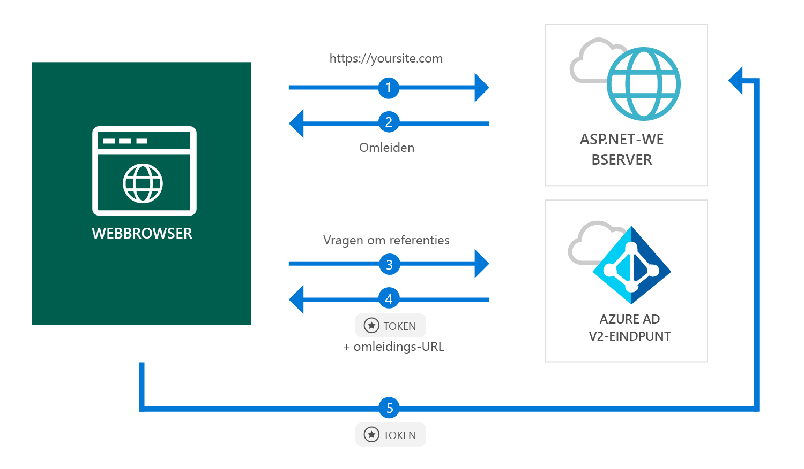

# <a name="quickstart-add-sign-in-with-microsoft-to-an-aspnet-web-app"></a>Snelstart: Aanmelding met Microsoft toevoegen aan een ASP.NET-web-app

[!INCLUDE [active-directory-develop-applies-v2](../../../includes/active-directory-develop-applies-v2.md)]

In deze snelstart leert u hoe een ASP.NET-web-app persoonlijke accounts (hotmail.com, outlook.com, anderen) en werk- en schoolaccounts kan aanmelden vanuit een willekeurig exemplaar van Azure Active Directory (Azure AD).



> [!div renderon="docs"]
> ## <a name="register-your-application-and-download-your-quickstart-app"></a>Uw toepassing registreren en de app uit de snelstart downloaden
>
> ### <a name="register-and-configure-your-application-and-code-sample"></a>Uw toepassing en codevoorbeeld registreren en configureren
> #### <a name="step-1-register-your-application"></a>Stap 1: Uw toepassing registreren
> 
> 1. Ga naar de [Microsoft-portal voor app-registratie](https://apps.dev.microsoft.com/portal/register-app).
> 1. Voer een naam in voor uw toepassing, zorg ervoor dat de optie voor **Stapsgewijze instelling** is uitgeschakeld en klik op **Maken**.
> 1. Klik op `Add Platform` en selecteer vervolgens `Web`.
> 1. Zorg ervoor dat **Impliciete stroom toestaan** is *ingeschakeld*.
> 1. Voer in **Omleidings-URL's** `https://localhost:44368/` in.
> 1. Schuif omlaag naar de onderkant van de pagina en klik op **Opslaan**.

> [!div class="sxs-lookup" renderon="portal"]
> #### <a name="step-1-configure-your-application-in-azure-portal"></a>Stap 1: Uw toepassing configureren in Azure Portal
> Voor een juiste werking van het codevoorbeeld uit deze snelstart, moet u een antwoord-URL als `https://localhost:44368/` toevoegen.
> > [!div renderon="portal" id="makechanges" class="nextstepaction"]
> > [Deze wijziging voor mij maken]()
>
> > [!div id="appconfigured" class="alert alert-info"]
> >  Uw toepassing is al geconfigureerd met dit kenmerk

#### <a name="step-2-download-your-project"></a>Stap 2: Uw project downloaden

[De Visual Studio 2017-oplossing downloaden](https://github.com/AzureADQuickStarts/AppModelv2-WebApp-OpenIDConnect-DotNet/archive/master.zip)

#### <a name="step-3-configure-your-visual-studio-project"></a>Stap 3: Uw Visual Studio-project configureren

1. Pak het zip-bestand uit in een lokale map dichter bij de hoofdmap (bijvoorbeeld **C:\Azure-Samples**)
1. Open de oplossing in Visual Studio (AppModelv2-Web-App-OpenIDConnect-DotNet.sln)
1. Bewerk **Web.config** en vervang `Enter_the_Application_Id_here` door de toepassings-id van de toepassing die u zojuist hebt geregistreerd:

    ```xml
    <add key="ClientId" value="Enter_the_Application_Id_here" />
    ```
    
> [!div class="sxs-lookup" renderon="portal"]
> [!IMPORTANT]
> Als uw toepassing een *toepassing met één tenant* (alleen gericht op accounts in deze map) is, zoekt u in uw **Web.config**-bestand de waarde op voor `Tenant` en vervangt u `common` door uw **tenant-id** of **tenantnaam** (bijvoorbeeld contoso.microsoft.com). U vindt de naam van de tenant op de **overzichtspagina**.

## <a name="more-information"></a>Meer informatie

Deze sectie bevat een overzicht van de code die vereist is voor het aanmelden van gebruikers. Dit kan handig zijn om te begrijpen hoe de code werkt, wat de belangrijkste argumenten zijn en ook als u aanmelding wilt toevoegen aan een bestaande ASP.NET-toepassing.

### <a name="owin-middleware-nuget-packages"></a>OWIN Middleware NuGet-pakketten

U kunt de verificatiepijplijn instellen met verificatie op basis van cookies met behulp van OpenID Connect in ASP.NET met OWIN Middleware-pakketten. U kunt deze pakketten installeren door de volgende opdrachten in de **Package Manager Console** van Visual Studio uit te voeren:

```powershell
Install-Package Microsoft.Owin.Security.OpenIdConnect
Install-Package Microsoft.Owin.Security.Cookies
Install-Package Microsoft.Owin.Host.SystemWeb
```

### <a name="owin-startup-class"></a>OWIN-opstartklasse

De OWIN-middleware maakt gebruik van een *opstartklasse* die wordt uitgevoerd wanneer het hostproces wordt geïnitialiseerd (in het geval van deze snelstart het bestand *startup.cs* dat zich in de hoofdmap bevindt). De volgende code toont de parameter die wordt gebruikt door deze snelstart:

```csharp
public void Configuration(IAppBuilder app)
{
    app.SetDefaultSignInAsAuthenticationType(CookieAuthenticationDefaults.AuthenticationType);

    app.UseCookieAuthentication(new CookieAuthenticationOptions());
    app.UseOpenIdConnectAuthentication(
        new OpenIdConnectAuthenticationOptions
        {
            // Sets the ClientId, authority, RedirectUri as obtained from web.config
            ClientId = clientId,
            Authority = authority,
            RedirectUri = redirectUri,
            // PostLogoutRedirectUri is the page that users will be redirected to after sign-out. In this case, it is using the home page
            PostLogoutRedirectUri = redirectUri,
            Scope = OpenIdConnectScope.OpenIdProfile,
            // ResponseType is set to request the id_token - which contains basic information about the signed-in user
            ResponseType = OpenIdConnectResponseType.IdToken,
            // ValidateIssuer set to false to allow personal and work accounts from any organization to sign in to your application
            // To only allow users from a single organizations, set ValidateIssuer to true and 'tenant' setting in web.config to the tenant name
            // To allow users from only a list of specific organizations, set ValidateIssuer to true and use ValidIssuers parameter 
            TokenValidationParameters = new TokenValidationParameters()
            {
                ValidateIssuer = false
            },
            // OpenIdConnectAuthenticationNotifications configures OWIN to send notification of failed authentications to OnAuthenticationFailed method
            Notifications = new OpenIdConnectAuthenticationNotifications
            {
                AuthenticationFailed = OnAuthenticationFailed
            }
        }
    );
}
```

> |Waar  |  |
> |---------|---------|
> | `ClientId`     | Toepassings-id van de toepassing die is geregistreerd in Azure Portal |
> | `Authority`    | Het STS-eindpunt voor de gebruiker voor verificatie. Meestal https://login.microsoftonline.com/{tenant}/v2.0 voor openbare cloud, waarbij {tenant} de naam is van uw tenant, uw tenant-id of *common* voor een verwijzing naar het algemene eindpunt (gebruikt voor toepassingen met meerdere tenants) |
> | `RedirectUri`  | URL waar gebruikers naartoe worden gestuurd na verificatie bij Azure Active Directory v2.0-eindpunt |
> | `PostLogoutRedirectUri`     | URL waar gebruikers naartoe worden gestuurd na afmelding |
> | `Scope`     | De lijst met bereiken die wordt aangevraagd, gescheiden door spaties |
> | `ResponseType`     | Aanvragen dat het antwoord van de verificatie een id-token bevat |
> | `TokenValidationParameters`     | Een lijst met parameters voor de validatie van tokens. In dit geval is `ValidateIssuer` ingesteld op `false` om aan te geven dat aanmeldingen vanaf persoonlijke, werk- of schoolaccounttypen kunnen worden geaccepteerd |
> | `Notifications`     | Een lijst met gemachtigden die kunnen worden uitgevoerd in verschillende *OpenIdConnect*-berichten |

### <a name="initiate-an-authentication-challenge"></a>Verificatievraag initiëren

U kunt afdwingen dat een gebruiker zich aanmeldt door een verificatievraag aan te vragen in uw controller:

```csharp
public void SignIn()
{
    if (!Request.IsAuthenticated)
    {
        HttpContext.GetOwinContext().Authentication.Challenge(
            new AuthenticationProperties{ RedirectUri = "/" },
            OpenIdConnectAuthenticationDefaults.AuthenticationType);
    }
}
```

> [!TIP]
> Het aanvragen van een verificatievraag met behulp van de bovenstaande methode is optioneel en wordt normaal gesproken gebruikt als u wilt dat een weergave toegankelijk is voor zowel geverifieerde als niet-geverifieerde gebruikers. U kunt controllers ook beveiligen met behulp van de methode die wordt beschreven in de volgende sectie.

### <a name="protect-a-controller-or-a-controllers-method"></a>Een controller of de methode van een controller beveiligen

U kunt een controller of controlleracties beveiligen met behulp van het kenmerk `[Authorize]`. Dit kenmerk beperkt toegang tot de controller of acties door alleen geverifieerde gebruikers toegang toe te staan tot de acties in de controller, wat betekent dat de verificatievraag automatisch wordt uitgevoerd wanneer een *niet-geverifieerde* gebruiker toegang probeert te krijgen tot een van deze acties of controller die zijn voorzien van het kenmerk `[Authorize]`.

## <a name="next-steps"></a>Volgende stappen

Volg de ASP.NET-zelfstudie voor een volledige stapsgewijze handleiding voor het bouwen van toepassingen en nieuwe functies, met inbegrip van een volledige uitleg van deze snelstart.

### <a name="learn-the-steps-to-create-the-application-used-in-this-quickstart"></a>Leer wat de stappen zijn voor het maken van de toepassing die wordt gebruikt in deze snelstart

> [!div class="nextstepaction"]
> [Zelfstudie Aanmelding](.\tutorial-v2-asp-webapp.md)

[!INCLUDE [Help and support](../../../includes/active-directory-develop-help-support-include.md)]