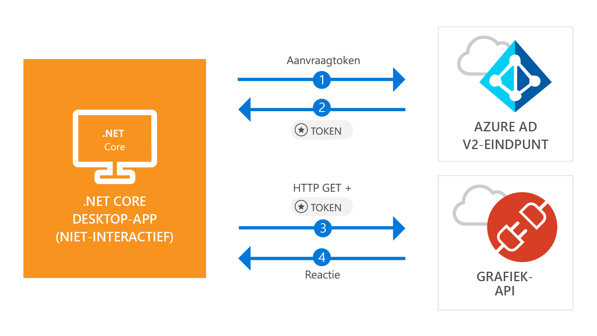

# <a name="quickstart-acquire-a-token-and-call-microsoft-graph-api-from-a-console-app-using-apps-identity"></a>Quickstart: Een token verkrijgen en Microsoft Graph API aanroepen vanuit een console-app met behulp van de identiteit van de app

[!INCLUDE [active-directory-develop-applies-v2-msal](../../../includes/active-directory-develop-applies-v2-msal.md)]

In deze quickstart leert u hoe u een .NET Core-toepassing schrijft die een toegangstoken kan ophalen met behulp van de eigen identiteit van de app en hoe u vervolgens de Microsoft Graph API aanroept om een [lijst met gebruikers](https://docs.microsoft.com/graph/api/user-list) in de map weer te geven. Dit scenario is nuttig in situaties waar een headless taak zonder toezicht of een Windows-service moet worden uitgevoerd met een toepassings-id in plaats van de identiteit van een gebruiker.



## <a name="prerequisites"></a>Vereisten

Voor deze quickstart is [.NET Core 2.1](https://www.microsoft.com/net/download/dotnet-core/2.1) vereist.

> [!div renderon="docs"]
> ## <a name="register-and-download-your-quickstart-app"></a>De quickstart-app registreren en downloaden

> [!div renderon="docs" class="sxs-lookup"]
>
> U hebt twee opties voor het starten van de snelstarttoepassing:
> * [Express] [Optie 1: registreer de toepassing en laat deze automatisch configureren. Download vervolgens het codevoorbeeld](#option-1-register-and-auto-configure-your-app-and-then-download-your-code-sample)
> * [Handmatig] [Optie 2: registreer de toepassing en configureer handmatig de toepassing en het codevoorbeeld](#option-2-register-and-manually-configure-your-application-and-code-sample)
>
> ### <a name="option-1-register-and-auto-configure-your-app-and-then-download-your-code-sample"></a>Optie 1: registreer de toepassing en laat deze automatisch configureren. Download vervolgens het codevoorbeeld
>
> 1. Ga naar de [Azure Portal - Toepassingsregistratie (preview)](https://portal.azure.com/?Microsoft_AAD_RegisteredApps=true#blade/Microsoft_AAD_RegisteredApps/applicationsListBlade/quickStartType/DotNetCoreDaemonQuickstartPage/sourceType/docs).
> 1. Voer een naam in voor de toepassing en selecteer **Registreren**.
> 1. Volg de instructies om de nieuwe toepassing met slechts één klik te downloaden en automatisch te configureren.
>
> ### <a name="option-2-register-and-manually-configure-your-application-and-code-sample"></a>Optie 2: registreer de toepassing en configureer handmatig de toepassing en het codevoorbeeld

> [!div renderon="docs"]
> #### <a name="step-1-register-your-application"></a>Stap 1: Uw toepassing registreren
> Volg deze stappen om de toepassing te registreren en de registratiegegevens van de app handmatig toe te voegen aan uw oplossing:
>
> 1. Meld u bij de [Azure-portal](https://portal.azure.com) aan met een werk- of schoolaccount of een persoonlijk Microsoft-account.
> 1. Als u via uw account toegang hebt tot meer dan één tenant, selecteert u uw account in de rechterbovenhoek en stelt u de portalsessie in op de gewenste Azure Active Directory-tenant.
> 1. Selecteer in het linkernavigatiedeelvenster de **Azure Active Directory**-service en selecteer vervolgens **App-registraties (preview)** > **Nieuwe registratie**.
> 1. Voer in de sectie **Naam** een beschrijvende toepassingsnaam in die wordt weergegeven voor gebruikers van de app, zoals `Daemon-console`. Selecteer vervolgens **Registreren** om de toepassing te maken.
> 1. Na het registreren opent u het menu **Certificaten en geheimen**.
> 1. Onder **Clientgeheimen** selecteert u **+ Nieuw clientgeheim**. Geef het clientgeheim een naam en selecteer **Toevoegen**. Kopieer het geheim naar een veilige locatie. U hebt dit nodig voor gebruik in uw code.
> 1. Open nu het menu **API-machtigingen**, selecteer de knop **+ Een geheim toevoegen** en selecteer **Microsoft Graph**.
> 1. Selecteer **Toepassingsmachtigingen**.
> 1. Selecteer onder het knooppunt **Gebruiker** de optie **User.Read.All** en selecteer vervolgens **Machtigingen toevoegen**

> [!div class="sxs-lookup" renderon="portal"]
> ### <a name="download-and-configure-your-quickstart-app"></a>Uw snelstart-app downloaden en configureren
> 
> #### <a name="step-1-configure-your-application-in-azure-portal"></a>Stap 1: uw toepassing configureren in Azure Portal
> Om ervoor te zorgen dat het codevoorbeeld voor deze quickstart werkt, moet u een clientgeheim maken en de toepassingstoestemming **User.Read.All** van Graph API toevoegen.
> > [!div renderon="portal" id="makechanges" class="nextstepaction"]
> > [Breng deze wijzigingen voor mij aan]()
>
> > [!div id="appconfigured" class="alert alert-info"]
> >  Uw toepassing is al geconfigureerd met deze kenmerken.

#### <a name="step-2-download-your-visual-studio-project"></a>Stap 2: uw Visual Studio-project downloaden

[Download het Visual Studio-project](https://github.com/Azure-Samples/active-directory-dotnetcore-daemon-v2/archive/master.zip)

#### <a name="step-3-configure-your-visual-studio-project"></a>Stap 3: uw Visual Studio-project configureren

1. Pak het zip-bestand uit in een lokale map dicht bij de hoofdmap van de schijf, bijvoorbeeld **C:\Azure-Samples**.
1. Open de oplossing in Visual Studio - **daemon-console.sln** (optioneel).
1. Bewerk **appsettings.json** en vervang de waarden van de velden `ClientId`, `Tenant` en `ClientSecret` door het volgende:

    ```json
    "Tenant": "Enter_the_Tenant_Id_Here",
    "ClientId": "Enter_the_Application_Id_Here",
    "ClientSecret": "Enter_the_Client_Secret_Here"
    ```
    > > [!div renderon="portal" id="certandsecretspage" class="sxs-lookup"]
    > > [Een nieuw clientgeheim genereren]()
    
    > [!div renderon="docs"]
    >> Waar:
    >> * `Enter_the_Application_Id_Here`: is de **toepassings-id (client-id)** voor de toepassing die u hebt geregistreerd.
    >> * `Enter_the_Tenant_Id_Here`: vervang deze waarde door de **Tenant-id** of **tenantnaam** (bijvoorbeeld contoso.microsoft.com)
    >> * `Enter_the_Client_Secret_Here`: vervang deze waarde door het clientgeheim dat is gemaakt in stap 1.

    > [!div renderon="docs"]
    > > [!TIP]
    > > Om de waarden van **Toepassings-id (client-id)** en **Map-id (tenant-id)** te achterhalen, gaat u naar de **Overzichtspagina** van de app in de Azure-portal. Voor het genereren van een nieuwe sleutel gaat u naar de pagina **Certificaten en geheimen**.
    
#### <a name="step-4-admin-consent"></a>Stap 4: toestemming van de beheerder

Elke *alleen app-machtiging* vereist beheerderstoestemming. Dit betekent dat er een globale beheerder van uw map nodig is om toestemming te geven aan uw toepassing. Selecteer een van de opties hieronder, afhankelijk van uw rol:

##### <a name="global-tenant-administrator"></a>Globale tenantbeheerder

> [!div renderon="docs"]
> Als u een globale tenantbeheerder bent, gaat u naar de pagina **API-machtigingen** in de registratie van toepassingen (preview) in de Azure-portal en selecteer **Beheerder toestemming verlenen voor {tenantnaam}** (waarbij {tenantnaam} de naam van uw map is).

> [!div renderon="portal" class="sxs-lookup"]
> Als u een globale beheerder bent, gaat u naar de pagina **API-machtigingen** en selecteert u **Beheerder toestemming verlenen voor Enter_the_Tenant_Name_Here**
> > [!div id="apipermissionspage"]
> > [Ga naar de pagina API-machtigingen]()

##### <a name="standard-user"></a>Standaardgebruiker

Als u een standaardgebruiker van uw tenant bent, moet u een globale beheerder vragen beheerderstoestemming voor uw toepassing te verlenen. Daarvoor verstrekt u de volgende URL aan uw beheerder:

```url
https://login.microsoftonline.com/Enter_the_Tenant_Id_Here/adminconsent?client_id=Enter_the_Application_Id_Here
```

> [!div renderon="docs"]
>> Waar:
>> * `Enter_the_Tenant_Id_Here`: vervang deze waarde door de **Tenant-id** of **Tenantnaam** (bijvoorbeeld contoso.microsoft.com)
>> * `Enter_the_Application_Id_Here`: is de **toepassings-id (client-id)** voor de toepassing die u hebt geregistreerd.

> [!NOTE]
> Mogelijk ziet u de fout *AADSTS50011: Er is geen antwoordadres geregistreerd voor de toepassing* na het verlenen van toestemming voor de app met behulp van de voorgaande URL. Dit gebeurt omdat deze toepassing en de URL geen omleidings-URI hebben. Negeer deze fout.

#### <a name="step-5-run-the-application"></a>Stap 5: De toepassing uitvoeren

Als u Visual Studio gebruikt, drukt u op **F5** om de toepassing uit te voeren. Voer anders de toepassing uit via de opdrachtprompt of de console:

```console
cd {ProjectFolder}\daemon-console
dotnet run
```

> Waar:
> * *{Projectmap}*  is de map waar u het zip-bestand hebt uitgepakt. Voorbeeld **C:\Azure-Samples\active-directory-dotnetcore-daemon-v2**

U ziet een lijst met gebruikers in uw Azure AD-directory als resultaat.

## <a name="more-information"></a>Meer informatie

### <a name="msalnet"></a>MSAL.NET

MSAL ([Microsoft.Identity.Client](https://www.nuget.org/packages/Microsoft.Identity.Client)) is de bibliotheek die wordt gebruikt voor het aanmelden van gebruikers en het aanvragen van tokens die worden gebruikt voor toegang tot een API die wordt beveiligd met Microsoft Azure AD (Azure Active Directory). Zoals beschreven, worden met deze quickstart tokens aangevraagd met behulp van de eigen identiteit van de toepassing in plaats van gedelegeerde machtigingen. De verificatiestroom die in dit voorbeeld wordt gebruikt, staat bekend als de *[oauth-stroom voor clientreferenties](v2-oauth2-client-creds-grant-flow.md)*. Zie [dit artikel](https://aka.ms/msal-net-client-credentials) voor meer informatie over het gebruik van MSAL.NET met een clientreferentiestroom.

 U kunt MSAL.NET installeren door de volgende opdracht uit te voeren in **Package Manager Console** van Visual Studio:

```powershell
Install-Package Microsoft.Identity.Client -Pre
```

### <a name="msal-initialization"></a>MSAL initialiseren

U kunt de verwijzing voor MSAL toevoegen door de volgende code toe te voegen:

```csharp
using Microsoft.Identity.Client;
```

Vervolgens initialiseert u MSAL met de volgende code:

```csharp
ClientCredential clientCredentials = new ClientCredential(secret: config.ClientSecret);

var app = new ConfidentialClientApplication(
    clientId: config.ClientId, 
    authority: config.Authority, 
    redirectUri: "https://daemon", 
    clientCredential: clientCredentials, 
    userTokenCache: null, 
    appTokenCache: new TokenCache()
);
```

> | Waar: ||
> |---------|---------|
> | `secret` | Het clientgeheim is dat voor de toepassing in Azure-portal wordt gemaakt. |
> | `clientId` | Is de **Toepassings-id (client-id)** voor de toepassing die is geregistreerd in de Azure-portal. U vindt deze waarde op de pagina **Overzicht** in de Azure-portal. |
> | `Authority`    | (Optioneel) Het STS-eindpunt voor de gebruiker voor verificatie. Dat is meestal https://login.microsoftonline.com/{tenant} voor de openbare cloud, waarbij {tenant} de naam van uw tenant of uw tenant-id is.|
> | `redirectUri`  | URL waar gebruikers naartoe worden gestuurd na verificatie. Omdat dit een console/niet-interactieve toepassing is, wordt in dit geval deze parameter niet gebruikt |
> | `clientCredentials`  | Het clientreferentie-object, met het geheim of een certificaat |
> | `userTokenCache`  | Exemplaar van een tokencache voor de gebruiker. Omdat deze app wordt uitgevoerd in de context van de app en niet van de gebruiker, is deze waarde in dit geval null|
> | `appTokenCache`  | Exemplaar van een tokencache voor de app|

Zie de [naslagdocumentatie voor `ConfidentialClientApplication`](https://docs.microsoft.com/dotnet/api/microsoft.identity.client.confidentialclientapplication.-ctor?view=azure-dotnet#Microsoft_Identity_Client_ConfidentialClientApplication__ctor_System_String_System_String_System_String_Microsoft_Identity_Client_ClientCredential_Microsoft_Identity_Client_TokenCache_Microsoft_Identity_Client_TokenCache) voor meer informatie

### <a name="requesting-tokens"></a>Tokens aanvragen

Als u een token wilt aanvragen met behulp van de identiteit van de app, gebruikt u de `AcquireTokenForClientAsync`-methode:

```csharp
result = await app.AcquireTokenForClientAsync(scopes);
```

> |Waar:| |
> |---------|---------|
> | `scopes` | De aangevraagde bereiken bevat. Voor vertrouwelijke clients moet hiervoor de indeling worden gebruikt die vergelijkbaar is met `{Application ID URI}/.default` om aan te geven dat de aangevraagde bereiken dezelfde zijn die statisch zijn gedefinieerd in het app-object dat is ingesteld in de Azure-portal (voor Microsoft Graph verwijst `{Application ID URI}` naar `https://graph.microsoft.com`). Voor aangepaste Web-API's wordt `{Application ID URI}` gedefinieerd in de sectie **Een API beschikbaar maken** in de registratie van toepassingen (preview) van de Azure-portal. |

Zie de [naslagdocumentatie voor `AcquireTokenForClientAsync`](https://docs.microsoft.com/dotnet/api/microsoft.identity.client.confidentialclientapplication.acquiretokenforclientasync?view=azure-dotnet#Microsoft_Identity_Client_ConfidentialClientApplication_AcquireTokenForClientAsync_System_Collections_Generic_IEnumerable_System_String__) voor meer informatie

[!INCLUDE [Help and support](../../../includes/active-directory-develop-help-support-include.md)]

## <a name="next-steps"></a>Volgende stappen

Meer informatie over machtigingen en toestemming:

> [!div class="nextstepaction"]
> [Machtigingen en toestemming](v2-permissions-and-consent.md)

Zie de Oauth 2.0-clientreferentiestroom voor meer informatie over de auth-stroom voor dit scenario:

> [!div class="nextstepaction"]
> [Oauth-clientreferentiestroom](v2-oauth2-client-creds-grant-flow.md)

> [!div class="nextstepaction"]
> [Clientreferentiestromen met MSAL.NET](https://aka.ms/msal-net-client-credentials)