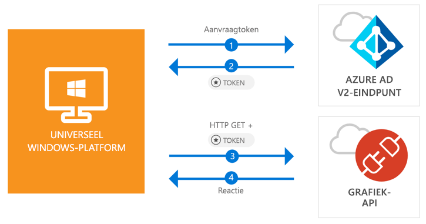

# <a name="call-the-microsoft-graph-api-from-a-universal-windows-platform-uwp-application"></a>De Microsoft Graph-API aanroepen vanuit de Universeel Windows-platformtoepasing (UWP)

[!INCLUDE [active-directory-develop-applies-v2-msal](../../../includes/active-directory-develop-applies-v2-msal.md)]

Deze snelstart bevat een codevoorbeeld dat u laat zien hoe een Universeel Windows-platformtoepassing (UWP) gebruikers met persoonlijke, werk- en schoolaccounts kan aanmelden, een toegangstoken kan ophalen en de Microsoft Graph API kan aanroepen.



> [!div renderon="docs"]
> ## <a name="register-and-download"></a>Registreren en downloaden
> ### <a name="register-and-configure-your-application-and-code-sample"></a>Uw toepassing en codevoorbeeld registreren en configureren
> #### <a name="step-1-register-your-application"></a>Stap 1: Uw toepassing registreren
> Ga als volgt te werk om de toepassing te registreren en de registratiegegevens van de toepassing toe te voegen aan uw oplossing:
> 1. Ga naar de [Microsoft-portal voor app-registratie](https://apps.dev.microsoft.com/portal/register-app) om een toepassing te registreren.
> 1. Typ in het vak **Toepassingsnaam** een naam voor de toepassing.
> 1. Zorg ervoor dat het selectievakje **Stapsgewijze instelling** is uitgeschakeld en selecteer vervolgens **Maken**.
> 1. Selecteer **Platform toevoegen**, selecteer **Systeemeigen toepassing** en selecteer vervolgens **Opslaan**.

> [!div renderon="portal" class="sxs-lookup alert alert-info"]
> #### <a name="step-1-configure-your-application"></a>Stap 1: Uw toepassing configureren
> Voor een juiste werking van het codevoorbeeld uit deze quickstart moet u een doorverwijzings-URL toevoegen als **urn:ietf:wg:oauth:2.0:oob**.
> > [!div renderon="portal" id="makechanges" class="nextstepaction"]
> > [Deze wijziging voor mij maken]()
>
> > [!div id="appconfigured" class="alert alert-info"]
> >  Uw toepassing is al geconfigureerd met deze kenmerken

#### <a name="step-2-download-your-visual-studio-project"></a>Stap 2: Uw Visual Studio-project downloaden

 - [Download het Visual Studio 2017-project](https://github.com/Azure-Samples/active-directory-dotnet-native-uwp-v2/archive/master.zip)

#### <a name="step-3-configure-your-visual-studio-project"></a>Stap 3: Uw Visual Studio-project configureren

1. Pak het zip-bestand uit in een lokale map (bijvoorbeeld **C:\Azure-Samples**)
1. Open het project in Visual Studio
1. Bewerk **App.Xaml.cs** en vervang de regel die begint met `private static string ClientId` door:

    ```csharp
    private static string ClientId = "Enter_the_Application_Id_here";
    ```

## <a name="more-information"></a>Meer informatie

Hieronder een overzicht van deze snelstartgids:

### <a name="msalnet"></a>MSAL.NET

MSAL ([Microsoft.Identity.Client](https://www.nuget.org/packages/Microsoft.Identity.Client)) is de bibliotheek die wordt gebruikt voor het aanmelden van gebruikers en het aanvragen van tokens die worden gebruikt voor toegang tot een API die wordt beveiligd met Microsoft Azure Active Directory. U kunt MSAL installeren door de volgende opdracht uit te voeren in *Package Manager Console* van Visual Studio:

```powershell
Install-Package Microsoft.Identity.Client -Pre
```

### <a name="msal-initialization"></a>MSAL initialiseren

U kunt de verwijzing voor MSAL toevoegen door de onderstaande regel toe te voegen:

```csharp
using Microsoft.Identity.Client;
```

Vervolgens initialiseert u MSAL met behulp van de onderstaande regel:

```csharp
public static PublicClientApplication PublicClientApp = new PublicClientApplication(ClientId);
```

> |Waar: ||
> |---------|---------|
> |ClientId | De toepassings-id van de toepassing die is geregistreerd in *portal.microsoft.com* |

### <a name="requesting-tokens"></a>Tokens aanvragen

Msal biedt twee methoden om tokens te verkrijgen: `AcquireTokenAsync` en `AcquireTokenSilentAsync`

#### <a name="get-a-user-token-interactively"></a>Een gebruikerstoken interactief ophalen

 In sommige situaties moeten gebruikers via een pop-upvenster worden gedwongen om te communiceren met het Azure Active Directory v2.0-eindpunt om hun referenties te valideren of om toestemming te geven. Voorbeelden daarvan zijn:

- De eerste keer dat gebruikers zich aanmelden bij de toepassing
- Gebruikers moeten mogelijk hun referenties opnieuw opgeven omdat het wachtwoord is verlopen
- Uw toepassing vraagt toegang tot een resource waarvoor de gebruiker toestemming moet geven
- Wanneer verificatie in twee stappen is vereist

```csharp
authResult = await App.PublicClientApp.AcquireTokenAsync(scopes);
```

> |Waar:||
> |---------|---------|
> |bereiken | Bevat de bereiken die worden aangevraagd (dat wil zeggen `{ "user.read" }` voor Microsoft Graph of `{ "api://<Application ID>/access_as_user" }` voor aangepaste web-API's) |

#### <a name="get-a-user-token-silently"></a>Een gebruikerstoken op de achtergrond ophalen

U wilt gebruikers niet verplichten om steeds hun referenties te valideren als ze toegang tot een resource nodig hebben; de meeste tijd wilt u tokens verkrijgen en verlengen zonder interactie met de gebruiker. `AcquireTokenSilentAsync` is de methode die het meest wordt gebruikt om tokens te verkrijgen die worden gebruikt voor toegang tot beschermde resources na de oorspronkelijke `AcquireTokenAsync`:

```csharp
var accounts = await App.PublicClientApp.GetAccountsAsync();
authResult = await App.PublicClientApp.AcquireTokenSilentAsync(scopes, accounts.FirstOrDefault());
```

> |Waar: ||
> |---------|---------|
> |bereiken | Bevat de bereiken die worden aangevraagd (dat wil zeggen `{ "user.read" }` voor Microsoft Graph of `{ "api://<Application ID>/access_as_user" }` voor aangepaste web-API's) |
> |accounts.FirstOrDefault() | De eerste gebruiker in de cache (MSAL biedt ondersteuning voor meerdere gebruikers in één app) |

## <a name="next-steps"></a>Volgende stappen

Volg de zelfstudie voor Windows-bureaublad voor een volledige stapsgewijze handleiding voor het bouwen van toepassingen en ontwikkelen van nieuwe functies, waaronder een volledige uitleg van deze snelstartgids:

### <a name="learn-the-steps-to-create-the-application-used-in-this-quickstart"></a>Leer de stappen voor het maken van de toepassing die wordt gebruikt in deze snelstartgids

> [!div class="nextstepaction"]
> [UWP - Zelfstudie voor het aanroepen van Graph API](tutorial-v2-windows-uwp.md)

[!INCLUDE [Help and support](../../../includes/active-directory-develop-help-support-include.md)]