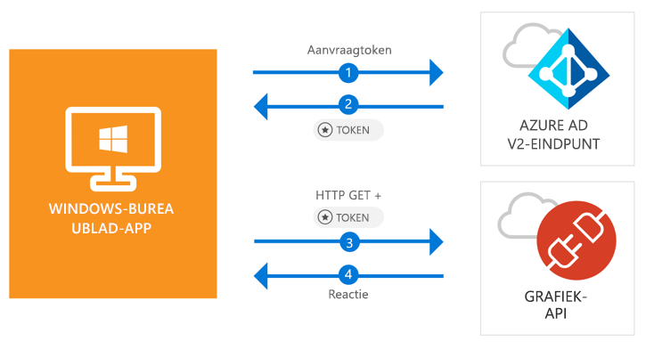

# <a name="quickstart-acquire-a-token-and-call-microsoft-graph-api-from-a-windows-desktop-app"></a>Quickstart: Een token verkrijgen en Microsoft Graph API aanroepen vanuit een Windows-bureaublad-app

[!INCLUDE [active-directory-develop-applies-v2-msal](../../../includes/active-directory-develop-applies-v2-msal.md)]

In deze quickstart leert u hoe u een .NET-toepassing (WPF) voor Windows-bureaublad schrijft waarmee privé-, werk- en schoolaccounts kunnen worden aangemeld, een toegangstoken kan worden opgehaald en de Microsoft Graph API kan worden aangeroepen.



> [!div renderon="docs"]
> ## <a name="register-and-download-your-quickstart-app"></a>De quickstart-app registreren en downloaden
> [!div renderon="docs" class="sxs-lookup"]
> U hebt twee opties voor het starten van de snelstarttoepassing:
> * [Express] [Optie 1: registreer de toepassing en laat deze automatisch configureren. Download vervolgens de voorbeeldcode](#option-1-register-and-auto-configure-your-app-and-then-download-your-code-sample)
> * [Handmatig] [Optie 2: registreer de toepassing en configureer handmatig de toepassing en het codevoorbeeld](#option-2-register-and-manually-configure-your-application-and-code-sample)
>
> ### <a name="option-1-register-and-auto-configure-your-app-and-then-download-your-code-sample"></a>Optie 1: de app registreren en automatisch configureren, en vervolgens de voorbeeldcode downloaden
>
> 1. Ga naar de [Azure-portal - toepassingsregistratie](https://portal.azure.com/?Microsoft_AAD_RegisteredApps=true#blade/Microsoft_AAD_RegisteredApps)
> 1. Voer een naam in voor de toepassing en selecteer **Registreren**.
> 1. Volg de instructies om de nieuwe toepassing met slechts één klik te downloaden en automatisch te configureren.
>
> ### <a name="option-2-register-and-manually-configure-your-application-and-code-sample"></a>Optie 2: registreer de toepassing en configureer handmatig de toepassing en het codevoorbeeld
> [!div renderon="docs"]
> #### <a name="step-1-register-your-application"></a>Stap 1: Uw toepassing registreren
> 1. Meld u bij de [Azure-portal](https://portal.azure.com) aan met een werk- of schoolaccount of een persoonlijk Microsoft-account.
> 1. Als u via uw account toegang hebt tot meer dan één tenant, selecteert u uw account in de rechterbovenhoek en stelt u de portalsessie in op de gewenste Azure Active Directory-tenant.
> 1. Selecteer in het linkernavigatiedeelvenster de **Azure Active Directory**-service en selecteer vervolgens **App-registraties (preview)** > **Nieuwe registratie**.
> 1. Wanneer de pagina **Een toepassing registreren** verschijnt, voert u de registratiegegevens van de toepassing in:
>      - Voer in de sectie **Naam** een beschrijvende toepassingsnaam. Deze wordt zichtbaar voor gebruikers van de app. Bijvoorbeeld: `Win-App-calling-MsGraph`.
>      - Selecteer in de sectie **Ondersteunde accounttypen** de optie **Accounts in alle organisatiemappen en persoonlijke Microsoft-accounts (bijvoorbeeld Skype, Xbox, Outlook.com**.
>      - Selecteer **Registreren** om de toepassing te maken.
> 1. Selecteer in de lijst met pagina’s voor de app de optie **Verificatie**.
> 1. Ga in de sectie **Omleidings-URI's** naar de sectie **Voorgestelde omleidings-URI's voor openbare clients (mobiel, desktop)**, en selecteer **"urn:ietf:wg:oauth:2.0:oob**.
> 1. Selecteer **Opslaan**.

> [!div renderon="portal" class="sxs-lookup"]
> #### <a name="step-1-configure-your-application"></a>Stap 1: Uw toepassing configureren
> Voor een juiste werking van het codevoorbeeld uit deze quickstart moet u een antwoord-URL toevoegen als **urn:ietf:wg:oauth:2.0:oob**.
> > [!div renderon="portal" id="makechanges" class="nextstepaction"]
> > [Deze wijziging voor mij maken]()
>
> > [!div id="appconfigured" class="alert alert-info"]
> >  Uw toepassing is al geconfigureerd met deze kenmerken.

#### <a name="step-2-download-your-visual-studio-project"></a>Stap 2: Uw Visual Studio-project downloaden

[Download het Visual Studio 2017-project](https://github.com/Azure-Samples/active-directory-dotnet-desktop-msgraph-v2/archive/master.zip)

#### <a name="step-3-configure-your-visual-studio-project"></a>Stap 3: Uw Visual Studio-project configureren

1. Pak het zip-bestand uit in een lokale map dicht bij de hoofdmap van de schijf, bijvoorbeeld **C:\Azure-Samples**.
1. Open het project in Visual Studio.
1. Bewerk **App.Xaml.cs** en vervang de waarden van de velden `ClientId` en `Tenant` door de volgende code:

    ```csharp
    private static string ClientId = "Enter_the_Application_Id_here";
    private static string Tenant = "Enter_the_Tenant_Info_Here";
    ```

> [!div renderon="docs"]
> Waar:
> - `Enter_the_Application_Id_here`: is de **toepassings-id (client-id)** voor de toepassing die u hebt geregistreerd.
> - `Enter_the_Tenant_Info_Here`: is ingesteld op een van de volgende opties:
>   - Als uw toepassing **Alleen accounts in deze organisatiemap** ondersteunt, vervang deze waarde dan door de **Tenant-id** of **Tenantnaam** (bijvoorbeeld contoso.microsoft.com)
>   - Als uw toepassing **Accounts in elke organisatiemap** ondersteunt, vervang deze waarde dan door `organizations`
>   - Als uw toepassing **Accounts in elke organisatiemap en persoonlijke Microsoft-accounts** ondersteunt, vervang deze waarde dan door `common`
>
> > [!TIP]
> > Om de waarden van **Toepassings-id (client-id)**, **Map-id (tenant-id)** en **Ondersteunde accounttypen** te achterhalen, gaat u naar de **Overzichtspagina** van de app in de Azure-portal.

## <a name="more-information"></a>Meer informatie

### <a name="msalnet"></a>MSAL.NET

MSAL ([Microsoft.Identity.Client](https://www.nuget.org/packages/Microsoft.Identity.Client)) is de bibliotheek die wordt gebruikt voor het aanmelden van gebruikers en het aanvragen van tokens die worden gebruikt voor toegang tot een API die wordt beveiligd met Microsoft Azure AD (Azure Active Directory). U kunt MSAL installeren door de volgende opdracht uit te voeren in **Package Manager Console** van Visual Studio:

```powershell
Install-Package Microsoft.Identity.Client -Pre
```

### <a name="msal-initialization"></a>MSAL initialiseren

U kunt de verwijzing voor MSAL toevoegen door de volgende code toe te voegen:

```csharp
using Microsoft.Identity.Client;
```

Vervolgens initialiseert u MSAL met de volgende code:

```csharp
public static PublicClientApplication PublicClientApp = new PublicClientApplication(ClientId);
```

> |Waar: ||
> |---------|---------|
> | `ClientId` | Is de **Toepassings-id (client-id)** voor de toepassing die is geregistreerd in de Azure-portal. U vindt deze waarde op de pagina **Overzicht** in de Azure-portal. |

### <a name="requesting-tokens"></a>Tokens aanvragen

MSAL biedt twee methoden om tokens te verkrijgen: `AcquireTokenAsync` en `AcquireTokenSilentAsync`.

#### <a name="get-a-user-token-interactively"></a>Een gebruikerstoken interactief ophalen

In sommige situaties is het nodig om gebruiker via een pop-upvenster te dwingen het Azure AD v2.0-eindpunt te gebruiken om hun referenties te valideren of om toestemming te geven. Voorbeelden zijn:

- De eerste keer dat gebruikers zich aanmelden bij de toepassing
- Wanneer gebruikers mogelijk hun referenties opnieuw moeten opgeven omdat het wachtwoord is verlopen
- Wanneer via de toepassing toegang wordt aangevraagd tot een resource waarvoor de gebruiker toestemming moet geven
- Wanneer tweeledige verificatie is vereist

```csharp
authResult = await App.PublicClientApp.AcquireTokenAsync(_scopes);
```

> |Waar:||
> |---------|---------|
> | `_scopes` | Bevat de bereiken die worden aangevraagd, bijvoorbeeld `{ "user.read" }` voor Microsoft Graph of `{ "api://<Application ID>/access_as_user" }` voor aangepaste web-API's. |

#### <a name="get-a-user-token-silently"></a>Een gebruikerstoken op de achtergrond ophalen

U wilt niet dat de gebruiker telkens wanneer deze toegang nodig heeft tot een resource, de referenties moet laten valideren. In de meeste gevallen wilt u tokens ophalen en verlengen zonder tussenkomst van de gebruiker. U kunt de methode `AcquireTokenSilentAsync` voor het verkrijgen van tokens gebruiken voor toegang tot beveiligde resources na de eerste methode `AcquireTokenAsync`:

```csharp
var accounts = await App.PublicClientApp.GetAccountsAsync();
authResult = await App.PublicClientApp.AcquireTokenSilentAsync(scopes, accounts.FirstOrDefault());
```

> |Waar: ||
> |---------|---------|
> | `scopes` | Bevat de bereiken die worden aangevraagd, bijvoorbeeld `{ "user.read" }` voor Microsoft Graph of `{ "api://<Application ID>/access_as_user" }` voor aangepaste web-API's. |
> | `accounts.FirstOrDefault()` | Geeft de eerste gebruiker in de cache op (MSAL biedt ondersteuning voor meerdere gebruikers in één app). |

[!INCLUDE [Help and support](../../../includes/active-directory-develop-help-support-include.md)]

## <a name="next-steps"></a>Volgende stappen

Volg de zelfstudie voor Windows-bureaublad voor een volledige stapsgewijze handleiding voor het bouwen van toepassingen en nieuwe functies, waaronder een volledige uitleg van deze quickstart.

> [!div class="nextstepaction"]
> [Zelfstudie voor het aanroepen van Graph API](https://docs.microsoft.com/azure/active-directory/develop/guidedsetups/active-directory-windesktop)

