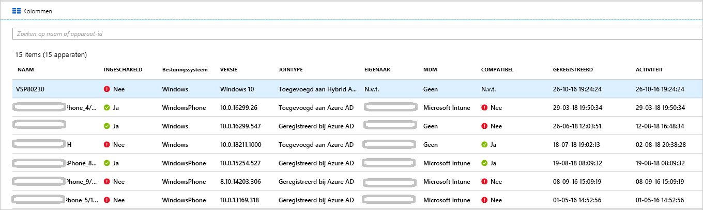

# <a name="how-to-manage-stale-devices-in-azure-ad"></a>Procedure: Verlopen apparaten beheren in Azure Active Directory

In het ideale geval moet de levenscyclus van geregistreerde apparaten worden voltooid door de registratie van de apparaten ongedaan te maken op het moment dat ze niet meer nodig zijn. Als gevolg van bijvoorbeeld verloren, gestolen of defecte apparaten, of herinstallaties van het besturingssysteem, zijn er meestal echter nog wel verlopen apparaten aanwezig in uw omgeving. Als IT-beheerder is het prettig om te beschikken over een methode voor het verwijderen van verlopen apparaten, zodat u zich kunt richten op het beheren van apparaten die nog echt in gebruik zijn.

In dit artikel leert u hoe u op een efficiënte manier verlopen apparaten in uw omgeving kunt beheren.
  

## <a name="what-is-a-stale-device"></a>Wat is een verlopen apparaat?

Een verlopen apparaat is een apparaat dat is geregistreerd bij Azure AD, maar dat gedurende een bepaalde periode niet is gebruikt voor toegang tot cloud-apps. Verlopen apparaten hebben vanwege de volgende redenen invloed op het efficiënt beheren en ondersteunen van apparaten en gebruikers in de tenant: 

- Dubbele apparaten kunnen het lastig maken voor de helpdesk om te bepalen welk apparaat momenteel actief is.
- Een groter aantal apparaten zorgt voor onnodige write-backs naar apparaten, waardoor er meer tijd nodig is synchronisaties met AAD Connect.
- Als een algemene maatregel en om te voldoen aan nalevingsvereisten, kan het prettig zijn om alleen met actieve apparaten te werken. 

Verlopen apparaten in Azure AD kunnen van invloed zijn op het algemene levenscyclusbeleid voor apparaten in uw organisatie.

## <a name="detect-stale-devices"></a>Verlopen apparaten detecteren

De definitie van een verlopen apparaat is een geregistreerd apparaat dat gedurende een bepaalde periode niet is gebruikt om toegang te krijgen tot cloud-apps. Om die reden vereist het detecteren van verlopen apparaten een eigenschap waarin een tijdstempel wordt opgeslagen. In Azure AD heeft deze eigenschap de naam **ApproximateLastLogonTimestamp** (ook wel **tijdstempel van activiteit** genoemd). Als het verschil tussen nu en de waarde van de **tijdstempel van activiteit** groter is dan de periode die u hebt gedefinieerd voor actieve apparaten, wordt een apparaat beschouwd als verlopen. Deze **tijdstempel van activiteit** is nu in openbare preview.

## <a name="how-is-the-value-of-the-activity-timestamp-managed"></a>Hoe wordt de waarde van de tijdstempel van activiteit beheerd?  

De evaluatie van de tijdstempel van activiteit wordt geactiveerd door een poging tot verificatie van een apparaat. In de volgende gevallen wordt de tijdstempel van activiteit geëvalueerd door Azure AD:

- Een beleid voor voorwaardelijke toegang waarvoor [beheerde apparaten](../conditional-access/require-managed-devices.md) of [goedgekeurde client-apps](../conditional-access/app-based-conditional-access.md) zijn vereist, is geactiveerd.
- Windows 10-apparaten die zijn toegevoegd aan Azure AD of hybride Azure AD zijn actief in het netwerk. 
- Met Intune beheerde apparaten zijn ingecheckt bij de service.

Als de verschil tussen de bestaande waarde van de tijds tempel van de activiteit en de huidige waarde meer dan 14 dagen (afwijking van +/-5 dagen) is, wordt de bestaande waarde vervangen door de nieuwe waarde.

## <a name="how-do-i-get-the-activity-timestamp"></a>Hoe kom ik aan het tijdstempel van activiteit?

Er zijn twee manieren om de waarde van de tijdstempel van activiteit te bepalen:

- Via de kolom **Activiteit** op de [pagina Apparaten](https://portal.azure.com/#blade/Microsoft_AAD_IAM/DevicesMenuBlade/Devices) in de Azure-portal

    

- Via de cmdlet [Get-MsolDevice](https://docs.microsoft.com/powershell/module/msonline/get-msoldevice?view=azureadps-1.0)

    

## <a name="plan-the-cleanup-of-your-stale-devices"></a>Opschonen van verlopen apparaten plannen

Om verlopen apparaten op een efficiënte manier op te schonen in uw omgeving, moet u een opschoningsbeleid definiëren. Dit beleid zorgt ervoor dat u rekening houdt met alle overwegingen met betrekking tot verlopen apparaten. In de volgende gedeelten vindt u voorbeelden van algemene beleidsoverwegingen. 

### <a name="cleanup-account"></a>Opschoningsaccount

Als u een apparaat wilt bijwerken in Azure AD, hebt u een account nodig waaraan een van de volgende rollen is toegewezen:

- Globale beheerder
- Cloud-apparaatbeheerder
- Intune-servicebeheerder

Selecteer in uw opschoningsbeleid accounts die over de vereiste rollen beschikken. 

### <a name="timeframe"></a>Periode

Definieer de periode die u als indicator wilt gebruiken voor een verlopen apparaat. Als u uw tijds bestek definieert, factor het venster dat wordt vermeld voor het bijwerken van de tijds tempel van de activiteit in uw waarde. U moet bijvoorbeeld een tijds tempel overwegen die jonger is dan 21 dagen (inclusief variantie) als indicator voor een verouderd apparaat. Er zijn scenario's waarin het lijkt alsof een apparaat verlopen is terwijl dat niet het geval is. Zo is het bijvoorbeeld mogelijk dat de eigenaar van het apparaat op vakantie is of ziek is en  hierdoor de periode voor verlopen apparaten wordt overschreden.

### <a name="disable-devices"></a>Apparaten uitschakelen

Het wordt afgeraden om een apparaat dat lijkt te zijn verlopen direct te verwijderen. Het is namelijk niet mogelijk om het apparaat weer terug te halen mocht het toch nog in gebruik zijn. De aanbevolen procedure is om een apparaat gedurende een respijtperiode uit te schakelen voordat u het definitief verwijdert. Definieer in uw beleid een tijdsbestek waarna u een apparaat uitschakelt voordat het definitief wordt verwijderd.

### <a name="mdm-controlled-devices"></a>Met MDM beheerde apparaten

Als een apparaat onder beheer staat van Intune of een andere MDM-oplossing, stelt u het apparaat in het beheersysteem buiten gebruik voordat u het uitschakelt of verwijdert.

### <a name="system-managed-devices"></a>Door systeem beheerde apparaten

Verwijder geen apparaten die door het systeem worden beheerd. Dit zijn meestal apparaten zoals auto-pilot. Nadat deze apparaten zijn verwijderd, kunnen ze niet opnieuw worden ingericht. Door het systeem beheerde apparaten worden standaard uitgesloten door de nieuwe cmdlet `get-msoldevice`. 

### <a name="hybrid-azure-ad-joined-devices"></a>Hybride Azure AD-gekoppelde apparaten

Apparaten die zijn gekoppeld aan hybride Azure AD moeten het beleid volgen voor het beheer van on-premises verlopen apparaten. 

Azure AD opschonen:

- **Windows 10-apparaten**: schakel Windows 10-apparaten uit in uw on-premises AD of verwijder ze, en laat Azure AD Connect de gewijzigde apparaatstatus synchroniseren naar Azure AD.
- **Windows 7/8** : Schakel eerst Windows 7/8-apparaten in uw on-premises AD in of verwijder deze. U kunt Azure AD Connect niet gebruiken voor het uitschakelen of verwijderen van Windows 7/8-apparaten in Azure AD. In plaats daarvan moet u, wanneer u de wijziging in uw on-premises aanbrengt, u in azure AD uitschakelen of verwijderen.

> [!NOTE]
>* Als u apparaten in uw on-premises AD of Azure AD verwijdert, wordt de registratie op de client niet verwijderd. Er wordt alleen voor komen dat toegang tot resources wordt gebruikt als identiteit (bijvoorbeeld voorwaardelijke toegang). Lees meer informatie over het [verwijderen van de registratie op de client](faq.md#hybrid-azure-ad-join-faq).
>* Wanneer u een Windows 10-apparaat alleen in azure AD verwijdert, wordt het apparaat opnieuw gesynchroniseerd vanuit uw on-premises met Azure AD Connect, maar als een nieuw object met de status in behandeling. Er is een nieuwe registratie vereist op het apparaat.
>* Als u het apparaat verwijdert uit het synchronisatie bereik voor Windows 10/server 2016-apparaten, wordt het Azure AD-apparaat verwijderd. Als u het weer toevoegt aan het synchronisatie bereik, wordt een nieuw object in de status ' in behandeling ' geplaatst. Er is een nieuwe registratie van het apparaat vereist.
>* Als u Azure AD Connect niet gebruikt voor het synchroniseren van Windows 10-apparaten (bijvoorbeeld alleen met behulp van AD FS voor registratie), moet u de levens cyclus op dezelfde manier beheren als Windows 7/8-apparaten.


### <a name="azure-ad-joined-devices"></a>Azure AD-gekoppelde apparaten

Apparaten die zijn gekoppeld aan Azure AD kunt u uitschakelen of verwijderen in Azure AD.

> [!NOTE]
>* Als u een Azure AD-apparaat verwijdert, wordt de registratie op de client niet verwijderd. Er wordt alleen voor komen dat toegang tot resources wordt gebruikt als identiteit (bijvoorbeeld voorwaardelijke toegang). 
>* Meer informatie over [het ontkoppelen van Azure AD](faq.md#azure-ad-join-faq) 

### <a name="azure-ad-registered-devices"></a>Azure AD-geregistreerde apparaten

Apparaten die zijn geregistreerd in Azure AD kunt u uitschakelen of verwijderen in Azure AD.

> [!NOTE]
>* Bij het verwijderen van een geregistreerd Azure AD-apparaat in azure AD wordt de registratie op de client niet verwijderd. Er wordt alleen voor komen dat toegang tot resources wordt gebruikt als identiteit (bijvoorbeeld voorwaardelijke toegang).
>* Meer informatie over het [verwijderen van een registratie op de client](faq.md#azure-ad-register-faq)

## <a name="clean-up-stale-devices-in-the-azure-portal"></a>Verlopen apparaten opschonen in de Microsoft Azure-portal  

Hoewel het mogelijk is om verlopen apparaten op te schonen in de Azure-portal, is het efficiënter om hiervoor een PowerShell-script te gebruiken. Gebruik de meest recente PowerShell V1-module om met behulp van het timestamp-filter apparaten uit te filteren die worden beheerd door het systeem, zoals auto-pilot. Op dit moment wordt PowerShell V2 niet aanbevolen.

Een typische routine bestaat uit de volgende stappen:

1. Verbinding maken met Azure Active Directory met behulp van de cmdlet [Connect-MsolService](https://docs.microsoft.com/powershell/module/msonline/connect-msolservice?view=azureadps-1.0)
1. De lijst met apparaten opvragen
1. Schakel het apparaat uit met de cmdlet [Disable-MsolDevice](https://docs.microsoft.com/powershell/module/msonline/disable-msoldevice?view=azureadps-1.0). 
1. Wacht tot de respijtperiode (d.w.z. het aantal dagen dat u hiervoor hebt gekozen) is verlopen voordat u het apparaat verwijdert.
1. Verwijder het apparaat met de cmdlet [Remove-MsolDevice](https://docs.microsoft.com/powershell/module/msonline/remove-msoldevice?view=azureadps-1.0).

### <a name="get-the-list-of-devices"></a>De lijst met apparaten opvragen

Alle apparaten opvragen en de geretourneerde gegevens opslaan in een CSV-bestand:

```PowerShell
Get-MsolDevice -all | select-object -Property Enabled, DeviceId, DisplayName, DeviceTrustType, Approxi
mateLastLogonTimestamp | export-csv devicelist-summary.csv
```

Als uw Directory een groot aantal apparaten bevat, kunt u het tijds tempel filter gebruiken om het aantal geretourneerde apparaten te beperken. Alle apparaten met een tijdstempel ouder dan een specifieke datum opvragen en de geretourneerde gegevens opslaan in een CSV-bestand: 

```PowerShell
$dt = [datetime]’2017/01/01’
Get-MsolDevice -all -LogonTimeBefore $dt | select-object -Property Enabled, DeviceId, DisplayName, DeviceTrustType, ApproximateLastLogonTimestamp | export-csv devicelist-olderthan-Jan-1-2017-summary.csv
```

## <a name="what-you-should-know"></a>Wat u moet weten

### <a name="why-is-the-timestamp-not-updated-more-frequently"></a>Waarom wordt de tijdstempel niet vaker bijgewerkt?

De tijdstempel wordt bijgewerkt ter ondersteuning van scenario's voor de levenscyclus van apparaten. Dit is geen controlefunctie. Gebruik de auditlogboeken voor aanmelden voor meer frequent updates over het apparaat.

### <a name="why-should-i-worry-about-my-bitlocker-keys"></a>Waarom moet ik mij zorgen maken over mijn BitLocker-sleutels?

Als dit is geconfigureerd, worden BitLocker-sleutels voor Windows 10-apparaten opgeslagen in het apparaatobject in Azure AD. Als u een verlopen apparaat verwijdert, verwijdert u ook de BitLocker-sleutels die op het apparaat zijn opgeslagen. U moet bepalen of uw opschoningsbeleid overeenkomt met de werkelijke levenscyclus van uw apparaat voordat u een verlopen apparaat verwijdert. 

### <a name="why-should-i-worry-about-windows-autopilot-devices"></a>Waarom moet ik me zorgen maken over Windows auto pilot-apparaten?

Wanneer een Azure AD-apparaat is gekoppeld aan een Windows auto pilot-object, kunnen de volgende drie scenario's optreden als het apparaat in de toekomst wordt hergebruikt:
- Met Windows auto pilot door gebruikers gestuurde implementaties zonder gebruik te maken van witte ondersteunt, wordt er een nieuw Azure AD-apparaat gemaakt, maar dit wordt niet gelabeld met de ZTDID.
- Met Windows auto pilot-implementaties in de modus voor automatische prototype mislukt deze omdat er geen Azure AD-apparaat kan worden gevonden.  (Dit is een beveiligings mechanisme om ervoor te zorgen dat er geen ' preposter '-apparaten proberen om lid te worden van Azure AD zonder referenties.) De fout geeft aan dat een ZTDID niet overeenkomt.
- Met de ondersteunt-implementaties van Windows auto pilot kunnen ze niet worden uitgevoerd, omdat er geen gekoppeld Azure AD-apparaat kan worden gevonden. (Achter de schermen gebruiken White ondersteunt-implementaties hetzelfde proces voor automatische implementatie, zodat ze dezelfde beveiligings mechanismen afdwingen.)

### <a name="how-do-i-know-all-the-type-of-devices-joined"></a>Hoe weet ik om wat voor type gekoppelde apparaten het gaat?

Zie [Overzicht van apparaatbeheer](overview.md) voor meer informatie over de verschillende typen.

### <a name="what-happens-when-i-disable-a-device"></a>Wat gebeurt er wanneer ik een apparaat uitschakel?

Verificatie waarbij een apparaat wordt gebruikt om te verifiëren bij Azure AD wordt geweigerd. Enkele typische voorbeelden:

- **Apparaat dat is gekoppeld aan hybride Azure AD**: gebruikers kunnen zich mogelijk met het apparaat aanmelden bij hun on-premises domein. Ze hebben echter geen toegang tot Azure AD-resources, zoals Office 365.
- **Apparaat dat is gekoppeld aan Azure AD**: gebruikers kunnen het apparaat niet gebruiken om zich aan te melden. 
- **Mobiele apparaten**: gebruikers hebben geen toegang tot Azure AD-resources, zoals Office 365. 

## <a name="next-steps"></a>Volgende stappen

Zie [Apparaten beheren met behulp van de Azure-portal](device-management-azure-portal.md) voor een overzicht van hoe u apparaten in de Azure-portal kunt beheren.
