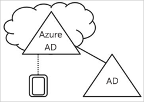
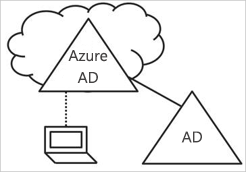
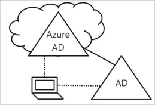

# Wat is apparaatbeheer in Azure Active Directory?

In een wereld waar mobiliteit en cloud belangrijke begrippen zijn, maakt Azure Active Directory (Azure AD) eenmalige aanmelding bij apparaten, apps en services vanaf elke locatie mogelijk. Als gevolg van een toenemend aantal apparaten, waaronder Bring Your Own Device (BYOD), hebben IT-professionals te maken met twee tegengestelde doelen:

- Geef de eindgebruikers de mogelijkheid overal en altijd productief te zijn
- Beveilig de zakelijke bezittingen - op elk moment

Uw gebruikers krijgen via apparaten toegang tot uw zakelijke assets. Om als ICT-beheerder uw bedrijfsassets te beschermen, hebt u controle over deze apparaten nodig. Zo kunt u ervoor zorgen dat uw gebruikers toegang tot uw bronnen hebben vanaf apparaten die voldoen aan uw normen voor beveiliging en naleving. 

Apparaatbeheer vormt ook de basis voor [scenario's met apparaatgebaseerde voorwaardelijke toegang](../conditional-access/require-managed-devices.md). Met voorwaardelijke toegang op basis van apparaat kunt u ervoor zorgen dat toegang tot bronnen in uw omgeving alleen mogelijk is met beheerde apparaten.   

In dit artikel wordt uitgelegd hoe apparaatbeheer in Azure Active Directory werkt.

## Apparaten onder het beheer van Azure AD krijgen

Om een apparaat onder het beheer van Azure AD te krijgen, hebt u twee opties:

- Registratie 
- Koppeling

**Registratie** van een apparaat bij Azure AD stelt u in staat de identiteit van een apparaat te beheren. Wanneer een apparaat is geregistreerd, geeft Azure AD-apparaatregistratie het apparaat een identiteit die wordt gebruikt om het apparaat te verifiëren wanneer een gebruiker zich aanmeldt bij Azure AD. U kunt de identiteit gebruiken om een apparaat in of uit te schakelen.

In combinatie met een MDM-oplossing (Mobile Device Management), zoals Microsoft Intune, worden de apparaatkenmerken in Azure AD bijgewerkt met extra informatie over het apparaat. Hiermee kunt u extra regels voor voorwaardelijke toegang maken die toegang afdwingen van apparaten, zodat ze voldoen aan uw standaarden voor beveiliging en compliance Zie ‘Apparaten inschrijven voor beheer in Intune’ voor meer informatie over het inschrijven van apparaten in Microsoft Intune.

**Koppeling** van een apparaat is een uitbreiding van registratie van een apparaat. Dit betekent dat u niet alleen alle voordelen van registratie krijgt, maar ook dat de lokale status van een apparaat wordt gewijzigd. Wijziging van de lokale status stelt uw gebruikers in staat zich bij een apparaat aan te melden met behulp van een werk- of schoolaccount in plaats van een persoonlijk account.

## Azure AD-geregistreerde apparaten   

Het doel van Azure AD-geregistreerde apparaten is u ondersteuning te bieden voor het scenario van **Bring Your Own Device (BYOD)**. In dit scenario kan een gebruiker via een persoonlijk apparaat toegang verkrijgen tot de Azure Active Directory-beheerde bronnen van uw organisatie.  

De toegang is gebaseerd op een werk- of schoolaccount dat op het apparaat is ingevoerd.  
Windows 10 stelt gebruikers bijvoorbeeld in staat een werk- of schoolaccount aan een persoonlijke computer, tablet of telefoon toe te voegen.  
Wanneer een gebruiker een werk- of schoolaccount heeft toegevoegd, wordt het apparaat geregistreerd bij Azure AD en optioneel ingeschreven in het MDM-systeem (Mobile Device Management) dat uw organisatie heeft geconfigureerd. De gebruikers van uw organisatie kunnen gemakkelijk een werk- of schoolaccount aan een persoonlijk apparaat toevoegen:

- Wanneer ze een werktoepassing voor het eerst openen
- Handmatig via het menu **Instellingen** in het geval van Windows 10 

U kunt Azure AD-geregistreerde apparaten configureren voor Windows 10, iOS, Android en macOS.

## Azure AD-gekoppelde apparaten

Het doel van Azure AD-gekoppelde apparaten is vereenvoudiging van:

- Windows-implementaties van apparaten die eigendom van het bedrijf zijn 
- Toegang tot apps en bronnen van de organisatie vanaf elk Windows-apparaat
- Cloudgebaseerd beheer van apparaten die eigendom van het bedrijf zijn

Azure AD-koppeling kan via een van de volgende methoden worden geïmplementeerd: 
 - [Windows AutoPilot](https://docs.microsoft.com/windows/deployment/windows-autopilot/windows-10-autopilot)
 - [Bulkimplementatie](https://docs.microsoft.com/intune/windows-bulk-enroll)
 - [Selfservice-ervaring](azuread-joined-devices-frx.md) 

**Azure AD-koppeling** is bedoeld voor organisaties die cloud-first willen zijn (d.w.z. die voornamelijk cloudservices willen gebruiken, met als doel on-premises infrastructuur steeds minder te gebruiken) of die cloud-only willen zijn (d.w.z. die geen on-premises infrastructuur willen gebruiken). Azure AD-koppeling kan worden geïmplementeerd door organisaties van elke omvang en elk type. Azure AD-koppeling werkt zelfs goed in een hybride omgeving, met toegang tot apps en bronnen in zowel de cloud als on-premises.

Door Azure AD-gekoppelde apparaten te implementeren, profiteert u van de volgende voordelen:

- **Eenmalige aanmelding** bij uw Azure-beheerde SaaS-apps en -services. Uw gebruikers zien geen aanvullende verificatieprompts wanneer ze werkbronnen openen. De functionaliteit voor eenmalige aanmelding is zelfs beschikbaar wanneer ze geen verbinding met het domeinnetwerk hebben.

- **Enterprise Compliant Roaming** van gebruikersinstellingen op alle gekoppelde apparaten. Gebruikers hoeven geen Microsoft-account (bijvoorbeeld Hotmail) te verbinden om instellingen op alle apparaten te kunnen zien.

- **Toegang tot Windows Store voor Bedrijven** met behulp van een Azure AD-account. Uw gebruikers kunnen kiezen uit verschillende toepassingen die vooraf zijn geselecteerd door de organisatie.

- **Windows Hello**-ondersteuning voor veilige en handige toegang tot werkbronnen.

- **App-toegang die is beperkt** tot alleen apparaten die aan nalevingsbeleid voldoen.

- **Naadloze toegang tot on-premises bronnen** wanneer het apparaat verbinding heeft met de on-premises domeincontroller. 

Hoewel Azure AD-koppeling voornamelijk is bedoeld voor organisaties die geen on-premises Windows Server Active Directory-infrastructuur hebben, kunt u dit beslist gebruiken in scenario’s waarbij:

- U wilt overstappen op cloudgebaseerde infrastructuur met behulp van Azure AD en MDM zoals Intune.

- U geen on-premises domeinkoppeling kunt gebruiken, bijvoorbeeld als u mobiele apparaten zoals tablets en telefoons onder controle moet krijgen.

- Uw gebruikers voornamelijk toegang nodig hebben tot Office 365 of andere SaaS-apps die zijn geïntegreerd met Azure AD.

- U een groep gebruikers in Azure AD wilt beheren in plaats van in Active Directory. Dit kan bijvoorbeeld van toepassing zijn op seizoenswerkers, aannemers of leerlingen/studenten.

- U koppelingsmogelijkheden wilt bieden aan medewerkers in externe filialen met beperkte on-premises infrastructuur.

U kunt Azure AD-gekoppelde apparaten configureren voor Windows 10-apparaten.

## Hybride Azure AD-gekoppelde apparaten

Al meer dan tien jaar gebruiken vele organisaties de domeinkoppeling naar hun on-premises Active Directory om:

- IT-afdelingen vanaf een centrale locatie apparaten te laten beheren die eigendom van het bedrijf zijn.

- Gebruikers zich bij hun apparaat te laten aanmelden met hun Active Directory-werkaccount of -schoolaccount. 

Organisaties met een on-premises voetafdruk zijn meestal afhankelijk van imaging-methoden om apparaten in te richten, en gebruiken vaak **System Center Configuration Manager (SCCM)** of **groepsbeleid (GP)** om ze te beheren.

Als uw omgeving een on-premises AD-voetafdruk heeft en u ook wilt profiteren van de mogelijkheden die Azure Active Directory biedt, kunt u hybride Azure AD-gekoppelde apparaten implementeren. Dit zijn apparaten die aan uw on-premises Active Directory zijn gekoppeld en die zijn geregistreerd bij uw Azure Active Directory.

U moet hybride Azure AD-gekoppelde apparaten gebruiken als:

- U Win32-apps op deze apparaten hebt geïmplementeerd die afhankelijk zijn van Active Directory-machineverificatie.

- U groepsbeleid nodig hebt om apparaten te beheren.

- U imaging-oplossingen wilt blijven gebruiken om apparaten voor uw werknemers te configureren.

U kunt hybride Azure AD-gekoppelde apparaten configureren voor Windows 10 en voor downlevel apparaten zoals Windows 8 en Windows 7.

## Samenvatting

Met apparaatbeheer in Azure AD kunt u: 

- Het proces vereenvoudigen om apparaten onder het beheer van Azure AD te krijgen

- Uw gebruikers gemakkelijke toegang tot de cloudgebaseerde bronnen van uw organisatie bieden

Als vuistregel geldt:

- Gebruik Azure AD-geregistreerde apparaten:

    - Voor persoonlijke apparaten 

    - Om apparaten handmatig te registreren bij Azure AD

- Gebruik Azure AD-gekoppelde apparaten: 

    - Voor apparaten die eigendom van uw organisatie zijn

    - Voor apparaten die **niet** zijn gekoppeld aan een on-premises AD

    - Om apparaten handmatig te registreren bij Azure AD

    - Om de lokale status van een apparaat te wijzigen

- Gebruik hybride Azure AD-gekoppelde apparaten:     

    - Voor apparaten die eigendom van uw organisatie zijn

    - Voor apparaten die zijn gekoppeld aan een on-premises AD

    - Om apparaten automatisch te registreren bij Azure AD

    - Om de lokale status van een apparaat te wijzigen

## Volgende stappen

- Zie [Apparaten beheren met behulp van de Azure-portal](device-management-azure-portal.md) voor een overzicht van hoe u apparaten in de Azure-portal kunt beheren.

- Zie [Beleid configureren voor apparaatgebaseerde voorwaardelijke toegang van Azure Active Directory](../conditional-access/require-managed-devices.md) voor meer informatie over apparaatgebaseerde voorwaardelijke toegang.

- Voor het instellen van:
    - Azure Active Directory-geregisteerde Windows 10-apparaten raadpleegt u [Azure Active Directory-geregistreerde Windows 10-apparaten configureren](../user-help/device-management-azuread-registered-devices-windows10-setup.md).
    - Azure Active Directory-gekoppelde apparaten raadpleegt u [Azure Active Directory-gekoppelde apparaten configureren](../user-help/device-management-azuread-joined-devices-setup.md).
    - Hybride Azure AD-gekoppelde apparaten raadpleegt u [De implementatie van uw hybride Azure Active Directory-koppeling plannen](hybrid-azuread-join-plan.md).

