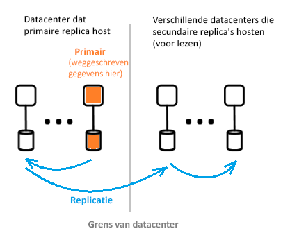

# Wat is de Azure Active Directory-architectuur?
Met Azure AD (Azure Active Directory) kunt u veilig de toegang tot Azure-services en -resources beheren voor uw gebruikers. Azure AD omvat een volledige suite met mogelijkheden voor identiteitsbeheer. Zie [Wat is Azure Active Directory?](active-directory-whatis.md) voor meer informatie over de functies van Azure AD.

Met Azure AD kunt u gebruikers en groepen maken en beheren, en machtigingen inschakelen om toegang tot bedrijfsresources te verlenen of te weigeren. Zie [De grondbeginselen van Azure-identiteitsbeheer](active-directory-whatis.md) voor meer informatie over identiteitsbeheer.

## Azure AD-architectuur
Geografisch verspreide architectuur van Azure AD combineert uitgebreide controle, geautomatiseerde omleidingen, failover en herstel mogelijkheden, die het hele bedrijf beschikbaarheid en prestaties aan klanten leveren.

In dit artikel worden de volgende elementen van de architectuur besproken:
 *  Servicearchitectuurontwerp
 *  Schaalbaarheid
 *  Continue beschikbaarheid
 *  Datacenters

### Servicearchitectuurontwerp
De meest voorkomende manier om een toegankelijk en bruikbaar, gegevens systeem te maken, is via onafhankelijke bouw stenen of schaal eenheden. Schaal eenheden van de Azure AD-gegevenslaag worden *partities*genoemd. 

De gegevenslaag heeft meerdere front-end-services die mogelijkheden bieden voor lezen/schrijven. In het onderstaande diagram ziet u hoe de onderdelen van een partitie met één map worden geleverd in geografisch verspreide data centers. 

  

De onderdelen van Azure AD-architectuur omvatten een primaire replica en secundaire replica's.

**Primaire replica**

De *primaire replica* ontvangt alle *schrijfbewerkingen* voor de partitie waarbij deze hoort. Alle schrijfbewerkingen worden onmiddellijk gerepliceerd naar een secundaire replica in een ander datacenter, voordat de aanroeper een melding van slagen ontvangt. Op deze manier wordt de geografisch redundante duurzaamheid van schrijfbewerkingen verzekerd.

**Secundaire replica's**

Alle Active Directory- *Lees bewerkingen* worden uitgevoerd vanuit *secundaire replica's*, die zich bevinden in data centers die zich fysiek in verschillende geografs. Er zijn veel secundaire replica's, omdat gegevens asynchroon worden gerepliceerd. Directory-Lees bewerkingen, zoals verificatie aanvragen, worden verwerkt vanuit data centers die zich dicht bij klanten bevinden. De secundaire replica's zijn verantwoordelijk voor de schaalbaarheid van leesbewerkingen.

### Schaalbaarheid

Schaalbaarheid is de mogelijkheid van een service om uit te breiden en zo te voldoen aan groeiende prestatievereisten. Schaalbaarheid van schrijfbewerkingen wordt bereikt door de gegevens te partitioneren. Schaalbaarheid van leesbewerkingen wordt bereikt door gegevens uit één partitie te repliceren naar meerdere secundaire replica's over de hele wereld.

Aanvragen van directory-toepassingen worden doorgestuurd naar het datacenter waar ze zich fysiek die het dichtst bij. Schrijfbewerkingen worden transparant omgeleid naar de primaire replica voor lees-/schrijfconsistentie. Secundaire replica's breiden de schaal van partities aanzienlijk uit, omdat in de mappen doorgaans leesbewerkingen worden afgehandeld.

Directory-toepassingen maken verbinding met de dichtstbijzijnde datacenters. Deze verbinding verbetert de prestaties en uitschalen is mogelijk. Omdat een mappartitie meerdere secundaire replica's kan hebben, kunnen deze secundaire replica's dichter bij Directory-clients worden geplaatst. Alleen interne Directory-serviceonderdelen die veel schrijfbewerkingen afhandelen, zijn rechtstreeks gericht op de actieve primaire replica.

### Continue beschikbaarheid

Beschikbaarheid (of bedrijfstijd) definieert de mogelijkheid van een systeem om ononderbroken actief te zijn. De sleutel tot de hoge Beschik baarheid van Azure AD is dat de services snel verkeer kunnen verplaatsen over meerdere geografisch gedistribueerde data centers. Elk Data Center is onafhankelijk, waarmee niet-gerelateerde fout modi worden ingeschakeld. Azure AD heeft via dit ontwerp voor hoge Beschik baarheid geen downtime voor onderhouds activiteiten.

Ontwerp van Azure AD-partities is vereenvoudigd in vergelijking met de enterprise AD ontwerp met behulp van een single-master-ontwerp dat een primaire replica voor zorgvuldig Geregisseerd en deterministisch failoverproces omvat.

**Fouttolerantie**

Een systeem is beschikbaarder als het tolerant is voor fouten in hardware, software en het netwerk. Voor elke partitie in de directory bestaat een Maxi maal beschik bare hoofd replica: De primaire replica. Op deze replica worden alleen schrijfbewerkingen naar de partitie uitgevoerd. Deze replica wordt voortdurend en nauwlettend gecontroleerd. Indien er een fout wordt gedetecteerd, kunnen schrijfbewerkingen onmiddellijk worden verplaatst naar een andere replica (die dan de nieuwe primaire replica wordt). Tijdens de failover kan er een verlies van schrijfbeschikbaarheid optreden. Dit duurt meestal maar 1-2 minuten. De leesbeschikbaarheid wordt gedurende deze tijd niet beïnvloed.

Leesbewerkingen (die vele malen vaker voorkomen dan schrijfbewerkingen) worden alleen opgeslagen in secundaire replica's. Aangezien secundaire replica's idempotent zijn, kan het verlies van een van de replica's in een bepaalde partitie eenvoudig worden gecompenseerd door de leesbewerkingen naar een andere replica te leiden. Meestal is dit dan een replica in hetzelfde datacenter.

**Duurzaamheid van gegevens**

Er wordt een schrijf bewerking naar ten minste twee data centers doorgevoerd voordat deze wordt bevestigd. Dit gebeurt door eerst de schrijf bewerking op de primaire uit te voeren en vervolgens onmiddellijk de schrijf bewerking naar ten minste één ander Data Center te repliceren. Met deze schrijf actie zorgt u ervoor dat het Data Center dat als host optreedt van de primaire computer geen gegevens verlies oplevert.

Azure AD onderhoudt een nul [Recovery Time Objective (RTO)](https://en.wikipedia.org/wiki/Recovery_time_objective) niet gegevensverlies tijdens failovers. Dit omvat:
-  Token-uitgifte en leesbewerkingen in een map
-  Zodat u slechts circa 5 minuten RTO voor directory-schrijfbewerkingen

### Datacenters

Azure AD-replica's worden opgeslagen in datacenters over de hele wereld. Zie [Azure Global Infrastructure](https://azure.microsoft.com/global-infrastructure/)(Engelstalig) voor meer informatie.

Azure AD werkt in data centers met de volgende kenmerken:

 * Verificatie, Graph en andere AD-services bevinden zich achter de Gateway-service. De taakverdeling van deze services wordt via de gateway beheerd. Dit wordt automatische failover als een beschadigde servers worden gedetecteerd via transactionele tests. Op basis van deze status tests stuurt de gateway dynamisch verkeer naar gezonde data centers.
 * Voor *Lees bewerkingen*heeft de Directory secundaire replica's en bijbehorende front-end-services in een actief-actief configuratie in meerdere data centers. Als er een fout optreedt in een volledig Data Center, wordt verkeer automatisch doorgestuurd naar een ander Data Center.
 *  Voor *schrijf bewerkingen*voert de Directory failover uit voor de primaire (hoofd replica) in data centers via gepland (nieuwe primaire server wordt gesynchroniseerd met oude primaire) of procedures voor nood failover. De duurzaamheid van gegevens wordt bereikt door een door voering te repliceren naar ten minste twee data centers.

**Gegevensconsistentie**

Het model van de directory is een van de uiteindelijke consistenties. Een typisch probleem met verspreide asynchrone replicatiesystemen is dat de gegevens die worden geretourneerd van een "name" replica niet bijgewerkt zijn kan. 

Met behulp van een secundaire replica biedt Azure AD lees-/schrijfconsistentie voor toepassingen door schrijfbewerkingen naar de primaire replica te leiden en ze tegelijkertijd terug te halen naar de secundaire replica.

Voor toepassingsschrijfbewerkingen met behulp van de Graph-API of Azure AD wordt geen affiniteit onderhouden met een mapreplica voor lees-/schrijfconsistentie. De Azure AD Graph-service onderhoudt een logische sessie die affiniteit heeft met een secundaire replica die wordt gebruikt voor lees bewerkingen. affiniteit wordt vastgelegd in een ' replica token ' dat door de Graph service wordt opgeslagen in de cache van een gedistribueerde cache in het secundaire Data Center. Dit token wordt vervolgens gebruikt voor verdere bewerkingen in dezelfde logische sessie. Om dezelfde logische sessie te blijven gebruiken, moeten volgende aanvragen worden doorgestuurd naar hetzelfde Azure AD-Data Center. Het is niet mogelijk om door te gaan met een logische sessie als de aanvragen van de Directory-client worden doorgestuurd naar meerdere Azure AD-data centers. Als dit gebeurt, heeft de client meerdere logische sessies met een onafhankelijke consistenties voor lezen/schrijven.

 >[!NOTE]
 >Schrijfbewerkingen worden onmiddellijk gerepliceerd naar de secundaire replica waarop de leesbewerkingen van de logische sessie zijn weggeschreven.
 >

**Back-upbeveiliging**

De map implementeert voorlopig verwijderen, in plaats van definitief, voor gebruikers en tenants, wat eenvoudig herstel mogelijk maakt wanneer items per ongeluk worden verwijderd door een klant. Als uw tenantbeheerder per ongeluk gebruikers verwijdert, kunnen ze gemakkelijk ongedaan maken en de verwijderde gebruikers terugzetten. 

Met Azure AD worden dagelijkse back-ups van alle gegevens geïmplementeerd. Daarom kunnen gegevens bindend worden teruggezet in het geval van logische verwijderingen of beschadigingen. De gegevenslaag maakt gebruik van fouten corrigeren codes, zodat deze kan controleren op fouten en bepaalde typen schijffouten automatisch worden gecorrigeerd.

**Metrische gegevens en controles**

Voor het uitvoeren van een service met een hoge beschikbaarheid zijn uitstekende mogelijkheden voor metrische gegevens en controle vereist. Met Azure AD worden belangrijke metrische gegevens met betrekking tot de status van de service voortdurend geanalyseerd voor elk van de services. Er is ook doorlopende ontwikkeling en het afstemmen van metrische gegevens en het bewaking en waarschuwingen voor elk scenario, binnen elke Azure AD-service en tussen alle services.

Als een Azure AD-service niet werkt zoals verwacht, wordt onmiddellijk actie ondernomen om de functionaliteit zo snel mogelijk te herstellen. De belangrijkste metrische gegevens van Azure AD-sporen is hoe snel live site problemen kunnen worden gedetecteerd en verholpen voor klanten. We investeren veel in controle en waarschuwingen om de detectietijd (TTD-doel: < 5 minuten) te minimaliseren en in operationele paraatheid om de hersteltijd (TTM-doel: < 30 minuten) zo kort mogelijk te houden.

**Veilige bewerkingen**

Met behulp van operationele besturingselementen zoals multi-factor authentication (MFA) voor elke bewerking, evenals controle van alle bewerkingen. Bovendien met behulp van een just-in-time-elevationsysteem om benodigde tijdelijke toegang voor alle operationele taken op aanvraag regelmatig te verlenen. Zie [De vertrouwde cloud](https://azure.microsoft.com/support/trust-center) voor meer informatie.

## Volgende stappen
[Ontwikkelaarshandleiding voor Azure Active Directory](https://docs.microsoft.com/azure/active-directory/develop/active-directory-developers-guide)

