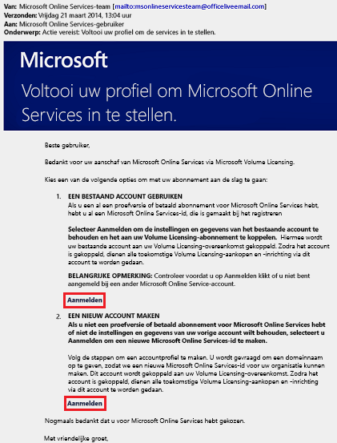
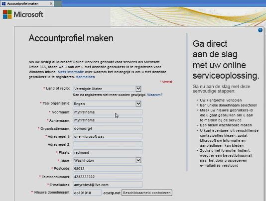
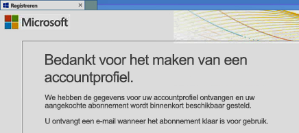
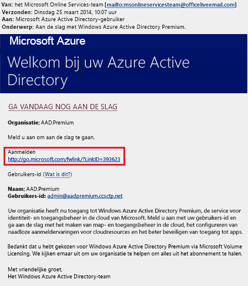
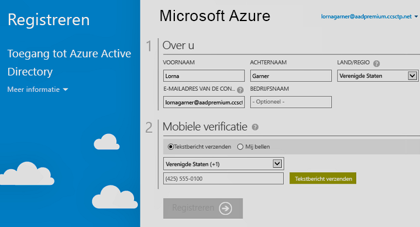

# Registreren voor Azure Active Directory Premium-edities
U kunt Azure Active Directory (Azure AD) Premium-edities kopen en deze koppelen aan uw Azure-abonnement. Als u een nieuw Azure-abonnement moet maken, moet u ook uw licentieabonnement en toegang tot de Azure AD-service activeren.

> [!NOTE]
>De Azure AD-edities Premium en Basic zijn beschikbaar voor klanten in China via het wereldwijde exemplaar van Azure Active Directory. De Azure AD Premium en Basic-edities worden momenteel niet ondersteund in de Azure-service die wordt beheerd door 21Vianet in China. Neem contact met ons op via het [Azure Active Directory Forum](https://feedback.azure.com/forums/169401-azure-active-directory/) voor meer informatie.

Voordat u zich aanmeldt voor Active Directory Premium 1 of Premium 2, moet u eerst bepalen welke van uw bestaande abonnement of plan te gebruiken:

- Via uw bestaande Azure of Office 365-abonnement

- Via uw Enterprise Mobility + Security-licentieplan

- Via een Microsoft Volume-licentieplan

Aanmelden met uw Azure-abonnement met de Azure AD-licenties die eerder werden gekocht en geactiveerd, activeert automatisch de licenties in dezelfde map. Als dat niet het geval is, moet u nog steeds uw licentieplan en uw Azure AD-toegang activeren. Zie voor meer informatie over het activeren van uw licentieplan [Uw nieuwe licentieplan activeren](#activate-your-new-license-plan). Zie voor meer informatie over het activeren van de Azure AD-toegang [De Azure AD-toegang activeren](#activate-your-azure-ad-access). 

## Aanmelden met behulp van uw bestaande Azure of Office 365-abonnement
Als abonnee van Azure of Office 365 kunt u Azure Active Directory Premium-edities online kopen. Zie [How to Purchase Azure Active Directory Premium - Existing Customers](https://channel9.msdn.com/Series/Azure-Active-Directory-Videos-Demos/How-to-Purchase-Azure-Active-Directory-Premium-Existing-Customer) (Azure Active Directory Premium aanschaffen - bestaande klanten) of [How to Purchase Azure Active Directory Premium - New Customers](https://channel9.msdn.com/Series/Azure-Active-Directory-Videos-Demos/How-to-Purchase-Azure-Active-Directory-Premium-New-Customers) (Azure Active Directory Premium aanschaffen - nieuwe klanten) voor gedetailleerde instructies.

## Aanmelding met behulp van uw Enterprise Mobility + Security-licentieplan
Enterprise Mobility + Security is een suite, bestaande uit Azure AD Premium, Azure Information Protection en Microsoft Intune. U kunt aan de slag met Azure AD als u al een EMS-licentie hebt met een van de volgende licentieopties:

Zie de [Enterprise Mobility + Security website ](https://www.microsoft.com/cloud-platform/enterprise-mobility-security) voor meer informatie over EMS.

- EMS uitproberen met een gratis [proefabonnement voor Enterprise Mobility + Security E5](https://signup.microsoft.com/Signup?OfferId=87dd2714-d452-48a0-a809-d2f58c4f68b7&ali=1)

- [Enterprise Mobility + Security E5-licenties](https://signup.microsoft.com/Signup?OfferId=e6de2192-536a-4dc3-afdc-9e2602b6c790&ali=1) kopen

- [Enterprise Mobility + Security E3-licenties](https://signup.microsoft.com/Signup?OfferId=4BBA281F-95E8-4136-8B0F-037D6062F54C&ali=1) kopen

## Aanmelden met behulp van uw Microsoft Volume-licentieplan
Via uw Microsoft Volume Licensing-plan kunt u zich registreren voor Azure AD Premium met een van deze twee programma's, op basis van het aantal licenties dat u wilt ophalen:

- **Voor 250 of meer licenties.** [Microsoft Enterprise Agreement](https://www.microsoft.com/en-us/licensing/licensing-programs/enterprise.aspx)

- **Voor 5-250 licenties.** [Open Volume License](https://www.microsoft.com/en-us/licensing/licensing-programs/open-license.aspx)

Ga naar de pagina [Een licentie kopen via Volume Licensing](https://www.microsoft.com/en-us/licensing/how-to-buy/how-to-buy.aspx) voor meer informatie over de opties voor het kopen van volumelicenties.

## Uw nieuw licentieplan activeren
Als u zich hebt aangemeld met behulp van een nieuw Azure AD-licentieplan, moet u deze activeren voor uw organisatie, met behulp van de bevestigingse-mail verzonden na de aankoop.

### Uw licentieplan activeren
- Open de bevestigingse-mail die u van Microsoft hebt ontvangen nadat u zich hebt geregistreerd, en klik dan ofwel op **Aanmelden** of **Registreren**.
   
    

    - **Aanmelden.** Als u een bestaande tenant hebt, klikt u op deze link, en vervolgens meldt u zich aan met uw bestaande administrator-account. U moet een globale beheerder zijn van de tenant waarin de licenties worden geactiveerd.

    - **Registreren.** Als u een nieuwe Azure AD-tenant wilt maken voor gebruik met uw licentieplan, klikt u op deze link om de pagina **Accountprofiel maken** te openen.

        

Wanneer u klaar bent, ziet u een bevestigingsvenster met dank voor het activeren van het licentieplan voor uw tenant.

## De Azure AD-toegang activeren
Als u nieuwe Azure AD Premium-licenties wilt toevoegen aan een bestaand abonnement, moet de Azure AD-toegang al zijn geactiveerd. Anders moet u Azure AD-toegang activeren nadat u het **welkomstbericht** hebt ontvangen.  

Nadat uw aangekochte licenties in uw map zijn ingericht, ontvangt u een **Welkomstbericht**. In dit e-mailbericht wordt bevestigd dat u de Azure AD Premium- of Enterprise Mobility + Security-licenties en -functies nu kunt beheren. 

> [!TIP]
> U krijgt geen toegang tot Azure AD voor de nieuwe tenant totdat u de Azure AD-maptoegang activeert uit het welkomstbericht.

### De Azure AD-toegang activeren

1. Open het **Welkomstbericht**, en klik vervolgens op **Aanmelden**.
   
    

2. Na de aanmelding, gaat u door met verificatie in twee stappen met behulp van een mobiel apparaat.
   
    

Het activeringsproces duurt meestal slechts een paar minuten en vervolgens kunt u uw Azure AD-tenant gebruiken. 

## Volgende stappen
Nu dat u Azure AD Premium hebt, kunt u [uw domein aanpassen](add-custom-domain.md), uw [zakelijk merk](customize-branding.md) toevoegen, [een tenant maken](active-directory-access-create-new-tenant.md), en [groepen toevoegen](active-directory-groups-create-azure-portal.md) en [gebruikers](add-users-azure-active-directory.md).
