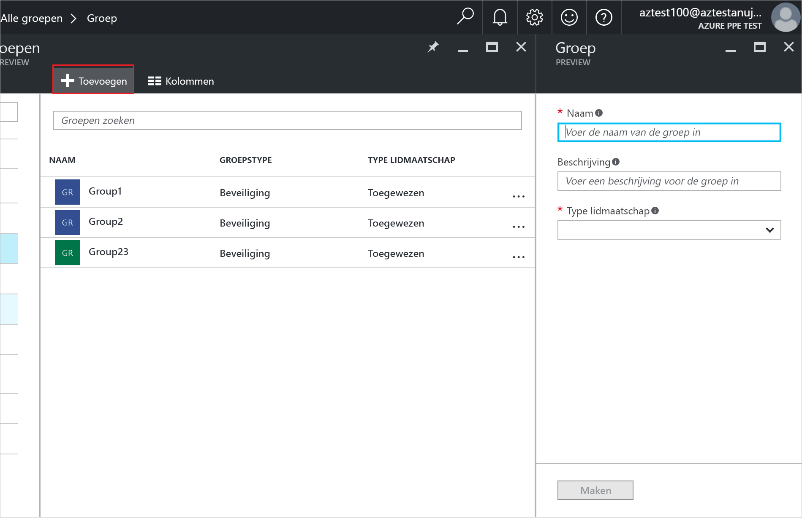
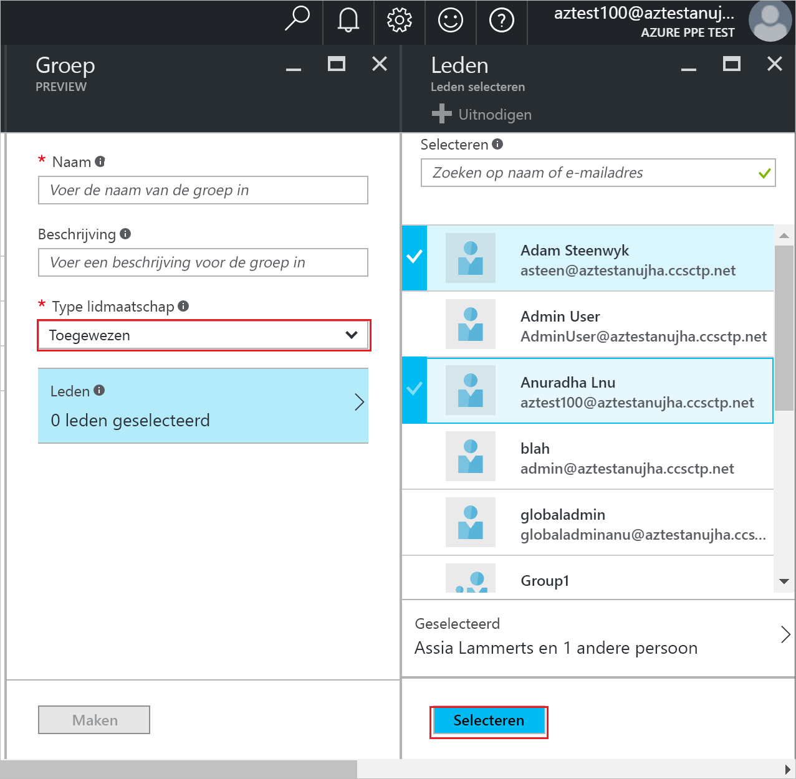
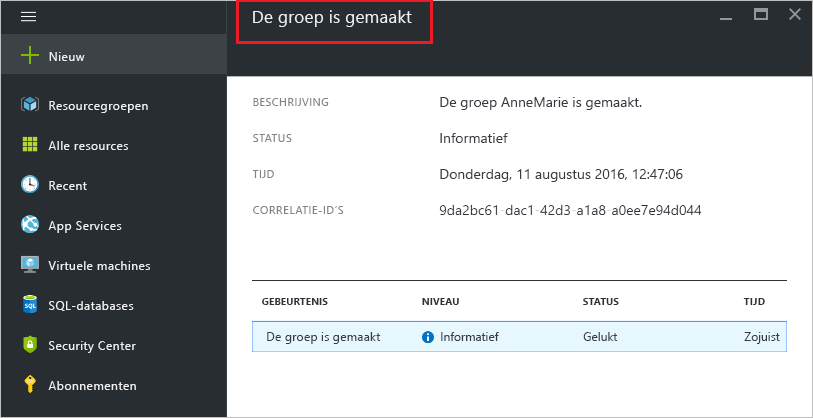

# Een groep maken en leden toevoegen in Azure Active Directory
> [!div class="op_single_selector"]
> * [Azure Portal](active-directory-groups-create-azure-portal.md)
> * [PowerShell](../users-groups-roles/groups-settings-v2-cmdlets.md)

In dit artikel wordt uitgelegd hoe u een nieuwe groep maakt en vult in Azure Active Directory. U gebruikt een groep om beheertaken uit te voeren zoals het toewijzen van licenties of machtigingen aan een aantal gebruikers of apparaten tegelijk.

## Hoe maak ik een groep?
1. Meld u aan bij [Azure Portal](https://portal.azure.com) met een account van een globale beheerder voor de directory.
2. Selecteer **Alle services**, typ **Gebruikers en groepen** in het tekstvak en druk op **Enter**

   
3. Selecteer **Alle groepen** op de blade **Gebruikers en groepen**.

   
4. Selecteer de opdracht **Toevoegen** op de blade **Gebruikers en groepen - alle groepen**.

   
5. Voeg op de blade **Groep** een naam en beschrijving toe voor de groep.
6. U kunt de leden selecteren die u wilt toevoegen aan de groep door **Toegewezen** te selecteren in de lijst **Type lidmaatschap** en vervolgens **Leden** te selecteren. Zie [Op kenmerken gebaseerde regels voor dynamisch groepslidmaatschap maken in Azure Active Directory](../active-directory-groups-dynamic-membership-azure-portal.md) voor meer informatie over het dynamisch beheren van het lidmaatschap van een groep.

   
7. Selecteer op de blade **Leden** een of meer gebruikers of apparaten die u wilt toevoegen aan de groep en selecteer vervolgens de knop **Selecteren** onderaan de blade om ze aan de groep toe te voegen. De lijst **Gebruiker** wordt gefilterd op basis van de overeenkomst van uw invoer met de volledige of gedeeltelijke naam van een gebruiker of apparaat. U kunt geen jokertekens gebruiken in de lijst.
8. Wanneer u klaar bent met het toevoegen van leden aan de groep, selecteert u **Maken** op de blade **Groep**.    

   

## Volgende stappen
Deze artikelen bevatten aanvullende informatie over Azure Active Directory.

* [Bestaande groepen weergeven](active-directory-groups-view-azure-portal.md)
* [Instellingen van een groep beheren](active-directory-groups-settings-azure-portal.md)
* [Leden van een groep beheren](active-directory-groups-members-azure-portal.md)
* [Lidmaatschappen van een groep beheren](active-directory-groups-membership-azure-portal.md)
* [Dynamische regels voor gebruikers in een groep beheren](../active-directory-groups-dynamic-membership-azure-portal.md)
