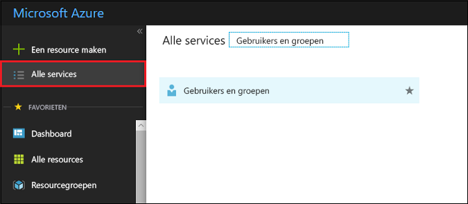
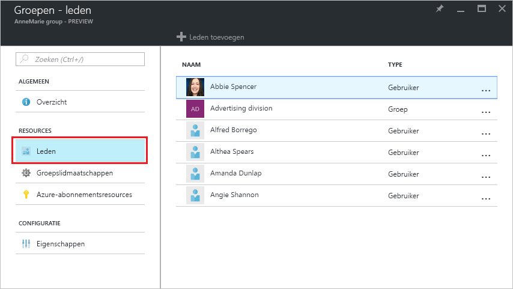
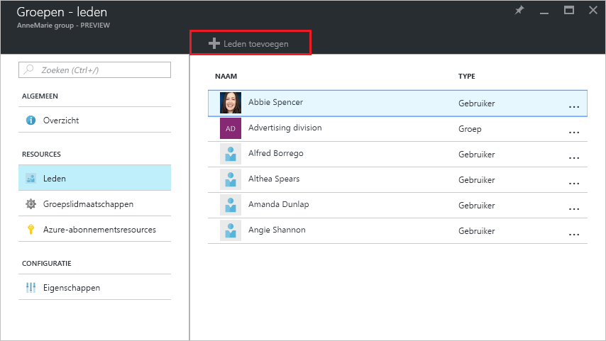
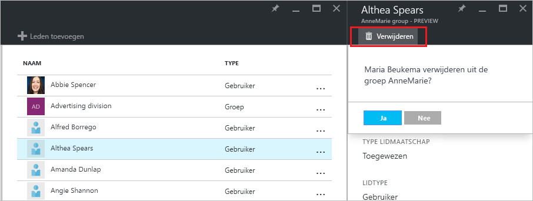

# Groepslidmaatschap beheren voor gebruikers in uw Azure Active Directory-tenant
In dit artikel wordt uitgelegd hoe u de leden van een groep beheert in Azure AD (Azure Active Directory).

## Hoe kan ik leden zoeken en ze beheren?
1. Meld u aan bij [Azure Portal](https://portal.azure.com) met een account van een globale beheerder voor de directory.
2. Selecteer **Alle services**, typ **Gebruikers en groepen** in het tekstvak en selecteer vervolgens **Enter**.

   
3. Selecteer **Alle groepen** op de blade **Gebruikers en groepen**.

   
4. Selecteer een groep op de blade **Gebruikers en groepen - alle groepen**.
5. Selecteer op de blade **Groepen - *groepsnaam*** de optie **Leden**.

   
6. Als u leden wilt toevoegen aan de groep, selecteert u op de blade **Groepen - leden** de optie **Leden toevoegen**.

   
7. Selecteer op de blade **Leden** een of meer gebruikers of apparaten die u wilt toevoegen aan de groep, en selecteer vervolgens onder aan de blade de knop **Selecteren** om ze aan de groep toe te voegen. Met het vak **Gebruiker** wordt de weergave gefilterd op basis van overeenkomsten tussen uw invoer en (een deel van) de naam van een gebruiker of apparaat. U kunt geen jokertekens gebruiken in dit vak.
8. Als u leden wilt verwijderen uit de groep, selecteert u een lid op de blade **Groep - leden**.
9. Selecteer op de blade **lidnaam** de opdracht ***Verwijderen*** en bevestig uw keuze wanneer u hierom wordt gevraagd.

   
10. Wanneer u klaar bent met het wijzigen van leden voor de groep, selecteert u **Opslaan**.

## Aanvullende informatie
Deze artikelen bevatten aanvullende informatie over Azure Active Directory.

* [Bestaande groepen weergeven](active-directory-groups-view-azure-portal.md)
* [Een nieuwe groep maken en leden toevoegen](active-directory-groups-create-azure-portal.md)
* [Instellingen van een groep beheren](active-directory-groups-settings-azure-portal.md)
* [Lidmaatschappen van een groep beheren](active-directory-groups-membership-azure-portal.md)
* [Dynamische regels voor gebruikers in een groep beheren](../users-groups-roles/groups-dynamic-membership.md)
