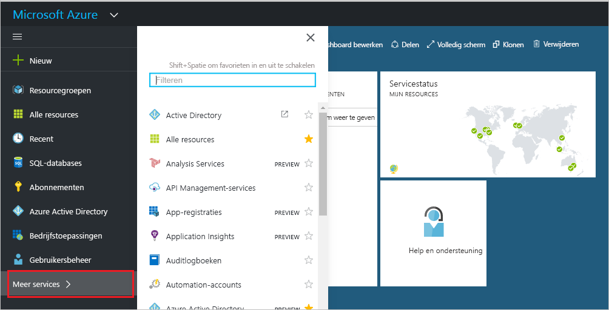
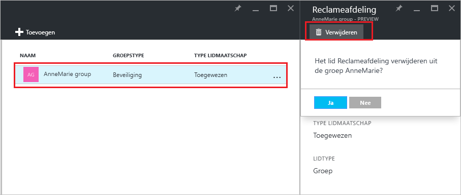

# Beheren bij welke groepen een groep hoort in uw Azure Active Directory-tenant
Groepen kunnen andere groepen bevatten in Azure Active Directory. Hier ziet u hoe u deze lidmaatschappen beheert.

## Hoe vind ik de groepen waarvan mijn groep lid is?
1. Meld u aan bij het [beheercentrum van Azure AD](https://aad.portal.azure.com) met een account met globale beheerdersrechten voor de directory.
2. Selecteer **Gebruikers en groepen**.

   
1. Selecteer **Alle groepen**.

   
1. Selecteer een groep.
2. Selecteer **Groepslidmaatschappen**.

   
1. Als u uw groep wilt toevoegen als lid van een andere groep, selecteert u op de blade **Groep - groepslidmaatschappen** de opdracht **Toevoegen**.
2. Selecteer een groep op de blade **Groep selecteren** en selecteer vervolgens onder aan de blade de knop **Selecteren**. U kunt uw groep slechts aan één groep tegelijk toevoegen. Met het vak **Gebruiker** wordt de weergave gefilterd op basis van overeenkomsten tussen uw invoer en (een deel van) de naam van een gebruiker of apparaat. U kunt geen jokertekens gebruiken in dit vak.

   
8. Als u uw groep wilt verwijderen als lid van een andere groep, selecteert u een groep op de blade **Groep - groepslidmaatschappen**.
9. Selecteer de opdracht **Verwijderen** en bevestig uw keuze wanneer u hierom wordt gevraagd.

   
10. Wanneer u klaar bent met het wijzigen van groepslidmaatschappen voor uw groep, selecteert u **Opslaan**.

## Aanvullende informatie
Deze artikelen bevatten aanvullende informatie over Azure Active Directory.

* [Bestaande groepen weergeven](active-directory-groups-view-azure-portal.md)
* [Een nieuwe groep maken en leden toevoegen](active-directory-groups-create-azure-portal.md)
* [Instellingen van een groep beheren](active-directory-groups-settings-azure-portal.md)
* [Leden van een groep beheren](active-directory-groups-members-azure-portal.md)
* [Dynamische regels voor gebruikers in een groep beheren](../users-groups-roles/groups-dynamic-membership.md)
