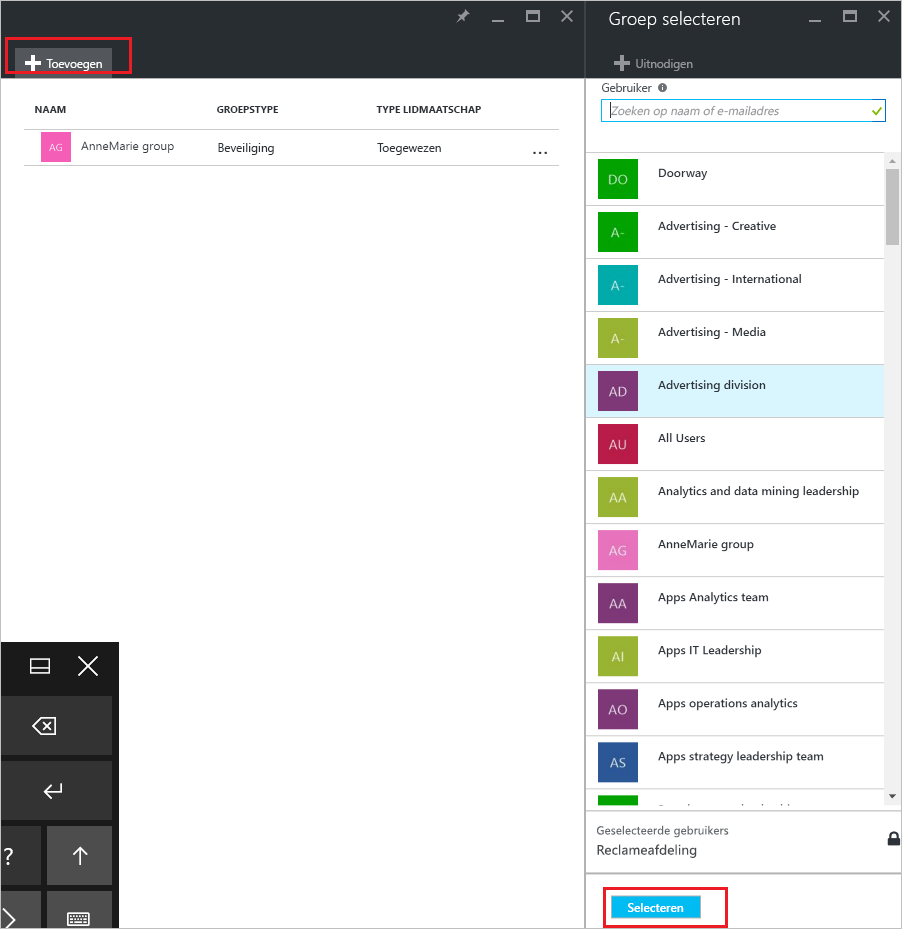
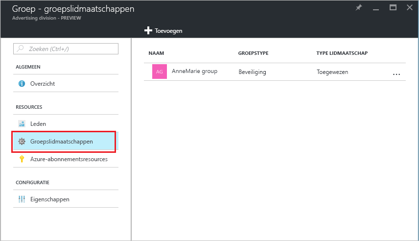

# Toevoegen of verwijderen van een groep uit een andere groep met behulp van Azure Active Directory
In dit artikel helpt u bij het toevoegen en verwijderen van een groep van een andere groep met behulp van Azure Active Directory.

>[!Note]
>Als u probeert te verwijderen van de bovenliggende groep, Zie [bijwerken of verwijderen van een groep en de bijbehorende leden](active-directory-groups-delete-group.md).

## Een groep toevoegen aan een andere groep
U kunt een bestaande beveiligingsgroep op een andere bestaande beveiligingsgroep (ook wel bekend als geneste groepen), het maken van een lid van groep (subgroep) en een bovenliggende groep toevoegen. De lid-groep neemt de kenmerken en eigenschappen van de bovenliggende groep, zodat u de configuratie.

>[!Important]
>Wordt momenteel niet ondersteund:<ul><li>Groepen toevoegen aan een groep gesynchroniseerd met on-premises Active Directory.</li><li>Beveiligingsgroepen toevoegen aan Office 365-groepen.</li><li>Office 365-groepen toevoegen aan beveiligingsgroepen of andere Office 365-groepen.</li><li>Apps toewijzen aan geneste groepen.</li><li>Licenties toepassen op geneste groepen.</li></ul>

### Een groep toevoegen als een lid van een andere groep

1. Meld u aan bij de [Azure Portal](https://portal.azure.com) met het account van een globale administrator voor de map.

2. Selecteer **Azure Active Directory**, en selecteer vervolgens **groepen**.

3. Op de **groepen - alle groepen** pagina, zoek en selecteer de groep die is lid van een andere groep. Voor deze oefening, gebruiken we de **MDM-beleid - West** groep.

    >[!Note]
    >U kunt uw groep als een lid toevoegen aan slechts één groep tegelijk. Bovendien de **groep selecteren** vak filteren op basis van die overeenkomen met uw inzending op een deel van de naam van een gebruiker of het apparaat weergegeven. Echter worden niet jokertekens ondersteund.

    

4. Op de **MDM - West - beleid groepslidmaatschappen** weergeeft, schakelt **groepslidmaatschappen**, selecteer **toevoegen**, zoek de groep die u wilt dat uw groep lid zijn van en kies vervolgens  **Selecteer**. Voor deze oefening, gebruiken we de **MDM-beleid - alle org** groep.

    De **MDM-beleid - West** groep is nu lid van de **MDM-beleid - alle org** groep, nemen alle eigenschappen en de configuratie van het beleid van de MDM - groep met alle org.

    

5. Controleer de **groepslidmaatschappen van MDM - West - beleid** pagina om te bekijken van de groep en lid relatie.

    

6. Voor een gedetailleerdere weergave van de groep en lid relatie, selecteer de naam van de (**MDM-beleid - alle org**) en bekijk de **MDM-beleid - West** pagina details.

    

## Een groep verwijderen uit een andere groep
U kunt een bestaande beveiligingsgroep verwijderen uit een andere beveiligingsgroep. Echter, de groep ook verwijdert, alle overgenomen kenmerken en de eigenschappen voor de leden.

### Een lid van groep te verwijderen uit een andere groep
1. Op de **groepen - alle groepen** pagina, zoek en selecteer de groep die moet worden verwijderd als een lid van een andere groep. Voor deze oefening opnieuw gebruiken we de **MDM-beleid - West** groep.

2. Op de **MDM-beleid - West-overzicht** weergeeft, schakelt **groepslidmaatschappen**.

    

3. Selecteer de **MDM-beleid - alle org** groep uit de **groepslidmaatschappen van MDM - West - beleid** pagina en selecteer vervolgens **verwijderen** van de **MDM-beleid - West** pagina details.

    

## Aanvullende informatie
Deze artikelen bevatten aanvullende informatie over Azure Active Directory.

- [Groepen en leden weergeven](active-directory-groups-view-azure-portal.md)

- [Een basisgroep maken en leden toevoegen](active-directory-groups-create-azure-portal.md)

- [Leden toevoegen of verwijderen uit een groep](active-directory-groups-members-azure-portal.md)

- [Instellingen van uw groep bewerken](active-directory-groups-settings-azure-portal.md)

- [Toegang tot SaaS-toepassingen beheren met behulp van een groep](../users-groups-roles/groups-saasapps.md)

- [Scenario's, beperkingen en bekende problemen met behulp van groepen beheren in Azure Active Directory-licentieverlening](../users-groups-roles/licensing-group-advanced.md#limitations-and-known-issues)
