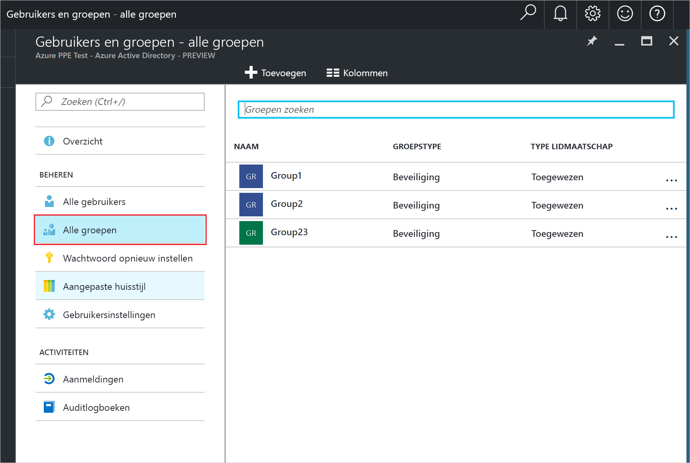
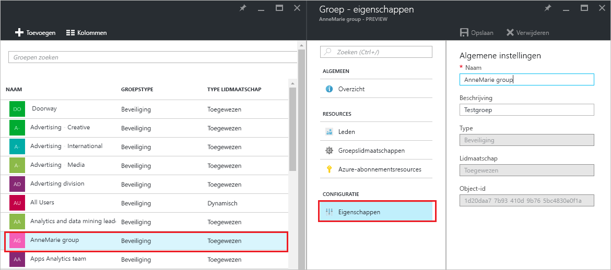
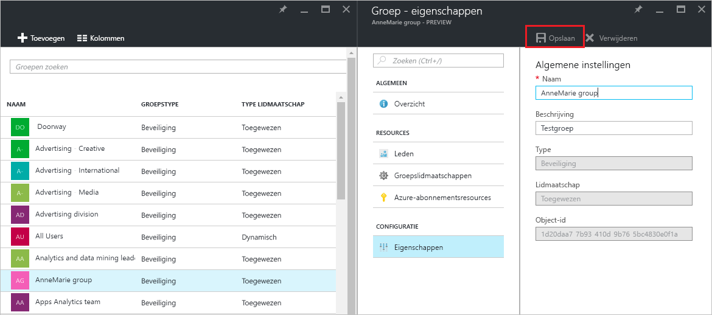

# De instellingen voor een groep in Azure Active Directory beheren
In dit artikel wordt uitgelegd hoe u de instellingen van een groep beheert in Azure AD (Azure Active Directory).

## Hoe kan ik de instellingen vinden en wijzigen?
1. Meld u aan bij het [beheercentrum van Azure AD](https://aad.portal.azure.com) met een account met globale beheerdersrechten voor de directory.
2. Selecteer **Alle services**, typ **Gebruikers en groepen** in het tekstvak en selecteer vervolgens **Enter**.

   
3. Selecteer **Alle groepen** op de blade **Gebruikers en groepen**.

   
4. Selecteer een groep op de blade **Gebruikers en groepen - alle groepen**.
5. Selecteer op de blade **Groepen - *groepsnaam*** de optie **Eigenschappen**.

   
6. Wanneer u klaar bent met het wijzigen van eigenschappen voor de groep, selecteert u **Opslaan**.    

   

## Volgende stappen
Deze artikelen bevatten aanvullende informatie over Azure Active Directory.

* [Bestaande groepen weergeven](active-directory-groups-view-azure-portal.md)
* [Een nieuwe groep maken en leden toevoegen](active-directory-groups-create-azure-portal.md)
* [Leden van een groep beheren](active-directory-groups-members-azure-portal.md)
* [Lidmaatschappen van een groep beheren](active-directory-groups-membership-azure-portal.md)
* [Dynamische regels voor gebruikers in een groep beheren](../users-groups-roles/groups-dynamic-membership.md)
