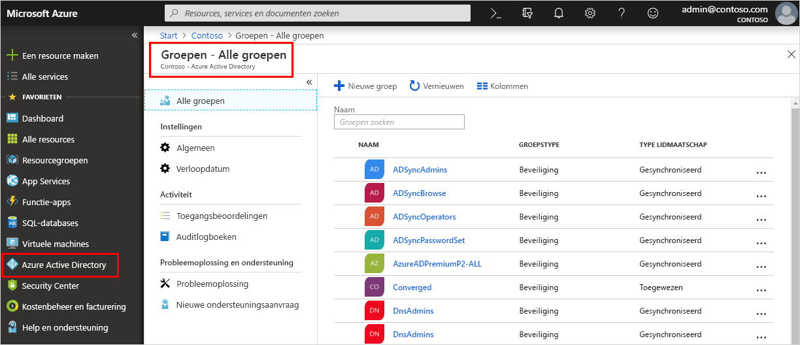

<!--As a brand-new Azure AD administrator, I need to view my organization’s groups along with the assigned members, so I can manage permissions to apps and services for people in my organization-->

# Snelstartgids: Groepen en groepsleden van uw organisatie weergeven in Azure Active Directory
U kunt de bestaande groepen en groepsleden van uw organisatie met de Azure-portal weergeven. Groepen worden gebruikt voor het beheren van gebruikers (leden) die allemaal dezelfde toegang en machtigingen nodig hebben voor mogelijk beperkte apps en services.

In deze snelstartgids gaat u alle bestaande groepen van uw organisatie weergeven en kijken welke leden deel uitmaken van de groepen.

Als u nog geen abonnement op Azure hebt, maakt u een [gratis account](https://azure.microsoft.com/free/) aan voordat u begint. 

## Vereisten
Voordat u begint, moet u het volgende doen:

- Een Azure Active Directory-tenant maken. Zie de snelstartgids [Access Azure Active Directory to create a new tenant](active-directory-access-create-new-tenant.md) (Nieuwe tenant maken met Azure Active Directory) voor meer informatie.

## Aanmelden bij Azure Portal
Meld u bij de [Azure-portal](https://portal.azure.com/) aan met het account van een globale beheerder voor de directory.

## Een nieuwe groep maken 
Maak een nieuwe groep, met de naam _MDM-beleid - West_. Zie [Een groep maken en leden toevoegen in Azure Active Directory](active-directory-groups-create-azure-portal.md) voor meer informatie over het maken van een groep.

1. Selecteer **Azure Active Directory**, **Groepen** en **Nieuwe groep**.

2. Vul de pagina **Groep** in:
    
    - **Groepstype:** Selecteer **Beveiliging**
    
    - **Groepsnaam:** Voer _MDM-beleid - West_ in
    
    - **Type lidmaatschap:** Selecteer **Toegewezen**.

3. Selecteer **Maken**.

## Een nieuwe gebruiker maken
Maak een nieuwe gebruiker met de naam _Alain Charon_. Een gebruiker moet bestaan voordat deze kan worden toegevoegd als een groepslid. Zie [Gebruikers toevoegen of verwijderen met Azure Active Directory](add-users-azure-active-directory.md) voor meer informatie over het maken van een gebruiker.

1. Selecteer **Azure Active Directory**, **Gebruikers** en **Nieuwe gebruiker**.

2. Vul de pagina **Gebruiker** in:

    - **Naam:** Voer _Alain Charon_ in.

    - **Gebruikersnaam:** Voer *alain@contoso.com* in.

3. Kopieer het automatisch gegenereerde wachtwoord in het vak **Wachtwoord** en selecteer vervolgens **Maken**.

## Een groepslid toevoegen
U hebt nu een groep en een gebruiker gemaakt. De volgende stap is dat we _Alain Charon_ als lid gaan toevoegen aan de groep _MDM-beleid - West_. Zie [Groepsleden toevoegen of verwijderen met Azure Active Directory](active-directory-groups-members-azure-portal.md) voor meer informatie over het toevoegen van groepsleden.

1. Selecteer **Azure Active Directory** > **Groepen**.

2. Zoek op de pagina **Groepen - Alle groepen** de groep **MDM-beleid - West** en selecteer de groep.

3. Selecteer op de pagina **Overzicht van MDM-beleid - West** de optie **Leden** onder **Beheren**.

4. Selecteer **Leden toevoegen**, zoek **Alain Charon** en selecteer deze persoon.

5. Kies **Selecteren**.

## Alle groepen weergeven
U kunt alle groepen voor uw organisatie weergeven op de pagina **Groepen - Alle groepen** van de Azure-portal.

- Selecteer **Azure Active Directory** > **Groepen**.

    De pagina **Groepen - Alle groepen** wordt weergegeven, met een overzicht van alle actieve groepen.

    

## Zoeken naar een groep
Voer een zoekopdracht uit op de pagina **Groepen - Alle groepen** om de groep **MDM-beleid - West** te vinden.

1. Typ op de pagina **Groepen - Alle groepen** de zoektekst _MDM_ in het zoekvak **Naam**.

    De zoekresultaten worden weergegeven onder het **zoekvak**, met inbegrip van de groep _MDM-beleid - West_.

    

3. Selecteer de groep **MDM-beleid - West**.

4. Bekijk de informatie van de groep op de pagina **Overzicht van MDM-beleid - West**, zoals het aantal leden van de groep.

    

## Groepsleden bekijken
Nu u de groep hebt gevonden, kunt u alle toegewezen leden bekijken.

- Selecteer **Leden** onder **Beheren** en bekijk vervolgens de volledige lijst met namen van leden die aan die specifieke groep toegewezen, dus ook _Alain Charon_.

    

## Resources opschonen
Deze groep wordt gebruikt in een aantal van de procedures die worden beschreven in de sectie **Handleidingen** van deze documentatie. Als u deze groep echter liever niet gebruikt, kunt u de groep en de toegewezen leden verwijderen door de volgende stappen uit te voeren:

1. Voer op de pagina **Groepen - Alle groepen** een zoekopdracht uit om de groep **MDM-beleid - West** te vinden.

2.  Selecteer de groep **MDM-beleid - West**.

    De pagina **Overzicht van MDM-beleid - West** wordt weergegeven.

3. Selecteer **Verwijderen**.

    De groep en de bijbehorende leden worden verwijderd.

    

    >[!Important]
    >De gebruiker Alain Charon wordt hierdoor niet verwijderd, alleen zijn lidmaatschap van de verwijderde groep.

## Volgende stappen
Ga naar het volgende artikel als u wilt lezen hoe u een abonnement koppelt aan uw Azure AD-directory.

> [!div class="nextstepaction"]
> [Een Azure-abonnement koppelen](active-directory-how-subscriptions-associated-directory.md)