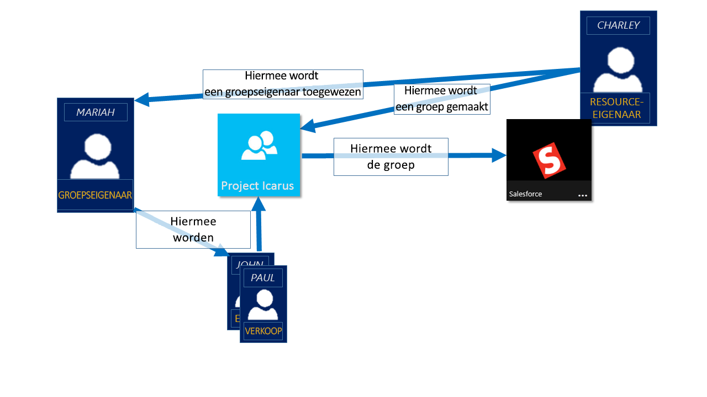
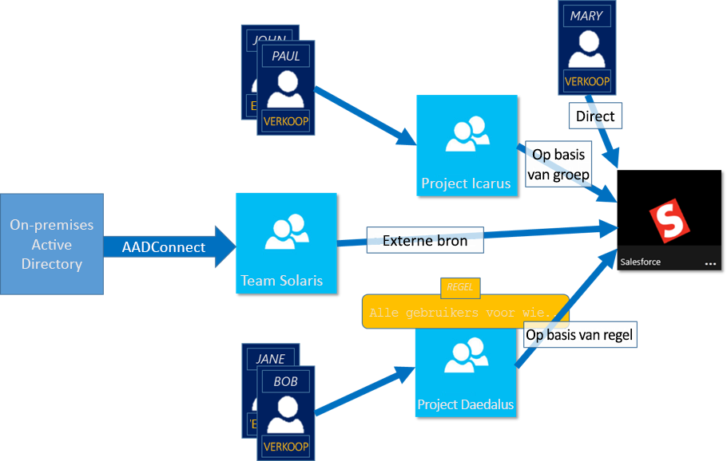

# Meer informatie over het beheer van toegang met behulp van Azure Active Directory-groepen
Azure Active Directory (Azure AD) helpt u bij het beheren van uw cloud-gebaseerde apps, on-premises toepassingen en uw resources met behulp van groepen van uw organisatie. Uw resources kunnen deel uitmaken van de map, zoals machtigingen voor het beheren van objecten door middel van rollen in de directory, of extern naar de map, zoals software as a Service (SaaS)-apps, Azure-services, SharePoint-sites, en on-premises resources.

>[!NOTE]
>U hebt een Azure-account nodig voor het gebruik van Azure Active Directory. Als u nog geen account hebt, kunt u [zich registreren voor een gratis Azure-account](https://azure.microsoft.com/free/).

## Hoe toegangsbeheer in Azure AD-werk?
Azure AD kunt u toegang geven tot resources van uw organisatie door te geven van de rechten voor één gebruiker of groep met een hele Azure AD. Met behulp van groepen, kunt de resource-eigenaar (of de eigenaar van de Azure AD-directory), een reeks machtigingen toewijzen aan alle leden van de groep, in plaats van deze op te geven van de rechten één voor één. De eigenaar van de resource of directory kan ook rights management voor de lijst met leden geven aan iemand anders, zoals de afdelingsmanager van een of Helpdesk-beheerder, zodat deze persoon toevoegen en verwijderen van leden, indien nodig. Zie voor meer informatie over het beheren van groepseigenaren [eigenaren van groepen beheren](active-directory-accessmanagement-managing-group-owners.md)

## Methoden voor het toewijzen van rechten
Er zijn vier manieren om toe te wijzen resource toegangsrechten aan uw gebruikers:

- **Rechtstreekse toewijzing toe.** De gebruiker de resource-eigenaar rechtstreeks toegewezen aan de resource.

- **Toewijzing van de groep.** De resource-eigenaar wijst een Azure AD-groep toe aan de resource, waarmee automatisch alle van de groep leden toegang tot de resource. Lidmaatschap van groep wordt beheerd door zowel de Groepseigenaar van de en de resource-eigenaar, zodat de eigenaar toevoegen of verwijderen van leden uit de groep. Zie voor meer informatie over het toevoegen of verwijderen van het groepslidmaatschap [hoe: toevoegen of verwijderen van een groep uit een andere groep met behulp van de Azure Active Directory-portal](active-directory-groups-membership-azure-portal.md). 

- **Toewijzing op basis van een regel.** De resource-eigenaar een groep maakt en gebruikt een regel voor het definiëren welke gebruikers zijn toegewezen aan een specifieke resource. De regel is gebaseerd op kenmerken die zijn toegewezen aan individuele gebruikers. De resource-eigenaar beheert de regel, waarmee wordt bepaald welke kenmerken en waarden vereist zijn voor toegang tot de resource. Zie voor meer informatie, [een dynamische groep maken en de status controleren](../users-groups-roles/groups-create-rule.md).

    U kunt ook deze korte video voor een korte uitleg over het maken en gebruiken van dynamische groepen bekijken:

    >[!VIDEO https://channel9.msdn.com/Series/Azure-Active-Directory-Videos-Demos/Azure-AD--Introduction-to-Dynamic-Memberships-for-Groups/player]

- **Toewijzing van externe-instantie.** Er is toegang afkomstig van een externe bron, zoals een on-premises directory of een SaaS-app. In dit geval de resource-eigenaar wijst een groep voor toegang tot de resource en vervolgens de leden van de groep voor het beheren van de externe bron.

   

## Gebruikers kunnen lid groepen zonder te worden toegewezen?
De eigenaar van de groep kunt toestaan dat gebruikers hun eigen groepen om toe te voegen, in plaats van ze toe te wijzen. De eigenaar van de kunt ook instellen van de groep alle gebruikers die deelnemen aan automatisch accepteren of goedkeuring vereisen.

Nadat een gebruiker aanvragen voor deelname aan een groep, wordt de aanvraag doorgestuurd naar de eigenaar van de groep. Als dit vereist is, de eigenaar van de aanvraag kan goedkeuren en de gebruiker wordt op de hoogte gesteld van het groepslidmaatschap. Echter, als u meerdere eigenaars hebben en een van beide disapproves, de gebruiker op de hoogte is gesteld, maar is niet toegevoegd aan de groep. Zie voor meer informatie en instructies over het kunnen uw gebruikers vragen om toe te voegen groepen [Azure AD instellen, zodat gebruikers aanvragen kunnen voor deelname aan groepen](../users-groups-roles/groups-self-service-management.md)

## Volgende stappen
Nu dat u een deel van een inleiding tot beheer van toegang met behulp van groepen hebt, start u uw resources en -apps beheren.

- [Maak een nieuwe groep met behulp van Azure Active Directory](active-directory-groups-create-azure-portal.md) of [maken en beheren van een nieuwe groep met behulp van PowerShell-cmdlets](../users-groups-roles/groups-settings-v2-cmdlets.md)

- [Groepen gebruiken voor toegang tot een geïntegreerde SaaS-app toewijzen](../users-groups-roles/groups-saasapps.md)

- [De groep van een on-premises naar Azure met Azure AD Connect synchroniseren](../connect/active-directory-aadconnect.md)