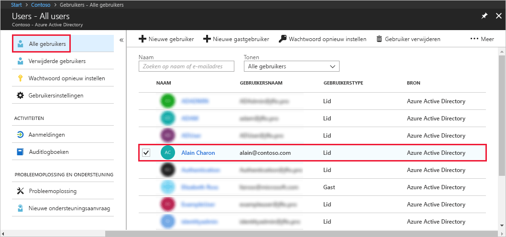
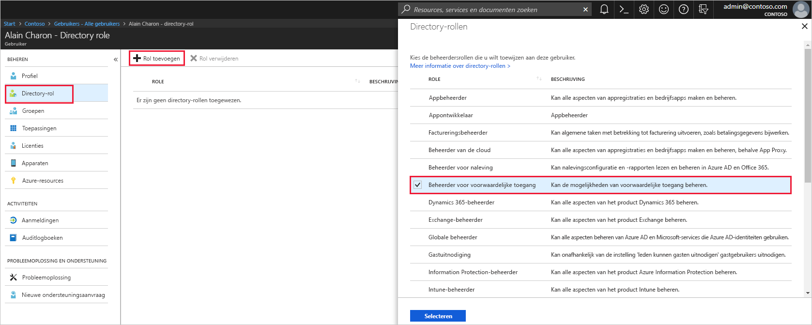

# Beheerdersrollen toewijzen aan gebruikers in Azure Active Directory
In dit artikel wordt uitgelegd hoe u een beheerdersrol toewijst aan een gebruiker in Azure Active Directory (Azure AD). Zie [Add new users to Azure Active Directory](../add-users-azure-active-directory.md) (Engelstalig) voor meer informatie over het toevoegen van nieuwe gebruikers in uw organisatie. Toegevoegde gebruikers hebben standaard geen gebruikersrechten, maar u kunt op elk gewenst moment rollen aan ze toewijzen.

## Een rol toewijzen aan een gebruiker
1. Meld u aan bij [Azure Portal](https://portal.azure.com) met een account van een hoofdbeheerder of rolbeheerder voor de directory.

2. Selecteer **Azure Active Directory**, selecteer **Gebruikers** en selecteer een specifieke gebruiker in de lijst.

    

3. Selecteer voor de geselecteerde gebruiker **Maprol**, selecteer **Rol toevoegen** en selecteer vervolgens de juiste beheerdersrollen in de lijst **Maprollen**, zoals  **Voorwaardelijke toegang beheerder**. Zie [Assigning administrator roles in Azure AD](../users-groups-roles/directory-assign-admin-roles.md) (Engelstalig) voor meer informatie over beheerdersrollen. 

    

1. Selecteer **Selecteren** om op te slaan.

## Volgende stappen
* [Snelstartgids: Gebruikers toevoegen of verwijderen in Azure Active Directory](add-users-azure-active-directory.md)
* [Gebruikersprofielen beheren](active-directory-users-profile-azure-portal.md)
* [Gastgebruikers uit een andere directory toevoegen](../b2b/what-is-b2b.md) 
* [Een rol toewijzen aan een gebruiker in Azure AD](active-directory-users-assign-role-azure-portal.md)
* [Een verwijderde gebruiker herstellen](active-directory-users-restore.md)
