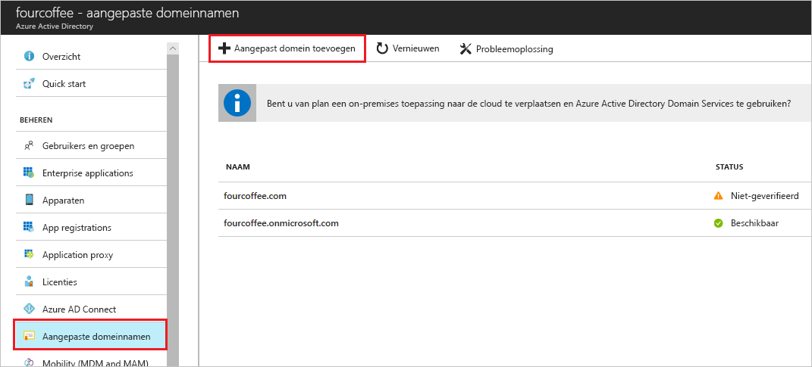

# De naam van uw aangepaste domein met behulp van de Azure Active Directory-portal toevoegen
Elke nieuwe Azure AD-tenant wordt geleverd met een initiële domeinnaam *domainname*. onmicrosoft.com. U niet wijzigen of verwijderen van de initiële domeinnaam, maar u kunt de namen van uw organisatie toevoegen aan de lijst. Toevoegen van aangepaste domeinnamen, helpt u bij het maken van de gebruikersnamen die bekend bij uw gebruikers, zoals zijn *alain\@contoso.com*.

## Voordat u begint
Voordat u een aangepaste domeinnaam toevoegen kunt, moet u de domeinnaam van uw maken met een domeinregistrar. Zie voor een erkende domeinregistrar [ICANN-Accredited Registrars](https://www.icann.org/registrar-reports/accredited-list.html).

## Maken van uw directory in Azure AD
Nadat u uw domeinnaam hebt ontvangen, kunt u uw eerste Azure AD-directory maken.

1. Aanmelden bij de [Azure-portal](https://portal.azure.com/) voor uw directory, met behulp van een account met de **eigenaar** rol voor het abonnement en selecteer vervolgens **Azure Active Directory**. Zie voor meer informatie over rollen van abonnement [klassiek abonnement beheerder functies, Azure RBAC-rollen en Azure AD-beheerdersrollen](../../role-based-access-control/rbac-and-directory-admin-roles.md#azure-rbac-roles).

    

    >[!TIP]
    > Als u van plan bent om uw on-premises Windows Server AD te federeren met Azure AD, moet u het selectievakje **Ik wil dit domein configureren voor eenmalige aanmelding met mijn lokale Active Directory** inschakelen wanneer u het hulpprogramma Azure AD Connect uitvoert om uw directory's te synchroniseren. Daarnaast moet u dezelfde domeinnaam registreren die u selecteert voor het federeren met uw on-premises directory in de stap **Azure AD-domein** in de wizard. [In deze instructies](../hybrid/how-to-connect-install-custom.md#verify-the-azure-ad-domain-selected-for-federation) ziet u hoe die stap van de wizard eruitziet. Als u het hulpprogramma Azure AD Connect niet hebt, kunt u het [hier](https://go.microsoft.com/fwlink/?LinkId=615771) downloaden.

2. Uw nieuwe map maken met de volgende stappen in [maken van een nieuwe tenant voor uw organisatie](active-directory-access-create-new-tenant.md#create-a-new-tenant-for-your-organization).

    >[!Important]
    >De persoon die de tenant maakt, wordt automatisch de globale beheerder voor de tenant. De globale beheerder kunt u extra beheerders toevoegen aan de tenant.

## Uw aangepaste domeinnaam toevoegen aan Azure AD
Nadat u uw directory hebt gemaakt, kunt u uw aangepaste domeinnaam toevoegen.

1. Selecteer **aangepaste-domeinnamen**, en selecteer vervolgens **aangepast domein toevoegen**.

    

2. Geef nieuwe domeinnaam van uw organisatie in de **aangepaste domeinnaam** vak (bijvoorbeeld _contoso.com_), en selecteer vervolgens **domein toevoegen**.

    De niet-geverifieerd domein is toegevoegd en de **Contoso** pagina wordt weergegeven waarin u uw DNS-gegevens.

    >[!Important]
    >U moet opnemen .com, .net of andere op het hoogste niveau extensie voor deze goed te laten werken.

    

4. Kopieer de DNS-gegevens van de **Contoso** pagina. Bijvoorbeeld, MS = ms64983159.

    

## Uw DNS-gegevens toevoegen aan de domeinregistrar
Nadat u uw aangepaste domeinnaam aan Azure AD toevoegen, moet u terug naar uw domeinregistrar en de Azure AD DNS-gegevens uit het gekopieerde TXT-bestand toevoegen. Het maken van dit TXT-record voor uw domein 'controleert of' eigendom van de domeinnaam van uw.

-  Ga terug naar uw domeinregistrar, maakt u een nieuwe TXT-record voor uw domein op basis van de gekopieerde gegevens van de DNS-de **TTL** (time to live van) 3600 seconden (60 minuten) en sla de gegevens.

    >[!Important]
    >U kunt zoveel domeinnamen als u wilt registreren. Elk domein wordt echter een eigen TXT-record opgehaald uit Azure AD. Wees voorzichtig bij het invoeren van de informatie van de TXT-bestanden op de domeinregistrar. Als u de verkeerde invoeren of dubbele gegevens per ongeluk hebt, hebt u wachten totdat de TTL-waarde een optreedt (60 minuten) time-out voordat u het opnieuw kunt proberen.

## Controleer of de naam van uw aangepaste domein
Nadat u uw aangepaste domeinnaam hebt geregistreerd, moet u controleren of dat de parameter is geldig zijn in Azure AD. Het doorgeven van uw domeinregistrar is Azure AD kan momentopname of het kan wel duren tot een paar dagen, afhankelijk van uw domeinregistrar.

### Om te controleren of uw aangepaste domeinnaam
1. Meld u aan bij de [Azure Portal](https://portal.azure.com/) met het account van een globale administrator voor de map.

2. Selecteer **Azure Active Directory**, en selecteer vervolgens **aangepaste-domeinnamen**.

3. Op de **Fabrikam - aangepaste-domeinnamen** pagina, selecteert u de aangepaste domeinnaam **Contoso**.

    

4. Op de **Contoso** weergeeft, schakelt **controleren** om te controleren of uw aangepaste domein juist is geregistreerd en is geldig voor Azure AD.

    

## Veelvoorkomende problemen met verificatie
- Als Azure AD een aangepaste domeinnaam niet verifiëren kan, probeert u de volgende suggesties:
  - **Wacht ten minste een uur en probeer het opnieuw**. DNS-records moeten worden doorgegeven voordat Azure AD kunt controleren of dat het domein en dit proces kunnen een uur of langer duren.

  - **Zorg ervoor dat de DNS-record klopt.** Ga terug naar de site domein naam registrar en zorg ervoor dat de vermelding wordt weergegeven, en dat deze overeenkomt met de DNS-vermeldingsgegevens geleverd door Azure AD.

    Als u de record op de site registrar niet bijwerken, moet u de vermelding delen met iemand die de juiste machtigingen voor de vermelding toevoegen en controleer of dat deze juist is.

- **Zorg ervoor dat de domeinnaam niet al wordt gebruikt in een andere directory.** De naam van een domein kan alleen worden geverifieerd in een bepaalde map, wat betekent dat als de domeinnaam van uw is momenteel geverifieerd in een andere directory, het kan ook worden geverifieerd in de nieuwe map. U lost dit probleem duplicatie, moet u de domeinnaam verwijderen uit de oude map. Zie voor meer informatie over het verwijderen van domeinnamen [aangepaste domeinnamen beheren](../users-groups-roles/domains-manage.md).

- **Zorg ervoor dat u hebt geen niet-beheerde Power BI-tenants.** Als uw gebruikers hebt geactiveerd Power BI via self-service-aanmelding en die een niet-beheerde tenant voor uw organisatie zijn gemaakt, moet u via management als een beheerder intern of extern uitvoeren met behulp van PowerShell. Zie voor meer informatie over hoe u een niet-beheerde directory overnemen, [een niet-beheerde directory overnemen als in Azure Active Directory-beheerder](../users-groups-roles/domains-admin-takeover.md).

## Volgende stappen

- Een andere globale beheerder toevoegen aan uw directory. Zie voor meer informatie, [toewijzen van rollen en beheerders](active-directory-users-assign-role-azure-portal.md).

- Gebruikers toevoegen aan uw domein, Zie [toevoegen of verwijderen van gebruikers](add-users-azure-active-directory.md).

- De gegevens van uw domein naam in Azure AD beheren. Zie voor meer informatie, [aangepaste domeinnamen beheren](../users-groups-roles/domains-manage.md).

- Als u beschikt over on-premises versies van Windows-Server die u wilt gebruiken samen met Azure Active Directory, raadpleegt u [uw on-premises directory's integreren met Azure Active Directory](../connect/active-directory-aadconnect.md).
