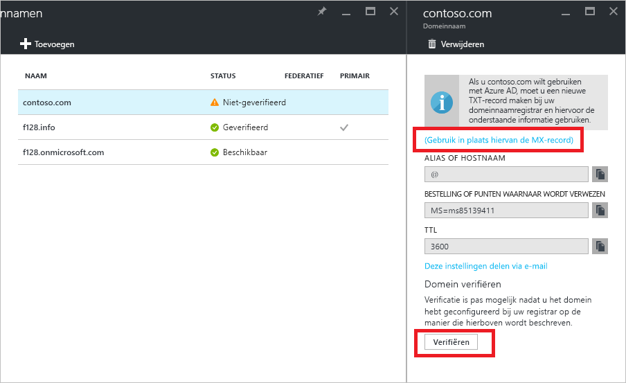

# Snelstartgids: Een aangepaste domeinnaam toevoegen aan Azure Active Directory

Elke Azure AD-directory heeft in eerste instantie een domeinnaam in de vorm van *domeinnaam*.onmicrosoft.com. Deze initiële domeinnaam kan niet worden gewijzigd of verwijderd, maar wat u wel kunt doen, is ook uw zakelijke domeinnaam toevoegen aan Azure AD. Stel dat uw organisatie verschillende domeinnamen gebruikt om zaken te doen en gebruikers zich aanmelden met uw zakelijke domeinnaam. U kunt dan aangepast domeinnamen toevoegen aan Azure AD, zodat u in de directory gebruikersnamen kunt toewijzen die bekend zijn bij uw gebruikers, zoals 'alice@contoso.com' in plaats van 'alice@*domeinnaam*.onmicrosoft.com'. Het proces is eenvoudig:

1. Voeg de aangepaste domeinnaam toe aan uw directory.
2. Voeg een DNS-vermelding voor de domeinnaam toe aan de domeinnaamregistrar.
3. Verifieer de aangepaste domeinnaam in Azure AD.

## Voeg de aangepaste domeinnaam toe aan uw directory.
1. Meld u aan bij [Azure Portal](https://aad.portal.azure.com/#blade/Microsoft_AAD_IAM/ActiveDirectoryMenuBlade/Overview) met een account van een globale beheerder voor de directory.
2. Selecteer aan de linkerkant **Namen van aangepaste domeinen**.
3. Selecteer **Aangepast domein toevoegen**.
   
   
5. Typ op de blade **Aangepaste-domeinnaam** de naam van uw aangepaste domein in het vak, bijvoorbeeld 'contoso.com', en selecteer vervolgens **Domein toevoegen**. Vergeet niet de extensie .com, .net of een andere extensie van het hoogste niveau toe te voegen.
6. Ga naar ***domeinnaam*** (de naam van het nieuwe domein is de titel) en noteer de gegevens van de DNS-vermelding. Deze hebt u later nodig om de aangepaste domeinnaam te controleren in Azure AD.
   
   

> [!TIP]
> Als u van plan bent om uw on-premises Windows Server AD te federeren met Azure AD, moet u het selectievakje **Ik wil dit domein configureren voor eenmalige aanmelding met mijn lokale Active Directory** inschakelen wanneer u het hulpprogramma Azure AD Connect uitvoert om uw directory's te synchroniseren. Daarnaast moet u dezelfde domeinnaam registreren die u selecteert voor het federeren met uw on-premises directory in de stap **Azure AD-domein** in de wizard. [In deze instructies](./../connect/active-directory-aadconnect-get-started-custom.md#verify-the-azure-ad-domain-selected-for-federation) ziet u hoe die stap van de wizard eruitziet. Als u het hulpprogramma Azure AD Connect niet hebt, kunt u het [hier](http://go.microsoft.com/fwlink/?LinkId=615771) downloaden.

## Voeg een DNS-vermelding voor de domeinnaam toe aan de domeinnaamregistrar.
De volgende stap voor het gebruik van de aangepaste domeinnaam met Azure AD bestaat uit het bijwerken van het DNS-zonebestand voor het domein. Azure AD kan nu controleren of uw organisatie eigenaar is van de aangepaste domeinnaam. U kunt [Azure DNS](https://docs.microsoft.com/azure/dns/dns-getstarted-portal) gebruiken voor uw Azure/Office 365/externe DNS-records in Azure. U kunt de DNS-vermelding ook toevoegen bij [een andere DNS-registrar](https://support.office.com/article/Create-DNS-records-for-Office-365-when-you-manage-your-DNS-records-b0f3fdca-8a80-4e8e-9ef3-61e8a2a9ab23/).

1. Meld u aan bij de domeinnaamregistrar voor het domein. Als u geen toegang hebt om de DNS-vermelding bij te werken, vraagt u de persoon die of het team dat wel over deze toegang beschikt om stap 2 uit te voeren en u te laten weten wanneer deze is voltooid.
2. Werk het DNS-zonebestand voor het domein bij, door de DNS-vermelding toe te voegen die u van Azure AD hebt ontvangen. De DNS-vermelding leidt niet tot veranderingen in het gedrag van bijvoorbeeld mailroutering of webhosting.

## Verifieer de aangepaste domeinnaam in Azure AD.
Nadat u de DNS-vermelding hebt toegevoegd, kunt u de domeinnaam bij Azure AD verifiëren. Een domeinnaam kan alleen worden geverifieerd nadat de DNS-records zijn doorgegeven. Deze doorgifte duurt vaak slechts enkele seconden, maar het kan ook wel eens een uur of langer duren. Als de verificatie de eerste keer niet werkt, probeer het dan later nog eens.

1. Meld u aan bij [Azure AD](https://aad.portal.azure.com/#blade/Microsoft_AAD_IAM/ActiveDirectoryMenuBlade/Overview) met een account met globale beheerdersrechten voor de tenant.
2. Selecteer **Namen van aangepaste domeinen**.
3. Selecteer de niet-geverifieerde domeinnaam die u wilt controleren.
4. Controleer de gegevens en selecteer **Controleren** om de verificatie te voltooien.

Nu kunt u [gebruikersnamen toewijzen die uw aangepaste domeinnaam omvatten](../users-groups-roles/domains-manage.md). U kunt cloudgebaseerde gebruikersaccounts maken of eerder gesynchroniseerde gegevens van on-premises gebruikersaccounts bijwerken, met behulp van uw aangepaste domeinnaam. U kunt domeinachtervoegsels van gesynchroniseerde gebruikersaccounts ook wijzigen met [Microsoft PowerShell](https://msdn.microsoft.com/library/azure/e1ef403f-3347-4409-8f46-d72dafa116e0#BKMK_ManageDomains) of de [Graph API](https://msdn.microsoft.com/Library/Azure/Ad/Graph/api/domains-operations).

> [!TIP]
> U kunt maximaal 900 beheerde domeinnamen toevoegen. Als u alle domeinen wilt configureren voor on-premises federatie met Active Directory, kunt u maximaal 450 domeinnamen toevoegen in elke directory. Zie [Federatieve en beheerde domeinnamen](https://docs.microsoft.com/azure/active-directory/active-directory-add-domain-concepts#federated-and-managed-domain-names) voor meer informatie.

## Problemen oplossen
Als het niet lukt om een aangepaste domeinnaam te verifiëren, probeert u deze oplossingen:

1. **Wacht een uur**. DNS-records moeten zijn doorgegeven voordat Azure AD het domein kan verifiëren. Dit proces kan een uur of langer duren.
2. **Controleer of de DNS-record is opgegeven en of deze juist is**. Voer deze stap uit op de website van de domeinnaamregistrar voor het domein. Azure AD kan de domeinnaam niet verifiëren als: 
  * De DNS-vermelding niet aanwezig is in het DNS-zonebestand
  * Deze niet exact overeenkomt met de DNS-vermelding die Azure AD u heeft doorgegeven. 
  
  Als u geen toegang hebt tot de site van de domeinnaamregistrar om de DNS-records voor het domein bij te werken, deel de DNS-vermelding dan met de persoon die of het team dat in uw organisatie deze toegang heeft en vraag om de DNS-vermelding toe te voegen.
3. **Verwijder de domeinnaam uit andere mappen in Azure AD**. Een domeinnaam kan maar in één map worden geverifieerd. Als een domeinnaam momenteel is geverifieerd in een andere directory, kan de naam pas worden geverifieerd in uw nieuwe directory als u de naam uit de andere directory hebt verwijderd. Zie [Aangepaste domeinnamen beheren](../users-groups-roles/domains-manage.md) voor meer informatie over het verwijderen van domeinnamen.    

Herhaal de stappen in dit artikel om al uw domeinnamen toe te voegen.

## Meer informatie
[Conceptueel overzicht van aangepaste domeinnamen in Azure AD](../users-groups-roles/domains-manage.md)

[Aangepaste domeinnamen beheren](../users-groups-roles/domains-manage.md)

## Volgende stappen
In deze snelstartgids hebt u geleerd hoe u een aangepast domein toevoegt aan Azure AD. 

Gebruik de volgende koppeling om een nieuw aangepast domein toe te voegen in Azure AD via Azure Portal.

> [!div class="nextstepaction"]
> [Een aangepast domein toevoegen](https://aad.portal.azure.com/#blade/Microsoft_AAD_IAM/ActiveDirectoryMenuBlade/QuickStart) 