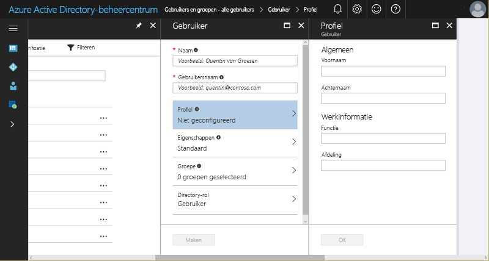

# Snelstart: Nieuwe gebruikers toevoegen aan Azure Active Directory
In dit artikel wordt uitgelegd hoe u gebruikers in uw organisatie kunt verwijderen uit of toevoegen aan de Azure AD-tenant (Azure Active Directory) met behulp van Azure Portal of door de gegevens van uw on-premises Windows Server AD-gebruikersaccounts te synchroniseren. 

## Cloudgebruikers toevoegen
1. Meld u aan bij het [Azure Active Directory-beheercentrum](https://aad.portal.azure.com) met een account met globale beheerdersrechten voor de directory.
2. Selecteer **Azure Active Directory** en vervolgens **Gebruikers en groepen**.
3. Selecteer in **Gebruikers en groepen** de optie **Alle gebruikers**. Selecteer vervolgens **Nieuwe gebruiker**.
   
4. Voer de details voor de gebruiker in, zoals **Naam** en **Gebruikersnaam**. De domeinnaam die deel uitmaakt van de gebruikersnaam, moet de eerste standaarddomeinnaam zijn, [domeinnaam].onmicrosoft.com, of een geverifieerde, niet-gefedereerde [aangepaste domeinnaam](add-custom-domain.md), zoals contoso.com.
5. Kopieer of noteer het gegenereerde gebruikerswachtwoord zodat u dit aan de gebruiker kunt doorgeven nadat dit proces is voltooid.
6. U kunt er ook voor kiezen om de informatie bij **Profiel**, **Groepen** of **Directory-rol** in te vullen voor de gebruiker. Zie [Assigning administrator roles in Azure AD](../users-groups-roles/directory-assign-admin-roles.md) (Engelstalig) voor meer informatie over gebruikers- en beheerdersrollen.
7. Selecteer bij **Gebruiker** de optie **Maken**.
8. Distribueer het gegenereerde wachtwoord op een veilige manier naar de nieuwe gebruiker zodat deze zich kan aanmelden.

> [!TIP]
> U kunt de gegevens van het gebruikersaccount ook synchroniseren vanuit on-premises Windows Server AD. De identiteitsoplossingen van Microsoft omvatten mogelijkheden voor zowel on-premises als in de cloud. Er wordt één gebruikersidentiteit gemaakt voor verificatie en autorisatie bij alle resources, ongeacht hun locatie. We noemen dit hybride identiteit. [Azure AD Connect](https://docs.microsoft.com/azure/active-directory/connect/active-directory-aadconnect) kan worden gebruikt om uw on-premises directory's te integreren met Azure Active Directory voor hybride identiteitsscenario’s. Hiermee kunt u uw gebruikers een algemene identiteit bieden voor Office 365, Azure en SaaS toepassingen die zijn geïntegreerd met Azure AD. 

## Gebruikers verwijderen uit Azure AD
1. Meld u aan bij het [Azure Active Directory-beheercentrum](https://aad.portal.azure.com) met een account met globale beheerdersrechten voor de directory.
2. Selecteer **Gebruikers en groepen**.
3. Selecteer op de blade **Gebruikers en groepen** de gebruiker die u wilt verwijderen uit de lijst. 
4. Selecteer op de blade voor de geselecteerde gebruiker de optie **Overzicht** en selecteer vervolgens **Verwijderen** in de opdrachtbalk.
   

### Meer informatie 
* [Gastgebruikers uit een andere directory toevoegen](../b2b/what-is-b2b.md) 
* [Een rol toewijzen aan een gebruiker in Azure AD](active-directory-users-assign-role-azure-portal.md)
* [Gebruikersprofielen beheren](active-directory-users-profile-azure-portal.md)
* [Een verwijderde gebruiker herstellen](active-directory-users-restore.md)

## Volgende stappen
In deze snelstart hebt u geleerd hoe u nieuwe gebruikers toevoegt in Azure AD Premium. 

U kunt de volgende koppeling gebruiken om een nieuwe gebruiker in Azure AD te maken vanuit Azure Portal.

>[!div class="nextstepaction"]
>[Gebruikers toevoegen aan Azure AD](https://aad.portal.azure.com/#blade/Microsoft_AAD_IAM/UserManagementMenuBlade/)