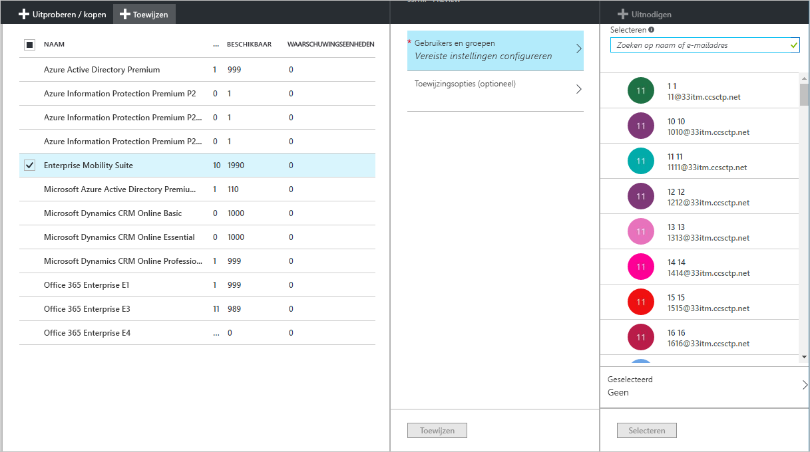
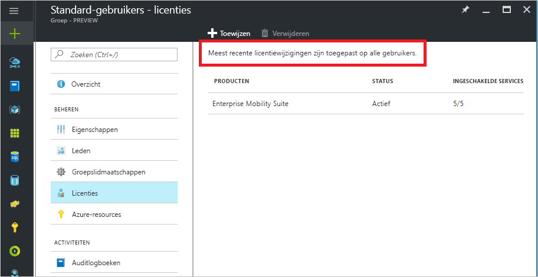
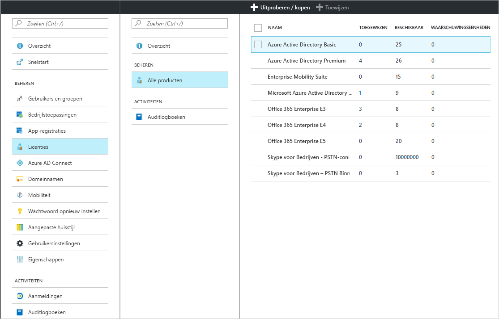
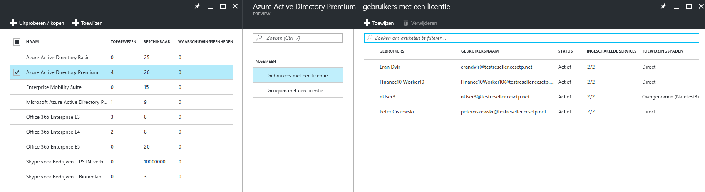
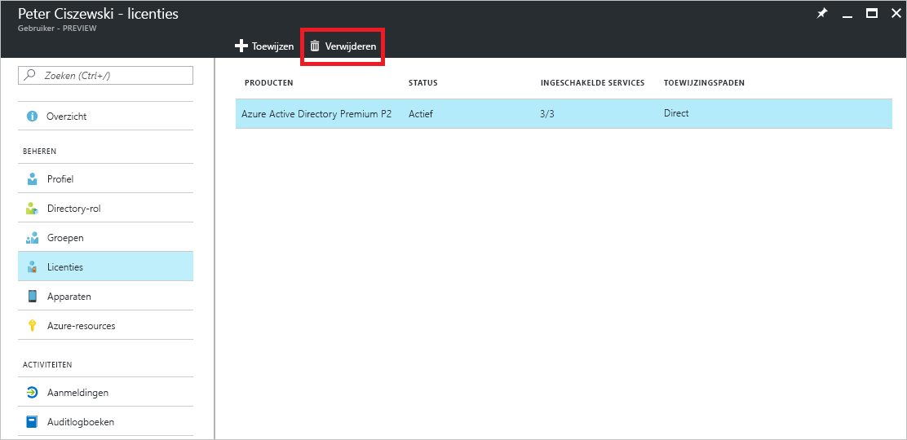

# Snelstartgids: Licentie geven aan gebruikers in Azure Active Directory
Azure AD-services op basis van een licentie zijn alleen toegankelijk na het activeren van een Azure AD-abonnement (Azure Active Directory) in uw Azure-tenant. Als het abonnement actief is, worden servicevoorzieningen beheerd door Azure AD-beheerders en gebruikt door gebruikers met een licentie. Wanneer u Enterprise Mobility + Security, Azure AD Premium of Azure AD Basic koopt, wordt uw tenant bijgewerkt met het abonnement, met inbegrip van de geldigheidsperiode en vooraf betaalde licenties. De abonnementsgegevens, waaronder het aantal toegewezen of beschikbare licenties, is beschikbaar via Azure Portal, door eerst **Azure Active Directory** te kiezen en dan de tegel **Licenties**. De tegel of blade **Licenties** is ook de beste plek voor het beheren van uw licentietoewijzingen.

Hoewel een abonnement de enige vereiste is voor het configureren van betaalde voorzieningen, moet u nog steeds gebruikerslicenties toewijzen voor betaalde functies van Azure AD. Elke gebruiker die toegang moet hebben tot een betaalde functie van Azure AD moet een licentie hebben. Dit geldt ook voor alle gebruikers die worden beheerd via een dergelijke functie. Licentietoewijzing is een koppeling tussen een gebruiker en een gekochte service, zoals Azure AD Premium, Basic of Enterprise Mobility + Security.

U kunt [licentietoewijzing voor groepen](active-directory-licensing-whatis-azure-portal.md) gebruiken om regels zoals deze in te stellen:
* Alle gebruikers in uw adreslijst of directory krijgen automatisch een licentie
* Iedereen met de juiste functie krijgt een licentie
* U kunt de beslissing delegeren aan andere managers in de organisatie (met behulp van [selfservicegroepen](../users-groups-roles/groups-self-service-management.md))

> [!TIP]
> Zie [Licenties toewijzen aan gebruikers door groepslidmaatschappen in Azure Active Directory](../active-directory-licensing-group-assignment-azure-portal.md) voor een gedetailleerde beschrijving van licentietoewijzing aan groepen, inclusief geavanceerde scenario's en licentiescenario's voor Office 365.

## Licenties toewijzen aan gebruikers en groepen
Met behulp van een actief abonnement moet u eerst een licentie aan uzelf toewijzen en uw browser vernieuwen om ervoor te zorgen dat u alle verwachte functies van uw abonnement ziet. De volgende stap is het toewijzen van licenties aan de gebruikers die toegang nodig hebben tot betaalde functies van Azure AD. Een eenvoudige manier om licenties toe te wijzen, is het toewijzen van licenties aan groepen gebruikers in plaats van aan individuele gebruikers. Als u licenties toewijst aan een groep, krijgen alle groepsleden een licentie. Als de groep wordt aangepast door het toevoegen of verwijderen van gebruikers, wordt er automatisch een licentie toegewezen of verwijderd. 

> [!NOTE]
> Sommige services van Microsoft zijn niet op alle locaties beschikbaar. Voordat een licentie kan worden toegewezen aan een gebruiker, moet de beheerder de eigenschap **Gebruikslocatie** voor de gebruiker instellen. U kunt deze eigenschap instellen onder **Gebruiker** &gt; **Profiel** &gt; **Instellingen** in Azure Portal. Als u kiest voor licentietoewijzing aan groepen, krijgt een gebruiker zonder gebruikslocatie automatisch de locatie van de adreslijst.

Als u een licentie wilt toewijzen, kiest u **Azure Active Directory** &gt; **Licenties** &gt; **Alle producten**, selecteert u een of meer producten, en selecteert u vervolgens  **Toewijzen** op de opdrachtbalk.

Gebruik de blade **Gebruikers en groepen** om meerdere gebruikers of groepen te kiezen of om serviceabonnementen in het product uit te schakelen. Gebruik het zoekvak bovenaan om te zoeken naar namen van gebruikers en groepen.

Wanneer u licenties toewijst aan een groep, kan het even duren voordat alle gebruikers de licentie hebben, afhankelijk van de grootte van de groep. U kunt de verwerkingsstatus controleren op de blade **Groep**, onder de tegel **Licenties**.

Er kunnen fouten optreden bij de toewijzing van licenties voor Azure AD, maar dit komt nauwelijks voor bij het beheren van producten van Azure AD en Enterprise Mobility + Security. Potentiële fouten bij licentietoewijzing zijn beperkt tot:
- Conflict bij toewijzing: wanneer eerder een licentie is toegewezen aan een gebruiker die niet compatibel is met de huidige licentie. In dit geval moet de huidige licentie eerst worden verwijderd om de nieuwe licentie te kunnen toewijzen.
- Beschikbare licenties overschreden: wanneer het aantal gebruikers in toegewezen groepen het aantal beschikbare licenties overschrijdt, geeft de toewijzingsstatus van de gebruiker aan dat er een fout is opgetreden vanwege ontbrekende licenties.

### Licentie voor Azure AD B2B-samenwerking

B2B-samenwerking maakt het mogelijk om gastgebruikers uit te nodigen in uw Azure AD-tenant om toegang te bieden tot Azure AD-services en Azure-resources die u beschikbaar stelt.  

Er zijn geen kosten verbonden aan het uitnodigen van B2B-gebruikers en het toewijzen van deze gebruikers aan een toepassing in Azure AD. Daarnaast zijn er kosteloos maximaal tien apps per gastgebruiker en drie basisrapporten beschikbaar voor gebruikers van B2B-samenwerking. Als uw gastgebruiker in de Azure AD-tenant van de partner over de juiste licenties beschikt, kunnen ze deze licenties ook in uw tenant gebruiken.

Het is niet vereist, maar als u toegang wilt bieden tot betaalde functies van Azure AD, moeten die B2B-gastgebruikers een geschikte Azure AD-licentie krijgen. Een partner-tenant met een betaalde licentie voor Azure AD kan gebruikersrechten voor B2B-samenwerking toewijzen aan vijf extra gastgebruikers die zijn uitgenodigd voor de tenant. Zie [Licentierichtlijnen voor B2B-samenwerking van Azure Active Directory](../b2b/licensing-guidance.md) voor scenario's en informatie.

## Toegewezen licenties weergeven

U kunt een overzicht van toegewezen en beschikbare licenties bekijken onder **Azure Active Directory** &gt; **Licenties** &gt; **Alle producten**.

U ziet een gedetailleerde lijst met toegewezen gebruikers en groepen wanneer u een specifiek product selecteert. De lijst **Gebruikers met licenties** bevat alle gebruikers die momenteel een licentie hebben. U ziet ook of de licentie rechtstreeks aan de gebruiker is toegewezen of is overgenomen van een groep.

Op dezelfde manier bevat de lijst **Groepen met licenties** bevat alle groepen waaraan licenties zijn toegewezen. Selecteer een gebruiker of groep om de blade **Licenties** te openen en alle licenties te zien die zijn toegewezen aan dat object.

## Een licentie verwijderen

Als u een licentie wilt verwijderen, gaat u naar de gebruiker of groep en opent u de tegel **Licenties**. Selecteer de licentie en klik op **Verwijderen**.

Licenties die door de gebruiker zijn overgenomen van een groep kunnen niet rechtstreeks worden verwijderd. In dat geval moet u de gebruiker verwijderen uit de groep waarvan de licentie is overgenomen.

## Volgende stappen
In deze snelstartgids hebt u geleerd hoe u licenties toewijst aan gebruikers en groepen in Azure AD Directory. 

U kunt de volgende koppeling gebruiken om via Azure Portal licentietoewijzingen voor een abonnement te configureren in Azure AD.

> [!div class="nextstepaction"]
> [Azure AD-licenties toewijzen](https://aad.portal.azure.com/#blade/Microsoft_AAD_IAM/LicensesMenuBlade/Overview) 