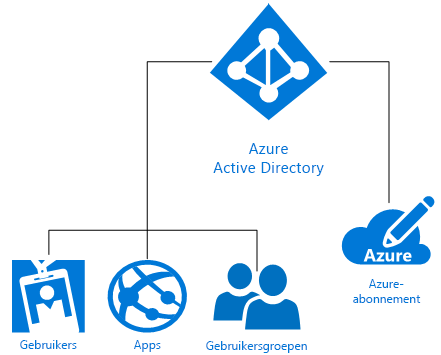

# Wat is Microsoft Azure-identiteit?
Microsoft Azure Active Directory (Azure AD) is een cloudoplossing voor identiteits- en toegangsbeheer die voorziet in adreslijstservices, identiteitsgovernance en toegangsbeheer voor toepassingen. Met Azure AD kunt u snel gebruikmaken van [eenmalige aanmelding](https://docs.microsoft.com/azure/active-directory/active-directory-enterprise-apps-manage-sso) bij duizenden vooraf geïntegreerde commerciële en aangepaste apps in de [Azure AD-toepassingsgalerie](https://azure.microsoft.com/marketplace/active-directory/all/). Veel van deze apps gebruikt u waarschijnlijk al, bijvoorbeeld Office 365, Salesforce.com, Box, ServiceNow en Workday.

Er wordt automatisch een Azure AD-directory gekoppeld aan een Azure-abonnement wanneer dit wordt gemaakt. Azure AD fungeert als identiteitsservice in Azure en biedt alle functies voor identiteits- en toegangsbeheer voor cloudresources. Deze resources kunnen gebruikers, apps en groepen voor een individuele tenant (organisatie) bevatten, zoals te zien is in onderstaand diagram:

Microsoft Azure biedt diverse manieren om gebruik te maken van identiteit als een service (Identity as a Service, IDaaS), met diverse complexiteitsniveaus om te voldoen aan de individuele behoeften van uw organisatie. Verder biedt dit artikel u meer inzicht in basisterminologie en -concepten van Azure-identiteitsoplossingen, evenals aanbevelingen om de beste keuze uit de beschikbare opties te maken.

## Belangrijke begrippen

Voordat u een geschikte Azure-identiteitsoplossing voor uw organisatie kunt kiezen, moet u een basisbegrip hebben van veelgebruikte begrippen die te maken hebben met Azure-identiteitsservices.

|Belangrijk begrip| Beschrijving|
|-----|-----|
|Azure-abonnement |Abonnementen worden gebruikt om Azure-cloudservices te betalen en zijn meestal gekoppeld aan een creditcard. U kunt meerdere abonnementen hebben, maar het kan lastig zijn om resources te delen met verschillende abonnementen.|
|Azure-tenant | Een Azure AD-tenant vertegenwoordigt één organisatie. De tenant is een speciaal, vertrouwd exemplaar van Azure AD dat automatisch wordt gemaakt wanneer een organisatie zich registreert voor een abonnement op een cloudservice van Microsoft, bijvoorbeeld Azure, Intune of Office 365. Tenants kunnen toegang krijgen tot services in een speciale omgeving (één tenant) of in een omgeving die wordt gedeeld met andere organisaties (multitenant).|
|Azure AD-directory | Elke Azure-tenant heeft een speciale, vertrouwde Azure AD-directory die de gebruikers, groepen en toepassingen van de tenant bevat. Hiermee worden functies voor identiteits- en toegangsbeheer uitgevoerd voor tenantresources. Aangezien er automatisch een unieke Azure AD-directory wordt ingericht voor uw organisatie wanneer u zich registreert voor een Microsoft-cloudservice zoals Azure, Microsoft Intune of Office 365, worden de begrippen *tenant*, *Azure AD* en *Azure AD-directory* afwisselend gebruikt om naar hetzelfde te verwijzen. |
|Aangepast domein | Wanneer u zich voor het eerst registreert voor een abonnement op een Microsoft-cloudservice, gebruikt uw tenant (organisatie) een domeinnaam van *.onmicrosoft.com*. De meeste organisaties hebben echter een of meerdere domeinnamen die worden gebruikt voor het bedrijf en waarmee eindgebruikers toegang krijgen tot bedrijfsresources. U kunt uw aangepaste domeinnaam toevoegen aan Azure AD zodat de domeinnaam herkenbaar is voor uw gebruikers, bijvoorbeeld *alice@contoso.com* in plaats van *alice@contoso.onmicrosoft.com*. |
|Azure AD-account | Deze identiteiten worden gemaakt wanneer u Azure AD of een andere cloudservice van Microsoft gebruikt, bijvoorbeeld Office 365. Ze zijn opgeslagen in Azure AD en toegankelijk voor alle cloudservice-abonnementen van de organisatie. |
|Azure-abonnementsbeheerder| De accountbeheerder is degene die de registratie voor of aanschaf van het Azure-abonnement heeft geregeld. In het [accountcentrum](https://account.azure.com/Subscriptions) kan hij diverse beheertaken uitvoeren. Hij kan bijvoorbeeld abonnementen maken of annuleren, de facturering voor een abonnement wijzigen of de servicebeheerder wijzigen. |
|Globale Azure AD-beheerder | Globale Azure AD-beheerders hebben volledige toegang tot alle beheerfuncties van Azure AD. De persoon die de organisatie registreert voor een abonnement op een Microsoft-cloudservice, wordt standaard automatisch de globale beheerder. U kunt meerdere globale beheerders hebben, maar alleen globale beheerders kunnen [de overige beheerdersrollen](https://docs.microsoft.com/azure/active-directory/active-directory-assign-admin-roles-azure-portal) toewijzen aan gebruikers. |
|Microsoft-account | Microsoft-accounts (die u hebt gemaakt voor persoonlijk gebruik) bieden toegang tot consumentgerichte producten en cloudservices van Microsoft, bijvoorbeeld Outlook (Hotmail), OneDrive, Xbox LIVE en Office 365. Deze identiteiten worden gemaakt en opgeslagen in het accountsysteem voor consumentidentiteiten van Microsoft, dat wordt beheerd door Microsoft.|
|Werk- of schoolaccounts | Werk-of schoolaccounts (waarvoor toegang is verleend door een beheerder voor zakelijk/academisch gebruik) bieden toegang tot Microsoft-cloudservices voor zakelijke ondernemingen, zoals Azure, Intune of Office 365.|

## Belangrijke concepten

Nu u enkele basisbegrippen met betrekking tot Azure-identiteitsservices kent, moet u meer leren over de volgende Azure-identiteitsconcepten zodat u een weloverwogen beslissing kunt nemen voor uw Azure-identiteitsservice.

|Belangrijk concept |Beschrijving|
|-----|-----|
|[Hoe Azure-abonnementen worden gekoppeld aan Azure Active Directory](https://docs.microsoft.com/azure/active-directory/active-directory-how-subscriptions-associated-directory) |Elk Azure-abonnement heeft een vertrouwensrelatie met een Azure AD-directory om gebruikers, services en apparaten te verifiëren. *Meerdere abonnementen kunnen een vertrouwensrelatie met dezelfde Azure AD-directory hebben, maar een abonnement heeft enkel met één Azure AD-directory een vertrouwensrelatie*. Deze vertrouwensrelatie is anders dan de relatie tussen een abonnement en andere Azure-resources (websites, databases, enzovoort), die beter te beschrijven zijn als onderliggende resources van een abonnement. Als een abonnement verloopt, wordt de toegang tot resources die aan het abonnement zijn gekoppeld, ook onderbroken, behalve voor Azure AD. De Azure AD-directory blijft wel aanwezig in Azure, zodat u een ander abonnement aan de directory kunt koppelen en tenantresources kunt blijven beheren.|
|[Hoe Azure AD-licenties werken](https://docs.microsoft.com/azure/active-directory/active-directory-licensing-get-started-azure-portal) | Wanneer u Enterprise Mobility Suite, Azure AD Premium of Azure AD Basic aanschaft of activeert, wordt uw directory bijgewerkt met het abonnement, waaronder de geldigheidsperiode en vooruitbetaalde licenties. Wanneer het abonnement actief is, kunnen globale Azure AD-beheerders de service beheren en gebruikers met een licentie de service gebruiken. De abonnementsgegevens, waaronder het aantal toegewezen of beschikbare licenties, kunt u inzien in Azure Portal via de blade **Azure Active Directory** > **Licenties**. Dit is ook de beste plek om uw licentietoewijzingen te beheren.|
|[Op rollen gebaseerd toegangsbeheer in Azure Portal](https://docs.microsoft.com/azure/role-based-access-control/overview)|Met op rollen gebaseerd toegangsbeheer beschikt u over geavanceerd toegangsbeheer voor Azure-resources. Wanneer een account te veel machtigingen heeft, kan het kwetsbaar zijn voor aanvallers. Maar met te weinig machtigingen kunnen werknemers niet efficiënt werken. Met op rollen gebaseerd toegangsbeheer geeft u werknemers precies de machtigingen die ze nodig hebben op basis van drie standaardrollen die van toepassing zijn op alle resourcegroepen: eigenaar, inzender en lezer. Daarnaast kunt u maximaal 2000 eigen [aangepaste rollen](https://docs.microsoft.com/azure/role-based-access-control/custom-roles) maken die zijn afgestemd op uw specifieke behoeften. |
|[Hybride identiteit](https://docs.microsoft.com/azure/active-directory/connect/active-directory-aadconnect)|Hybride identiteit wordt bereikt door uw on-premises Windows Server Active Directory (AD DS) te integreren met Azure AD via [Azure AD Connect](https://docs.microsoft.com/azure/active-directory/connect/active-directory-aadconnect). Hiermee kunt u uw gebruikers een algemene identiteit bieden voor Office 365, Azure en alle on-premises apps of SaaS-toepassingen die zijn geïntegreerd met Azure AD. Met een hybride identiteit breidt u uw on-premises omgeving in feite uit naar de cloud voor identiteit en toegang.|

### Het verschil tussen Windows Server AD DS en Azure AD
Azure Active Directory (Azure AD) en on-premises Active Directory (Active Directory Domain Services of AD DS) zijn beide systemen voor het opslaan van directory-gegevens en het beheren van de communicatie tussen gebruikers en resources, waaronder aanmeldingsprocessen van gebruikers, verificatie en zoekopdrachten in de directory.

Als u al bekend bent met on-premises Windows Server Active Directory Domain Services (AD DS), dat voor het eerst werd geïntroduceerd met Windows 2000 Server, begrijpt u het basisconcept van een identiteitsservice waarschijnlijk al. Het is echter ook belangrijk om te weten dat Azure AD meer is dan een domeincontroller in de cloud. Azure AD vormt een geheel nieuwe manier om identiteit als een service (IDaaS) te bieden in Azure. Hiervoor is een geheel nieuwe manier van denken nodig als u de cloudmogelijkheden volledig wilt benutten en uw organisatie wilt beschermen tegen actuele bedreigingen. 

AD DS is een serverfunctie van Windows Server. U kunt AD DS implementeren op fysieke of virtuele machines. De functie heeft een hiërarchische structuur op basis van X.500. AD DS gebruikt DNS om objecten te vinden, biedt communicatie via LDAP en gebruikt voornamelijk Kerberos voor verificatie. Active Directory maakt organisatie-eenheden (OE's) en groepsbeleidobjecten (GPO's) mogelijk en voegt machines samen met het domein. Er worden ook vertrouwensrelaties tussen de domeinen gemaakt.

IT heeft zijn beveiligingsperimeter jarenlang beschermd met AD DS, maar voor moderne ondernemingen zonder perimeter die identiteitsbehoeften voor werknemers, klanten en partners ondersteunen, is een nieuwe beheerlaag vereist. Azure AD is die identiteitsbeheerlaag. Beveiliging omvat nu meer dan een zakelijke firewall. In de cloud beschermt Azure AD bedrijfsresources en toegang door gebruikers één algemene identiteit te bieden (on-premises of in de cloud). Hierdoor kunnen uw gebruikers flexibel en veilig toegang krijgen tot de apps die ze nodig hebben om hun werk uit te voeren op bijna elk apparaat. Er wordt ook naadloze, op risico's gebaseerde gegevensbescherming geboden, ondersteund door machine learning-mogelijkheden en diepgaande rapportage. Dit heeft IT nodig om bedrijfsgegevens veilig te houden.

Azure AD is een openbare directory-service voor meerdere klanten. Binnen Azure AD kunt u een tenant maken voor uw cloudservers en toepassingen zoals Office 365. Gebruikers en groepen worden ongestructureerd gemaakt zonder OE's of GPO's. Verificatie wordt uitgevoerd via protocollen als SAML, WS-Federation en OAuth. U kunt een query uitvoeren voor Azure AD, maar in plaats van LDAP moet u daarvoor een REST API genaamd AD Graph API gebruiken. Dit gebeurt allemaal via HTTP en HTTPS.

### Beheer- en beveiligingsmogelijkheden van Office 365 uitbreiden
Gebruikt u Office 365 al? U kunt uw digitale transformatie versnellen door de ingebouwde Office 365-mogelijkheden uit te breiden met Azure AD om al uw resources te beveiligen. Op deze manier kunt u veilige productiviteit bieden voor al uw medewerkers. Wanneer u Azure AD gebruikt naast Office 365-mogelijkheden, kunt u uw gehele toepassingsportfolio beveiligen met één identiteit en eenmalige aanmelding voor alle apps. U kunt uw mogelijkheden voor voorwaardelijke toegang uitbreiden, niet alleen op basis van apparaatstatus, maar ook op basis van gebruiker, locatie, toepassing en risico. Mogelijkheden voor meervoudige verificatie (MFA) bieden nog meer bescherming wanneer u die nodig hebt. U krijgt meer toezicht op gebruikersmachtigingen en kunt op aanvraag Just-In-Time-beheerderstoegang bieden. Uw gebruikers kunnen productiever werken en hoeven minder helpdesktickets te maken dankzij de selfservice-mogelijkheden van Azure AD, zoals het opnieuw instellen van vergeten wachtwoorden, toegangsverzoeken voor toepassingen en het maken en beheren van groepen.

> [!TIP]
> Wilt u meer informatie over het gebruik van Azure AD-identiteitsbeheer met Office 365? [Download het e-book](https://info.microsoft.com/Extend-Office-365-security-with-EMS.html).

## Microsoft Azure-identiteitsoplossingen

Microsoft Azure biedt diverse manieren om de identiteiten van uw gebruikers te beheren, of dit nu volledig on-premises, alleen in de cloud of via een combinatie van beide gebeurt. Deze opties omvatten: doe-het-zelf AD DS in Azure, Azure Active Directory (Azure AD), hybride identiteit en Azure AD Domain Services.

### Doe-het-zelf AD DS
Bedrijven die slechts een kleine cloudruimte nodig hebben, kunnen **doe-het-zelf AD DS** in Azure gebruiken. Deze optie ondersteunt diverse Windows Server AD DS-scenario's die geschikt zijn voor implementatie als virtuele machines (VM's) in Azure. U kunt bijvoorbeeld een virtuele Azure-machine maken als domeincontroller die wordt uitgevoerd in een datacenter ver weg, waarbij verbinding wordt gemaakt met het externe netwerk. De VM kan dan verificatieverzoeken van externe gebruikers ondersteunen en de verificatieprestaties verbeteren. Deze optie is ook zeer geschikt als relatief goedkope vervanging voor dure noodherstelsites door een klein aantal domeincontrollers en één virtueel netwerk in Azure te hosten. Tot slot moet u mogelijk een toepassing in Azure implementeren, zoals SharePoint, waarvoor Windows Server AD DS is vereist, maar die niet afhankelijk is van het on-premises netwerk of de Windows Server Active Directory van het bedrijf. In dit geval kunt u een afzonderlijke forest implementeren in Azure om te voldoen aan de vereisten van de SharePoint-serverfarm. Deze optie ondersteunt ook de implementatie van netwerktoepassingen die wel verbinding met het on-premises netwerk en de on-premises Active Directory vereisen.

### Azure Active Directory (Azure AD)
**Azure AD zelfstandig** is een oplossing voor identiteits- en toegangsbeheer als een service (IDaaS) die volledig in de cloud wordt uitgevoerd. Azure AD biedt een robuuste set mogelijkheden voor het beheren van gebruikers en groepen. U kunt hiermee de toegang tot on-premises en cloudtoepassingen beveiligen, waaronder webservices van Microsoft, zoals Office 365, en een groot aantal SaaS-toepassingen (Software as a Service) van andere leveranciers dan Microsoft. Azure AD is verkrijgbaar in drie edities: Gratis, Basic en Premium. Azure AD verhoogt de efficiëntie binnen uw organisatie en biedt meer beveiliging dan de perimeterfirewall, namelijk in de vorm van een nieuwe beheerlaag die wordt beschermd door machine learning van Azure en andere geavanceerde beveiligingsfuncties.

### Hybride identiteit
U hoeft niet te kiezen tussen on-premises of cloudoplossingen voor identiteit. Veel vooruitstrevende CIO's en bedrijven die al nadenken over de richting van hun bedrijf op de lange termijn, breiden hun on-premises directory's uit naar de cloud met **hybride identiteitsoplossingen**. Met hybride identiteit profiteert u van een globale oplossing voor identiteits- en toegangsbeheer die veilige en productieve toegang biedt tot de toepassingen die gebruikers nodig hebben om hun werk te doen.

> [!TIP]
> Download de [CIO's Guide to Azure Active Directory](https://aka.ms/AzureADCIOGuide) (Azure Active Directory-handleiding voor CIO's) voor meer informatie over hoe CIO's Azure Active Directory tot een belangrijk onderdeel van hun IT-strategie hebben gemaakt.

### Azure AD Domain Services
**Azure AD Domain Services** biedt een cloudoptie waarmee u AD DS gebruikt voor eenvoudig configuratiebeheer van virtuele Azure-machines en om te voldoen aan de on-premises identiteitsvereisten voor het ontwikkelen en testen van netwerktoepassingen. Azure AD Domain Services is niet bedoeld om uw on-premises AD DS-infrastructuur te verplaatsen naar virtuele Azure-machines die worden beheerd met Azure AD Domain Services. De virtuele Azure-machines moeten in plaats daarvan worden gebruikt om on-premises toepassingen die AD DS-verificatiemethoden vereisen, te ontwikkelen, testen en verplaatsen naar de cloud.

## Veelvoorkomende scenario's en aanbevelingen

Hieronder volgen enkele veelvoorkomende identiteits- en toegangsscenario's met aanbevelingen voor de best geschikte Azure-identiteitsoptie.

|Identiteitsscenario| Aanbeveling|
|-----|-----|
|Mijn organisatie heeft veel geïnvesteerd in on-premises Windows Server Active Directory, maar we willen identiteit uitbreiden naar de cloud.| De meestgebruikte Azure-identiteitsoplossing is [hybride identiteit](https://docs.microsoft.com/azure/active-directory/active-directory-hybrid-identity-design-considerations-overview). Als u al hebt geïnvesteerd in on-premises AD DS, kunt u identiteit eenvoudig uitbreiden naar de cloud met Azure AD Connect.|
|Mijn bedrijf is opgezet in de cloud en we hebben geen investeringen gedaan in on-premises identiteitsoplossingen.| [Azure Active Directory](https://docs.microsoft.com/azure/active-directory/active-directory-whatis) is de beste keuze voor cloudbedrijven zonder on-premises investeringen.|
|Ik heb eenvoudige configuratie en beheer van virtuele Azure-machines nodig om te voldoen aan de on-premises identiteitsvereisten voor het ontwikkelen en testen van apps.|[Azure AD Domain Services](https://docs.microsoft.com/azure/active-directory-domain-services/active-directory-ds-overview) is een goede keuze als u AD DS wilt gebruiken voor eenvoudige configuratie en beheer van virtuele Azure-machines of als u oudere, on-premises directory-toepassingen wilt ontwikkelen of migreren naar de cloud.|  
|Ik wil een aantal virtuele machines in Azure ondersteunen, maar mijn bedrijf is sterk afhankelijk van on-premises Active Directory (AD DS).|Gebruik [doe-het-zelf AD DS](https://docs.microsoft.com/azure/active-directory-domain-services/active-directory-ds-comparison#do-it-yourself-diy-ad-deployment-options) om virtuele Azure-machines te gebruiken wanneer u een aantal virtuele machines wilt ondersteunen en on-premises veel hebt geïnvesteerd in AD DS. |

## Waar vind ik meer informatie?
We bieden online tal van goede bronnen met allerlei informatie over Azure AD. Hieronder volgt een lijst van artikelen waarmee u aan de slag kunt:

* [Uw directory geschikt maken voor hybride beheer met Azure AD Connect](../hybrid/whatis-hybrid-identity.md)
* [Extra beveiliging voor de verbonden wereld](../authentication/multi-factor-authentication.md)
* [Automate User Provisioning and Deprovisioning to SaaS Applications with Azure Active Directory](../manage-apps/user-provisioning.md) (Automatisch gebruikers inrichten en de inrichting ongedaan maken voor SaaS-toepassingen met Azure Active Directory)
* [Overal uw wachtwoorden beheren](../user-help/active-directory-passwords-update-your-own-password.md)
* [What is application access and single sign-on with Azure Active Directory?](../manage-apps/what-is-single-sign-on.md) (Wat houden toegang tot toepassingen en eenmalige aanmelding met Azure Active Directory in?)
* [Automate User Provisioning and Deprovisioning to SaaS Applications with Azure Active Directory](../manage-apps/user-provisioning.md) (Automatisch gebruikers inrichten en de inrichting ongedaan maken voor SaaS-toepassingen met Azure Active Directory)
* [How to provide secure remote access to on-premises applications](../manage-apps/application-proxy.md) (Beveiligde externe toegang bieden voor on-premises toepassingen)
* [Managing access to resources with Azure Active Directory groups](active-directory-manage-groups.md) (Toegang tot resources beheren met Azure Active Directory-groepen)
* [Wat is Microsoft Azure Active Directory-licentieverlening?](active-directory-licensing-whatis-azure-portal.md)
* [Hoe kan ik niet-goedgekeurde cloud-apps die worden gebruikt in mijn organisatie detecteren?](../manage-apps/cloud-app-discovery.md)

## Volgende stappen

Nu u een idee hebt van Azure-identiteitsconcepten en de opties die voor u beschikbaar zijn, kunt u met de volgende bronnen aan de slag om de door u gekozen optie te implementeren:

[Meer informatie over hybride identiteitsoplossingen van Azure](https://docs.microsoft.com/azure/active-directory/choose-hybrid-identity-solution)

[Vergroot uw kennis in een Azure Proof of Concept-omgeving](https://aka.ms/aad-poc)
