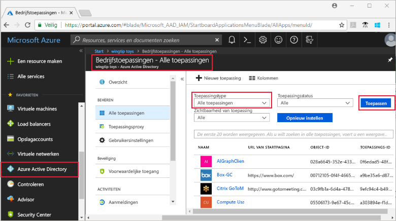
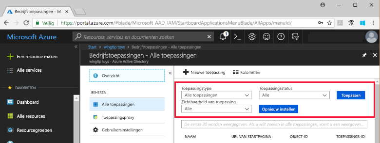
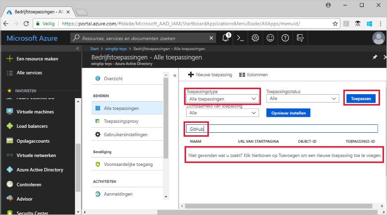
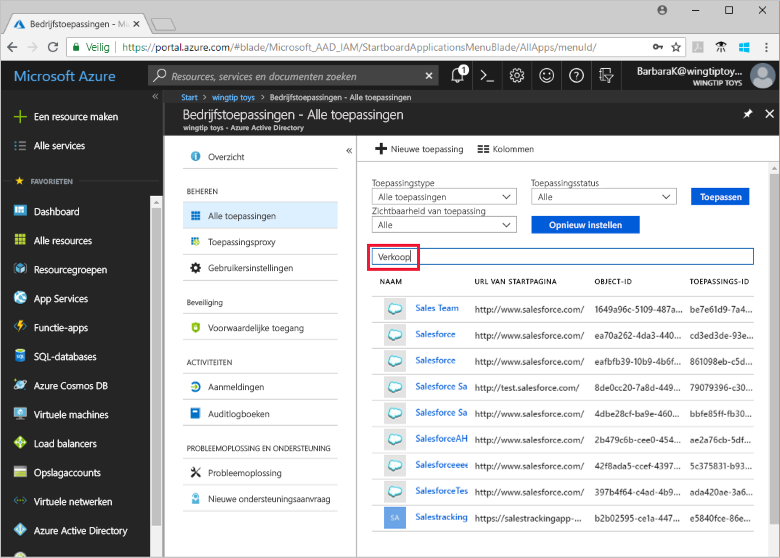

# Azure Active Directory-tenanttoepassingen weergeven

In deze quickstart wordt de Azure-portal gebruikt om de toepassingen in uw Azure AD-tenant (Azure Active Directory) weer te geven.

## Voordat u begint

Uw Azure AD-tenant moet over minstens één toepassing beschikken om resultaten te zien. Raadpleeg de quickstart [Een toepassing toevoegen](add-application-portal.md) om een toepassing toe te voegen.

Meld u bij de [Azure-portal](https://portal.azure.com) aan als globale beheerder van uw Azure AD-tenant, als beheerder van cloudtoepassingen of als toepassingsbeheerder.

## De lijst met tenanttoepassingen zoeken

Azure AD-tenanttoepassingen worden weergegeven in de sectie **Bedrijfsapps** van de Azure-portal.

Ga als volgt te werk om de tenanttoepassingen te zoeken:

1. Klik in de **[Azure-portal](https://portal.azure.com)** in het navigatiepaneel aan de linkerkant op **Azure Active Directory**. 

2. Klik op de blade Azure Active Directory op **Bedrijfstoepassingen**. 

3. Selecteer in de vervolgkeuzelijst **Toepassingstype** de optie **Alle toepassingen** en klik op **Toepassen**. Er wordt een willekeurige selectie uit uw tenanttoepassingen weergegeven.

    
   
4. Als u meer toepassingen wilt zien, klikt u onder aan de lijst op **Meer weergeven**. Afhankelijk van het aantal toepassingen in de tenant is het welllicht gemakkelijker om te [zoeken naar een bepaalde toepassing](#search-for-a-tenant-application) in plaats van door de lijst te schuiven.

## Weergaveopties selecteren

Selecteer in deze sectie de opties op basis van wat u zoekt.

1. U kunt de toepassingen weergeven op basis van opties voor **Toepassingstype**, **Toepassingsstatus** en **Zichtbaarheid van toepassing**. 

    

2. Kies onder **Toepassingstype** een van de volgende opties:

    - **Bedrijfstoepassingen** geeft niet-Microsoft-toepassingen weer.
    - **Microsoft-toepassingen** geeft Microsoft-toepassingen weer.
    - **Alle toepassingen** geeft zowel niet-Microsoft- als Microsoft-toepassingen weer.

3. Kies onder **Toepassingsstatus** een van de volgende opties: **Alle**, **Uitgeschakeld** of **Ingeschakeld**. De optie **Alle** omvat zowel de uitgeschakelde als de ingeschakelde toepassingen.

4. Kies onder **Zichtbaarheid van toepassing** de optie **Alle** of **Verborgen**. De optie **Verborgen** geeft toepassingen weer die zich in de tenant bevinden maar die niet zichtbaar zijn voor gebruikers.

5. Als u de gewenste opties hebt gekozen, klikt u op **Toepassen**.
 

## Zoeken naar een tenanttoepassing

Ga als volgt te werk om naar een bepaalde toepassing te zoeken:

1. Selecteer in het menu **Toepassingstype** de optie **Alle toepassingen** en klik op **Toepassen**.

2. Voer de naam in van de toepassing die u zoekt. Als de toepassing is toegevoegd aan uw Azure AD-tenant, wordt deze weergegeven in de zoekresultaten. In dit voorbeeld ziet u dat GitHub niet is toegevoegd aan de tenanttoepassingen.

    

3. Voer de eerste paar letters van een toepassingsnaam in.  In dit voorbeeld ziet u dat alle toepassingen beginnen met **Verkoop**.

    

## Volgende stappen

In deze quickstart hebt u geleerd hoe u de toepassingen in uw Azure AD-tenant kunt weergeven en hoe u de lijst met toepassingen kunt filteren op type, status en zichtbaarheid van de toepassing. U hebt ook geleerd hoe u kunt zoeken naar een bepaalde toepassing.

Nu u de toepassing hebt gevonden die u zocht, kunt u [meer toepassingen toevoegen aan de tenant](add-application-portal.md) of op de toepassing klikken om de eigenschappen en configuratieopties te bekijken of te bewerken. U kunt bijvoorbeeld ook eenmalige aanmelding configureren. 

> [!div class="nextstepaction"]
> [Eenmalige aanmelding configureren](configure-single-sign-on-portal.md)

