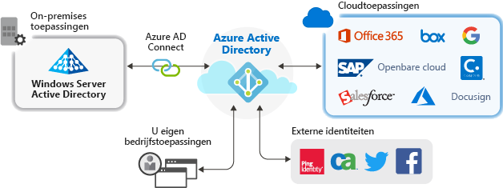

# Toepassingsbeheer met Azure Active Directory

Azure Active Directory (Azure AD) biedt veilige en naadloze toegang tot de cloud en on-premises toepassingen. Gebruikers hoeven zich slechts één keer aan te melden voor toegang tot Office 365 en andere zakelijke toepassingen van Microsoft, SaaS-toepassingen (software als een dienst), on-premises-toepassingen en LOB-apps (line-of-business). Administratieve kosten verlagen door het automatiseren van gebruikersinrichting. Meervoudige verificatie en beleid voor voorwaardelijke toegang gebruiken voor toegang tot beveiligde toepassingen.

## Waarom toepassingen beheren met een cloud-oplossing?

Organisaties hebben vaak honderden toepassingen waar gebruikers afhankelijk van zijn voor hun werk. Gebruikers hebben toegang tot deze toepassingen van groot aantal apparaten en -locaties. Elke dag worden nieuwe toepassingen toegevoegd, ontwikkeld en buiten gebruik gesteld. Met vele toepassingen en toegangspunten is het belangrijker dan ooit om een cloud-gebaseerde oplossing gebruiken voor het beheren van toegang tot alle toepassingen.

## Beheer de risico’s met een voorwaardelijk toegangsbeleid
Koppelen van Azure AD eenmalige aanmelding (SSO) met beleid voor voorwaardelijke toegang biedt een hoge mate van beveiliging voor toegang tot toepassingen. Mogelijkheden voor beveiliging zijn schaalbare cloud-identiteitsbeveiliging, risicogebaseerde meervoudige verificatie en beleid voor voorwaardelijke toegang. Dankzij deze mogelijkheden kunt een nauwkeurig beheer creëren op basis van toepassingen of van groepen die een hoger niveau van beveiliging nodig hebben.

## Verhoog de productiviteit met eenmalige aanmelding
Eenmalige aanmelding (SSO) voor toepassingen en Office 365 biedt een superieure aanmeldingservaring voor bestaande gebruikers door verschillende aanmeldingen te elimineren. Er wordt een samenhangende gebruikersomgeving gecreëerd zonder afleiding door meerdere aanmeldschermen of de noodzaak om meerdere wachtwoorden te beheren. De bedrijfsgroep kan toegang beheren en goedkeuren via selfservice en dynamisch lidmaatschap. De zorg dat alleen de juiste personen in het bedrijf toegang hebben tot een toepassing verbetert de beveiliging van het identiteitssysteem.

SSO verbetert de beveiliging. *Zonder eenmalige aanmelding* moeten beheerders gebruikersaccounts maken en bijwerken voor elke afzonderlijke toepassing. Dat kost waardevolle tijd. Gebruikers moeten meerdere referenties bijhouden voor toegang tot hun toepassingen. Als gevolg hiervan schrijven gebruikers vaak hun wachtwoorden op of gebruiken andere oplossingen voor wachtwoordbeheer waarmee het beveiligingsrisico stijgt. 

## Voeg governance en naleving toe
Met Azure AD, kunt u de toepassing-aanmeldingen bewaken met behulp van rapporten die gebruikmaken van hulpprogramma's voor beveiligingsincidenten en gebeurtenisbewaking (SIEM). U kunt de rapporten openen vanuit de portal of via API's. Programmatisch controleren wie toegang heeft tot uw toepassingen en toegang verwijderen van niet-actieve gebruikers via toegangsbeoordelingen.

## Kosten beheren
Door te migreren naar Azure AD, kunt u kosten besparen en wordt het beheer van on-premises infrastructuur makkelijk. Azure AD biedt ook self-service tot toepassingen, en bespaart daarmee tijd voor beheerders en gebruikers. Eenmalige aanmelding elimineert de noodzaak van toepassingsspecifieke wachtwoorden. De mogelijkheid u slechts eenmaal te hoeven aanmelden, bespaart op kosten in verband met wachtwoordherstel voor toepassingen en wordt productieverlies voorkomen bij het ophalen van wachtwoorden.

