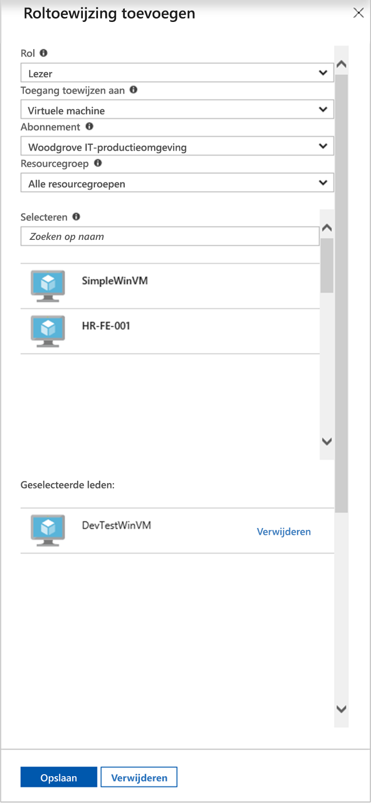

# <a name="use-a-windows-vm-system-assigned-managed-identity-to-access-resource-manager"></a>Een door het Windows-VM-systeem toegewezen beheerde identiteit gebruiken voor toegang tot Resource Manager

[!INCLUDE [preview-notice](../../../includes/active-directory-msi-preview-notice.md)]

In deze zelfstudie ziet u hoe u toegang krijgt tot de Azure Resource Manager-API met een virtuele Windows-machine waarop een door het systeem toegewezen beheerde identiteit is ingeschakeld. Beheerde entiteiten voor Azure-resources worden automatisch beheerd in Azure en stellen u in staat om te verifiëren bij services die Microsoft Azure AD-verificatie ondersteunen, zonder referenties in code te hoeven invoegen. In deze zelfstudie leert u procedures om het volgende te doen:

> [!div class="checklist"] 
> * Uw virtuele machine toegang verlenen tot een resourcegroep in Azure Resource Manager 
> * Een toegangstoken ophalen met behulp van de identiteit van de virtuele machine en daarmee Azure Resource Manager aanroepen

## <a name="prerequisites"></a>Vereisten

[!INCLUDE [msi-qs-configure-prereqs](../../../includes/active-directory-msi-qs-configure-prereqs.md)]

[!INCLUDE [msi-tut-prereqs](../../../includes/active-directory-msi-tut-prereqs.md)]

- [Aanmelden bij de Azure-portal](https://portal.azure.com)

- [Een virtuele Windows-machine maken](/azure/virtual-machines/windows/quick-create-portal)

- [Door het systeem toegewezen beheerde identiteit op uw virtuele machine inschakelen](/azure/active-directory/managed-service-identity/qs-configure-portal-windows-vm#enable-system-assigned-identity-on-an-existing-vm)

## <a name="grant-your-vm-access-to-a-resource-group-in-resource-manager"></a>Uw virtuele machine toegang verlenen tot een resourcegroep in Resource Manager
Met behulp van beheerde identiteiten voor Azure-resources kan uw code toegangstokens ophalen voor verificatie bij resources die ondersteuning bieden voor Microsoft Azure AD-verificatie.  Azure Resource Manager biedt ondersteuning voor Azure AD-verificatie.  Eerst moeten we de door het systeem toegewezen beheerde identiteit van deze VM toegang verlenen tot een resource in Resource Manager, in dit geval de resourcegroep waarin de VM is opgenomen.  

1.  Navigeer naar het tabblad **Resourcegroepen**. 
2.  Selecteer de specifieke **resourcegroep** die u eerder voor uw **virtuele Windows-machine** hebt gemaakt. 
3.  Ga naar **Toegangsbeheer (IAM)** in het linkerpaneel. 
4.  Klik vervolgens op **Toevoegen** om een nieuwe roltoewijzing voor de **virtuele Windows-machine** toe te voegen.  Kies **Rol** als **lezer**. 
5.  Stel in de volgende vervolgkeuzelijst, **Toegang toewijzen aan**, de resource in op **Virtuele machine**. 
6.  Controleer vervolgens of het juiste abonnement wordt weergegeven in de vervolgkeuzelijst **Abonnement**. Bij **Resourcegroep** selecteert u **Alle resourcegroepen**. 
7.  Kies ten slotte bij **Selecteren** uw virtuele Windows-machine in de vervolgkeuzelijst en klik op **Opslaan**.

    

## <a name="get-an-access-token-using-the-vms-system-assigned-managed-identity-and-use-it-to-call-azure-resource-manager"></a>Een toegangstoken ophalen met behulp van de door het systeem toegewezen beheerde identiteit van de VM en dit gebruiken om er Azure Resource Manager mee aan te roepen 

In dit gedeelte moet u **PowerShell** gebruiken.  Als **Powershell** nog niet is geïnstalleerd, downloadt u het [hier](https://docs.microsoft.com/powershell/azure/overview?view=azurermps-4.3.1). 

1.  Navigeer in Azure Portal naar **Virtuele machines**, ga naar uw virtuele Windows-machine en klik op de pagina **Overzicht** op **Verbinden**. 
2.  Voer uw referenties (**gebruikersnaam** en **wachtwoord**) in die u hebt toegevoegd bij het maken van de virtuele Windows-machine. 
3.  Nu u een **Verbinding met extern bureaublad** met de virtuele machine hebt gemaakt, opent u **PowerShell** in de externe sessie. 
4.  Dien met behulp van Powershell een Invoke-WebRequest-aanvraag in bij de lokaal beheerde identiteit om een toegangstoken voor Azure Resource Manager op te halen voor het Azure-resources-eindpunt.

    ```powershell
       $response = Invoke-WebRequest -Uri 'http://169.254.169.254/metadata/identity/oauth2/token?api-version=2018-02-01&resource=https%3A%2F%2Fmanagement.azure.com%2F' -Method GET -Headers @{Metadata="true"}
    ```
    
    > [!NOTE]
    > De waarde van de parameter 'resource' moet exact overeenkomen met wat er in Azure AD wordt verwacht. Wanneer u de resource-id van Azure Resource Manager gebruikt, moet u de URI opgeven met een slash op het einde.
    
    Extraheer vervolgens de volledige reactie, die is opgeslagen als een tekenreeks in JSON-indeling (JavaScript Object Notation) in het object $response. 
    
    ```powershell
    $content = $response.Content | ConvertFrom-Json
    ```
    Extraheer vervolgens het toegangstoken uit het antwoord.
    
    ```powershell
    $ArmToken = $content.access_token
    ```
    
    Roep ten slotte Azure Resource Manager aan met behulp van het toegangstoken. In dit voorbeeld gebruiken we Invoke-WebRequest van PowerShell ook om Azure Resource Manager aan te roepen en het toegangstoken in de autorisatie-header op te nemen.
    
    ```powershell
    (Invoke-WebRequest -Uri https://management.azure.com/subscriptions/<SUBSCRIPTION ID>/resourceGroups/<RESOURCE GROUP>?api-version=2016-06-01 -Method GET -ContentType "application/json" -Headers @{ Authorization ="Bearer $ArmToken"}).content
    ```
    > [!NOTE] 
    > De URL is hoofdlettergevoelig, dus gebruik precies dezelfde naam van de resourcegroep als hiervoor, met inbegrip van de hoofdletter 'G' in 'resourceGroups'.
        
    De volgende opdracht retourneert de gegevens van de resourcegroep:

    ```powershell
    {"id":"/subscriptions/98f51385-2edc-4b79-bed9-7718de4cb861/resourceGroups/DevTest","name":"DevTest","location":"westus","properties":{"provisioningState":"Succeeded"}}
    ```

## <a name="next-steps"></a>Volgende stappen

In deze snelstart hebt u geleerd hoe u toegang krijgt tot de Azure Resource Manager-API met een door het systeem beheerde identiteit.  Zie voor meer informatie over Azure Resource Manager:

> [!div class="nextstepaction"]
>[Azure Resource Manager](/azure/azure-resource-manager/resource-group-overview)

