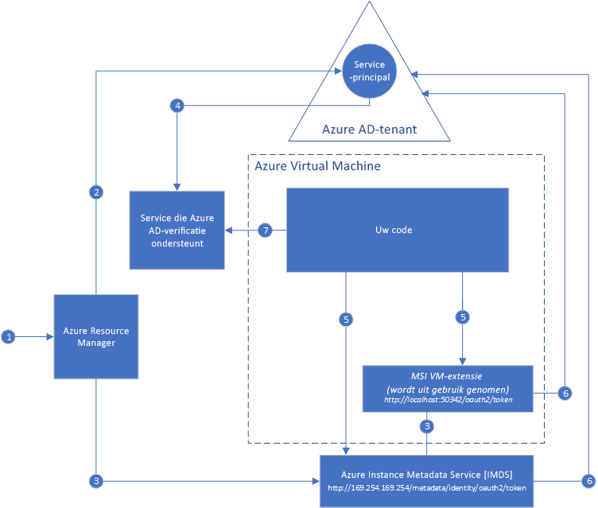

#  Wat is Managed Service Identity voor Azure-resources?

[!INCLUDE[preview-notice](../../../includes/active-directory-msi-preview-notice.md)]

Een veelvoorkomende uitdaging bij het bouwen van cloud-apps is het beheren van de referenties die in uw code moeten worden opgenomen voor verificatie bij cloudservices. Het is belangrijk dat deze referenties veilig worden verwerkt. In het ideale geval worden ze nooit weergegeven op werkstations van ontwikkelaars of ingecheckt in broncodebeheer. Azure Key Vault biedt een manier voor het veilig opslaan van referenties en andere sleutels en geheimen, maar uw code moet worden geverifieerd voor Key Vault om ze op te halen. Managed Service Identity levert Azure-services met een automatisch beheerde identiteit in Azure Active Directory (Azure AD), waarmee dit probleem eenvoudiger kan worden opgelost. U kunt deze identiteit gebruiken voor verificatie bij alle services die ondersteuning bieden voor Azure AD-verificatie, inclusief Key Vault, zonder dat u referenties in uw code hoeft te hebben.

Managed Service Identity wordt gratis geleverd bij Azure Active Directory. Dit is de standaardoptie voor Azure-abonnementen. Er zijn geen extra kosten voor Managed Service Identity.

## Hoe werkt het?

Er zijn twee soorten Managed Service-identiteiten: **door het systeem toegewezen** en **door de gebruiker toegewezen**.

- Een **door het systeem toegewezen identiteit** wordt rechtstreeks op een Azure Service-exemplaar ingeschakeld. Wanneer dit is ingeschakeld, wordt een identiteit voor het service-exemplaar in de Azure AD-tenant gemaakt, dat wordt vertrouwd door het abonnement van het service-exemplaar. Zodra de identiteit is gemaakt, worden de referenties ingericht op het service-exemplaar. De levenscyclus van een door het systeem toegewezen identiteit is rechtstreeks gekoppeld aan het Azure Service-exemplaar waarop de identiteit is ingeschakeld. Als het service-exemplaar wordt verwijderd, ruimt Azure automatisch de referenties en de identiteit in Azure AD op.
- Een **door de gebruiker toegewezen identiteit** wordt gemaakt als een zelfstandige Azure-resource. Via een productieproces maakt Azure een identiteit in de Azure AD-tenant, die wordt vertrouwd door het abonnement dat wordt gebruikt. Nadat de identiteit is gemaakt, kan deze worden toegewezen aan een of meer Azure Service-exemplaren. De levenscyclus van een door de gebruiker toegewezen identiteit wordt afzonderlijk beheerd van de levenscyclus van de Azure Service-exemplaren waaraan de identiteit is toegewezen.

Als gevolg hiervan kan uw code een door het systeem of door de gebruiker toegewezen identiteit gebruiken om toegangstokens aan te vragen voor services die ondersteuning bieden voor Azure AD-verificatie. Azure zorgt voor het implementeren van de referenties die worden gebruikt door het service-exemplaar.

Hier volgt een voorbeeld van hoe door het systeem toegewezen identiteiten werken met Azure-VM's:

1. Azure Resource Manager ontvangt een aanvraag voor het inschakelen van de door het systeem toegewezen identiteit op een VM.
2. Azure Resource Manager maakt een Service-principal in Azure AD die de identiteit van de virtuele machine voorstelt. De Service-principal wordt gemaakt in de Azure AD-tenant die wordt vertrouwd door dit abonnement.
3. Azure Resource Manager configureert de identiteit op de VM:
    - Het Azure Instance Metadata Service-eindpunt voor identiteit wordt bijgewerkt met de client-id en het certificaat van de Service-principal.
    - De VM-extensie wordt ingericht en de client-id en het certificaat van de Service-principal wordt toegevoegd. (Wordt afgeschaft.)
4. Nu de VM een identiteit heeft, gebruiken we de informatie van de Service-principal om de virtuele machine toegang te verlenen tot Azure-resources. Als uw code bijvoorbeeld Azure Resource Manager moet aanroepen, zou u de Service-principal van de VM de juiste rol toewijzen  met behulp van op rollen gebaseerd toegangsbeheer (RBAC) in Azure AD. Als uw code Key Vault moet aanroepen, zou u uw code toegang verlenen tot het specifieke geheim of de specifieke sleutel in Key Vault.
5. De code die wordt uitgevoerd op de virtuele machine, kan een token aanvragen vanaf twee eindpunten die alleen toegankelijk zijn vanuit de virtuele machine:

    - IMDS-eindpunt voor identiteit (Azure Instance Metadata Service): http://169.254.169.254/metadata/identity/oauth2/token (aanbevolen)
        - De resourceparameter specificeert de service waarnaar het token wordt verzonden. Als u bijvoorbeeld wilt dat uw code wordt geverifieerd voor Azure Resource Manager, gebruikt u resource=https://management.azure.com/.
        - De API-versieparameter specificeert de IMDS-versie, gebruik api-version=2018-02-01 of hoger.
    - Eindpunt voor VM-extensie: http://localhost:50342/oauth2/token (wordt afgeschaft)
        - De resourceparameter specificeert de service waarnaar het token wordt verzonden. Als u bijvoorbeeld wilt dat uw code wordt geverifieerd voor Azure Resource Manager, gebruikt u resource=https://management.azure.com/.

6. Er wordt een aanroep uitgevoerd naar Azure AD om een toegangstoken aan te vragen zoals beschreven in stap 5, met behulp van de client-id en het certificaat geconfigureerd in stap 3. Azure AD retourneert een JWT-toegangstoken (JSON Web Token).
7. Uw code verzendt het toegangstoken bij een aanroep naar een service die Azure AD-verificatie ondersteunt.

Hier is (met gebruikmaking van hetzelfde diagram) een voorbeeld van hoe een door de gebruiker toegewezen MSI met Azure Virtual Machines werkt.

1. Azure Resource Manager ontvangt een aanvraag voor het maken van een door de gebruiker toegewezen identiteit.
2. Azure Resource Manager maakt een Service-principal in Azure AD die de identiteit van de door de gebruiker toegewezen identiteit voorstelt. De Service-principal wordt gemaakt in de Azure AD-tenant die wordt vertrouwd door dit abonnement.
3. Azure Resource Manager ontvangt een aanvraag voor het configureren van de door de gebruiker toegewezen identiteit op een VM.
    - Het Azure Instance Metadata Service-eindpunt voor identiteit wordt bijgewerkt met de client-id en het certificaat van de Service-principal voor de door de gebruiker toegewezen identiteit.
    - De VM-extensie wordt ingericht en de client-id en het certificaat van de Service-principal voor de door de gebruiker toegewezen identiteit worden toegevoegd (wordt afgeschaft).
4. Nu de door de gebruiker toegewezen identiteit is gemaakt, gebruiken we de informatie van de Service-principal om de identiteit toegang te verlenen tot Azure-resources. Als uw code bijvoorbeeld Azure Resource Manager moet aanroepen, zou u de Service-principal van de door de gebruiker toegewezen identiteit de juiste rol toewijzen  met behulp van op rollen gebaseerd toegangsbeheer (RBAC) in Azure AD. Als uw code Key Vault moet aanroepen, zou u uw code toegang verlenen tot het specifieke geheim of de specifieke sleutel in Key Vault. Opmerking: deze stap kan ook vóór stap 3 worden uitgevoerd.
5. De code die wordt uitgevoerd op de virtuele machine, kan een token aanvragen vanaf twee eindpunten die alleen toegankelijk zijn vanuit de virtuele machine:

    - IMDS-eindpunt voor identiteit (Azure Instance Metadata Service): http://169.254.169.254/metadata/identity/oauth2/token (aanbevolen)
        - De resourceparameter specificeert de service waarnaar het token wordt verzonden. Als u bijvoorbeeld wilt dat uw code wordt geverifieerd voor Azure Resource Manager, gebruikt u resource=https://management.azure.com/.
        - Client-id-parameter bevat de identiteit waarvoor het token wordt aangevraagd. Dit is vereist om ambiguïteit op te heffen wanneer meer dan een door de gebruiker toegewezen identiteiten aanwezig is op een enkele virtuele machine.
        - De API-versieparameter specificeert de IMDS-versie, gebruik api-version=2018-02-01 of hoger.

    - Eindpunt voor VM-extensie: http://localhost:50342/oauth2/token (wordt afgeschaft)
        - De resourceparameter specificeert de service waarnaar het token wordt verzonden. Als u bijvoorbeeld wilt dat uw code wordt geverifieerd voor Azure Resource Manager, gebruikt u resource=https://management.azure.com/.
        - Client-id-parameter bevat de identiteit waarvoor het token wordt aangevraagd. Dit is vereist om ambiguïteit op te heffen wanneer meer dan een door de gebruiker toegewezen identiteiten aanwezig is op een enkele virtuele machine.
6. Er wordt een aanroep uitgevoerd naar Azure AD om een toegangstoken aan te vragen zoals beschreven in stap 5, met behulp van de client-id en het certificaat geconfigureerd in stap 3. Azure AD retourneert een JWT-toegangstoken (JSON Web Token).
7. Uw code verzendt het toegangstoken bij een aanroep naar een service die Azure AD-verificatie ondersteunt.
     
## Managed Service Identity proberen

Volgt een zelfstudie over Managed Service Identity om complete scenario's te leren kennen voor het krijgen van toegang tot verschillende Azure-resources:
  
| Vanuit een voor beheerde identiteit ingeschakelde resource | Leer hoe u het volgende doet: |
| ------- | -------- |
| Azure VM (Windows) | [Toegang krijgen tot Azure Data Lake Store met een Managed Service Identity voor Windows-VM](tutorial-windows-vm-access-datalake.md) |
|                    | [Toegang krijgen tot Azure Resource Manager met een Managed Service Identity voor Windows-VM](tutorial-windows-vm-access-arm.md) |
|                    | [Toegang krijgen tot Azure SQL met een Managed Service Identity voor Windows-VM](tutorial-windows-vm-access-sql.md) |
|                    | [Toegang krijgen tot Azure Storage via toegangssleutel met een Managed Service Identity voor Windows-VM](tutorial-windows-vm-access-storage.md) |
|                    | [Toegang krijgen tot Azure Storage via SAS met een Managed Service Identity voor Windows-VM](tutorial-windows-vm-access-storage-sas.md) |
|                    | [Toegang krijgen tot een niet-Azure AD-resource met een Managed Service Identity voor Windows-VM en Azure Key Vault](tutorial-windows-vm-access-nonaad.md) |
| Azure VM (Linux)   | [Toegang krijgen tot Azure Data Lake Store met een Managed Service Identity voor Linux-VM](tutorial-linux-vm-access-datalake.md) |
|                    | [Toegang krijgen tot Azure Resource Manager met een Managed Service Identity voor Linux-VM](tutorial-linux-vm-access-arm.md) |
|                    | [Toegang krijgen tot Azure Storage via toegangssleutel met een Managed Service Identity voor Linux-VM](tutorial-linux-vm-access-storage.md) |
|                    | [Toegang krijgen tot Azure Storage via SAS met een Managed Service Identity voor Linux-VM](tutorial-linux-vm-access-storage-sas.md) |
|                    | [Toegang tot een niet-Azure AD-resource met een Managed Service Identity voor Linux-VM en Azure Key Vault](tutorial-linux-vm-access-nonaad.md) |
| Azure App Service  | [Managed Service Identity gebruiken met Azure App Service of Azure Functions](/azure/app-service/app-service-managed-service-identity) |
| Azure Functions    | [Managed Service Identity gebruiken met Azure App Service of Azure Functions](/azure/app-service/app-service-managed-service-identity) |
| Azure Service Bus  | [Managed Service Identity gebruiken met Azure Service Bus](../../service-bus-messaging/service-bus-managed-service-identity.md) |
| Azure Event Hubs   | [Managed Service Identity gebruiken met Azure Event Hubs](../../event-hubs/event-hubs-managed-service-identity.md) |
| Azure API Management | [Managed Service Identity gebruiken met Azure API Management](../../api-management/api-management-howto-use-managed-service-identity.md) |

## Welke Azure-services ondersteunen Managed Service Identity?

Beheerde identiteiten kunnen worden gebruikt voor verificatie bij services die ondersteuning bieden voor Azure AD-verificatie. Raadpleeg het volgende artikel voor een lijst met Azure-services die ondersteuning bieden voor Managed Service Identity:
- [Services die Managed Service Identity ondersteunen](services-support-msi.md)

## Volgende stappen

Ga aan de slag met Azure Managed Service Identity met de volgende snelstartgidsen:

* [Een Managed Service Identity voor Windows-VM gebruiken voor toegang tot Resource Manager - Windows-VM](tutorial-windows-vm-access-arm.md)
* [Een Managed Service Identity voor Linux-VM gebruiken voor toegang tot Azure Resource Manager - Linux-VM](tutorial-linux-vm-access-arm.md)
