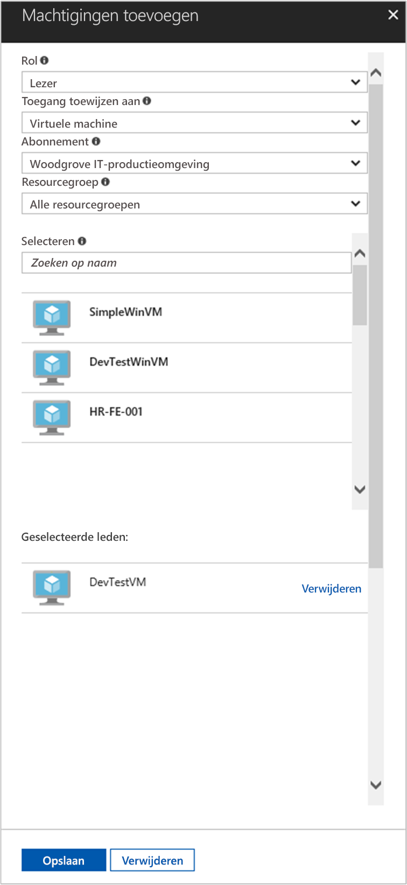

# <a name="use-a-linux-vm-system-assigned-managed-identity-to-access-azure-resource-manager"></a>Een door het Linux-VM-systeem toegewezen beheerde identiteit gebruiken voor toegang tot Azure Resource Manager

[!INCLUDE[preview-notice](../../../includes/active-directory-msi-preview-notice.md)]

Deze snelstart laat zien hoe u toegang krijgt tot de Azure Resource Manager-API met een door het systeem toegewezen identiteit voor een virtuele Linux-machine (VM). Beheerde entiteiten voor Azure-resources worden automatisch beheerd in Azure en stellen u in staat om te verifiëren bij services die Microsoft Azure AD-verificatie ondersteunen, zonder referenties in code te hoeven invoegen. In deze zelfstudie leert u procedures om het volgende te doen:

> [!div class="checklist"]
> * Uw virtuele machine toegang verlenen tot een resourcegroep in Azure Resource Manager 
> * Een toegangstoken ophalen met behulp van de identiteit van de virtuele machine en daarmee Azure Resource Manager aanroepen 

## <a name="prerequisites"></a>Vereisten

[!INCLUDE [msi-qs-configure-prereqs](../../../includes/active-directory-msi-qs-configure-prereqs.md)]

[!INCLUDE [msi-tut-prereqs](../../../includes/active-directory-msi-tut-prereqs.md)]

- [Aanmelden bij de Azure-portal](https://portal.azure.com)

- [Een virtuele Linux-machine maken](/azure/virtual-machines/linux/quick-create-portal)

- [Door het systeem toegewezen beheerde identiteit op uw virtuele machine inschakelen](/azure/active-directory/managed-service-identity/qs-configure-portal-windows-vm#enable-system-assigned-identity-on-an-existing-vm)

## <a name="grant-your-vm-access-to-a-resource-group-in-azure-resource-manager"></a>Uw virtuele machine toegang verlenen tot een resourcegroep in Azure Resource Manager 

Met behulp van beheerde identiteiten voor Azure-resources kan uw code toegangstokens ophalen voor verificatie bij resources die ondersteuning bieden voor Microsoft Azure AD-verificatie. De Azure Resource Manager-API biedt ondersteuning voor Azure AD-verificatie. Eerst moeten we de identiteit van deze virtuele machine toegang verlenen tot een resource in Azure Resource Manager, in dit geval de resourcegroep waarin de virtuele machine is opgenomen.  

1. Navigeer naar het tabblad **Resourcegroepen**.
2. Selecteer de specifieke **resourcegroep** die u eerder hebt gemaakt.
3. Ga naar **Toegangsbeheer (IAM)** in het linkerpaneel.
4. Klik op **Toevoegen** om een nieuwe roltoewijzing voor de virtuele machine toe te voegen. Kies **Rol** als **lezer**.
5. Stel in de volgende vervolgkeuzelijst **Toegang toewijzen aan** de resource in op **Virtuele machine**.
6. Controleer vervolgens of het juiste abonnement wordt weergegeven in de vervolgkeuzelijst **Abonnement**. Bij **Resourcegroep** selecteert u **Alle resourcegroepen**.
7. Kies ten slotte bij **Selecteren** uw virtuele Linux-machine in de vervolgkeuzelijst en klik op **Opslaan**.

    

## <a name="get-an-access-token-using-the-vms-system-assigned-managed-identity-and-use-it-to-call-resource-manager"></a>Een toegangstoken ophalen met behulp van de door het systeem toegewezen beheerde identiteit van de VM en dit gebruiken om er Resource Manager mee aan te roepen 

U hebt een SSH-client nodig om deze stappen uit te voeren. Als u Windows gebruikt, kunt u de SSH-client in het [Windows-subsysteem voor Linux](https://msdn.microsoft.com/commandline/wsl/about) gebruiken. Zie [De sleutels van uw SSH-client gebruiken onder Windows in Azure](../../virtual-machines/linux/ssh-from-windows.md) of [Een sleutelpaar met een openbare SSH-sleutel en een privé-sleutel maken en gebruiken voor virtuele Linux-machines in Azure](../../virtual-machines/linux/mac-create-ssh-keys.md) als u hulp nodig hebt bij het configureren van de sleutels van uw SSH-client.

1. Navigeer in de portal naar de virtuele Linux-machine en klik in het **overzicht** op **Verbinden**.  
2. **Maak verbinding** met de virtuele machine met de SSH-client van uw keuze. 
3. Dien in het terminalvenster met behulp van CURL een aanvraag in bij het eindpunt van de lokaal beheerde identiteiten voor Azure-resources om een toegangstoken voor Azure Resource Manager op te halen.  
 
    Hieronder ziet u de CURL-aanvraag voor het toegangstoken.  
    
    ```bash
    curl 'http://169.254.169.254/metadata/identity/oauth2/token?api-version=2018-02-01&resource=https%3A%2F%2Fmanagement.azure.com%2F' -H Metadata:true   
    ```
    
    > [!NOTE]
    > De waarde van de parameter 'resource' moet exact overeenkomen met wat er in Azure AD wordt verwacht.  Wanneer u de resource-id van Resource Manager gebruikt, moet de URI opgeven met een slash op het einde. 
    
    Het antwoord bevat het toegangstoken dat u nodig hebt voor toegang tot Azure Resource Manager. 
    
    Reactie:  

    ```bash
    {"access_token":"eyJ0eXAiOi...",
    "refresh_token":"",
    "expires_in":"3599",
    "expires_on":"1504130527",
    "not_before":"1504126627",
    "resource":"https://management.azure.com",
    "token_type":"Bearer"} 
    ```
    
    U kunt dit toegangstoken gebruiken voor toegang tot Azure Resource Manager, bijvoorbeeld om de details te bekijken van de resourcegroep waaraan u deze virtuele machine eerder toegang hebt verleend. Vervang de waarden van \<SUBSCRIPTION ID\> (abonnements-id), \<RESOURCE GROUP\> (resourcegroep) en \<ACCESS TOKEN\> (toegangstoken) door de waarden die u eerder hebt gemaakt. 
    
    > [!NOTE]
    > De URL is hoofdlettergevoelig, dus gebruik precies dezelfde naam van de resourcegroep als hiervoor, met inbegrip van de hoofdletter 'G' in 'resourceGroup'.  
    
    ```bash 
    curl https://management.azure.com/subscriptions/<SUBSCRIPTION ID>/resourceGroups/<RESOURCE GROUP>?api-version=2016-09-01 -H "Authorization: Bearer <ACCESS TOKEN>" 
    ```
    
    De reactie met de specifieke resourcegroepsinformatie: 
     
    ```bash
    {"id":"/subscriptions/98f51385-2edc-4b79-bed9-7718de4cb861/resourceGroups/DevTest","name":"DevTest","location":"westus","properties":{"provisioningState":"Succeeded"}} 
    ```     

## <a name="next-steps"></a>Volgende stappen

In deze snelstart hebt u geleerd hoe u toegang krijgt tot de Azure Resource Manager-API met een door het systeem beheerde identiteit.  Zie voor meer informatie over Azure Resource Manager:

> [!div class="nextstepaction"]
>[Azure Resource Manager](/azure/azure-resource-manager/resource-group-overview)