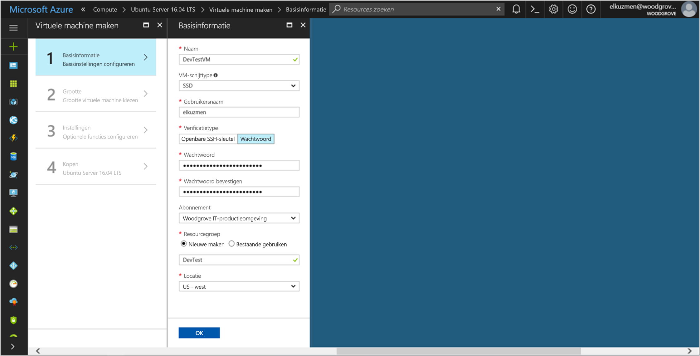
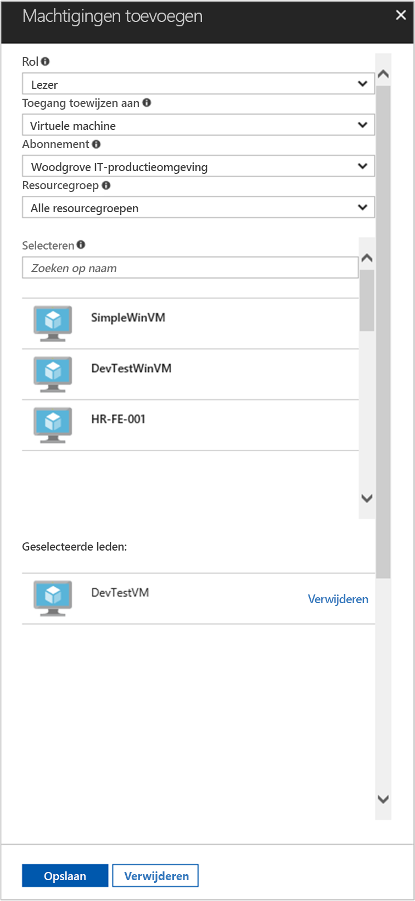

# <a name="use-a-linux-vm-managed-service-identity-msi-to-access-azure-resource-manager"></a>Een Linux VM beheerde Service identiteit (MSI) gebruiken voor toegang tot Azure Resource Manager

[!INCLUDE[preview-notice](../../includes/active-directory-msi-preview-notice.md)]

Deze zelfstudie laat zien hoe u beheerde Service identiteit (MSI) inschakelen voor een virtuele Linux-Machine en vervolgens die identiteit gebruiken voor toegang tot de Azure Resource Manager-API. Beheerde Service-identiteiten worden automatisch beheerd door Azure en u te verifiëren bij services die ondersteuning bieden voor Azure AD-verificatie zonder referenties invoegen in uw code. Procedures voor:

> [!div class="checklist"]
> * MSI op een virtuele Linux-Machine inschakelen 
> * Uw VM-toegang verlenen aan een resourcegroep in Azure Resource Manager 
> * Ophalen van een toegangstoken met behulp van de identiteit van de virtuele machine en het aanroepen van Azure Resource Manager 

## <a name="prerequisites"></a>Vereisten

[!INCLUDE [msi-qs-configure-prereqs](../../includes/active-directory-msi-qs-configure-prereqs.md)]

[!INCLUDE [msi-tut-prereqs](../../includes/active-directory-msi-tut-prereqs.md)]

## <a name="sign-in-to-azure"></a>Aanmelden bij Azure

Meld u aan bij Azure Portal op [https://portal.azure.com](https://portal.azure.com).

## <a name="create-a-linux-virtual-machine-in-a-new-resource-group"></a>Een virtuele Linux-Machine in een nieuwe resourcegroep maken

Voor deze zelfstudie maken we een nieuwe Linux VM. U kunt ook MSI op een bestaande virtuele machine inschakelen.

1. Klik op de knop **Nieuw** in de linkerbovenhoek van Azure Portal.
2. Selecteer **Compute** en selecteer vervolgens **Ubuntu Server 16.04 LTS**.
3. Geef de informatie van de virtuele machine op. Voor **verificatietype**, selecteer **openbare SSH-sleutel** of **wachtwoord**. De gemaakte referenties kunnen u zich aanmelden bij de virtuele machine.

    

4. Kies een **abonnement** voor de virtuele machine in de vervolgkeuzelijst.
5. Selecteer een nieuwe **resourcegroep** u wilt dat de virtuele machine om te worden gemaakt in of kies **nieuw**. Na het voltooien klikt u op **OK**.
6. Selecteer de grootte van de virtuele machine. Selecteer om te zien meer grootten, **weergeven van alle** of wijzigen van de ondersteunde schijf type filter. Handhaaf op de blade Instellingen de standaardwaarden en klik op **OK**.

## <a name="enable-msi-on-your-vm"></a>MSI op de virtuele machine inschakelen

De MSI van een virtuele Machine kunt u toegangstokens ophalen uit Azure AD zonder dat u referenties in uw code te plaatsen. Achter de MSI inschakelen biedt twee dingen: het installeren van de MSI-VM-extensie op uw virtuele machine en zorgt ervoor dat MSI voor de virtuele machine.  

1. Selecteer de **virtuele Machine** dat u inschakelen van MSI wilt op.
2. Klik op de linkernavigatiebalk **configuratie**.
3. U ziet **beheerde Service-identiteit**. Als u wilt registreren en inschakelen van het MSI-bestand, selecteer **Ja**, als u wilt uitschakelen, kiest u Nee.
4. Zorg ervoor dat u klikt op **opslaan** aan de configuratie op te slaan.

    

5. Als u wilt controleren welke uitbreidingen zijn op deze **Linux VM**, klikt u op **extensies**. Als MSI is ingeschakeld, de **ManagedIdentityExtensionforLinux** verschijnt in de lijst.

    

## <a name="grant-your-vm-access-to-a-resource-group-in-azure-resource-manager"></a>Uw VM-toegang verlenen aan een resourcegroep in Azure Resource Manager 

Met behulp van MSI Vind uw code toegangstokens voor verificatie naar bronnen die ondersteuning bieden voor Azure AD-verificatie. De Azure Resource Manager-API ondersteunt Azure AD-verificatie. Eerst moet deze VM identiteit toegang verlenen tot een resource in Azure Resource Manager, in dit geval de resourcegroep waarin de virtuele machine is opgenomen.  

1. Navigeer naar het tabblad voor **resourcegroepen**.
2. Selecteer de specifieke **resourcegroep** u eerder hebt gemaakt.
3. Ga naar **toegang tot control(IAM)** in het linkerdeelvenster.
4. Klik om **toevoegen** een nieuwe roltoewijzing voor de virtuele machine. Kies **rol** als **lezer**.
5. In de volgende vervolgkeuzelijst **toewijzen van toegang tot** de resource **virtuele Machine**.
6. Controleer vervolgens het juiste abonnement wordt vermeld in de **abonnement** vervolgkeuzelijst. En voor **resourcegroep**, selecteer **alle resourcegroepen**.
7. Ten slotte in **Selecteer** Kies uw virtuele Linux-Machine in de vervolgkeuzelijst en klik op **opslaan**.

    

## <a name="get-an-access-token-using-the-vms-identity-and-use-it-to-call-resource-manager"></a>Ophalen van een toegangstoken die met de identiteit van de VM en deze gebruiken om aan te roepen Resource Manager 

Deze stappen uit te voeren, moet u een SSH-client. Als u van Windows gebruikmaakt, kunt u de SSH-client in de [Windows-subsysteem voor Linux](https://msdn.microsoft.com/commandline/wsl/about). Als u informatie over het configureren van de client van uw SSH-sleutels nodig hebt, raadpleegt u [het gebruik van SSH-sleutels met Windows in Azure](../virtual-machines/linux/ssh-from-windows.md), of [maken en de openbare en persoonlijke sleutelpaar voor een SSH gebruiken voor virtuele Linux-machines in Azure](../virtual-machines/linux/mac-create-ssh-keys.md).

1. Navigeer in de portal voor uw Linux-VM en in de **overzicht**, klikt u op **Connect**.  
2. **Verbinding maken met** naar de virtuele machine met de SSH-client van uw keuze. 
3. Het terminalvenster met CURL, zorg er in een aanvraag naar het lokale eindpunt MSI een access-token ophalen voor Azure Resource Manager.  
 
    De aanvraag CURL voor het toegangstoken is lager dan.  
    
    ```bash
    curl http://localhost:50342/oauth2/token --data "resource=https://management.azure.com/" -H Metadata:true   
    ```
    
    > [!NOTE]
    > De waarde van de resourceparameter '' moet een exacte overeenkomst voor door Azure AD wordt verwacht.  U moet de afsluitende slash op de URI opnemen in het geval van de resource-ID van het Resource Manager. 
    
    Het antwoord bevat het toegangstoken dat u nodig hebt voor toegang tot Azure Resource Manager. 
    
    Antwoord:  

    ```bash
    {"access_token":"eyJ0eXAiOi...",
    "refresh_token":"",
    "expires_in":"3599",
    "expires_on":"1504130527",
    "not_before":"1504126627",
    "resource":"https://management.azure.com",
    "token_type":"Bearer"} 
    ```
    
    U kunt deze toegangstoken gebruiken voor toegang tot Azure Resource Manager, bijvoorbeeld lezen van de details van de resourcegroep die u eerder deze VM-toegang verleend. Vervang de waarden van \<ABONNEMENTS-ID\>, \<RESOURCEGROEP\>, en \<ACCESS TOKEN\> met de referenties die u eerder hebt gemaakt. 
    
    > [!NOTE]
    > De URL is hoofdlettergevoelig, dus Controleer als u de dezelfde hoofdletters gebruikt als u eerder gebruikt wanneer u de resourcegroep en de hoofdletters 'G' in 'resourceGroup' genoemd.  
    
    ```bash 
    curl https://management.azure.com/subscriptions/<SUBSCRIPTION ID>/resourceGroups/<RESOURCE GROUP>?api-version=2016-09-01 -H "Authorization: Bearer <ACCESS TOKEN>" 
    ```
    
    Het antwoord terug met de specifieke informatie in de resourcegroep: 
     
    ```bash
    {"id":"/subscriptions/98f51385-2edc-4b79-bed9-7718de4cb861/resourceGroups/DevTest","name":"DevTest","location":"westus","properties":{"provisioningState":"Succeeded"}} 
    ```
     
## <a name="related-content"></a>Gerelateerde inhoud

- Zie voor een overzicht van MSI [overzicht van de Service-identiteit beheerd](../active-directory/msi-overview.md).

Gebruik de volgende sectie met opmerkingen uw feedback en help ons verfijnen en onze content vorm.

