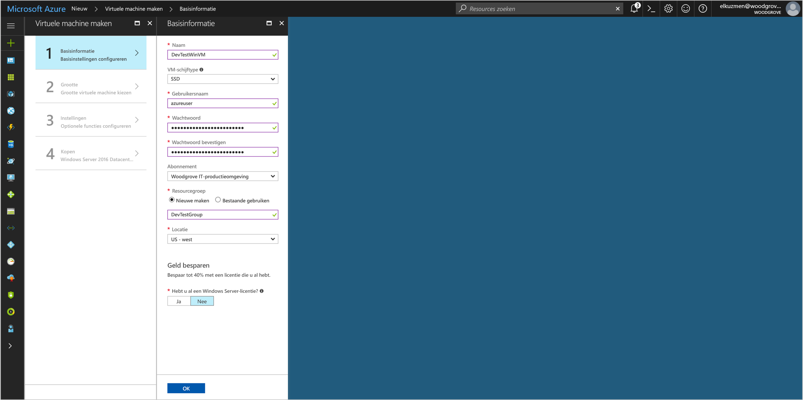
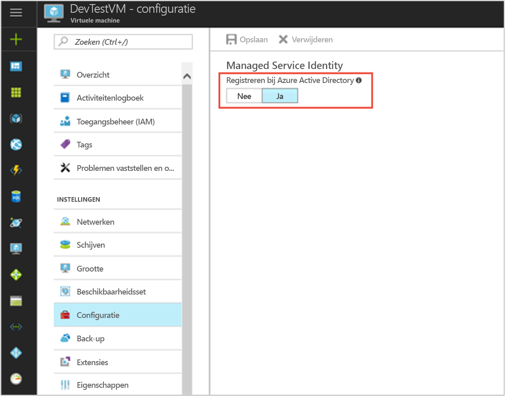

# <a name="use-a-windows-vm-managed-service-identity-msi-to-access-azure-key-vault"></a>Een Windows VM beheerde Service identiteit (MSI) gebruiken voor toegang tot Azure Sleutelkluis 

[!INCLUDE[preview-notice](../../includes/active-directory-msi-preview-notice.md)]

Deze zelfstudie laat zien hoe u beheerde Service identiteit (MSI) inschakelen voor een virtuele Windows-Machine en vervolgens die identiteit gebruiken voor toegang tot Azure Sleutelkluis. Fungeren als een bootstrap, maakt Sleutelkluis het mogelijk voor de clienttoepassing vervolgens geheim voor toegang tot bronnen die niet beveiligd door Azure Active Directory (AD) gebruiken. Beheerde Service-identiteiten worden automatisch beheerd door Azure en u te verifiëren bij services die ondersteuning bieden voor Azure AD-verificatie, zonder referenties invoegen in uw code. 

Procedures voor:


> [!div class="checklist"]
> * Beheerde Service-identiteit op een virtuele Machine van Windows inschakelen 
> * Uw VM toegang verlenen tot een geheim dat is opgeslagen in een Sleutelkluis 
> * Ophalen van een toegangstoken met behulp van de identiteit van de VM en deze gebruiken voor het ophalen van het geheim uit Sleutelkluis 

## <a name="prerequisites"></a>Vereisten

[!INCLUDE [msi-qs-configure-prereqs](../../includes/active-directory-msi-qs-configure-prereqs.md)]

[!INCLUDE [msi-tut-prereqs](../../includes/active-directory-msi-tut-prereqs.md)]

## <a name="sign-in-to-azure"></a>Aanmelden bij Azure

Meld u aan bij Azure Portal op [https://portal.azure.com](https://portal.azure.com).

## <a name="create-a-windows-virtual-machine-in-a-new-resource-group"></a>Een virtuele Windows-machine in een nieuwe resourcegroep maken

Voor deze zelfstudie maken we een nieuwe Windows VM. U kunt ook MSI op een bestaande virtuele machine inschakelen.

1.  Klik op de knop **Nieuw** in de linkerbovenhoek van Azure Portal.
2.  Selecteer **Compute** en vervolgens **Windows Server 2016 Datacenter**. 
3.  Geef de informatie van de virtuele machine op. De **gebruikersnaam** en **wachtwoord** gemaakte Hier ziet u de referenties die u kunt aanmelden bij de virtuele machine.
4.  Kies de juiste **abonnement** voor de virtuele machine in de vervolgkeuzelijst.
5.  Selecteer een nieuwe **resourcegroep** u wilt virtuele machine om te worden gemaakt in of kies **nieuw**. Na het voltooien klikt u op **OK**.
6.  Selecteer de grootte van de virtuele machine. Kies om meer groottes weer te geven de optie **Alle weergeven** of wijzig het filter **Ondersteund schijftype**. Handhaaf op de blade Instellingen de standaardwaarden en klik op **OK**.

    

## <a name="enable-msi-on-your-vm"></a>MSI op de virtuele machine inschakelen 

De MSI van een virtuele Machine kunt u toegangstokens ophalen uit Azure AD zonder dat u referenties in uw code te plaatsen. Inschakelen van MSI vertelt Azure voor het maken van een beheerde identiteit voor uw virtuele Machine. Achter de MSI inschakelen biedt twee dingen: het installeren van de MSI-VM-extensie op uw virtuele machine en zorgt ervoor dat MSI in Azure Resource Manager.

1.  Selecteer de **virtuele Machine** dat u inschakelen van MSI wilt op.  
2.  Klik op de linkernavigatiebalk **configuratie**. 
3.  U ziet **beheerde Service-identiteit**. Als u wilt registreren en inschakelen van het MSI-bestand, selecteer **Ja**, als u wilt uitschakelen, kiest u Nee. 
4.  Zorg ervoor dat u klikt op **opslaan** aan de configuratie op te slaan.  

    

5. Als u wilt controleren en nagaan welke uitbreidingen zijn op deze virtuele machine, klikt u op **extensies**. Als MSI is ingeschakeld, klikt u vervolgens **ManagedIdentityExtensionforWindows** wordt weergegeven in de lijst.

    

## <a name="grant-your-vm-access-to-a-secret-stored-in-a-key-vault"></a>Uw VM-toegang verlenen aan een geheim dat is opgeslagen in een Sleutelkluis 
 
Met behulp van MSI Vind uw code toegangstokens voor verificatie naar bronnen die ondersteuning bieden voor Azure AD-verificatie.  Niet alle Azure-services ondersteunen echter Azure AD-verificatie. Opslaan van referenties voor de service in Azure Key Vault voor het gebruik van MSI aan deze services, en het gebruik van MSI voor toegang tot de Sleutelkluis voor het ophalen van de referenties. 

Eerst moet er een Sleutelkluis maken en onze VM identiteit toegang verlenen aan de Sleutelkluis.   

1. Selecteer boven aan de linkernavigatiebalk **+ nieuw** vervolgens **beveiliging en identiteit** vervolgens **Sleutelkluis**.  
2. Geef een **naam** voor de nieuwe Sleutelkluis. 
3. De Sleutelkluis niet vinden in de hetzelfde abonnement en de resource-groep als de virtuele machine die u eerder hebt gemaakt. 
4. Selecteer **toegangsbeleid** en klik op **nieuwe toevoegen**. 
5. Selecteer in het configureren van sjabloon **geheim Management**. 
6. Kies **Principal selecteren**, en voer de naam van de virtuele machine die u eerder hebt gemaakt in het zoekveld.  Selecteer de virtuele machine in de lijst met resultaten en klik **Selecteer**. 
7. Klik op **OK** naar het nieuwe toegangsbeleid toevoegen is voltooid en **OK** toegang beleid selectie te voltooien. 
8. Klik op **maken** voltooid met het maken van de Sleutelkluis. 

    


Vervolgens een geheim toevoegen aan de Sleutelkluis, zodat u later kunt u de code die wordt uitgevoerd in uw virtuele machine met geheim ophalen: 

1. Selecteer **alle Resources**, en zoek en selecteer de Sleutelkluis die u hebt gemaakt. 
2. Selecteer **geheimen**, en klik op **toevoegen**. 
3. Selecteer **handmatige**, van **uploaden opties**. 
4. Voer een naam en waarde voor het geheim.  De waarde kan elke gewenste zijn. 
5. Laat de activering en vervaldatum wissen, en laat **ingeschakeld** als **Ja**. 
6. Klik op **maken** voor het maken van het geheim. 
 
## <a name="get-an-access-token-using-the-vm-identity-and-use-it-to-retrieve-the-secret-from-the-key-vault"></a>Ophalen van een toegangstoken met behulp van de identiteit van de VM en deze gebruiken voor het ophalen van het geheim uit de Sleutelkluis  

Als er geen PowerShell 4.3.1 of hoger geïnstalleerd, moet u [download en installeer de nieuwste versie](https://docs.microsoft.com/powershell/azure/overview).

We gebruiken de VM-MSI eerst ophalen van een toegangstoken om Sleutelkluis te verifiëren:
 
1. Navigeer in de portal naar **virtuele Machines** en gaat u naar uw Windows-machine en in de **overzicht**, klikt u op **Connect**.
2. Voer in uw **gebruikersnaam** en **wachtwoord** voor die u hebt toegevoegd tijdens het maken van de **Windows VM**.  
3. Nu dat u hebt gemaakt een **verbinding met extern bureaublad** met de virtuele machine, opent u PowerShell in de externe sessie.  
4. In PowerShell de webaanvraag voor de tenant ophalen van het token voor de lokale host in de specifieke poort voor de virtuele machine worden aangeroepen.  

    De PowerShell-aanvraag:
    
    ```powershell
    PS C:\> $response = Invoke-WebRequest -Uri http://localhost:50342/oauth2/token -Method GET -Body @{resource="https://vault.azure.net"} -Headers @{Metadata="true"} 
    ```
    
    Pak vervolgens het volledige antwoord die wordt opgeslagen als een tekenreeks in JSON JavaScript Object Notation () geformatteerd in de $response-object.  
    
    ```powershell
    PS C:\> $content = $response.Content | ConvertFrom-Json 
    ```
    
    Haal het toegangstoken vervolgens uit het antwoord.  
    
    ```powershell
    PS C:\> $KeyVaultToken = $content.access_token 
    ```
    
    Gebruik tot slot van PowerShell Invoke-WebRequest-opdracht voor het ophalen van het geheim die u eerder in de Sleutelkluis, het toegangstoken doorgeven in de autorisatie-header gemaakt.  U moet de URL van uw Sleutelkluis, dat zich bevindt in de **Essentials** sectie van de **overzicht** pagina van de Sleutelkluis.  
    
    ```powershell
    PS C:\> (Invoke-WebRequest -Uri https://<your-key-vault-URL>/secrets/<secret-name>?api-version=2016-10-01 -Method GET -Headers @{Authorization="Bearer $KeyVaultToken"}).content 
    ```
    
    Het antwoord ziet er als volgt: 
    
    ```powershell
    {"value":"p@ssw0rd!","id":"https://mytestkeyvault.vault.azure.net/secrets/MyTestSecret/7c2204c6093c4d859bc5b9eff8f29050","attributes":{"enabled":true,"created":1505088747,"updated":1505088747,"recoveryLevel":"Purgeable"}} 
    ```
    
Zodra u het geheim hebt opgehaald uit de Sleutelkluis, kunt u deze kunt gebruiken voor verificatie bij een service waarvoor een gebruikersnaam en wachtwoord. 

## <a name="related-content"></a>Gerelateerde inhoud

- Zie voor een overzicht van MSI [overzicht van de Service-identiteit beheerd](../active-directory/msi-overview.md).

Gebruik de volgende sectie met opmerkingen uw feedback en help ons verfijnen en onze content vorm.
