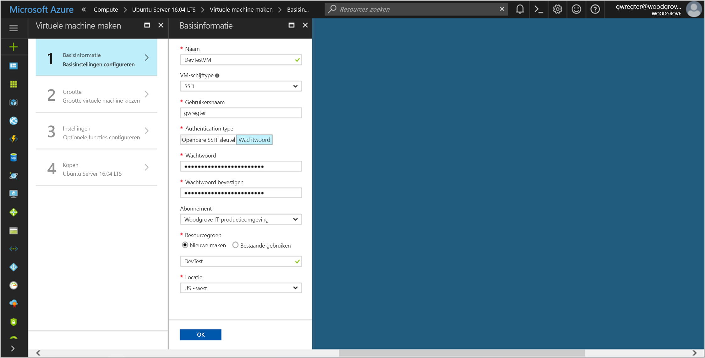
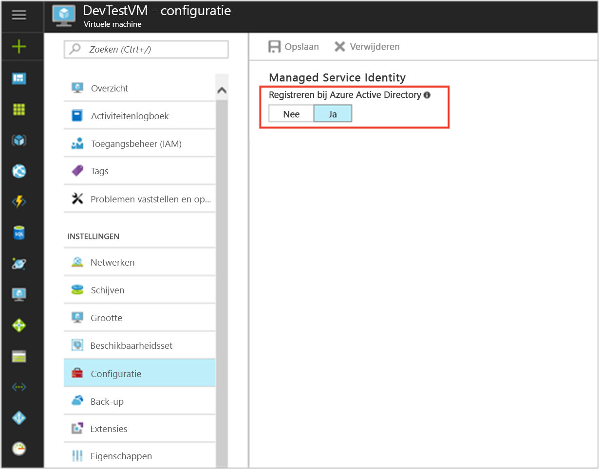

# <a name="use-a-linux-vm-managed-service-identity-msi-to-access-azure-key-vault"></a>Een Linux VM Managed Service Identity (MSI) gebruiken voor toegang tot Azure Key Vault 

[!INCLUDE[preview-notice](~/includes/active-directory-msi-preview-notice-ua.md)]

Deze zelfstudie leert u hoe u Managed Service Identity (MSI) inschakelen voor een virtuele Linux-Machine en vervolgens die identiteit gebruiken voor toegang tot Azure Key Vault. Fungeren als een bootstrap, maakt Key Vault het mogelijk voor de clienttoepassing gebruikt u het geheim voor toegang tot resources die niet beveiligd door Azure Active Directory (AD). Beheerde Service-identiteiten automatisch worden beheerd door Azure en kunt u voor de verificatie bij services die ondersteuning bieden voor Azure AD-verificatie, zonder referenties invoegen in uw code. 

In deze zelfstudie leert u procedures om het volgende te doen:

> [!div class="checklist"]
> * MSI-bestand op een Linux-Machine inschakelen 
> * Uw virtuele machine toegang verlenen tot een geheim opgeslagen in een Key Vault 
> * Een toegangstoken met behulp van de identiteit van de virtuele machine en deze gebruiken om op te halen van het geheim van de Key Vault 
 
## <a name="prerequisites"></a>Vereisten

[!INCLUDE [msi-core-prereqs](~/includes/active-directory-msi-core-prereqs-ua.md)]

[!INCLUDE [msi-tut-prereqs](~/includes/active-directory-msi-tut-prereqs.md)]

## <a name="sign-in-to-azure"></a>Aanmelden bij Azure
Meld u aan bij de Azure Portal op [https://portal.azure.com](https://portal.azure.com). 

## <a name="create-a-linux-virtual-machine-in-a-new-resource-group"></a>Een virtuele Linux-Machine in een nieuwe resourcegroep maken

Voor deze zelfstudie maken we een nieuwe Linux-VM. U kunt ook de MSI-bestand op een bestaande virtuele machine inschakelen.

1. Klik op **een resource maken** in de linkerbovenhoek van Azure portal.
2. Selecteer **Compute** en selecteer vervolgens **Ubuntu Server 16.04 LTS**.
3. Geef de informatie van de virtuele machine op. Voor **verificatietype**, selecteer **openbare SSH-sleutel** of **wachtwoord**. De gemaakte referenties kunnen u zich aanmelden bij de virtuele machine.

    

4. Kies een **abonnement** voor de virtuele machine in de vervolgkeuzelijst.
5. Selecteer een nieuwe **resourcegroep** u wilt dat de virtuele machine om te worden gemaakt in of kies **nieuw**. Na het voltooien klikt u op **OK**.
6. Selecteer de grootte voor de virtuele machine. Meer groottes Selecteer **weergeven van alle** of wijzigen van de ondersteunde schijf type filter. Behoud de standaardinstellingen op de instellingenpagina en klik op **OK**.

## <a name="enable-msi-on-your-vm"></a>MSI-bestand op de virtuele machine inschakelen

Een MSI-bestand voor de virtuele Machine kunt u tokens voor toegang van Azure AD ophalen zonder dat u om referenties in uw code. Op de achtergrond inschakelen van MSI doet twee dingen: de MSI-VM-extensie worden geïnstalleerd op de virtuele machine en zorgt ervoor dat MSI-bestand voor de virtuele machine.  

1. Selecteer de **virtuele Machine** dat u inschakelen van MSI-bestand wilt op.
2. Klik op de linker navigatiebalk op **configuratie**.
3. U ziet **beheerde Service-identiteit**. Als u wilt registreren en inschakelen van het MSI-bestand, selecteer **Ja**, als u wilt uitschakelen, kiest u Nee.
4. Controleer of u klikken op **opslaan** aan de configuratie op te slaan.

    

5. Als u wilt controleren welke uitbreidingen zijn op deze **Linux-VM**, klikt u op **extensies**. Als het MSI-bestand is ingeschakeld, de **ManagedIdentityExtensionforLinux** wordt weergegeven in de lijst.

    


## <a name="grant-your-vm-access-to-a-secret-stored-in-a-key-vault"></a>Uw VM-toegang verlenen tot een geheim opgeslagen in een Key Vault  

Met behulp van MSI krijgt uw code toegangstokens voor verificatie bij de resources die ondersteuning bieden voor Azure Active Directory-verificatie. Niet alle Azure-services bieden echter ondersteuning voor Azure AD-verificatie. Voor het gebruik van MSI-bestand met deze services, referenties voor de service in Azure Key Vault opslaan en MSI gebruiken voor toegang tot Key Vault om op te halen van de referenties. 

Eerst moet er voor het maken van een Key Vault en van onze VM identiteit toegang verlenen tot de Key Vault.   

1. Selecteer boven aan de linker navigatiebalk **+ nieuw** vervolgens **beveiliging en identiteit** vervolgens **Key Vault**.  
2. Geef een **naam** voor de nieuwe Key Vault. 
3. Ga naar de Key Vault in het hetzelfde abonnement en resourcegroep als de virtuele machine die u eerder hebt gemaakt. 
4. Selecteer **toegangsbeleid** en klikt u op **nieuwe toevoegen**. 
5. Selecteer in het configureren van sjabloon **geheim Management**. 
6. Kies **Principal selecteren**, en voer in het zoekveld de naam van de virtuele machine die u eerder hebt gemaakt.  Selecteer de virtuele machine in de lijst met resultaten en klikt u op **Selecteer**. 
7. Klik op **OK** naar de nieuw toegangsbeleid toevoegen is voltooid en **OK** voltooid toegang-beleid te selecteren. 
8. Klik op **maken** te maken van de Key Vault voltooien. 

    

Vervolgens een geheim toevoegen aan de Key Vault, zodat u later kunt u het geheim met behulp van code die wordt uitgevoerd in uw virtuele machine ophalen: 

1. Selecteer **alle Resources**, en zoek en selecteer de Sleutelkluis die u hebt gemaakt. 
2. Selecteer **geheimen**, en klikt u op **toevoegen**. 
3. Selecteer **handmatig**, van **uploadopties**. 
4. Voer een naam en waarde voor de geheime sleutel.  De waarde mag elke gewenste. 
5. Laat de activeringsdatum en datum van afloop voor wissen en laat **ingeschakeld** als **Ja**. 
6. Klik op **maken** om het geheim te maken. 
 
## <a name="get-an-access-token-using-the-vms-identity-and-use-it-to-retrieve-the-secret-from-the-key-vault"></a>Een toegangstoken met behulp van de identiteit van de virtuele machine en deze gebruiken om op te halen van het geheim van de Key Vault  

Als u wilt deze stappen hebt voltooid, moet u een SSH-client.  Als u Windows gebruikt, kunt u de SSH-client in de [Windows-subsysteem voor Linux](https://msdn.microsoft.com/commandline/wsl/about). Als u informatie over het configureren van de client van uw SSH-sleutels nodig hebt, raadpleegt u [over het gebruik van SSH-sleutels met Windows op Azure](~/articles/virtual-machines/linux/ssh-from-windows.md), of [maken en gebruiken van de openbare en persoonlijke sleutelpaar voor een SSH voor virtuele Linux-machines in Azure](~/articles/virtual-machines/linux/mac-create-ssh-keys.md).
 
1. Navigeer in de portal voor uw Linux-VM en klik in de **overzicht**, klikt u op **Connect**. 
2. **Verbinding maken met** aan de virtuele machine met de SSH-client van uw keuze. 
3. In het terminalvenster met CURL, een aanvraag indienen op het lokale eindpunt van de MSI-bestand op een toegangstoken ophalen voor Azure Key Vault.  
 
    De CURL de aanvraag voor het toegangstoken is hieronder.  
    
    ```bash
    curl http://localhost:50342/oauth2/token --data "resource=https://vault.azure.net" -H Metadata:true  
    ```
    Het antwoord bevat het toegangstoken dat u nodig hebt voor toegang tot Resource Manager. 
    
    Antwoord:  
    
    ```bash
    {"access_token":"eyJ0eXAi...",
    "refresh_token":"",
    "expires_in":"3599",
    "expires_on":"1504130527",
    "not_before":"1504126627",
    "resource":"https://vault.azure.net",
    "token_type":"Bearer"} 
    ```
    
    U kunt deze toegangstoken gebruiken om te verifiëren bij Azure Key Vault.  De volgende CURL-aanvraag wordt beschreven hoe een geheim uit Key Vault kan lezen met behulp van CURL en de REST-API van Key Vault.  U moet de URL van uw Key Vault, die zich in de **Essentials** sectie van de **overzicht** pagina van de Key Vault.  U moet ook het toegangstoken dat u hebt verkregen in de vorige aanroep. 
        
    ```bash
    curl https://<YOUR-KEY-VAULT-URL>/secrets/<secret-name>?api-version=2016-10-01 -H "Authorization: Bearer <ACCESS TOKEN>" 
    ```
    
    Het antwoord er als volgt: 
    
    ```bash
    {"value":"p@ssw0rd!","id":"https://mytestkeyvault.vault.azure.net/secrets/MyTestSecret/7c2204c6093c4d859bc5b9eff8f29050","attributes":{"enabled":true,"created":1505088747,"updated":1505088747,"recoveryLevel":"Purgeable"}} 
    ```
    
Zodra u het geheim hebt opgehaald uit de Key Vault, kunt u deze kunt gebruiken om te verifiëren bij een service die een gebruikersnaam en wachtwoord vereist.


## <a name="related-content"></a>Gerelateerde inhoud

- Zie voor een overzicht van MSI [overzicht van de beheerde Service-identiteit](msi-overview.md).

Gebruik de volgende sectie met opmerkingen uw feedback en help ons verfijnen en vorm van onze inhoud.


