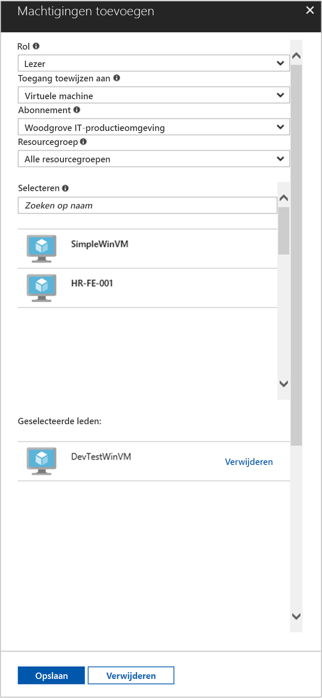

# <a name="use-a-windows-vm-managed-service-identity-msi-to-access-resource-manager"></a>Een Windows VM Managed Service Identity (MSI) gebruiken voor toegang tot Resource Manager

[!INCLUDE[preview-notice](~/includes/active-directory-msi-preview-notice-ua.md)]

Deze zelfstudie leert u hoe u Managed Service Identity (MSI) inschakelen voor een Windows virtuele machine (VM). U kunt vervolgens die identiteit gebruiken voor toegang tot de Azure Resource Manager-API. Beheerde Service-identiteiten automatisch worden beheerd door Azure en kunt u voor de verificatie bij services die ondersteuning bieden voor Azure AD-verificatie zonder referenties invoegen in uw code. In deze zelfstudie leert u procedures om het volgende te doen:

> [!div class="checklist"]
> * Inschakelen van MSI-bestand op een Windows VM 
> * Uw VM-toegang verlenen tot een resourcegroep in Azure Resource Manager 
> * Een toegangstoken met behulp van de identiteit van de virtuele machine en gebruiken voor het aanroepen van Azure Resource Manager

## <a name="prerequisites"></a>Vereisten

[!INCLUDE [msi-core-prereqs](~/includes/active-directory-msi-core-prereqs-ua.md)]

[!INCLUDE [msi-tut-prereqs](~/includes/active-directory-msi-tut-prereqs.md)]

## <a name="sign-in-to-azure"></a>Aanmelden bij Azure
Meld u aan bij de Azure Portal op [https://portal.azure.com](https://portal.azure.com).

## <a name="create-a-windows-virtual-machine-in-a-new-resource-group"></a>Een Windows-machine in een nieuwe resourcegroep maken

Voor deze zelfstudie maken we een nieuwe Windows-VM.  U kunt ook de MSI-bestand op een bestaande virtuele machine inschakelen.

1.  Klik op **een resource maken** in de linkerbovenhoek van Azure portal.
2.  Selecteer **Compute** en vervolgens **Windows Server 2016 Datacenter**. 
3.  Geef de informatie van de virtuele machine op. De **gebruikersnaam** en **wachtwoord** gemaakt als volgt de referenties die u gebruiken voor aanmelding bij de virtuele machine.
4.  Kies de juiste **abonnement** voor de virtuele machine in de vervolgkeuzelijst.
5.  Selecteer een nieuwe **resourcegroep** waarin u kunt uw virtuele machine maakt, kiest **nieuw**. Na het voltooien klikt u op **OK**.
6.  Selecteer de grootte voor de virtuele machine. Kies om meer groottes weer te geven de optie **Alle weergeven** of wijzig het filter **Ondersteund schijftype**. Behoud de standaardinstellingen op de pagina instellingen en klik op **OK**.

    

## <a name="enable-msi-on-your-vm"></a>MSI-bestand op de virtuele machine inschakelen 

Een VM MSI kunt u tokens voor toegang van Azure AD ophalen zonder dat u om referenties in uw code. Inschakelen van MSI weet Azure te maken van een beheerde identiteit voor uw virtuele machine. Op de achtergrond inschakelen van MSI doet twee dingen: de MSI-VM-extensie worden geïnstalleerd op de virtuele machine en Hiermee MSI in Azure Resource Manager.

1.  Selecteer de **virtuele Machine** dat u inschakelen van MSI-bestand wilt op.  
2.  Klik op de linker navigatiebalk op **configuratie**. 
3.  U ziet **beheerde Service-identiteit**. Als u wilt registreren en inschakelen van het MSI-bestand, selecteer **Ja**, als u wilt uitschakelen, kiest u Nee. 
4.  Controleer of u klikken op **opslaan** aan de configuratie op te slaan.  
    

5. Als u wilt controleren en nagaan welke uitbreidingen zijn op deze virtuele machine, klikt u op **extensies**. Als het MSI-bestand is ingeschakeld, klikt u vervolgens **ManagedIdentityExtensionforWindows** wordt weergegeven in de lijst.

    

## <a name="grant-your-vm-access-to-a-resource-group-in-resource-manager"></a>Uw VM-toegang verlenen tot een resourcegroep in Resource Manager
Met behulp van MSI krijgt uw code toegangstokens voor verificatie bij de resources die ondersteuning bieden voor Azure AD-verificatie.  De Azure Resource Manager biedt ondersteuning voor Azure AD-verificatie.  Eerst moet van deze virtuele machine identiteit om toegang te verlenen aan een resource in Resource Manager, in dit geval de resourcegroep waarin de virtuele machine is opgenomen.  

1.  Navigeer naar het tabblad voor **resourcegroepen**. 
2.  Selecteer de specifieke **resourcegroep** u hebt gemaakt voor uw **Windows VM**. 
3.  Ga naar **toegangsbeheer (IAM)** in het linkerpaneel. 
4.  Vervolgens **toevoegen** een nieuwe roltoewijzing voor uw **Windows VM**.  Kies **rol** als **lezer**. 
5.  In de volgende vervolgkeuzelijst **toegang toewijzen aan** de resource **virtuele Machine**. 
6.  Controleer vervolgens of het juiste abonnement wordt weergegeven in de **abonnement** vervolgkeuzelijst. En voor **resourcegroep**, selecteer **alle resourcegroepen**. 
7.  Ten slotte in **Selecteer** kiest u uw Windows-VM in de vervolgkeuzelijst en klik op **opslaan**.

    

## <a name="get-an-access-token-using-the-vm-identity-and-use-it-to-call-azure-resource-manager"></a>Een toegangstoken met behulp van de identiteit van de virtuele machine en gebruiken voor het aanroepen van Azure Resource Manager 

U moet gebruiken **PowerShell** in dit gedeelte.  Als u niet hebt geïnstalleerd, downloadt u deze [hier](https://docs.microsoft.com/powershell/azure/overview?view=azurermps-4.3.1). 

1.  Navigeer in de portal naar **virtuele Machines** en gaat u naar uw Windows-machine en klik in de **overzicht**, klikt u op **Connect**. 
2.  Geef in uw **gebruikersnaam** en **wachtwoord** voor die u hebt toegevoegd bij het maken van de Windows-VM. 
3.  Nu dat u hebt gemaakt een **verbinding met extern bureaublad** openen met de virtuele machine, **PowerShell** in de externe sessie. 
4.  Met behulp van Powershell Invoke-WebRequest, een aanvraag indienen op de lokale MSI-eindpunt op een toegangstoken ophalen voor Azure Resource Manager.

    ```powershell
       $response = Invoke-WebRequest -Uri http://localhost:50342/oauth2/token -Method GET -Body @{resource="https://management.azure.com/"} -Headers @{Metadata="true"}
    ```
    
    > [!NOTE]
    > De waarde van de parameter 'resource' moet een exacte overeenkomst voor wat er door Azure AD wordt verwacht. Wanneer u de resource-ID van Azure Resource Manager gebruikt, moet u de afsluitende slash bevatten in de URI bevatten.
    
    Het volledige antwoord dat is opgeslagen als een tekenreeks JavaScript Object Notation (JSON)-indeling in het object $response vervolgens uitpakken. 
    
    ```powershell
    $content = $response.Content | ConvertFrom-Json
    ```
    Haal het toegangstoken vervolgens uit het antwoord.
    
    ```powershell
    $ArmToken = $content.access_token
    ```
    
    Roep ten slotte Azure Resource Manager met behulp van het toegangstoken. In dit voorbeeld we van PowerShell Invoke-WebRequest ook gebruiken om te maken van de aanroep naar Azure Resource Manager en het toegangstoken in de autorisatie-header bevatten.
    
    ```powershell
    (Invoke-WebRequest -Uri https://management.azure.com/subscriptions/<SUBSCRIPTION ID>/resourceGroups/<RESOURCE GROUP>?api-version=2016-06-01 -Method GET -ContentType "application/json" -Headers @{ Authorization ="Bearer $ArmToken"}).content
    ```
    > [!NOTE] 
    > De URL is hoofdlettergevoelig, dus zorg ervoor als u werkt precies hetzelfde hoofdlettergebruik als u eerder hebt gebruikt toen u de naam van de resourcegroep en de hoofdletters "G" in "resourceGroups."
        
    De volgende opdracht retourneert de gegevens van de resourcegroep:

    ```powershell
    {"id":"/subscriptions/98f51385-2edc-4b79-bed9-7718de4cb861/resourceGroups/DevTest","name":"DevTest","location":"westus","properties":{"provisioningState":"Succeeded"}}
    ```

## <a name="related-content"></a>Gerelateerde inhoud

- Zie voor een overzicht van MSI [overzicht van de beheerde Service-identiteit](msi-overview.md).

Gebruik de volgende sectie met opmerkingen uw feedback en help ons verfijnen en vorm van onze inhoud.

