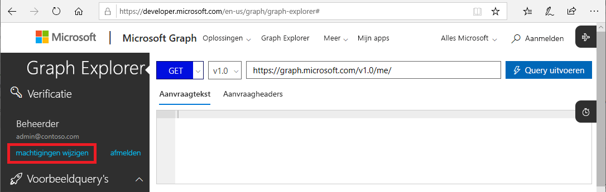
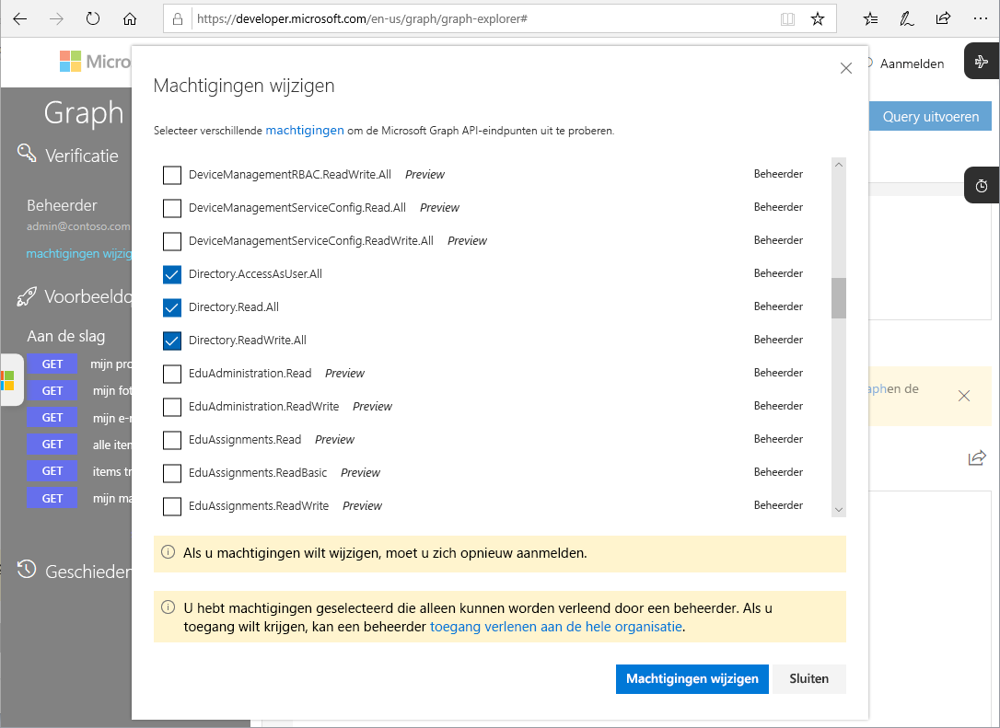

# Microsoft Graph-API's voor PIM (preview)

De meeste taken die u met de Azure-portal kunt uitvoeren in Azure AD Privileged Identity Management (PIM), kunt u ook uitvoeren met de [Microsoft Graph-API's](https://developer.microsoft.com/graph/docs/concepts/overview). In dit artikel worden enkele belangrijke concepten beschreven bij het gebruik van de Microsoft Graph-API's voor PIM. Zie de [naslag bij Azure AD Privileged Identity Management-API](https://developer.microsoft.com/graph/docs/api-reference/beta/resources/privilegedidentitymanagement_root) voor meer informatie over de Microsoft Graph-API's.

> [!IMPORTANT]
> API's onder de /bèta-versie in Microsoft Graph zijn beschikbaar als preview en kunnen worden gewijzigd. Het gebruik van deze API's in productie-apps wordt niet ondersteund.

## Vereiste machtigingen

Voor het aanroepen van de Microsoft Graph-API's voor PIM, hebt u **een of meer** van de volgende machtigingen nodig:

- `Directory.AccessAsUser.All`
- `Directory.Read.All`
- `Directory.ReadWrite.All`
- `PrivilegedAccess.ReadWrite.AzureAD`

### Machtigingen instellen

Toepassingen die de Microsoft Graph-API's voor PIM willen aanroepen, moeten beschikken over de vereiste machtigingen. De eenvoudigste manier om de vereiste machtigingen op te geven, is door het [toestemmingsframework van Azure AD-](../develop/consent-framework.md) te gebruiken.

### Machtigingen instellen in Graph Explorer

Als u Graph Explorer gebruikt om uw aanroepen te testen, kunt u de machtigingen opgeven in het hulpprogramma.

1. Meld u als globale beheerder aan bij [Graph Explorer](https://developer.microsoft.com/graph/graph-explorer).

1. Klik op **Machtigingen wijzigen**.

    

1. Vink de machtigingen aan die u wilt opnemen. `PrivilegedAccess.ReadWrite.AzureAD` is nog niet beschikbaar in Graph Explorer.

    

1. Klik op **Machtigingen wijzigen** om de wijzigingen in de machtigingen toe te passen.

## Volgende stappen

- [Naslag bij Azure AD Privileged Identity Management-API](https://developer.microsoft.com/graph/docs/api-reference/beta/resources/privilegedidentitymanagement_root)
