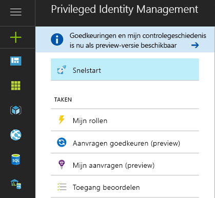
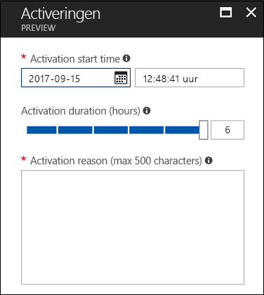
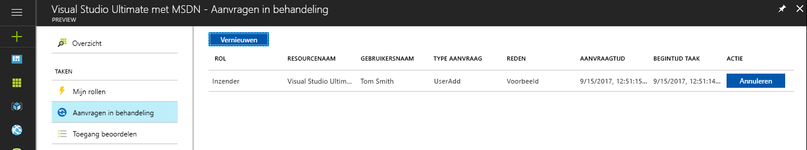
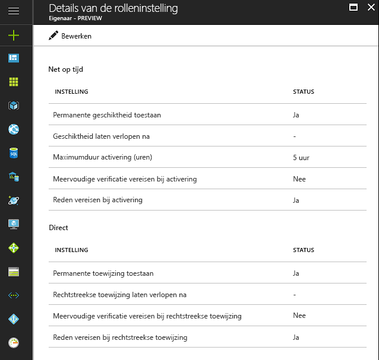

# Wat is Azure AD Privileged Identity Management?

Met Azure Active Directory (Azure AD) Privileged Identity Management kunt u toegang binnen de organisatie beheren, controleren en bewaken. Dit is inclusief toegang tot resources in Azure AD, Azure-resources en andere Microsoft-onlineservices zoals Office 365 en Microsoft Intune.

> [!NOTE]
> Wanneer u Privileged Identity Management inschakelt voor uw tenant, is een geldige betaalde versie of proefversie van Azure AD Premium P2 of Enterprise Mobility + Security E5 vereist voor elke gebruiker die een van de voordelen van de service ontvangt of gebruikt. Voorbeelden zijn gebruikers/gebruikers in een groep die:
>
>- Zijn toegewezen aan de rol Beheerder met bevoorrechte rol 
>- Zijn toegewezen als in aanmerking komend voor andere adreslijstrollen die worden beheerd via PIM 
>- Aanvragen in PIM kunnen goedkeuren/weigeren 
>- Zijn toegewezen aan een Azure-resourcerol met JIT-toewijzingen (Just-In-Time) of directe toewijzingen (op basis van tijd)  
>- Zijn toegewezen aan een toegangsbeoordeling
>
>Zie [Azure Active Directory-edities](../fundamentals/active-directory-whatis.md) voor meer informatie.

Organisaties willen het aantal mensen beperken dat toegang heeft tot beveiligde gegevens of resources, om zo de kans te verkleinen dat een kwaadwillende gebruiker toegang verkrijgt of een geautoriseerde gebruiker per ongeluk een gevoelige resource wijzigt.  Gebruikers moeten echter wel bevoorrechte bewerkingen kunnen uitvoeren in Azure AD, Azure, Office 365 of SaaS-apps. Organisaties kunnen gebruikers daarom bevoorrechte toegang geven tot Azure-resources zoals abonnementen en Azure AD. Het is belangrijk dat er toezicht is over wat gebruikers doen met hun beheerdersbevoegdheden. Azure AD Privileged Identity Management vermindert het risico op overmatige, overbodige of verkeerd gebruikte toegangsrechten.

Azure AD Privileged Identity Management maakt het volgende mogelijk in uw organisatie:

- Zien welke gebruikers bevoorrechte rollen hebben voor het beheren van Azure-resources, en aan welke gebruikers beheerdersrollen zijn toegewezen in Azure AD
- JIT-beheerderstoegang op aanvraag inschakelen voor Microsoft-onlineservices zoals Office 365 en Intune, en voor Azure-resources van abonnementen, resourcegroepen en afzonderlijke resources zoals virtuele machines 
- Een historisch overzicht zien van activering door beheerders, waaronder wat beheerders hebben gewijzigd in Azure-resources
- Waarschuwingen ontvangen over wijzigingen in beheerderstoewijzingen
- Goedkeuring vereisen voor het activeren van bevoorrechte Azure AD-beheerdersrollen
- Lidmaatschap van beheerdersrollen controleren en gebruikers vragen om een reden voor vernieuwd lidmaatschap

In Azure AD kunnen met Azure AD Privileged Identity Management de gebruikers worden beheerd die zijn toegewezen aan de ingebouwde Azure AD-organisatierollen, zoals Globale beheerder. In Azure kunnen met Azure AD Privileged Identity Management de gebruikers en groepen worden beheerd die zijn toegewezen via Azure RBAC-rollen, inclusief Eigenaar of Inzender.

## JIT-beheerderstoegang (Just-In-Time)

Eerder was het mogelijk om een gebruiker toe te wijzen aan een beheerdersrol via Azure Portal, andere portals van Microsoft-onlineservices of de Azure AD-cmdlets in Windows PowerShell. Het gevolg was dat de gebruiker een **permanente beheerder** werd, die altijd actief was in de toegewezen rol. In Azure AD Privileged Identity Management wordt het concept van een **in aanmerking komende beheerder** geïntroduceerd. In aanmerking komende beheerders zijn gebruikers die af en toe bevoorrechte toegang nodig hebben, maar niet de hele dag en ook niet elke dag. De rol is inactief totdat gebruikers toegang nodig hebben. Op dat moment voeren ze een activeringsproces uit en zijn ze gedurende een vooraf bepaalde hoeveelheid tijd een actieve beheerder. Steeds meer organisaties kiezen voor deze benadering om doorlopende beheerderstoegang tot bevoorrechte rollen te verminderen of uit te sluiten.

## Terminologie

*In aanmerking komende rolgebruiker*: een in aanmerking komende rolgebruiker is een gebruiker in uw organisatie die aan een Azure AD-rol is toegewezen als in aanmerking komend (de rol moet worden geactiveerd).

*Gedelegeerde fiatteur*: een gedelegeerde fiatteur bestaat uit een of meerdere personen of groepen in uw Azure AD die verantwoordelijk is/zijn voor het goedkeuren van aanvragen om rollen te activeren.

## Scenario's

Privileged Identity Management ondersteunt de volgende scenario's:

**Als een beheerder met bevoorrechte rol kunt u:**

- Goedkeuring voor specifieke rollen inschakelen
- Gebruikers en/of groepen toewijzen als fiatteur om aanvragen goed te keuren
- De geschiedenis van aanvragen en goedkeuringen bekijken voor alle bevoorrechte rollen

**Als een aangewezen fiatteur, kunt u:**

- Goedkeuringen in behandeling (aanvragen) bekijken
- Aanvragen voor rolverhoging goedkeuren of afwijzen (afzonderlijk en/of bulksgewijs)
- De reden voor de goedkeuring/afwijzing opgeven 

**Als een in aanmerking komende rolgebruiker kunt u:**

- Activering van een rol waarvoor goedkeuring nodig is, aanvragen
- De status van uw aanvraag voor activeren bekijken
- Uw taak voltooien in Azure AD als de activering is goedgekeurd

## Wie kan wat doen in PIM

Als u de eerste persoon bent PIM gebruikt, krijgt u automatisch de rol van [Beveiligingsbeheerder](../users-groups-roles/directory-assign-admin-roles.md#security-administrator) en [Beheerder met bevoorrechte rol](../users-groups-roles/directory-assign-admin-roles.md#privileged-role-administrator) toegewezen in de map.

Voor Azure AD-rollen geldt dat alleen een gebruiker met de rol Beheerder met bevoorrechte rol toewijzingen voor andere beheerders in PIM kan beheren. U kunt [andere beheerders toegang verlenen voor het beheren van PIM](pim-how-to-give-access-to-pim.md). Globale beheerders, beveiligingsbeheerders en beveiligingslezers kunnen toewijzingen aan Azure AD-rollen in PIM weergeven.

Voor rollen voor Azure-resources geldt dat alleen een abonnementsbeheerder, een resource-eigenaar of een beheerder voor gebruikerstoegang tot resources toewijzingen voor andere beheerders in PIM kan beheren. Gebruikers met de rol Beheerder met bevoorrechte rol, Beveiligingsbeheerder of Beveiligingslezer hebben standaard geen bevoegdheid om toewijzingen aan rollen voor Azure-resources in PIM weer te geven.

## Overzicht van Privileged Identity Management (toegangspunt)

Azure AD Privileged Identity Management biedt ondersteuning voor het beheer van Azure AD-adreslijstrollen en rollen voor Azure-resources. De functie van rollen voor Azure-resources verschillen van beheerdersrollen in Azure AD. Azure-resourcerollen bieden gedetailleerde machtigingen voor de resource waaraan ze zijn toegewezen, en aan alle onderliggende resources in de hiërarchie van de resource (overname genoemd). [Meer informatie over RBAC, resourcehiërarchie en overname](../../role-based-access-control/role-assignments-portal.md). PIM kan voor zowel Azure AD-adreslijstrollen als Azure-resources worden beheerd door de desbetreffende koppeling te volgen onder de sectie Beheren van het toegangspunt Overzicht van PIM in het linkernavigatiemenu.

PIM biedt via de sectie Taken in het linkernavigatiemenu snel toegang tot opties voor het activeren van rollen, het bekijken van openstaande activeringen/aanvragen en van goedkeuringen die nog in behandeling zijn (voor Azure AD-adreslijstrollen), evenals beoordelingen die wachten op uw reactie.

Wanneer u een optie kiest in de sectie Taken onder het toegangspunt Overzicht, ziet u resultaten voor zowel Azure AD-adreslijstrollen als Azure-resourcerollen.

Mijn rollen bevatten een lijst met actieve en in aanmerking komende roltoewijzingen voor Azure AD-adreslijstrollen en Azure-resourcerollen. [Meer informatie over het activeren van in aanmerking komende roltoewijzingen](pim-how-to-activate-role.md).

Het activeren van rollen voor Azure-resources is een nieuwe functie die in aanmerking komende leden van een rol de gelegenheid biedt om activering te plannen voor een toekomstige datum/tijd, gekoppeld aan een specifieke activeringsduur binnen de maximale periode die is ingesteld door beheerders.

Als een geplande activering niet meer nodig is, kunnen gebruikers hun aanvraag annuleren door in het linkernavigatiemenu Aanvragen in behandeling te kiezen en vervolgens in de regel van deze aanvraag op Annuleren te klikken.

## Beheerdashboard van Privileged Identity Management

Azure AD Privileged Identity Manager beschikt over een beheerdashboard met belangrijke informatie zoals:

* Waarschuwingen die aangeven waar u de beveiliging kunt verbeteren
* Het aantal gebruikers dat aan elke bevoorrechte rol is toegewezen  
* Het aantal in aanmerking komende en permanente beheerders
* Een grafiek met daarin activeringen van bevoorrechte rollen in uw adreslijst
* Het aantal Just-In-Time, tijdsgebonden en permanente toewijzingen voor Azure-resourcerollen
* Gebruikers en groepen met nieuwe roltoewijzingen van de afgelopen dertig dagen (Azure-resourcerollen)

## Beheer van bevoorrechte rollen

Met Azure AD Privileged Identity Management kunt u beheertaken voor de beheerders uitvoeren door permanente of in aanmerking komende beheerders toe te voegen of te verwijderen voor Azure AD-adreslijstrollen. Met PIM voor Azure-resources kunnen eigenaars, beheerders van gebruikerstoegang en globale beheerders die het beheer van abonnementen in hun tenant inschakelen, gebruikers of groepen toewijzen aan Azure-resourcerollen als in aanmerking komend (Just-In-Time toegang), als tijdsgebonden toegang (geen activering vereist) met een begin- en einddatum/-tijd of permanent (indien ingeschakeld in de rolinstellingen).

## Instellingen voor rolactivering configureren

Met behulp van [rolinstellingen](pim-how-to-change-default-settings.md) kunt u de eigenschappen voor activering van in aanmerking komende rollen configureren voor Azure AD-adreslijstrollen, waaronder:

* De duur van de activeringsperiode voor de rol
* De melding bij rolactivering
* De informatie die een gebruiker moet opgeven tijdens het activeren van de rol
* Nummer van het serviceticket of incident
* [Vereisten voor goedkeuringswerkstroom](./azure-ad-pim-approval-workflow.md)

In de bovenstaande afbeelding zijn de knoppen voor **Multi-Factor Authentication** uitgeschakeld. Voor bepaalde, zeer bevoorrechte rollen, is MFA vereist voor een nog betere beveiliging.

Rolinstellingen voor Azure-resourcerollen stellen beheerders in staat om instellingen voor Just-In-Time directe toewijzingen te configureren, zoals:

- De mogelijkheid om gebruikers of groepen toe te wijzen aan rollen zonder een einddatum/-tijd (permanente toewijzing)
- De standaardduur van een toewijzing (indien niet permanent)
- De maximale activeringsduur (wanneer een in aanmerking komend lid van een rol zich activeert)
- De informatie die een gebruiker moet opgeven tijdens het activeren van de rol (Just-In-Time-toewijzingen) of het toewijzingsproces (directe toewijzingen)

## Rolactivering

Als een [rol moet worden geactiveerd](pim-how-to-activate-role.md), vraagt een in aanmerking komende beheerder een tijdsgebonden activering aan voor de rol. De activering kan worden aangevraagd met de optie **Mijn rol activeren** in Azure AD Privileged Identity Management.

Een beheerder die een rol wil activeren, moet Azure AD Privileged Identity Management initialiseren in Azure Portal.

Rolactivering kan worden aangepast. In de instellingen van PIM kunt u de duur van de activering bepalen en welke gegevens de beheerder moet opgeven voor het activeren van de rol.

## Rolactiviteit controleren

Er zijn twee manieren om bij te houden hoe uw werknemers en beheerders bevoorrechte rollen gebruiken. De eerste optie is met behulp van [de controlegeschiedenis voor adreslijstrollen](pim-how-to-use-audit-log.md). De logboeken die samen de controlegeschiedenis vormen, bevatten informatie over wijzigingen in toewijzingen van bevoorrechte rollen, de activeringsgeschiedenis van een rol en wijzigingen in de instellingen voor Azure-resourcerollen. 

De tweede optie is door het instellen van periodieke [toegangsbeoordelingen](pim-how-to-start-security-review.md). Deze toegangsbeoordelingen kunnen worden uitgevoerd door een toegewezen persoon (zoals een teammanager) of de werknemers kunnen elkaar beoordelen. Dit is de beste manier om te controleren wie er nog steeds toegang nodig heeft en wie niet.

## Azure AD PIM bij verlopen van abonnement

In een tenant moet een proefversie of betaalde versie van Azure AD Premium P2 (of EMS E5) beschikbaar zijn om Azure AD PIM te kunnen gebruiken.  Bovendien moeten er licenties worden toegewezen aan de beheerders van de tenant.  Er moeten met name licenties worden toegewezen aan beheerders in Azure AD-rollen die worden beheerd via Azure AD PIM, aan beheerders in Azure RBAC-rollen die worden beheerd via Azure AD PIM, en aan gebruikers die geen beheerder zijn maar die wel toegangsbeoordelingen uitvoeren.
Als in uw organisatie het abonnement op Azure AD Premium P2 niet is verlengd of de proefversie is verlopen, zijn de functies van Azure AD PIM niet meer beschikbaar in uw tenant, worden toewijzingen van in aanmerking komende rollen verwijderd en kunnen gebruikers geen rollen meer activeren. Meer informatie kunt u vinden in de [vereisten voor Azure AD PIM-abonnementen](./subscription-requirements.md)

## Volgende stappen

- [Beginnen met PIM](pim-getting-started.md)
- [Abonnementsvereisten voor het gebruik van PIM](subscription-requirements.md)
- [Bevoegde toegang beveiligen voor hybride implementaties en cloudimplementaties in Azure AD](../users-groups-roles/directory-admin-roles-secure.md?toc=%2fazure%2factive-directory%2fprivileged-identity-management%2ftoc.json)
