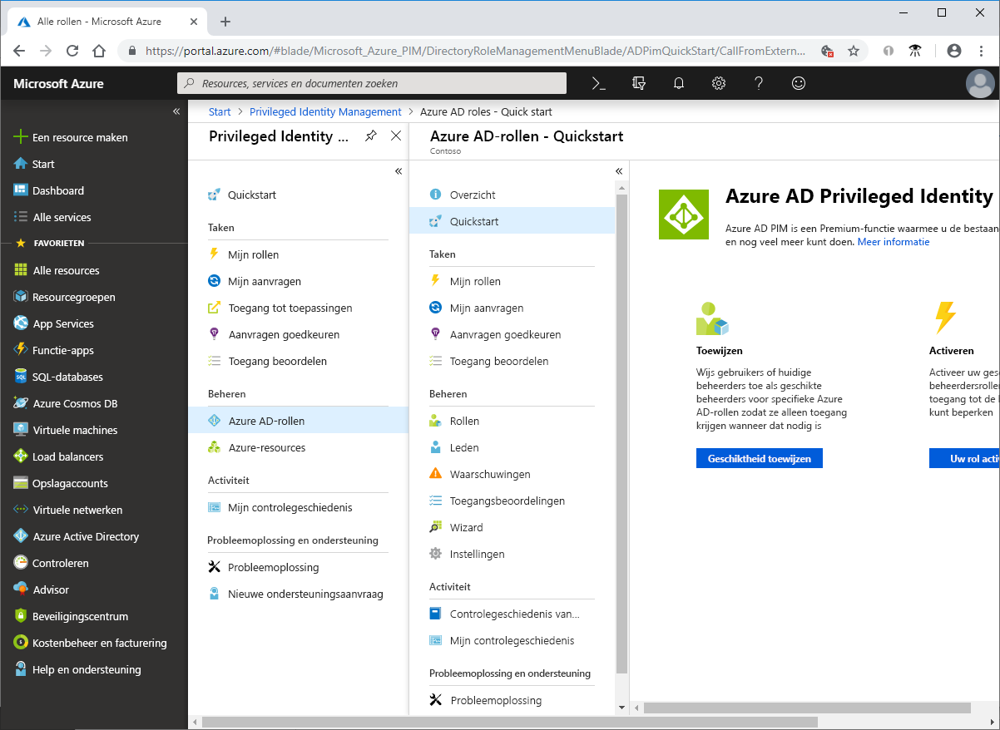

# Wat is Azure AD Privileged Identity Management?

Azure Active Directory (Azure AD) Privileged Identity Management (PIM) is een service waarmee u toegang tot belangrijke resources in uw organisatie kunt beheren, controleren en bewaken. Dit is inclusief toegang tot resources in Azure AD, Azure-resources en andere Microsoft-onlineservices zoals Office 365 en Microsoft Intune.

## Waarom zou ik PIM gebruiken?

Organisaties willen het aantal mensen dat toegang heeft tot beveiligde gegevens of resources beperken, om zo de kans te verkleinen dat een kwaadwillende gebruiker toegang verkrijgt of een geautoriseerde gebruiker per ongeluk een gevoelige resource wijzigt. Gebruikers moeten echter wel bevoorrechte bewerkingen kunnen uitvoeren in Azure AD, Azure, Office 365 of SaaS-apps. Organisaties kunnen gebruikers daarom bevoorrechte JIT-toegang (Just-In-Time) geven tot Azure-resources en Azure Active Directory. Het is belangrijk dat er toezicht is op wat gebruikers met hun beheerdersbevoegdheden doen. PIM vermindert het risico op overmatige, overbodige of verkeerd gebruikte toegangsrechten.

## Wat kan ik doen met PIM?

PIM helpt u in feite met het beheren van het wie, wat, wanneer, waar en waarom voor resources die voor u van belang zijn. Dit zijn enkele van de belangrijkste functies van PIM:

- Bevoorrechte **JIT**-toegang (Just-In-Time) bieden aan Azure Active Directory- en Azure-resources
- **Tijdsgebonden** toegang bieden aan resources met behulp van begin- en einddatums
- **Goedkeuring** vereisen om bevoorrechte rollen te activeren
- **Meervoudige verificatie** afdwingen om een rol te activeren
- Gebruikmaken van **redenen** om te begrijpen waarom gebruikers activeren
- **Meldingen** ontvangen wanneer bevoorrechte rollen zijn geactiveerd
- **Toegangsbeoordelingen** uitvoeren om te controleren of gebruikers rollen nog steeds nodig hebben
- **Controlegeschiedenis** downloaden voor interne of externe controle

## Vereisten

Voor het gebruik van PIM moet u in het bezit zijn van een van de volgende betaalde of proeflicenties. Zie [Wat is Azure Active Directory?](../fundamentals/active-directory-whatis.md) voor meer informatie.

- Azure AD Premium P2
- Enterprise Mobility + Security (EMS) E5

Zie [Licentievereisten voor het gebruik van PIM](subscription-requirements.md) voor meer informatie over licenties voor gebruikers.

## Terminologie

Lees de volgende terminologie voor een beter begrip van PIM en de bijbehorende documentatie.

| Term of concept | Roltoewijzingscategorie | Beschrijving |
| --- | --- | --- |
| in aanmerking komend | Type | Een roltoewijzing die vereist dat een gebruiker een of meer acties uitvoert om de rol te kunnen gebruiken. Als een gebruiker in aanmerking komt voor een rol, betekent dit dat de gebruiker de rol kan activeren wanneer deze nodig is om bevoegde taken uit te voeren. Er is geen verschil in de toegang voor iemand met een permanente roltoewijzing ten opzichte van iemand die in aanmerking komt voor een roltoewijzing. Het enige verschil is dat sommige gebruikers niet voortdurend toegang nodig hebben. |
| actief | Type | Een roltoewijzing die niet vereist dat een gebruiker een actie uitvoert om de rol te kunnen gebruiken. Gebruikers die zijn toegewezen als actief zijn in het bezit van de bevoegdheden die zijn toegewezen aan de rol. |
| activeren |  | Het proces van het uitvoeren van een of meer acties om de rol te kunnen gebruiken waarvoor de gebruiker in aanmerking komt. Acties kunnen bijvoorbeeld een meervoudige verificatiecontrole, het opgeven van een zakelijke reden of het vragen om toestemming bij aangewezen fiatteurs zijn. |
| toegewezen | Status | Een gebruiker met een actieve roltoewijzing. |
| geactiveerd | Status | Een gebruiker die in aanmerking komt voor een roltoewijzing, de acties voor het activeren van de rol heeft uitgevoerd en nu actief is.  Wanneer de rol is geactiveerd, kan de gebruiker deze gebruiken gedurende een vooraf geconfigureerde periode voordat ze de rol opnieuw moeten activeren. |
| permanent in aanmerking komend | Duur | Een roltoewijzing waarbij een gebruiker altijd in aanmerking komt om de rol te activeren. |
| permanent actief | Duur | Een roltoewijzing waarbij een gebruiker de rol altijd kan gebruiken zonder acties te hoeven uitvoeren. |
| verlopen - in aanmerking komend | Duur | Een roltoewijzing waarbij een gebruiker de rol binnen een opgegeven begin- en datum mag activeren. |
| verlopen - actief | Duur | Een roltoewijzing waarbij een gebruiker de rol kan gebruiken zonder acties te hoeven uitvoeren binnen een opgegeven begin- en einddatum. |
| Just-in-time-toegang (JIT) |  | Een model waarbij gebruikers tijdelijke machtigingen ontvangen om bepaalde taken uit te mogen voeren, waardoor kwaadwillende of onbevoegde gebruikers geen toegang kunnen krijgen na het verlopen van deze machtigingen. Toegang wordt alleen verleend wanneer gebruikers deze nodig hebben. |
| Principe van toegang met minimale bevoegdheden |  | Een aanbevolen beveiligingsprocedure waarbij alle gebruikers enkel de minimale bevoegdheden krijgt toegewezen die nodig zijn om de taken uit te voeren waarvoor ze bevoegd zijn. Met deze procedure wordt het aantal globale beheerders tot het minimum beperkt en worden er specifieke beheerdersrollen gebruikt voor bepaalde scenario's. |

## Hoe ziet PIM eruit?

Zodra u PIM hebt ingesteld, ziet u de opties **Taken**, **Beheren** en **Activiteit** in het navigatiemenu links. Als beheerder kiest u tussen het beheren van **Azure Active Directory-rollen** en **Azure-resource**rollen. Als u het type te beheren rollen kiest, ziet u een soortgelijke set met opties voor dat roltype.

## Wie kan wat doen in PIM?

Als u de eerste persoon bent PIM gebruikt, krijgt u automatisch de rol van [Beveiligingsbeheerder](../users-groups-roles/directory-assign-admin-roles.md#security-administrator) en [Beheerder met bevoorrechte rol](../users-groups-roles/directory-assign-admin-roles.md#privileged-role-administrator) toegewezen in de map.

Voor Azure AD-rollen geldt dat alleen een gebruiker met de rol Beheerder met bevoorrechte rol toewijzingen voor andere beheerders in PIM kan beheren. U kunt [andere beheerders toegang verlenen voor het beheren van PIM](pim-how-to-give-access-to-pim.md). Globale beheerders, beveiligingsbeheerders en beveiligingslezers kunnen toewijzingen aan Azure Active Directory-rollen in PIM weergeven.

Voor rollen voor Azure-resources geldt dat alleen een abonnementsbeheerder, een resource-eigenaar of een beheerder voor gebruikerstoegang tot resources toewijzingen voor andere beheerders in PIM kan beheren. Gebruikers met de rol Beheerder met bevoorrechte rol, Beveiligingsbeheerder of Beveiligingslezer hebben standaard geen bevoegdheid om toewijzingen aan rollen voor Azure-resources in PIM weer te geven.

## Scenario's

PIM ondersteunt de volgende scenario’s:

**Als een beheerder met bevoorrechte rol kunt u:**

- Goedkeuring voor specifieke rollen inschakelen
- Gebruikers en/of groepen toewijzen als fiatteur om aanvragen goed te keuren
- De geschiedenis van aanvragen en goedkeuringen bekijken voor alle bevoorrechte rollen

**Als een fiatteur kunt u het volgende doen:**

- Goedkeuringen in behandeling (aanvragen) bekijken
- Aanvragen voor rolverhoging goedkeuren of afwijzen (afzonderlijk en/of bulksgewijs)
- De reden voor de goedkeuring/afwijzing opgeven 

**Als een in aanmerking komende rolgebruiker kunt u het volgende doen:**

- Activering van een rol waarvoor goedkeuring nodig is, aanvragen
- De status van uw aanvraag voor activeren bekijken
- Uw taak voltooien in Azure AD als de activering is goedgekeurd

## Volgende stappen

- [Licentievereisten voor het gebruik van PIM](subscription-requirements.md)
- [Bevoegde toegang beveiligen voor hybride implementaties en cloudimplementaties in Azure AD](../users-groups-roles/directory-admin-roles-secure.md?toc=%2fazure%2factive-directory%2fprivileged-identity-management%2ftoc.json)
- [PIM implementeren](pim-deployment-plan.md)
