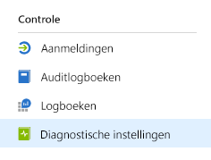
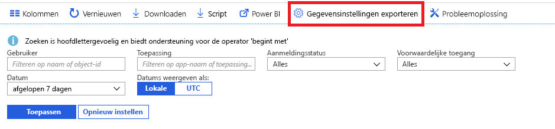

# Wat is bewaking van Azure Active Directory? (preview)

Met bewaking van Azure Active Directory (Azure AD), kunt u nu uw Azure AD-activiteitenlogboeken naar verschillende eindpunten routeren. U kunt deze vervolgens behouden voor later gebruik of integreren met SIEM-hulpprogramma's (Security Information and Event Management) van derden om meer inzicht in uw omgeving te verkrijgen.

Op dit moment kunt u de logboeken routeren naar:

- Een Azure Storage-account.
- Een Azure Event Hub, zodat u deze kunt integreren met uw Splunk en Sumologic-exemplaren.
- Azure Log Analytics-werkruimte, waarin u de gegevens kunt analyseren en een dashboard en waarschuwingen voor specifieke gebeurtenissen kunt maken

## Configuratie voor diagnostische instellingen

Om bewakingsinstellingen voor Azure AD-activiteitenlogboeken te configureren, meldt u zich aan bij de [Azure-portal](https://portal.azure.com) en selecteert u **Azure Active Directory**. Vervolgens kunt u de pagina voor het configureren van de diagnostische instellingen op twee manieren openen:

* Selecteer **Diagnostische instellingen** in de sectie **Bewaking**.

    
    
* Selecteer **Auditlogboeken** of **Aanmeldingen** en selecteer vervolgens **Exportinstellingen**. 

    

## Logboeken naar opslagaccount doorsturen

Door logboeken te routeren naar een Azure Storage-account, kunt u deze langer bewaren dan de standaardbewaartermijn die wordt beschreven in ons [bewaarbeleid](reference-reports-data-retention.md). Ontdek hoe u [gegevens routeert naar uw opslagaccount](quickstart-azure-monitor-route-logs-to-storage-account.md).

## Logboeken naar Event Hub streamen

Het routeren van logboeken naar een Azure Event Hub biedt u de mogelijkheid deze te integreren met SIEM-hulpprogramma's van derden, zoals Sumologic en Splunk. Zo kunt u gegevens van Azure Active Directory-activiteitenlogboeken combineren met andere gegevens die worden beheerd door uw SIEM en meer inzicht krijgen in uw omgeving. Ontdek hoe u [logboeken streamt naar een Event Hub](tutorial-azure-monitor-stream-logs-to-event-hub.md).

## Logboeken naar Log Analytics verzenden

[Log Analytics](https://docs.microsoft.com/azure/log-analytics/log-analytics-overview) is een oplossing waarin bewakingsgegevens uit verschillende bronnen worden samengevoegd. Met de bijbehorende querytaal en analyse-engine kunt u meer inzicht krijgen in de werking van uw toepassingen en resources. Door Azure AD-activiteitenlogboeken naar Log Analytics te streamen, kunt u verzamelde gegevens snel ophalen en controleren en eventuele waarschuwingen bekijken. Ontdek hoe u [gegevens verzendt naar Log Analytics](howto-integrate-activity-logs-with-log-analytics.md).

U kunt ook de vooraf gemaakte weergaven voor Azure AD-activiteitenlogboeken installeren om veelvoorkomende scenario's met betrekking tot aanmeldingen en controlegebeurtenissen te bewaken. Ontdek hoe u [Log Analytics-weergaven voor Azure AD-activiteitenlogboeken installeert en gebruikt](howto-install-use-log-analytics-views.md).

## Volgende stappen

* [Activiteitenlogboeken in Azure Monitor](concept-activity-logs-azure-monitor.md)
* [Logboeken naar Event Hub streamen](tutorial-azure-monitor-stream-logs-to-event-hub.md)
* [Logboeken naar Log Analytics verzenden](howto-integrate-activity-logs-with-log-analytics.md)