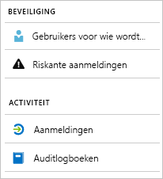

# Wat zijn Azure Active Directory-rapporten?

Azure Active Directory-rapporten (Azure AD) bieden een uitgebreid overzicht van de activiteit in uw omgeving. Met de gegevens kunt u het volgende doen:

- Vaststellen hoe uw apps en services door uw gebruikers worden gebruikt
- Potentiële risico's detecteren die invloed hebben op de status van uw omgeving
- Problemen oplossen waardoor uw gebruikers hun werk niet kunnen doen  

De rapportagearchitectuur is afhankelijk van twee belangrijke zaken:

- [Beveiligingsrapporten](#security-reports)
- [Activiteitsrapporten](#activity-reports)

## Beveiligingsrapporten

Met de beveiligingsrapporten kunt u de identiteiten van uw organisatie beschermen. Er zijn twee typen beveiligingsrapporten:

- **Gebruikers voor wie wordt aangegeven dat ze risico lopen**: in het rapport [Gebruikers voor wie wordt aangegeven dat ze risico lopen](concept-user-at-risk.md) krijgt u een overzicht van gebruikersaccounts die mogelijk zijn aangetast.

- **Riskante aanmeldingen**: in het beveiligingsrapport [Riskante aanmeldingen](concept-risky-sign-ins.md) krijgt u een idee van aanmeldingspogingen die mogelijk zijn uitgevoerd door iemand die geen rechtmatige eigenaar van een gebruikersaccount is. 

### Welke Azure AD-licentie heb ik nodig voor toegang tot een beveiligingsrapport?  

Alle edities van Azure AD bieden rapporten over gebruikers voor wie wordt aangegeven dat ze risico lopen en rapporten over riskante aanmeldingen. Het detailniveau van rapporten verschilt wel per editie: 

- In de edities **Azure Active Directory Free en Basic** hebt u toegang tot een lijst die gebruikers bevat voor wie wordt aangegeven dat ze risico lopen, evenals riskante aanmeldingen. 

- De editie **Azure Active Directory Premium 1** bevat een uitgebreider model waarmee u ook bepaalde onderliggende risicogebeurtenissen kunt onderzoeken die voor elk rapport zijn gedetecteerd. 

- De editie **Azure Active Directory Premium 2** biedt u de meest gedetailleerde informatie over de onderliggende risicogebeurtenissen. Deze editie stelt u ook in staat beveiligingsbeleidsregels te configureren die automatisch op de geconfigureerde risiconiveaus reageren.

## Activiteitsrapporten

Activiteitenrapporten helpen u het gedrag van gebruikers in uw organisatie te begrijpen. Er zijn in Azure AD twee typen activiteitsrapporten:

- **Audittrails**: het [activiteitenrapport voor audittrails](concept-audit-logs.md) biedt u toegang tot de geschiedenis van elke taak die in uw tenant is uitgevoerd.

- **Aanmeldingen**: met het [activiteitenrapport voor aanmeldingen](concept-sign-ins.md) kunt u bepalen wie de taken heeft uitgevoerd die in het audittrailrapport zijn gerapporteerd.

### Rapport voor audittrails 

De [audittrailrapporten](concept-audit-logs.md) bieden records van systeemactiviteiten in het kader van naleving. Met deze gegevens kunt u algemene scenario's aanpakken zoals:

- Iemand in mijn tenant heeft toegang gekregen tot een beheerdersgroep. Wie heeft diegene toegang verleend? 

- Ik wil een lijst weergeven met gebruikers die zich in een specifieke app hebben aangemeld sinds ik de app onlangs heb toegevoegd en wil weten of de app het goed doet

- Ik wil weten hoe vaak er in mijn tenant een wachtwoord opnieuw is ingesteld

#### Welke Azure AD-licentie heb ik nodig voor toegang tot audittrailrapporten?  

Het audittrailrapport is beschikbaar voor functies waarvoor u licenties hebt. Als u een licentie voor een specifieke functie hebt, hebt u ook toegang tot de audittrailgegevens hiervan. Zie [Functies en mogelijkheden van Azure Active Directory](https://www.microsoft.com/cloud-platform/azure-active-directory-features) voor meer informatie.   

### Aanmeldingenrapport

Het [aanmeldingenrapport](concept-sign-ins.md) helpt u antwoorden te vinden op vragen zoals:

- Wat is het aanmeldingspatroon van een gebruiker?
- Hoeveel keer hebben gebruikers zich aangemeld gedurende een week?
- Wat is de status van deze aanmeldingen?

#### Welke Azure AD-licentie heb ik nodig voor toegang tot het aanmeldactiviteitenrapport?  

Uw tenant moet beschikken over een Azure AD Premium-licentie om het rapport met aanmeldactiviteiten te kunnen openen.

## Toegang op programmeerniveau

De rapportage van Azure AD biedt u naast de gebruikersinterface ook [toegang op programmeerniveau](concept-reporting-api.md) tot de rapportagegegevens via een reeks REST API's. U kunt deze API's vanuit een groot aantal computertalen en hulpprogramma's aanroepen. 

## Volgende stappen

- [Rapport voor riskante aanmeldingen](concept-risky-sign-ins.md)
- [Rapport voor audittrails](concept-audit-logs.md)
- [Rapport voor aanmeldlogboeken](concept-sign-ins.md)
