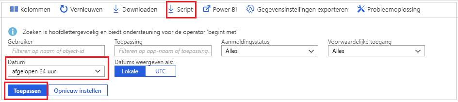
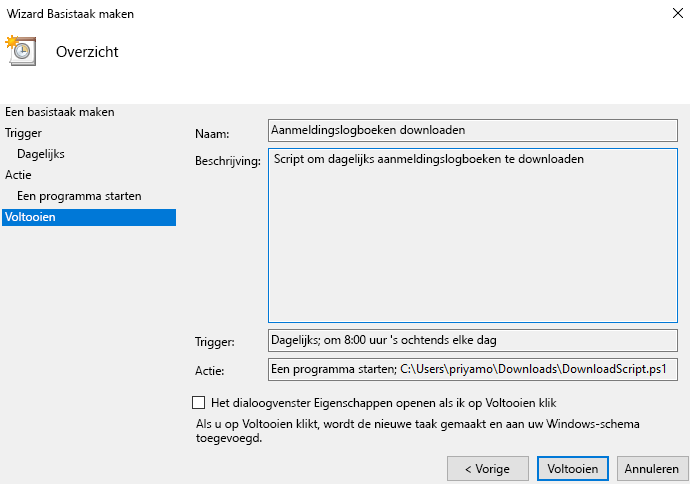

# Zelfstudie: Een script downloaden en gebruiken voor toegang tot aanmeldingslogboeken

U kunt de gegevens van de aanmeldingsactiviteiten downloaden als u buiten Azure Portal met de gegevens wilt werken. Met de optie **Downloaden** in de Azure-portal wordt een CSV-bestand gemaakt van de meest recente 5000 records. Als u meer flexibiliteit nodig hebt, bijvoorbeeld om meer dan 5000 records tegelijk te downloaden, of om de logboeken te downloaden op geplande intervallen, kunt u de knop **Script** gebruiken om een PowerShell-script te genereren voor het downloaden van uw gegevens.

In deze zelfstudie leert u hoe u een script genereert om alle aanmeldingslogboeken van de afgelopen 24 uur te downloaden en hoe u kunt plannen dat dit script elke dag wordt uitgevoerd. 

## Vereisten

U hebt nodig

* Een Azure Active Directory-tenant met een premium-licentie (P1/P2). 
* Een gebruiker die de rol **Globale beheerder**, **Beveiligingsbeheerder**, **Beveiligingslezer** of **Rapportlezer** voor de tenant heeft. Bovendien kan elke gebruiker toegang krijgen tot eigen aanmeldingen. 
* Als u het gedownloade script wilt uitvoeren op een Windows 10-computer, [stelt u de AzureRM-module en het uitvoeringsbeleid in](concept-sign-ins.md#running-the-script-on-a-windows-10-machine).

## Zelfstudie

1. Ga naar de [Azure-portal](https://portal.azure.com) en selecteer uw map.
2. Selecteer **Azure Active Directory** en selecteer in de sectie **Controle** de optie **Aanmeldingen**. 
3. Gebruik de filtervervolgkeuzelijst **Datumbereik** en selecteer **24 uur** om gegevens op te halen van de afgelopen 24 uur. 
4. Selecteer **Toepassen** en controleer of het filter is toegepast zoals verwacht. 
5. Selecteer in het bovenste menu de optie **Script** om het Powershell-script te downloaden met de toegepaste filters.

     
     
6. Open de toepassing **Task Scheduler** op de Windows-computer en selecteer **Een basistaak maken**.
7. Voer een naam en beschrijving in voor de taak en klik op **Volgende**.
8. Selecteer het keuzerondje **Dagelijks** om de taak dagelijks uit te voeren, en voer een begindatum en begintijd in.
9. Selecteer in het actiemenu de optie **Een programma starten** en selecteer het gedownloade script. Selecteer **Volgende**. 
10. Beoordeel de geplande taak en selecteer **Voltooien** om de taak te maken.

     

De taak wordt nu elke dag uitgevoerd. De aanmeldingsrecords van de afgelopen 24 uur worden opgeslagen in de notatie **AAD_SignInReport_YYYYMMDD_HHMMSS.csv**. U kunt het gedownloade PowerShell-script ook bewerken om het op te slaan onder een andere bestandsnaam of om het aantal gedownloade records te wijzigen. 

## Volgende stappen

* [Azure Active Directory report retention policies](reference-reports-data-retention.md) (Retentiebeleid voor Azure Active Directory-rapporten)
* [Aan de slag met de Azure Active Directory Reporting-API](concept-reporting-api.md)
* [Toegang krijgen tot de API voor rapportage met behulp van certificaten](tutorial-access-api-with-certificates.md)
