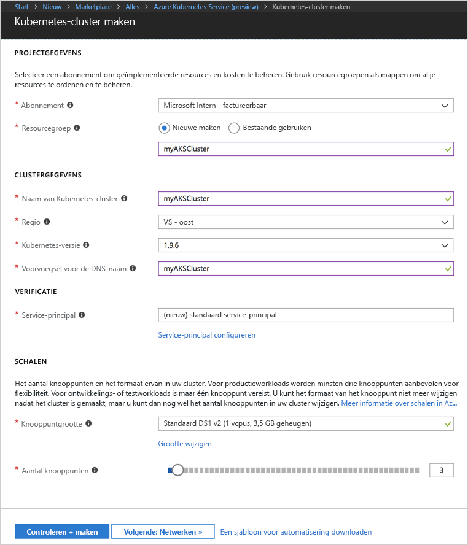
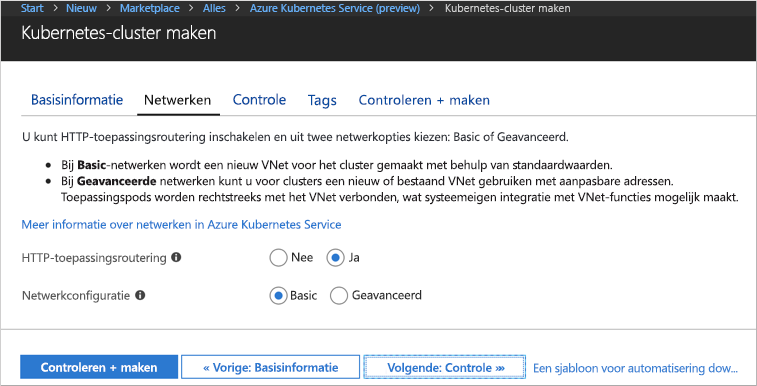
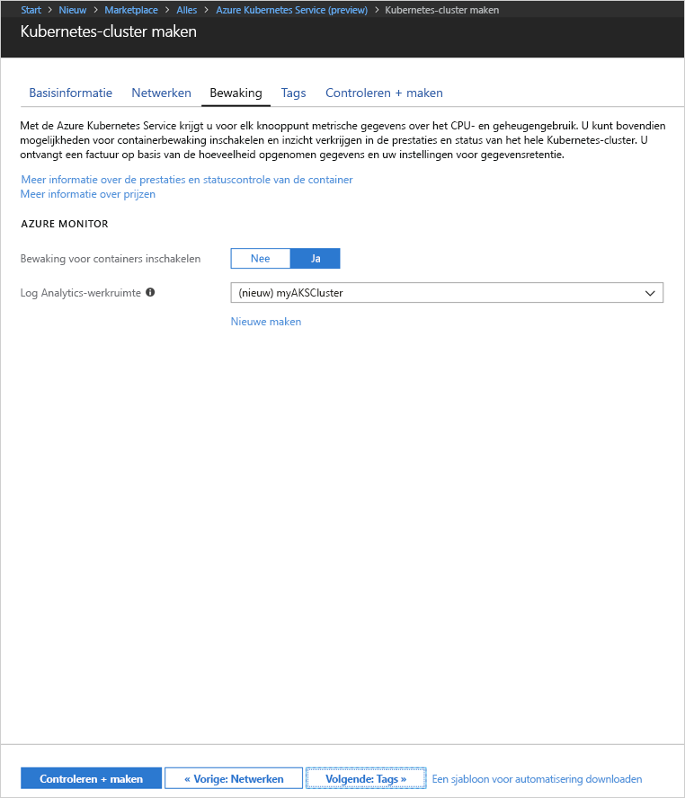
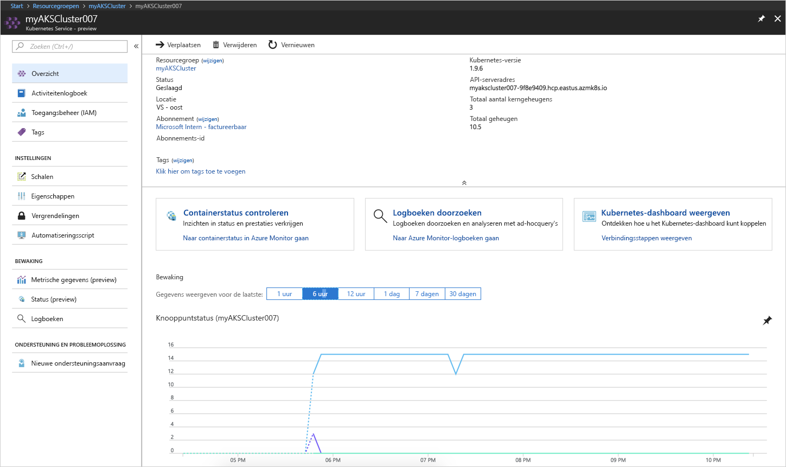
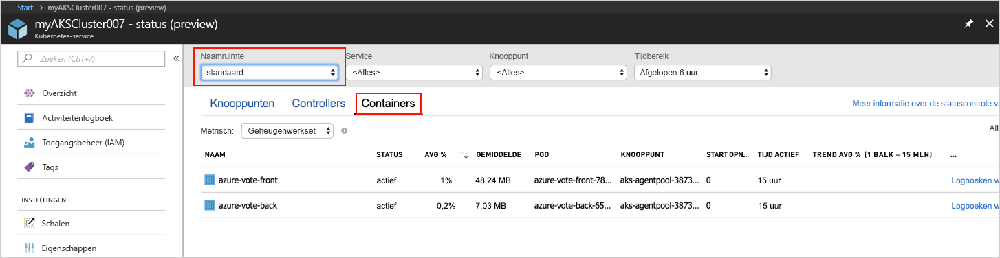
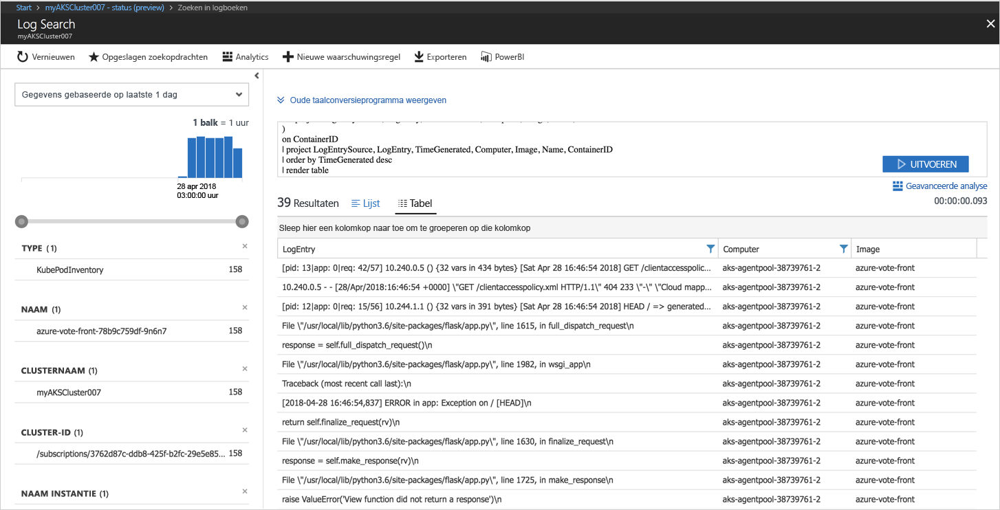

# <a name="quickstart-deploy-an-azure-kubernetes-service-aks-cluster"></a>Snelstart: Een AKS-cluster (Azure Kubernetes Service) implementeren

In deze quickstart implementeert u een AKS-cluster met behulp van Azure Portal. Vervolgens wordt een toepassing met meerdere containers op het cluster uitgevoerd die bestaat uit een web-front-end en een Redis-exemplaar. Zodra de toepassing is voltooid, is deze toegankelijk via internet.


In deze quickstart wordt ervan uitgegaan dat u een basisbegrip hebt van Kubernetes-concepten. Raadpleeg de [Kubernetes-documentatie][kubernetes-documentation] voor gedetailleerde informatie over Kubernetes.

## <a name="sign-in-to-azure"></a>Aanmelden bij Azure

Meld u aan bij Azure Portal op http://portal.azure.com.


## <a name="create-aks-cluster"></a>AKS-cluster maken

Kies **Een resource maken** > ga naar **Kubernetes** > selecteer **Kubernetes-service** > **Maken**.

Voer de volgende stappen uit onder elke kop van het formulier AKS-cluster maken.

- **PROJECTDETAILS**: selecteer een Azure-abonnement en een nieuwe of bestaande Azure-resourcegroep.
- **CLUSTERDETAILS**: voer een naam, regio, versie en DNS-voorvoegsel voor het AKS-cluster in.
- **VERIFICATIE**: maak een nieuwe service-principal of gebruik een bestaande service-principal. Wanneer u een bestaande service-principal gebruikt, moet u de SPN-client-ID en het geheim opgeven.
- **SCHAAL**: selecteer een VM-grootte voor de AKS-knooppunten. De VM-grootte kan **niet** meer worden gewijzigd als een AKS-cluster eenmaal is geïmplementeerd. Selecteer ook het aantal knooppunten dat u in het cluster wilt implementeren. Het aantal knooppunten kan nog **wel** worden gewijzigd als het cluster is geïmplementeerd.

Selecteer **Volgende: Netwerk** wanneer u klaar bent.



Configureer de volgende netwerkopties:

- **Routering van HTTP-toepassing**: hiermee configureert u een geïntegreerde ingangscontroller met functionaliteit voor het automatisch maken van openbare DNS-namen. Zie [HTTP-routering en DNS voor AKS][http-routing] voor meer informatie over HTTP-routering.
- **Netwerkconfiguratie**: kies of u de basisnetwerkconfiguratie met de Kubernetes-invoegtoepassing [kubenet][kubenet] wilt gebruiken, of geavanceerde netwerkconfiguratie met [Azure CNI][azure-cni]. Zie het [AKS-netwerkoverzicht][aks-network] voor meer informatie over netwerkopties.

Selecteer **Volgende: Controle** wanneer u klaar bent.



Bij het implementeren van een AKS-cluster kan Azure Container Insights worden geconfigureerd voor het controleren van de status van het AKS-cluster en schillen die in het cluster worden uitgevoerd. Zie [Status van Azure Kubernetes Service controleren][aks-monitor] voor meer informatie over het controleren van de status van de container.

Selecteer **Ja** als u statuscontrole van de container wilt inschakelen en selecteer een bestaande Log Analytics-werkruimte of maak een nieuwe.

Selecteer **Controleren + maken** en vervolgens **Maken** wanneer u klaar bent.



Na enkele ogenblikken is het AKS-cluster geïmplementeerd en klaar voor gebruik. Blader naar de AKS-clusterresourcegroep en selecteer de AKS-resource. Als het goed is, wordt nu het AKS-clusterdashboard weergegeven.



## <a name="connect-to-the-cluster"></a>Verbinding maken met het cluster

Als u een Kubernetes-cluster wilt beheren, gebruikt u [kubectl][kubectl], de Kubernetes-opdrachtregelclient. De kubectl-client is vooraf geïnstalleerd in Azure Cloud Shell.

Open Cloud Shell met behulp van de knop in de rechterbovenhoek van Azure Portal.


Gebruik de opdracht [az aks get-credentials][az-aks-get-credentials] om kubectl zo te configureren dat deze verbinding maakt met het Kubernetes-cluster.

Kopieer en plak de volgende opdracht in Cloud Shell. Wijzig de naam van de resourcegroep en van het cluster, indien nodig.

```azurecli-interactive
az aks get-credentials --resource-group myAKSCluster --name myAKSCluster
```

Als u de verbinding met uw cluster wilt controleren, gebruikt u de opdracht [kubectl get][kubectl-get] om een lijst met clusterknooppunten te retourneren.

```azurecli-interactive
kubectl get nodes
```

Uitvoer:

```
NAME                       STATUS    ROLES     AGE       VERSION
aks-agentpool-11482510-0   Ready     agent     9m        v1.9.6
aks-agentpool-11482510-1   Ready     agent     8m        v1.9.6
aks-agentpool-11482510-2   Ready     agent     9m        v1.9.6
```

## <a name="run-the-application"></a>De toepassing uitvoeren

In een Kubernetes-manifestbestand wordt een gewenste status voor een cluster gedefinieerd, inclusief zaken zoals welke containerinstallatiekopieën moeten worden uitgevoerd. In dit voorbeeld worden met behulp van een manifest alle objecten gemaakt die nodig zijn om de Azure Vote-toepassing uit te voeren. Dit behelst twee [Kubernetes-implementaties][kubernetes-deployment], een voor de Azure Vote-front-end en een voor een Redis-exemplaar. Er worden ook twee [Kubernetes-services][kubernetes-service] gemaakt: een interne service voor het Redis-exemplaar en een externe service voor toegang tot de Azure Vote-toepassing vanaf internet.

Maak een bestand met de naam `azure-vote.yaml` en kopieer de volgende YAML-code naar het bestand. Als u werkt in Azure Cloud Shell, maakt u het bestand met behulp van vi of Nano, zoals bij een virtueel of fysiek systeem.

```yaml
apiVersion: apps/v1beta1
kind: Deployment
metadata:
  name: azure-vote-back
spec:
  replicas: 1
  template:
    metadata:
      labels:
        app: azure-vote-back
    spec:
      containers:
      - name: azure-vote-back
        image: redis
        ports:
        - containerPort: 6379
          name: redis
---
apiVersion: v1
kind: Service
metadata:
  name: azure-vote-back
spec:
  ports:
  - port: 6379
  selector:
    app: azure-vote-back
---
apiVersion: apps/v1beta1
kind: Deployment
metadata:
  name: azure-vote-front
spec:
  replicas: 1
  template:
    metadata:
      labels:
        app: azure-vote-front
    spec:
      containers:
      - name: azure-vote-front
        image: microsoft/azure-vote-front:v1
        ports:
        - containerPort: 80
        env:
        - name: REDIS
          value: "azure-vote-back"
---
apiVersion: v1
kind: Service
metadata:
  name: azure-vote-front
spec:
  type: LoadBalancer
  ports:
  - port: 80
  selector:
    app: azure-vote-front
```

Gebruik de opdracht [kubectl apply][kubectl-apply] om de toepassing uit te voeren.

```azurecli-interactive
kubectl apply -f azure-vote.yaml
```

Uitvoer:

```
deployment "azure-vote-back" created
service "azure-vote-back" created
deployment "azure-vote-front" created
service "azure-vote-front" created
```

## <a name="test-the-application"></a>De toepassing testen

Terwijl de toepassing wordt uitgevoerd, wordt er een [Kubernetes-service][kubernetes-service] gemaakt die de toepassing beschikbaar maakt op internet. Dit proces kan enkele minuten duren.

Gebruik de opdracht [kubectl get service][kubectl-get] met het argument `--watch` om de voortgang te controleren.

```azurecli-interactive
kubectl get service azure-vote-front --watch
```

In eerste instantie wordt het *EXTERNE IP-adres* voor de service *azure-vote-front* weergegeven als *in behandeling*.

```
NAME               TYPE           CLUSTER-IP   EXTERNAL-IP   PORT(S)        AGE
azure-vote-front   LoadBalancer   10.0.37.27   <pending>     80:30572/TCP   6s
```

Zodra het *EXTERNE IP-adres* is gewijzigd van *in behandeling* in een *IP-adres*, gebruikt u `CTRL-C` om het controleproces van kubectl te stoppen.

```
azure-vote-front   LoadBalancer   10.0.37.27   52.179.23.131   80:30572/TCP   2m
```

Blader nu naar het externe IP-adres voor een overzicht van de Azure Vote-app.


## <a name="monitor-health-and-logs"></a>Status en logboeken controleren

Als Container Insights-controle is ingeschakeld, zijn er in het AKS-clusterdashboard zowel metrische statusgegevens beschikbaar voor het AKS-cluster als voor de schillen die in het cluster wordt uitgevoerd. Zie [Status van Azure Kubernetes Service controleren][aks-monitor] voor meer informatie over het controleren van de status van de container.

Als u de huidige status, bedrijfstijd en het resourcegebruik van de Azure Vote-schillen wilt bekijken, bladert u terug naar de AKS-resource en selecteer achtereenvolgens **Status van container controleren**, de **standaard**naamruimte en **Containers**. Het kan enkele minuten duren voordat deze gegevens in Azure Portal worden ingevuld.



Als u de logboeken voor de `azure-vote-front`-schil wilt weergeven, selecteert u de koppeling **Logboeken weergeven**. Deze logboeken bevatten de stromen stdout en stderr van de container.



## <a name="delete-cluster"></a>Cluster verwijderen

Wanneer het cluster niet meer nodig is, verwijdert u de clusterresource. Hierdoor worden ook alle bijbehorende resources verwijderd. Deze bewerking kan worden voltooid in Azure Portal door in het AKS-clusterdashboard de knop Verwijderen te selecteren. U kunt ook de opdracht [az aks delete][az-aks-delete] gebruiken in Cloud Shell.

```azurecli-interactive
az aks delete --resource-group myAKSCluster --name myAKSCluster --no-wait
```

## <a name="get-the-code"></a>Code ophalen

In deze quickstart zijn vooraf gemaakte containerinstallatiekopieën gebruikt om een Kubernetes-implementatie te maken. De gerelateerde toepassingscode, Dockerfile en het Kubernetes-manifestbestand zijn beschikbaar op GitHub.

[https://github.com/Azure-Samples/azure-voting-app-redis][azure-vote-app]

## <a name="next-steps"></a>Volgende stappen

In deze snelstart hebt u een Kubernetes-cluster geïmplementeerd en vervolgens een toepassing met meerdere containers geïmplementeerd.

Voor meer informatie over AKS en een volledig stapsgewijs voorbeeld van code tot implementatie gaat u naar de zelfstudie over Kubernetes-clusters.

> [!div class="nextstepaction"]
> [AKS-zelfstudie][aks-tutorial]

<!-- LINKS - external -->
[azure-vote-app]: https://github.com/Azure-Samples/azure-voting-app-redis.git
[azure-cni]: https://github.com/Azure/azure-container-networking/blob/master/docs/cni.md
[kubectl]: https://kubernetes.io/docs/user-guide/kubectl/
[kubectl-apply]: https://kubernetes.io/docs/reference/generated/kubectl/kubectl-commands#apply
[kubectl-get]: https://kubernetes.io/docs/reference/generated/kubectl/kubectl-commands#get
[kubenet]: https://kubernetes.io/docs/concepts/cluster-administration/network-plugins/#kubenet
[kubernetes-deployment]: https://kubernetes.io/docs/concepts/workloads/controllers/deployment/
[kubernetes-documentation]: https://kubernetes.io/docs/home/
[kubernetes-service]: https://kubernetes.io/docs/concepts/services-networking/service/

<!-- LINKS - internal -->
[az-aks-get-credentials]: /cli/azure/aks?view=azure-cli-latest#az_aks_get_credentials
[az-aks-delete]: /cli/azure/aks#az-aks-delete
[aks-monitor]: ../monitoring/monitoring-container-health.md
[aks-network]: ./networking-overview.md
[aks-tutorial]: ./tutorial-kubernetes-prepare-app.md
[http-routing]: ./http-application-routing.md
